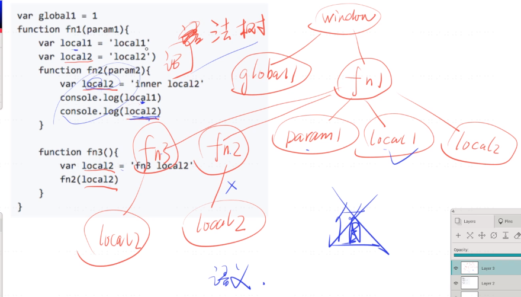

# 你真的懂函数吗

## ★课程简介

1. 定义

   1. 匿名函数
   2. 具名函数
   3. 箭头函数

2. 词法作用域（也叫静态作用域）

   ```js
    var global1 = 1
    function fn1(param1){
        var local1 = 'local1'
        var local2 = 'local2')
        function fn2(param2){
            var local2 = 'inner local2'
            console.log(local1)
            console.log(local2)
        }
   
        function fn3(){
            var local2 = 'fn3 local2'
            fn2(local2)
        }
    }
   ```

   深入阅读：

   - [javascript的词法作用域](http://js8.in/2011/08/15/javascript%E7%9A%84%E8%AF%8D%E6%B3%95%E4%BD%9C%E7%94%A8%E5%9F%9F/)
   - [作用域 - Wikiwand](https://www.wikiwand.com/zh-hans/%E4%BD%9C%E7%94%A8%E5%9F%9F)
   - [Abstract Syntax Tree 抽象语法树简介](https://div.io/topic/1994)

3. call stack

   - [普通调用 1+1+1](http://latentflip.com/loupe/?code=ZnVuY3Rpb24gYSgpewogICAgY29uc29sZS5sb2coJ2EnKQogIHJldHVybiAnYScgIAp9CgpmdW5jdGlvbiBiKCl7CiAgICBjb25zb2xlLmxvZygnYicpCiAgICByZXR1cm4gJ2InCn0KCmZ1bmN0aW9uIGMoKXsKICAgIGNvbnNvbGUubG9nKCdjJykKICAgIHJldHVybiAnYycKfQoKYSgpCmIoKQpjKCk%3D!!!)
   - [嵌套调用 1>2>3](http://latentflip.com/loupe/?code=ZnVuY3Rpb24gYSgpewogICAgY29uc29sZS5sb2coJ2ExJykKICAgIGIoKQogICAgY29uc29sZS5sb2coJ2EyJykKICByZXR1cm4gJ2EnICAKfQpmdW5jdGlvbiBiKCl7CiAgICBjb25zb2xlLmxvZygnYjEnKQogICAgYygpCiAgICBjb25zb2xlLmxvZygnYjInKQogICAgcmV0dXJuICdiJwp9CmZ1bmN0aW9uIGMoKXsKICAgIGNvbnNvbGUubG9nKCdjJykKICAgIHJldHVybiAnYycKfQphKCkKY29uc29sZS5sb2coJ2VuZCcp!!!)
   - [递归](http://latentflip.com/loupe/?code=ZnVuY3Rpb24gZmFiKG4pewogICAgY29uc29sZS5sb2coJ3N0YXJ0IGNhbGMgZmFiICcrIG4pCiAgICBpZihuPj0zKXsKICAgICAgICByZXR1cm4gZmFiKG4tMSkgKyBmYWIobi0yKQogICAgfWVsc2V7CiAgICAgICAgcmV0dXJuIDEKICAgIH0KfQoKZmFiKDUp!!!PGJ1dHRvbj5DbGljayBtZSE8L2J1dHRvbj4%3D)

4. this & arguments

   - 重要：[this 就是 call 的第一个参数！call 的其他参数统称为 arguments](https://zhuanlan.zhihu.com/p/23804247)
     如果你记住了这个规则，那么网上其他关于 this 的解释在此时都变得很啰嗦了。

   - this 是隐藏的第一个参数，且一般是对象（如果不是对象，就显得很没有意义了）

     ```js
       function f(){
           console.log(this)
           console.log(arguments)
       }
       f.call() // window
       f.call({name:'frank'}) // {name: 'frank'}, []
       f.call({name:'frank'},1) // {name: 'frank'}, [1]
       f.call({name:'frank'},1,2) // {name: 'frank'}, [1,2]
     ```

   - this 为什么必须是对象
     因为 this 就是函数与对象之间的羁绊

     ```js
           var person = {
               name: 'frank',
               sayHi: function(person){
                   console.log('Hi, I am' + person.name)
               },
               sayBye: function(person){
                   console.log('Bye, I am' + person.name)
               },
               say: function(person, word){
                   console.log(word + ', I am' + person.name)
               }
           }
           person.sayHi(person)
           person.sayBye(person)
           person.say(person, 'How are you')
     
           // 能不能变成 
           person.sayHi()
           person.sayBye()
           person.say('How are you')
     
           // 那么源代码就要改了
           var person = {
               name: 'frank',
               sayHi: function(){
                   console.log('Hi, I am' + this.name)
               },
               sayBye: function(){
                   console.log('Bye, I am' + this.name)
               },
               say: function(word){
                   console.log(word + ', I am' + this.name)
               }
           }
           // 如果你不想吃语法糖
           person.sayHi.call(person)
           person.sayBye.call(person)
           person.say.call(person, 'How are you')
     
           // 还是回到那句话：this 是 call 的第一个参数
           // this 是参数，所以，只有在调用的时候才能确定
           person.sayHi.call({name:'haha'})  // 这时 sayHi 里面的 this 就不是 person 了
           // this 真的很不靠谱
     
           // 新手疑惑的两种写法
           var fn = person.sayHi
           person.sayHi() // this === person
           fn()  // this === window
     ```

5. call / apply
   fn.call(asThis, p1,p2) 是函数的正常调用方式
   当你不确定参数的个数时，就使用 apply
   fn.apply(asThis, params)

6. bind
   call 和 apply 是直接调用函数，而 bind 则是返回一个新函数（并没有调用原来的函数），这个新函数会 call 原来的函数，call 的参数由你指定。

7. return
   每个函数都有 return
   如果你不写 return，就相当于写了 return undefined

8. 柯里化 / 高阶函数
   返回函数的函数

   - 柯里化：将 f(x,y) 变成 f(x=1)(y) 或 f(y=1)x

     ```js
       //柯里化之前
       function sum(x,y){
           return x+y
       }
       //柯里化之后
       function addOne(y){
           return sum(1, y)
       }
       //柯里化之前
       function Handlebar(template, data){
           return template.replace('{{name}}', data.name)
       }
       //柯里化之后
       function Handlebar(template){
           return function(data){
               return template.replace('{{name}}', data.name)
           }
       }
     ```

     柯里化可以将真实计算拖延到最后再做

     关于柯里化的高级文章：

     1. <http://www.yinwang.org/blog-cn/2013/04/02/currying>
     2. <https://zhuanlan.zhihu.com/p/31271179>

   - 高阶函数：

     在数学和计算机科学中，高阶函数是至少满足下列一个条件的函数：

     1. 接受一个或多个函数作为输入：forEach sort map filter reduce
     2. 输出一个函数：lodash.curry
     3. 不过它也可以同时满足两个条件：Function.prototype.bind

9. 回调
   名词形式：被当做参数的函数就是回调
   动词形式：调用这个回调
   注意回调跟异步没有任何关系

10. 构造函数
    返回对象的函数就是构造函数
    一般首字母大写

课后题答案：

```js
function curry(func , fixedParams){
    if ( !Array.isArray(fixedParams) ) { fixedParams = [ ] }
    return function(){
        let newParams = Array.prototype.slice.call(arguments); // 新传的所有参数
        if ( (fixedParams.length+newParams.length) < func.length ) {
            return curry(func , fixedParams.concat(newParams));
        }else{
            return func.apply(undefined, fixedParams.concat(newParams));
        }
    };
}
```

## ★概述

我们会讲函数相关的很多细节知识！如，函数的3种声明方式！、this&argument这2个隐含的变量、柯里化/高阶哈数等这些概念，可见我们需要讲的概念很多，而你需要做的就是记笔记！

这个课程是JavaScript的高阶课！如果你发现有很多东西不懂，那么最好的姿势就是记笔记，写博客……

芳芳平时买书看，都会在看书的同时，用一个小本来做笔记，即把书上重要的知识给记下来！这样在回顾的时候就更快了，不用每次都重新看！

当然你可以把课程简介中的讲义当作笔记，不过我希望你能把其中的那些链接都给点一遍！毕竟这些链接都是一些比较深入的资料

## ★函数声明

JS中目前有3种函数的声明方式，分别是

- 匿名函数
- 具名函数
- 箭头函数

### ◇匿名函数

声明函数的时候，不要给名字！就像下面这行demo一样，**✎：**

```js
function() {
    return 1
}
```

不过，你直接运行是会报错的！

因为你声明了一个函数，但是你又不能引用到它！所以这就相当于一个「废话」了呀！为此，一般浏览器都不会让这种函数可以过的，即会告诉你报错了！

那么如何才能让它过呢？

我们需要给它一个引用，**✎：**

```js
var fn = function() {
    return 1
}
```

这个fn就引用了这个函数！

> 其实也就是说，匿名函数要给变量一个引入自己的机会才行！可是，箭头函数呢？这家伙可没有名字，也能自行执行也不报错！

为什么说是「引用」呢？

首先，这个匿名函数是一个对象对吧！可见，这个匿名函数是存储在堆内存里面的！

其次，说到堆内存，显然就有个叫「地址」的概念！

所以，这个fn记录的是这个匿名函数的地址，而不是该函数本身！

> 关于对「引用」的理解，我们在日常中为了让自己所讲的话更具有说服力，为此我们时常用明引的姿势，如，**✎：**「宋代[欧阳修](https://www.wikiwand.com/zh/%E6%AD%90%E9%99%BD%E4%BF%AE)则云：『最佳读书时间，乃为三上：即枕上、马上、厕上。』」
>
> **➹：**[引用 - Wikiwand](https://www.wikiwand.com/zh/%E5%BC%95%E7%94%A8)
>
> 我们的fn引用了一个匿名函数，这也就是说通过fn我们是可以使用这个函数的！这就像是那些名言不是我们自己所想，不是我们第一个说的，但是我们是可以使用它们来为我们自身服务的，当然，你最好指明出处才行，不然这是很不道德的！

言归正传，我们如何才能体现这个fn存储的是一个地址呢？

```js
var fn = function() {
    return 1
}
var fn2 = fn
```

在这里，我们把fn1赋值给了fn2，然后你打印一下 `fn.name`和 `fn2.name`的值，你会发现他们都是fn，**✎：**


我在想为啥都是fn呢？我把fn2赋值给fn3，看看fn3.name是fn还是fn2，**✎：**


我想了想，谁叫这个fn是第一个引用匿名函数的变量啊！这就像是这个匿名函数是有版权的，版权归属为fn……

不过fn2、fn3，除了具有可读能力，还具有修改这个匿名函数的能力！这就像我可以把Linux当作是个匿名函数的，而我们都知道它的创造者是[林纳斯·托瓦兹](https://www.wikiwand.com/zh-cn/%E6%9E%97%E7%B4%8D%E6%96%AF%C2%B7%E6%89%98%E7%93%A6%E8%8C%B2)，如fn一样。当它开源后，如赋值一样，即出现了众多的为它贡献代码的开发者了！这也意味着Linux将会愈发地强大起来！

总之，匿名函数默认的name是fn，你会发现这很矛盾——**我是匿名函数，但是我有name**！

或许我可以这样理解，我们总得给一个东西一个名字，毕竟它确实存在于这个世界，不然「这个」「那个」的，沟通起来很不方便，如「这个」是啥？「那个」又是啥。由于匿名函数它确实在堆中，既然在堆中总得起个名字哈！或许是直观的name属性，或许是常用的给个地址，总之我们可以借助某种手段，能精确无误地找到这个东西就可以了

### ◇具名函数

具有名字的函数

```js
function fn3() {
    return 3
}
var fn5 = function fn4() {
    return fn4
}

```

fn3的作用域是全局的，毕竟它是声明在最顶级空间的，而fn4则不是全局的，而是，**✎：**


总之，匿名函数与具名函数的唯一区别就是有没有fn3、fn4……这个名字，但是它们都有name……

### ◇箭头函数

这个是es6的语法……

箭头函数有多少种写法呢？

如果只有一个参数，**✎：**

```js
var fn6 = i => i+1
fn6(6) //7
fn6(7) //8
```

接收一个i返回一个i+1，这就是所谓额输入和输出了，这是最简单的一种写法！

如果有2个参数呢？就像这样，**✎：**

```js
var fn7 = i,j => i+j
```

你说这样写行吗？不行哈！会报错


那么非要传2个参数，该如何才能让它不报错呢？

用括号括起来即可，**✎：**

```js
var fn8 = (i,j) => i+j
```

如果后面，即函数体中不止是一句话呢？

那么你需要用花括号把它们都括起来，同时还要把return的值给说清楚哈！

当然，如果只有一句话，你就不用写return了！但是如果是2句话的话，那么你就得显示的把这个return给说出来了！

```js
var fn9 = (i,j) => { console.log('我是用来测试作为第二句话的！'); return i+j }
```

以上就是箭头函数的用法了！至于区别，我们在讲this的时候才会知道，总之，大体来讲是没有区别的，而只有在this这个地方才会有区别哈！，**✎：**


---

以上就是函数的定义了，匿名函数、具名函数、箭头函数

其中匿名函数和具名函数，都有name，那么箭头函数有没有name呢？

也是有的，跟它们俩的规律是一样的，只是形式不同


总之，箭头函数跟它们俩唯一的不同点在`this`这个地方，而其它地方都是一样的！

### ◇拓展阅读

**➹：**[java中为什么分栈内存和堆内存？ - 知乎](https://www.zhihu.com/question/24807877)

**➹：**[什么是堆和栈，它们在哪儿？ - 文章 - 伯乐在线](http://blog.jobbole.com/75321/)

## ★词法作用域

你曾有的疑问，**✎：**

> 有时候一个方法定义的地方和使用的地方会相隔十万八千里，那方法执行时，它能访问哪些变量，不能访问哪些变量，这个该怎么判断呢？

为此，引出了我们这一小节所讲解的内容了——**词法作用域**

那么什么是词法作用域呢？

变量的作用域是**在定义时决定而不是执行时决定**，也就是说**词法作用域取决于源码**，通过静态分析就能确定，因此词法作用域也叫做静态作用域。 对于JS来说，`with`和`eval`除外，所以只能说JS的作用域机制**非常接近**词法作用域（Lexical scope）。

那么在JS中，如何才能体现出词法作用域呢？

给你一段demo，你就知道了，**✎：**

```js
 var global1 = 1
 function fn1(param1){
     var local1 = 'local1'
     var local2 = 'local2'
     function fn2(param2){
         var local2 = 'inner local2'
         console.log(local1)
         console.log(local2)
     }

     function fn3(){
         var local2 = 'fn3 local2'
         fn2(local2)
     }
 }
```

是不是有很多local2，而这个local2就是用于体现词法作用域的！

当浏览器看到这段demo，并不会马上去执行，而是会做一个抽象语法树！

什么叫语法树呢？

即它会把这个语法变成一棵树，然后便于它去执行！

也就是说第一次先不执行，只看语法，看你语法对不对，然后再去理解你的语法。总之语法全部对了之后，再重头开始执行！

我们只看跟变量声明相关的不完整语法树或者叫词法树，**✎：**



1. window是本来就存在的一个全局环境
2. window下面有2个全局声明的变量——global1和fn1，它们俩是同级的！
3. fn1下面有5个声明的变量，分别是param1、local1、local2、fn2和fn3，在这里形参param1也是局部变量
4. fn2下面则有param2、local2这2个声明的变量！
5. fn3下面则有1个声明的变量——local2

这样一来这棵树就形成了，那么这棵树有什么用呢？

以我们需要打印fn2函数中的local1为例，那么你说这打印的是哪个local1呢？而这其中又是如何确定的呢？

这是根据词法树来确定的！

你看我们的fn2下面只有一个local2，所以找不到local1，既然在fn2下面找不到，那么就去fn2所在的这一级里面找了。为此就找到了与fn2同级的local1了！

这是一种静态分析的方式，即此级找不到，就往上找，如果找到了就不就继续往上找了！

好了，这就是所谓的词法树了！

总之，一个函数里面能访问哪些变量，在做词法分析的时候就已经确定了，也就是说这跟你调用与不调用没啥关系，只跟语法有关系，跟执行顺序什么的都没有关系！

还有一点就是，词法树只是用于分析①这个变量是不是②这个变量，不是用来分析①这个变量的值，是不是②这个变量的值。**✎：**


总之，我们只分析语义，即这个①变量是②这个变量，至于其中的值是否相等，并不是我们所关心的！

### ◇一个著名的题目

```js
var a = 1
function b() {
    console.log(a)
}
```

请问b里面的a是不是外面的a？我们分析一下语法就知道是外面的a了，毕竟b它自己并咩有声明这个a。

但是我们所打印a的值是不是外面a的值？即是不是绝对是1呢？

这是无法确定的哈！如，**✎：**

```js
var a = 1
function b() {
    console.log(a)
}
a = 2
b()
```

我们声明了一个函数b，但还没有执行它，当我们去调用b的时候，才会去执行这个函数b，那么这个时候a就是2了！

所以如果你不看这段demo下面的，即，**✎：**

```js
a = 2
b()
```

这一部分，你是永远不知道 `console.log(a)`中的a是几的！

所以我们的词法作用域只是能确定这个a是不是外面那个a，但是不能确定a的这个值是不是外面那个a的值！

总之，词法作用域确定的是两个变量的关系，**✎：**


### ◇拓展阅读

**➹：**[javascript的词法作用域 - 三水清](https://js8.in/2011/08/15/javascript%E7%9A%84%E8%AF%8D%E6%B3%95%E4%BD%9C%E7%94%A8%E5%9F%9F/)

**➹：**[作用域 - Wikiwand](https://www.wikiwand.com/zh-hans/%E4%BD%9C%E7%94%A8%E5%9F%9F)

**➹：**[Abstract Syntax Tree 抽象语法树简介 - Div.IO](https://div.io/topic/1994)

**➹：**[你知道「编译」与「解释」的区别吗？ - BlueSun](http://huang-jerryc.com/2016/11/20/do-you-konw-the-different-between-compiler-and-interpreter/)

**➹：**[js引擎的执行过程（一） - Heying Ye's Personal Website](https://heyingye.github.io/2018/03/19/js%E5%BC%95%E6%93%8E%E7%9A%84%E6%89%A7%E8%A1%8C%E8%BF%87%E7%A8%8B%EF%BC%88%E4%B8%80%EF%BC%89/)

**➹：**[什么是语义学](http://www.yinwang.org/blog-cn/2012/07/25/semantics)

### ◇测试demo

这是看这个 [javascript的词法作用域 - 三水清](https://js8.in/2011/08/15/javascript%E7%9A%84%E8%AF%8D%E6%B3%95%E4%BD%9C%E7%94%A8%E5%9F%9F/)  链接的一些测试demo，**✎：**

```js
// function a(i) {
//     var i
//     console.log(i)
// }
// 等价于上面的写法
// 重复var一个变量，并不会让这个i的值为undefined
function a() {
    var i = arguments[0]
    var i;
    console.log(i); //10
}
a(10)
// 总之我想告诉你的是arguments[0]就是形参i
// 何以见得？
function b(i) {
    console.log(arguments[0])
    var i = 6
    console.log(arguments[0])
}
b(10)
// 可见结果是10、6，我们改变了形参i的值，而且这个var形如摆设，即只是个重复的var而已
// 可见局部变量i和形参i以及arguments[0]是同一个家伙
// 你要不信，那比如这样呢：
function c(i) {
    var i ;
    console.log(i===i); //true
    console.log(i); //10
}
c(10)

// 局部变量提升，需要注意的是函数声明提升与变量声明提升，咩有先后顺序之分，即谁在前谁就先声明
var i=10;
function d() {
    console.log(i); //undefined
    var i = 2;
    console.log(i); //2
};
d();
// 等价于
// function d() {
//   var i;
//   console.log(i)
//   i = 2
//   console.log(i)
// }
```

## ★Call Stack

