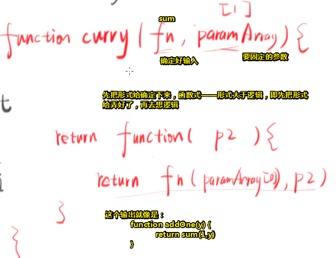
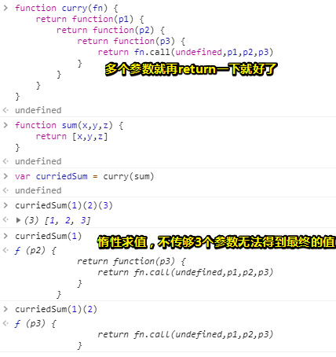

# 异步 - 代码烧脑的原因

## ★总览

本次任务的第一个视频是上节课课后题的答案

### ◇ 同步与异步

同步：等待结果
异步：不等待结果

注意，异步常常伴随回调一起出现，但是异步不是回调，回调也不一定是异步

```javascript
// 同步的 sleep
function sleep(seconds){
    var start = new Date()
    while(new Date() - start < seconds * 1000){

    }
    return
}
console.log(1)
sleep(3)
console.log('wake up')
console.log(2)
```


```javascript
//异步的 sleep
function sleep(seconds, fn){
    setTimeout(fn, seconds * 1000)
}
console.log(1)
sleep(3, ()=> console.log('wake up'))
console.log(2)
```


可以看出，用了异步之后，JS 的空闲时间，多了许多。

但是注意，在 JS 空闲的这段时间，实际上是浏览器中的计时器在工作（很有可能是每过一段时间检查是否时间到了，具体要看 Chrome 代码）

### ◇前端经常遇到的异步

```js
document.getElementsByTagNames('img')[0].width // 宽度为 0
console.log('done')
```

```js
document.getElementsByTagNames('img')[0].onload = function(){
    console.log(this.width) // 宽度不为 0
    console.log('real done')
}
console.log('done')
```

### ◇面试题中的异步

```js
let liList = document.querySelectorAll('li')
for(var i=0; i<liList.length; i++){
    liList[i].onclick = function(){
        console.log(i)
    }
}
```

把 var i 改成 let 就可以破解：<https://zhuanlan.zhihu.com/p/28140450>

### ◇AJAX 中的异步

```js
let request = $.ajax({
  url: '.',
  async: false
})
console.log(request.responseText)
```

```js
$.ajax({
    url: '/',
    async: true,
    success: function(responseText){
        console.log(responseText)
    }
})
```

### ◇异步的形式

一般有两种方式拿到异步结果

1. 傻逼方法：轮训
2. 正规方法：回调

### ◇回调的形式

1. Node.js 的 error-first 形式

   ```js
    fs.readFile('./1.txt', (error, content)=>{
        if(error){
            // 失败
        }else{
            // 成功
        }
    })
   ```

2. jQuery 的 success / error 形式

   ```js
    $.ajax({
        url:'/xxx',
        success:()=>{},
        error: ()=>{}
    })
   ```

3. jQuery 的 done / fail / always 形式

   ```js
    $.ajax({
        url:'/xxx',
    }).done( ()=>{} ).fail( ()=>{} ).always( ()=> {})
   ```

4. Prosmise 的 then 形式

   ```js
    $.ajax({
        url:'/xxx',
    }).then( ()=>{}, ()=>{} ).then( ()=>{})
   ```

### ◇如何处理异常？

1. 如何使用多个 success 函数？
2. 在有多个成功回调的情况下，如何处理异常？

### ◇自己返回 Promise

```js
function ajax(){
    return new Promise((resolve, reject)=>{
        做事
        如果成功就调用 resolve
        如果失败就调用 reject
    })
}

var promise = ajax()
promise.then(successFn, errorFn)
```

Promise 深入阅读：<http://www.cnblogs.com/hustskyking/p/promise.html>

Promise/A+ 规范：<https://segmentfault.com/a/1190000002452115>

### ◇async / await

```js
function buyFruit(){
    return new Promise((resolve, reject)=>{
        做事
        如果成功就调用 resolve
        如果失败就调用 reject
    })
}

var promise = await ajax()
```

```js
async functon fn(){
    var result = await buyFruit()
    return result
}

var r = await fn()
console.log(r)
```

## ★上节课答案

### ◇分析题目


> 这莫非就是输入和输出，难怪老师会这样写……

### ◇如何写一个函数？

你在写一个函数的时候只需要关心两件事情：

1. 它的输入是什么鬼
2. 它的输出是什么鬼

搞清楚这个输入和输出之后，再去写这中间的逻辑！

### ◇开搞

**①根据形式，确定输入和输出：**



这个返回值的形式更addOne这个函数的形式一模一样……所以你在学函数式的时候一定要记形式，不要去管这个逻辑是怎样的额，只需要把形式给记下来就ok啦！为什么这么说呢？——因为对于函数式来说，形式是大于逻辑的，函数是有这个特点的，总之形式很重要，像柯里化整个就是一个形式变化

目前，我们知道了一个最简单的柯里化是怎么写的了！

**②简单点——实现一个只能把两个参数变成一个参数的curry函数**

> 当你没有思路的时候，就把这个东西给简化一下，所以我们不需要搞那么复杂的，只要能实现把sum函数变成addOne函数，那么我就是成功的。
>
> 总之先把这个最简单的（sum函数）给实现了，然后再去搞这个（abc函数）复杂的！


一旦调了这个return出去的函数，那么我们就call一下这个fn！

这个curry函数只能实现把sum变成addOne的这么一个柯里化


可以见到，addOne实际上是curry这个函数所return出来的函数，这个函数会接受一个参数p2，当我们调用这个函数，那么是上就会去调用sum函数！我们之前用了curry函数固定了sum函数的一个参数，之后在根据你调用addOne函数所传的参数（你传什么就是什么），确定最终的输出结果

这个curry函数做到了——把一个接受两个参数的函数变成固定一个参数接受另一个参数的函数！

一些问题：

1. 我们题目要求的abc函数有3个参数，而这里的sum只有2个参数
2. 可以不传参数1，即固定什么值由用户指定的！而不是交给这个curry函数！

接下来干啥？

如果不传这个1——形式是这样的：

```js
var fn2 = curry(sum)
var addOne = fn2(1)
fn(1)(2)
//本来的形式：
sum(2,3) //5
//通过柯里化这个sum函数之后，现在调用sum函数的形式：
fn2(2)(3)
//注意：不要去管形式转化的逻辑是怎样的，目前，你只需要关注形式是怎样的就可以了！
```

也就是说你传什么就固定什么参数，如你先传个1然后再传个2，就是你先固定一个1，相当于是addOne函数，然后再调用sum函数！

确定形式：


我们在curry sum函数的时候不需要传任何参数，即柯里化这个sum函数把固定参数这一步给消掉了！，总之对curry函数只需要传sum函数即可！其它参数不需要传！至于什么时候传呢？——后面传，即对curry函数所返回的新函数传即可，如fn1……第一次传什么就把sum函数的x形参固定为什么……

接下要考虑什么呢？——怎么能让curry函数接受有3个参数的fn呢？

很简单，再加个return就好了，与此同时你会了解到惰性求值是什么鬼？即不传够三个参数你会无法调用那个fn函数的！



或许你会问这有点多余、有点无聊！因为我直接 `sum(1,2,3)`就好了，即一开始就可以传到位了，为啥还要柯里化sum后再调用呢？

但是有一种情况就是「有没有可能你一开始就不知道传给sum函数有哪些参数？或者说你需要异步请求后才知道有哪些参数」——所以柯里化是能给你一次机会——让你把两次值用不同的时间来传。如sum函数的这3个参数需要从不同的服务器上请求来的数据，然后数据到位了，就把它们混到一起，才调用sum函数。而用柯利化呢？——拿到什么就传什么，那什么时候凑齐了就什么时候有结果……

可见，这就是使用了柯利化的好处啦！

那如果接受4个参数呢？咋办？

难道要再加个return？显然不能继续这样干了，因为我们无法确定fn到底有多少个参数……

好话说，有咩有一个属性标志着某个函数要接受几个参数？——有的，length属性，即函数接受几个参数可以length得到：


这就给我们一个启发了呀！——我们要return几次函数不就是看它要接受几个参数吗？

> 也就是说return几个函数是动态变化的咯！

总之，return（最后那个return调用fn不算）的嵌套层数就是它的length。

所以终极curry的思路是怎么写的呢？——每return一次就记一下数就告诉curry「我已经return过一次了，然后下次你就只需要return两次了」


总之通过一个length再加一个计数器就能搞定这个事了！

**➹：**[JavaScript函数式编程--柯里化(curry) - Jin](https://jinyy.app/article/js-func-curry/)

```js
function curry(func , fixedParams){
    if ( !Array.isArray(fixedParams) ) { fixedParams = [ ] } //防止fixedParams一开始是undefined，为此无法使用数组的cancat方法
    return function(){
        let newParams = Array.prototype.slice.call(arguments); // 新传的所有参数
        if ( (fixedParams.length+newParams.length) < func.length ) {
            return curry(func , fixedParams.concat(newParams));
        }else{
            return func.apply(undefined, fixedParams.concat(newParams));
        }
    };
}
```

分析：

> 当传入的参数个数没有到达`func`函数要求的参数个数的时候一直返回柯里化函数。
> 只有参数满足`func`函数的个数的时候才通过`apply`执行`func`函数。


## ★目录

异步是一些人之所以学不会JS的主要原因！总之你学不会JS，那是因为你不知道什么是异步！

这节课讲什么？

- 什么是同步？什么是异步？
- 前端经常会遇到的异步代码
- 面试题
- AJAX中的异步
- 异步主要获取结果的形式
- 回调是怎么用的
- 如何处理异步中的异常
- 什么是Promise
- 讲解一下async和await这个两个关键字


---

## ★总结

- 把大问题拆解成小问题，根据大问题提供的方向扩展小问题，为此小问题逐渐演化成大问题，最终的结果就是把大问题给解决了，而这个过程是不断地添加问题和解决问题，有种「极限」的调调（联想到求导）……把大问题解决就像是你不想添加新问题或者说是你找不到新问题可以添加进去……

- 当你看视频学习的时候，尤其是讲解某些知识点，你最好先预习一遍，看一下资料，然后试着尝试自己先讲解一波，最后根据视频所讲的与自己所讲的进行一个比较，你在自学一遍的过程中，所遇到的不会，你就在视频找寻答案；对有些东西的理解是否准确或者说是不是还有更好的理解姿势，你都可以去视频中找寻答案！

  总之，基于每个人知识面的不同，所以对同一样的东西理解可能会千奇百怪，不管怎样，只要能解决问题就好了！至于解决问题的姿势漂不漂亮，还需要积累……

- 额，本来是腰腿有点疼，可是心无杂念（专注于写总结），坐姿比较正确，结果一站起来好像没有那么疼了……当然专注于打LOL也是如此……

- 练习题——写一个curry函数：关键在于判断所传参数个数是否凑齐了！凑齐了就调用fn啦，如果没凑齐就继续柯里化咯！


---

## ★Q&A

### ①形式大于内容？

我本来想要搜索的是「形式大于逻辑」，结果出现「形式大于内容，逻辑大于情感」……

**➹：**[演讲或讲课过程中，形式大于内容？ - 知乎](https://zhuanlan.zhihu.com/p/20853039)

**➹：**[《一代宗师》：概念先行，形式大于内容-影视评论-论坛_天涯社区](http://bbs.tianya.cn/post-filmtv-378464-1.shtml)


