# 异步 - 代码烧脑的原因

## ★总览

本次任务的第一个视频是上节课课后题的答案

### ◇同步与异步

同步：等待结果
异步：不等待结果

注意，异步常常伴随回调一起出现，但是异步不是回调，回调也不一定是异步

```javascript
// 同步的 sleep
function sleep(seconds){
    var start = new Date()
    while(new Date() - start < seconds * 1000){

    }
    return
}
console.log(1)
sleep(3)
console.log('wake up')
console.log(2)
```


```javascript
//异步的 sleep
function sleep(seconds, fn){
    setTimeout(fn, seconds * 1000)
}
console.log(1)
sleep(3, ()=> console.log('wake up'))
console.log(2)
```


可以看出，用了异步之后，JS 的空闲时间，多了许多。

但是注意，在 JS 空闲的这段时间，实际上是浏览器中的计时器在工作（很有可能是每过一段时间检查是否时间到了，具体要看 Chrome 代码）

### ◇前端经常遇到的异步

```js
document.getElementsByTagNames('img')[0].width // 宽度为 0
console.log('done')
```

```js
document.getElementsByTagNames('img')[0].onload = function(){
    console.log(this.width) // 宽度不为 0
    console.log('real done')
}
console.log('done')
```

### ◇面试题中的异步

```js
let liList = document.querySelectorAll('li')
for(var i=0; i<liList.length; i++){
    liList[i].onclick = function(){
        console.log(i)
    }
}
```

把 var i 改成 let 就可以破解：<https://zhuanlan.zhihu.com/p/28140450>

### ◇AJAX 中的异步

```js
let request = $.ajax({
  url: '.',
  async: false
})
console.log(request.responseText)
```

```js
$.ajax({
    url: '/',
    async: true,
    success: function(responseText){
        console.log(responseText)
    }
})
```

### ◇异步的形式

一般有两种方式拿到异步结果

1. 傻逼方法：轮训
2. 正规方法：回调

### ◇回调的形式

1. Node.js 的 error-first 形式

   ```js
    fs.readFile('./1.txt', (error, content)=>{
        if(error){
            // 失败
        }else{
            // 成功
        }
    })
   ```

2. jQuery 的 success / error 形式

   ```js
    $.ajax({
        url:'/xxx',
        success:()=>{},
        error: ()=>{}
    })
   ```

3. jQuery 的 done / fail / always 形式

   ```js
    $.ajax({
        url:'/xxx',
    }).done( ()=>{} ).fail( ()=>{} ).always( ()=> {})
   ```

4. Prosmise 的 then 形式

   ```js
    $.ajax({
        url:'/xxx',
    }).then( ()=>{}, ()=>{} ).then( ()=>{})
   ```

### ◇如何处理异常？

1. 如何使用多个 success 函数？
2. 在有多个成功回调的情况下，如何处理异常？

### ◇自己返回 Promise

```js
function ajax(){
    return new Promise((resolve, reject)=>{
        做事
        如果成功就调用 resolve
        如果失败就调用 reject
    })
}

var promise = ajax()
promise.then(successFn, errorFn)
```

Promise 深入阅读：<http://www.cnblogs.com/hustskyking/p/promise.html>

Promise/A+ 规范：<https://segmentfault.com/a/1190000002452115>

### ◇async / await

```js
function buyFruit(){
    return new Promise((resolve, reject)=>{
        做事
        如果成功就调用 resolve
        如果失败就调用 reject
    })
}

var promise = await ajax()
```

```js
async functon fn(){
    var result = await buyFruit()
    return result
}

var r = await fn()
console.log(r)
```

## ★上节课答案

### ◇分析题目


> 这莫非就是输入和输出，难怪老师会这样写……

### ◇如何写一个函数？

你在写一个函数的时候只需要关心两件事情：

1. 它的输入是什么鬼
2. 它的输出是什么鬼

搞清楚这个输入和输出之后，再去写这中间的逻辑！

### ◇开搞

**①根据形式，确定输入和输出：**


这个返回值的形式更addOne这个函数的形式一模一样……所以你在学函数式的时候一定要记形式，不要去管这个逻辑是怎样的额，只需要把形式给记下来就ok啦！为什么这么说呢？——因为对于函数式来说，形式是大于逻辑的，函数是有这个特点的，总之形式很重要，像柯里化整个就是一个形式变化

目前，我们知道了一个最简单的柯里化是怎么写的了！

**②简单点——实现一个只能把两个参数变成一个参数的curry函数**

> 当你没有思路的时候，就把这个东西给简化一下，所以我们不需要搞那么复杂的，只要能实现把sum函数变成addOne函数，那么我就是成功的。
>
> 总之先把这个最简单的（sum函数）给实现了，然后再去搞这个（abc函数）复杂的！

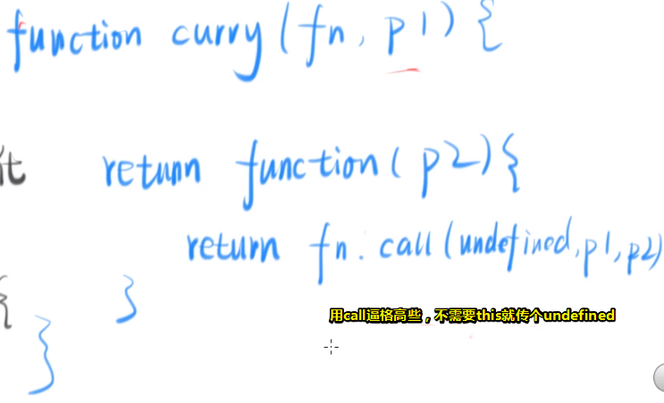

一旦调了这个return出去的函数，那么我们就call一下这个fn！

这个curry函数只能实现把sum变成addOne的这么一个柯里化

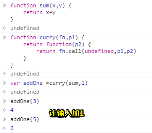

可以见到，addOne实际上是curry这个函数所return出来的函数，这个函数会接受一个参数p2，当我们调用这个函数，那么是上就会去调用sum函数！我们之前用了curry函数固定了sum函数的一个参数，之后在根据你调用addOne函数所传的参数（你传什么就是什么），确定最终的输出结果

这个curry函数做到了——把一个接受两个参数的函数变成固定一个参数接受另一个参数的函数！

一些问题：

1. 我们题目要求的abc函数有3个参数，而这里的sum只有2个参数
2. 可以不传参数1，即固定什么值由用户指定的！而不是交给这个curry函数！

接下来干啥？

如果不传这个1——形式是这样的：

```js
var fn2 = curry(sum)
var addOne = fn2(1)
fn(1)(2)
//本来的形式：
sum(2,3) //5
//通过柯里化这个sum函数之后，现在调用sum函数的形式：
fn2(2)(3)
//注意：不要去管形式转化的逻辑是怎样的，目前，你只需要关注形式是怎样的就可以了！
```

也就是说你传什么就固定什么参数，如你先传个1然后再传个2，就是你先固定一个1，相当于是addOne函数，然后再调用sum函数！

确定形式：

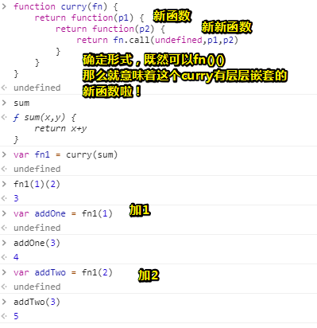

我们在curry sum函数的时候不需要传任何参数，即柯里化这个sum函数把固定参数这一步给消掉了！，总之对curry函数只需要传sum函数即可！其它参数不需要传！至于什么时候传呢？——后面传，即对curry函数所返回的新函数传即可，如fn1……第一次传什么就把sum函数的x形参固定为什么……

接下要考虑什么呢？——怎么能让curry函数接受有3个参数的fn呢？

很简单，再加个return就好了，与此同时你会了解到惰性求值是什么鬼？即不传够三个参数你会无法调用那个fn函数的！


或许你会问这有点多余、有点无聊！因为我直接 `sum(1,2,3)`就好了，即一开始就可以传到位了，为啥还要柯里化sum后再调用呢？

但是有一种情况就是「有没有可能你一开始就不知道传给sum函数有哪些参数？或者说你需要异步请求后才知道有哪些参数」——所以柯里化是能给你一次机会——让你把两次值用不同的时间来传。如sum函数的这3个参数需要从不同的服务器上请求来的数据，然后数据到位了，就把它们混到一起，才调用sum函数。而用柯利化呢？——拿到什么就传什么，那什么时候凑齐了就什么时候有结果……

可见，这就是使用了柯利化的好处啦！

那如果接受4个参数呢？咋办？

难道要再加个return？显然不能继续这样干了，因为我们无法确定fn到底有多少个参数……

好话说，有咩有一个属性标志着某个函数要接受几个参数？——有的，length属性，即函数接受几个参数可以length得到：

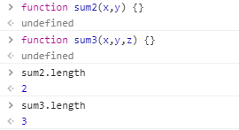

这就给我们一个启发了呀！——我们要return几次函数不就是看它要接受几个参数吗？

> 也就是说return几个函数是动态变化的咯！

总之，return（最后那个return调用fn不算）的嵌套层数就是它的length。

所以终极curry的思路是怎么写的呢？——每return一次就记一下数就告诉curry「我已经return过一次了，然后下次你就只需要return两次了」


总之通过一个length再加一个计数器就能搞定这个事了！

**➹：**[JavaScript函数式编程--柯里化(curry) - Jin](https://jinyy.app/article/js-func-curry/)

```js
function curry(func , fixedParams){
    if ( !Array.isArray(fixedParams) ) { fixedParams = [ ] } //防止fixedParams一开始是undefined，为此无法使用数组的cancat方法
    return function(){
        let newParams = Array.prototype.slice.call(arguments); // 新传的所有参数
        if ( (fixedParams.length+newParams.length) < func.length ) {
            return curry(func , fixedParams.concat(newParams));
        }else{
            return func.apply(undefined, fixedParams.concat(newParams));
        }
    };
}
```

分析：

> 当传入的参数个数没有到达`func`函数要求的参数个数的时候一直返回柯里化函数。
> 只有参数满足`func`函数的个数的时候才通过`apply`执行`func`函数。


## ★目录

异步是一些人之所以学不会JS的主要原因！总之你学不会JS，那是因为你不知道什么是异步！

这节课讲什么？

- 什么是同步？什么是异步？
- 前端经常会遇到的异步代码
- 面试题
- AJAX中的异步
- 异步主要获取结果的形式
- 回调是怎么用的
- 如何处理异步中的异常
- 什么是Promise
- 讲解一下async和await这个两个关键字

## ★同步与异步

> **➹：**[怎样理解阻塞非阻塞与同步异步的区别？ - 知乎](https://www.zhihu.com/question/19732473)
>
> 为啥同步和异步会涉及到I/O呢？——似乎涉及到网络请求等……
>
> 同步与异步的概念在JS中会不会有点不一样？

### ◇区别

简单来说，同步就是等待结果，而异步则是不等结果！形象一点来说就是同步是个很有耐心的一个人，而异步则是一个很急躁的、没有耐心的人！

#### 用代码来说明

```javascript
// 同步的 sleep
function sleep(seconds){
    var start = new Date()
    while(new Date() - start < seconds * 1000){

    }
    return
}
console.log(1)
sleep(3)
console.log('wake up')
console.log(2)
```

解释一波：

这里有个sleep函数，它什么都咩有做，只是等待几秒钟而已……

运行结果，先log个1，然后睡3s，接着再醒来，最后输出2

所以打印顺序为1→☞停3s→☞wake up→☞2

这个过程其实很符合我们人类的直觉，既然要让程序停3s，那就停3s呗……可是JavaScript不支持啊！总不能说V8老哥不要解释代码了，等3s后你在解释第11行代码吧！所以如何模拟出停3秒呢？——写一个执行3s但无意义的操作即可！简单来说，就是这3s之内，v8还在执行代码……只是做一些无意义的操作而已！唯有这样才能按顺序执行的……

在这个sleep函数中，我没有想到的是`new Date()`做计算的话，会得到毫秒数！还有那个循环判断等于3000ms也行……

接下来通过控制台，可视化3s这段时间做了什么：

1. 打开控制台
2. 切换到Performance，然后按一下ESC，就会出现Console
3. 把代码复制到Console中去，不要按回车
4. 点击左上角的Record，即记录一下我们的CPU，然后回车运行代码！

5. 运行结束后，就点击Stop，表示停止记录……


你可以看到这橙色部分基本连成一片了，所以sleep这个函数就好像让JS引擎不停地看表（看循环的判断条件……），直到走了3s钟才结束……

那么这3s钟之内看 了多少次表呢？——这个得看你的CPU有多强了，你CPU越强，看的时间次数越多！当然还得看一些软件设置，总之具体有多少次是不知道的！至少几十万次吧……

所以所谓的同步就是，`console.log('wake up')` 要等 `sleep(3)` 执行完毕后才会执行自己！

那么可以不等吗？可以不等，那就是异步啦！

```javascript
//异步的 sleep
function sleep(seconds, fn){
    setTimeout(fn, seconds * 1000)
}
console.log(1)
sleep(3, ()=> console.log('wake up'))
console.log(2)
```

这个sleep除了接收一个秒数以外，还接收一个回调！

我们把代码运行一下，**✎：**


发现，`wake up`是最后才打印的！即 `console.log(2)`并咩有等 `sleep(3, ()=> console.log('wake up'))`的执行完……

为什么不会等它执行完呢？我想来看一看sleep这个函数做了什么吧！

1. 输入：秒数、回调fn

2. 函数体：设置一个闹钟，这个闹钟会在3000ms之后调用这个fn。而在这3000ms之内JS啥也没做，之前是不停地看表，而这次则是到了时间，就由浏览器调用fn，调用fn这件事情也不是JS做的……是浏览器做的！总之

   `setTimeout(fn, seconds * 1000)`的意思是说「浏览器同志请在3秒钟之后调用fn」，毕竟这个setTimeout是浏览器提供的API，所以浏览器会去负责调用这个fn，而fn里面的才是JS的代码！

   我们**不需要等fn被调用**，直接就开始执行下一句了……此时JS是很闲的，就想去睡觉一样，接着3s后就醒来了……

所以异步和同步的区别就是，下一句不会等上一句代码执行完毕……

我们可以再次查看JavaScript的执行情况：

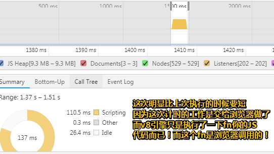

> 照理说会有一段时间不连贯才对的！……
>
> 额我看到了后面，原来是我肉眼没有观测到的原因：

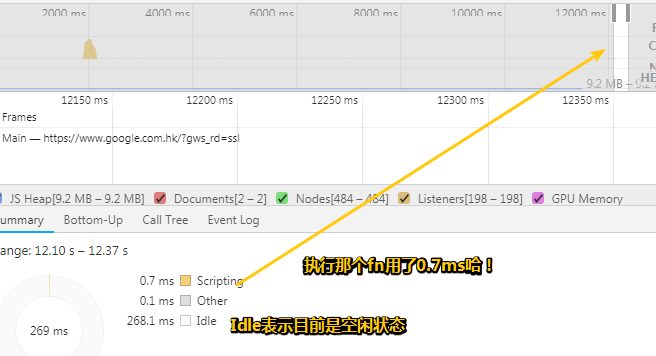

### ◇时序图

画出它们俩的运行过程……

一般异步的过程都用时序图画出来！

#### 同步

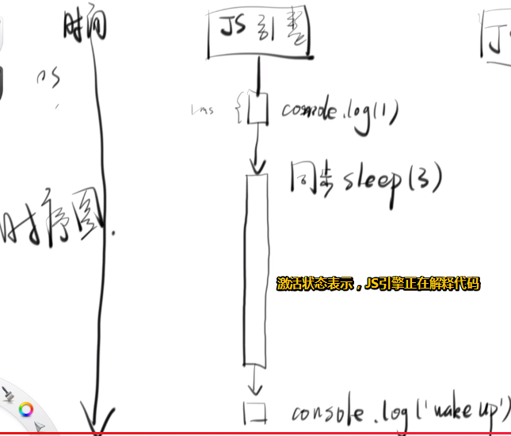

#### 异步

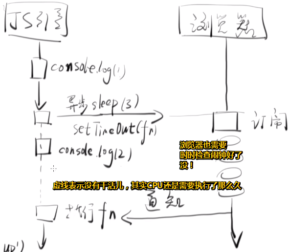


定完闹钟后就马上执行 `console.log(2)` ，这是为什么呢？因为v8引擎很闲哈！总不能傻傻地等着吧！

之所以我们可以实现异步，那是因为我们把定时这件事交给浏览器做了！这样一来JS引擎执行的时间就变少了！毕竟JS引擎处于活跃状态的话，是会阻塞浏览器的，即用户无法实时地与页面交互了！

> 其实说白了就是，一旦call stack中还有代码需要被JS引擎执行的话，那么这是会阻塞浏览器渲染的……毕竟有个渲染队列哈！

浏览器在定好闹钟之后，会定期地去看时间到了没有，一旦到了，它就会通知JS引擎去执行一下你刚刚给我的fn！

时序图是一个非常重要的用于理解异步概念的图！

### ◇小结

- 同步会等待sleep这个函数执行完毕，而异步则不会等待，直接跳到下一句！

## ★异步面试题

> 举3个异步的例子！

### ◇图片？获取它的宽度？

```js
document.getElementsByTagNames('img')[0].width // 宽度为 0
console.log('done')
```

```js
document.getElementsByTagNames('img')[0].onload = function(){
    console.log(this.width) // 宽度不为 0
    console.log('real done')
}
console.log('done')
```

- 当你分析问题不清楚的时候，就用时序图吧！

  

- 回调有多种形式，之前我们所讲的那种是作为参数的形式，那是最常见的，而用onload事件这种呢？则是另一种回调！总之我们无法确切知道图片什么时候加载成功，或许10ms、50ms……所以只能通过事件去做了……

---


所以异步想要真正拿到结果，要么就去监听一个事件，即你异步操作成功了，就告诉我……毕竟你的成功时间是不可预测的！所以我们就先挂一个函数到你的身上……即挂一个函数到onload身上，等你加载成功后，你就调一下这个onload即可！

以上就是前端遇到的第一种异步，即图片加载是需要时间的，还有一种就是面试的时候会经常问到的！

### ◇面试题中的异步

#### var？for循环……


浏览器没有等图中用圈圈	圈住的那个代码执行，直接就进入到一下个循环……总之事件是异步的……

时序图分析：


如何解决这个问题？——不要用var，用let就好了！

如果不理解let，那么就看看这篇文章：

**➹：**[我用了两个月的时间才理解 let - 方应杭的个人网站](https://fangyinghang.com/2017/let-in-js/)

#### let？for循环……


第一次循环给个i1，第二次循环给个i2……这是let做到的！总之i1等这些是不会变的……只有外面那个i才会变！而那6个分身不会变！整体来看改为let之后，从1个i变为了6个i，即多了5个i！

总之你可以直接记住结论，即把var改为let就好了！

时序图的话：

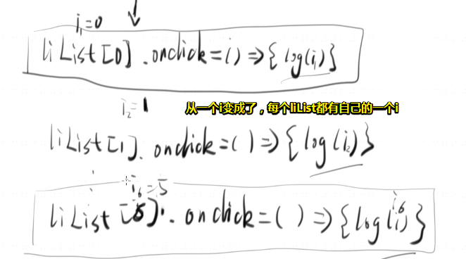

### ◇AJAX中的异步

后端程序员转前端的程序员，尤其喜欢把AJAX变为同步的，而且你会发现同步的AJAX这很奇葩啊！因为AJAX的A是异步的意思！……总之AJAX必须是异步的，况且这种同步的AJAX早就快被废除了！**✎：**

```js
let request = $.ajax({
  url: '.',
  async: false
})
console.log(request.responseText)
```

这个 `.`表示向当前页面的url请求，请求结束后才log出结果！

时序图：


用户点击了按钮，浏览器也不会响应它的动作！你可以通过这段代码测试，且在网速很慢的情况，你会发现无法选中页面中的文本！


**➹：** [demo](http://js.jirengu.com/tedinukoko/1/edit)

总之，这是一种非常垃圾的写法！所以你把异步变成同步的话，那么在你请求的过程中，整个页面什么东西都不能动，就像死了一样，但是如果你改成异步的话：


可见这就是异步的好处，即在请求结束前，浏览器同样可以响应用户所做的一些事件！而不需要等着你这个网络请求的响应返回……

接下来，来讲一下是如何拿到异步的结果的！

之前那个图片我们是在onload事件中拿到结果的，而且你不要痴心妄想可以在其它地方拿到！

还有onclick也是，当浏览器调用所赋给onclick的函数时，就会传一个东西给这个回调！

还有一种就是那个success函数！

而同步不需要什么技巧，直接就可以拿到了，**✎：**

```js
let request = $.ajax({
  url: '.',
  async: false
})
console.log(request.responseText)
```

接着把异步的结果赋值给request即可拿到，不需要什么特殊的技巧！但是异步呢？需要一些技巧（这些技巧不是所有人都知道的！）才能拿到，如onload、success……

## ★回调的形式

### ◇如何拿到异步代码的结果

啥意思？——比如说我们请求一个网络的资源，那我们用ajax，那么我们如何拿到这个网络资源的内容呢？

一般有两种形式，一种比较傻逼叫轮询，另一种则是比较正规聪明的叫回调

#### 轮询

如何用所谓的轮询拿到网络资源的内容？

既然结果是在一段时间之后才有的，那就这样做呗：

> 拿到这个结果之后，就把这个结果放到一个地方，然后定期去看一下这个地方有没有这个结果

啥意思？

假设我让一个人去帮我买水果，但是我没有时间跟他一起去买哈！毕竟分分钟几千万上下（ 调侃）……

然后叫他买好之后就放到桌子上即可！而这个**放到桌子上**就是一个结果啦，但是我们并不知道他什么时候会放到桌子上！所以，咋办呢？

比如说此刻我正在写代码，那我就每5分钟看一眼桌子，只要他把这个水果放到桌子上，那么在这5分钟之内我们肯定是能看到这个水果的，然后就把这个水果拿过来了！这就叫做轮询啦！

> 似乎是我在监听这个桌子，但是，我这个是每5min就得触发一次行为，即看一眼这桌子，如果桌子上没有东西，5min之后再次触发行为，直到桌子上有东西后，才停止这些傻逼行为
>
> 这就像是我需要写一个`setInterval()`一样，每5min就要调用一个函数或者说是执行一个代码段，然后判断桌子上是否有东西，有则把这个钟给敲碎了，没有则继续做傻逼操作！
>
> 其实这也有点像是，QQ聊天一样，过几秒看看有没有人回复……当然你可设置通知……

总之不停地去看桌子上有没有水果就是轮询啦！

**用demo模拟这个过程：**

1. 写一个buyFruit函数
2. 由于不知道啥时候把水果买回来，所以用个随机数模拟一段时间……
3. 查看水果买到没？直接看全局变量就好了！


> 我们并不知道，当我们去买水果的时候，什么时候window.apple才会变为「买到苹果啦！」，我们不停地轮询，这其实很智障啊！

有咩有一种办法可以不手动轮询呢？即不要每隔点时间就在Console中敲 `window.apple`一下，然后回车，毕竟这很不自动化呀！

那就用程序呗！你也可以用个setInterval来帮你看看 `window.apple`的值哈！


> 不知道怎么回事，在chrome的Console面板中，运行setInterval居然没有效果！以后还是用jsbin来测试JS代码好了

总之这是一种很智障的做法，即轮询（隔断时间就看一下有没有结果）……

为啥说这种方式很智障呢？——因为以前的程序员不会写代码，所以才会这样智障的代码，而正规的方法是什么呢？——回调！即你给一个函数，如果水果到了就通知你！

> 这有种发布订阅的味道……
>
> 其实，上面的代码已经用了回调了，如setTimeout的第一个参数，只是我们无法确定什么时候有结果而已，我们确定知道有结果的方式有两种，一种是通过轮询，另一张则是事件驱动吧，为啥要说是回调呢？
>
> **➹：**[事件驱动和回调函数之间有何联系？ - 知乎](https://www.zhihu.com/question/30396023)


---

## ★总结

- 把大问题拆解成小问题，根据大问题提供的方向扩展小问题，为此小问题逐渐演化成大问题，最终的结果就是把大问题给解决了，而这个过程是不断地添加问题和解决问题，有种「极限」的调调（联想到求导）……把大问题解决就像是你不想添加新问题或者说是你找不到新问题可以添加进去……

- 当你看视频学习的时候，尤其是讲解某些知识点，你最好先预习一遍，看一下资料，然后试着尝试自己先讲解一波，最后根据视频所讲的与自己所讲的进行一个比较，你在自学一遍的过程中，所遇到的不会，你就在视频找寻答案；对有些东西的理解是否准确或者说是不是还有更好的理解姿势，你都可以去视频中找寻答案！

  总之，基于每个人知识面的不同，所以对同一样的东西理解可能会千奇百怪，不管怎样，只要能解决问题就好了！至于解决问题的姿势漂不漂亮，还需要积累……

- 额，本来是腰腿有点疼，可是心无杂念（专注于写总结），坐姿比较正确，结果一站起来好像没有那么疼了……当然专注于打LOL也是如此……

- 练习题——写一个curry函数：关键在于判断所传参数个数是否凑齐了！凑齐了就调用fn啦，如果没凑齐就继续柯里化咯！

- 形式？指某物的样子和构造，区别于该物构成的材料，即为事物的外形。也有指办事的方法。形式犹言表象。


---

## ★Q&A

### ①形式大于内容？

我本来想要搜索的是「形式大于逻辑」，结果出现「形式大于内容，逻辑大于情感」……

**➹：**[演讲或讲课过程中，形式大于内容？ - 知乎](https://zhuanlan.zhihu.com/p/20853039)

**➹：**[《一代宗师》：概念先行，形式大于内容-影视评论-论坛_天涯社区](http://bbs.tianya.cn/post-filmtv-378464-1.shtml)

### ②UML？

常用的 UML 图可分静（态）图、动（态）图两类，静态图主要描绘软件的静态结构，而动态图主要描绘软件的动态行为。

常用 UML 动态图（5 个）：

用例图，活动图，状态机图，序列图，通信图。

常用 UML 静态图（4 个）：

类图，包图，部署图，构件图。

以上这 9 种图是从 UML 1.x 开始就有的，因而很基础，建议初学者先掌握这些图。

不常用的 UML 图大多是 UML 2.x 后来添加的，有 5 个：

对象图（1.x 起）、组成结构图、扩集图、交互概览图、时序图。

**➹：**[时序图 - Wikiwand](https://www.wikiwand.com/zh-hans/%E6%97%B6%E5%BA%8F%E5%9B%BE)

**➹：**[顺序图的语法和功能](http://plantuml.com/sequence-diagram)

**➹：**[在软件开发过程中，有哪些UML图是比较常用的？ - 知乎](https://www.zhihu.com/question/22253854)

**➹：**[UML 还有用吗？ - 知乎](https://www.zhihu.com/question/23569835)

**➹：**[UML实践详细经典教程----用例图、顺序图、状态图、类图、包图、协作图](http://www.uml.org.cn/oobject/201609092.asp)

**➹：**[时序图、流程图、状态图、协作图之间的区别 - rosekin的专栏 - CSDN博客](https://blog.csdn.net/rosekin/article/details/14519277)

**➹：**[快速学习时序图：时序图简介、画法及实例 -人人都是产品经理](http://www.woshipm.com/ucd/607593.html)

### ③performance？

**➹：**[全新Chrome Devtool Performance使用指南 - Nic's Utopia](https://nicholaslee119.github.io/2017/10/04/Chrome-Devtool-Performance%E4%BD%BF%E7%94%A8%E6%8C%87%E5%8D%97/)

### ④V8到底是解释代码还是执行代码？

你要知道编程语言分为编译型语言和解释型语言两类，编译型语言在执行之前要先进行完全编译，而解释型语言一边编译一边执行，很明显解释型语言的执行速度是慢于编译型语言的，而JavaScript就是一种解释型脚本语言，支持动态类型、弱类型、基于原型的语言，内置支持类型……

V8确实是在执行代码，即把JavaScript代码编译成机器码，为此，好让CPU真正地去执行代码！

目前JS引擎的执行过程为：

源代码-→抽象语法树-→字节码-→JIT-→本地代码(V8引擎没有中间字节码)。

**➹：**[认识 V8 引擎 - 知乎](https://zhuanlan.zhihu.com/p/27628685)

### ⑤let声明的变量是否会提升？

关于变量的生命周期……

 当引擎使用变量时，它们的生命周期包括以下阶段：


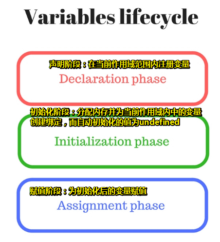

> 关于绑定，就像是为已注册的变量系上了一条目标为某个内存的地址的绳索一样……
>
> 补充：
>
> JS 变量的「创建create、初始化initialize 和赋值assign」
>
> 有的地方把创建说成是声明（declare），为了将这个概念与变量声明区别开，我故意不使用声明这个字眼。
>
> 有的地方把初始化叫做绑定（binding），但我感觉这个词不如初始化形象。

总之，JS引擎在处理变量声明的过程中需要历经3个阶段： 声明阶段、初始化阶段和赋值阶段。

注意：声明阶段非我们通常所说的变量声明……

---

**①var变量的生命周期：**（`var` variables（变量声明？） lifecycle）

> 难道翻译为var「变量声明生命周期」？还是说「变量生命周期」呢？我觉得前者比较合理！因为我是看必应词典查的！**✎：**
>
> 
>
> 我不认为它会作为一个形容词……


用代码来体现这个过程：

```javascript
function multiplyByTen(number) {  
  console.log(ten); // => undefined
  var ten;
  ten = 10;
  console.log(ten); // => 10
  return number * ten;
}
multiplyByTen(4); // => 40  
```

当JavaScript开始执行 `multiplyByTen(4); `，那么它就会在Call stack记录好当前位置，然后切换到或者说是进入到函数作用域，在执行`console.log(ten);`之前， 变量ten经历了两个阶段，即声明阶段和初始化阶段，此刻变量ten的状态为初始化状态，所以当你调用 `console.log(ten);`时，显然这个ten变量被log出的结果为undefined……

接着就是 `ten = 10;`，赋给了ten变量一个初始值10，所以历经了赋值阶段后， `console.log(ten)`的结果就是10啦！

---

**②函数声明生命周期**

相较于var这种声明，`function funName() {...}`这种函数声明语句更为简单！

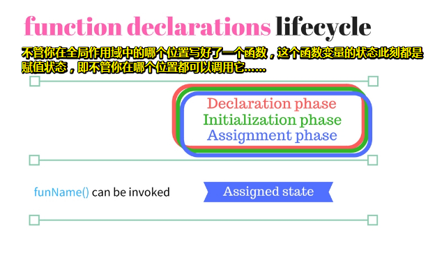

用代码来说就是：

```javascript
function sumArray(array) {  
  return array.reduce(sum);
  function sum(a, b) {
    return a + b;
  }
}
sumArray([5, 10, 8]); // => 23  
```

这个代码演示了这个sum函数的提升……即函数提升啦！

解释一波：

但JavaScript执行 `sumArray([5, 10, 8]); `，那么就会进入到sumArray的函数作用域中去。

在这个作用域里，在任何语句执行之前，sum函数首先会经历3个阶段——声明、初始化和赋值阶段……

所以 `array.reduce(sum);`是可以在我们使用这个 `function sum(a, b) {...}`声明语句之前使用sum函数的！

**③`let` variables lifecycle**

let变量声明的处理方式与var不同。 主要区别在于其声明和初始化阶段是分开的。


> 把浅蓝色的`variable`看作是`xxx`

1. 现在让我们来研究这样一个场景：当解释器进入一个包含let变量（即 `let xxx` ）语句的块作用域时，`xxx`变量会立即通过声明阶段，并将其名称（变量名）注册到该作用域中

   然后解释器继续逐行解析块级作用域里的语句

   如果在此阶段尝试访问变量`xxx`，那么JavaScript将抛出`ReferenceError : xxx is not defined`。之所以发生这种情况是因为变量`xxx`的状态未初始化，而之前的var是两者都有了，即变量处于初始化状态哈！

   总之此刻你打算访问变量`xxx`是不行的，毕竟变量`xxx`此时处于 TDZ中……

2. 当解释器到达语句`let xxx`时，初始化阶段就过去了

   那么现在变量状态则已经被初始化了，而且访问它的结果就是 `undefined`的

   此时，也意味着，变量`xxx`退出了TDZ

3. 之后当赋值语句出现，即出现`xxx ='value'`时，那么赋值阶段也就通过了，即此刻变量`xxx`为**可赋值状态**了……额，还是说`已赋值状态`呢？我觉得后者好一点，因为可以对应`已初始化状态`，不然叫 `可初始化状态` 有点怪怪的，毕竟初始化就TM一次……

4. 如果JavaScript遇到`let xxx = ' value '`，那么初始化和赋值将在这单个语句中进行。

   > 之前有了解过这样：
   >
   > ```js
   > let xxx = 'value';
   > 
   > let xxx;
   > xxx = 'value';
   > ```
   >
   > 好像是在学习vue的时候出现过这种情况，当时好像说在那个需要被挂载的DOM里写表达式的问题……

用代码来说明上述过程……

在一个块级作用域中，创建一个用let来声明的变量number：

```javascript
let condition = true;  
if (condition) {  
  // console.log(number); // => Throws ReferenceError
  let number;
  console.log(number); // => undefined
  number = 5;
  console.log(number); // => 5
}
```

当JavaScript进入到 `if (condition) {...}`这个块级作用域时，`number`立即通过声明阶段……

由于`number`目前为未初始化状态，并且处于临时死区（TDZ）中，所以试图访问变量，那么就会抛出 `ReferenceError: number is not defined`这样的错误信息出来！

之后的语句  `let number`对变量进行了初始化，所以现在是可以访问变量的，当然它的值是 `undefined`

接着赋值语句 `number = 5`，显然，这会进入到赋值阶段……

 `const`和 `class` 类型与`let`具有相同的生命周期，除了赋值只能发生一次。

---

所以，为啥提升（ hoisting）对于`let` 生命周期是无效的？

如上所述，提升是把变量在作用域顶部进行了声明和初始化的耦合，简而言之：提升就是变量的耦合，那么耦合谁跟谁呢？——声明阶段和初始化阶段

而let生命周期则是将声明和初始化阶段给解耦了，既然解耦了，那么hoisting这个术语对于let来说就消失了啊！即let的字典里没有hoisting这个单词！至于var的字典里有这个单词，但这关我屁事啊！

话又说回来， 这两个阶段之间的间隙创建了TDZ（temporal dead zone）——在这里变量是无法被访问的，所以不要痴心妄想试图访问了，毕竟有了个TDZ约束，这样你的代码看起来就好看很多了。

装逼一点来说， 站在科幻风格的角度来看，提升本来是两个位面的事儿，但对于let生命周期来说，则使出了洪荒之力把这两个位面的间隙给轰出了一个临时性死区……

> 其实用双节棍类比也挺好的，var是真的双节棍，而let则是一节棍……

结论：

1. 使用var意味着任性，容易导致很多错误！为此ES6改进了算法，引入了let，而且添加了块级作用域
2.  由于声明和初始化阶段是分离的，所以提升对于`let 变量`(包括常量和class)是无效的。初始化之前，变量处于临时性死区，而且这是不可访问的。
3. 为了让你（写JavaScript代码的）干变量声明的活儿优雅起来，所以推荐了一些建议给你：
   - 声明，初始化，然后使用变量。这个流程是正确的且易于遵循
   -  尽可能隐藏变量。暴露的变量越少，那么代码就越模块化。

这其实是 *variables coding best practices*哈！

补充，关于对let的扩展：

对JS变量封禁起来，即你无法对该变量进行**赋值、取值**，还是**声明**……

做法？——直接 `let x = x`即可，不要想着x是个undefined哈！因为右值x已经报错了。即初始化过程失败！

可以得到的结论：

如果 let x 的初始化过程失败了，那么

1. x 变量就将永远处于 created 状态。
2. 你无法再次对 x 进行初始化（初始化只有一次机会，而那次机会你失败了）。
3. 由于 x 无法被初始化，所以 x 永远处在暂时死区（也就是盗梦空间里的 limbo）！
4. 有人会觉得 JS 坑，怎么能出现这种情况；其实问题不大，因为此时代码已经报错了，后面的代码想执行也没机会。

**➹：**[我用了两个月的时间才理解 let - 知乎](https://zhuanlan.zhihu.com/p/28140450)

**➹：**[var let变量提升引发的思考 - 简书](https://www.jianshu.com/p/b87d620185f2)

**➹：**[let 声明会提升（hoist）吗？ - 知乎](https://zhuanlan.zhihu.com/p/27558914)

**➹：**[★JavaScript variables lifecycle: why let is not hoisted](https://dmitripavlutin.com/variables-lifecycle-and-why-let-is-not-hoisted/)

### ⑥事件驱动模型？

事件驱动模型也就是我们常说的观察者，或者发布-订阅模型；理解它的几个关键点：

- 首先是一种对象间的**一对多**的关系；最简单的如交通信号灯，信号灯是目标（一方），行人注视着信号灯（多方）；
- 当目标发送改变（发布），观察者（订阅者）就可以接收到改变；
- 观察者如何处理（如行人如何走，是快走/慢走/不走，目标不会管的），目标无需干涉；所以就**松散耦合**了它们之间的关系。

---

事件驱动机制就是：

- 让驴拉磨，它不拉，你用鞭抽一下，它就开始拉了。然后又停了，你再抽一下，它又继续拉了。**这叫用“鞭”驱动“驴”拉磨**

- 在程序里，程序停止在那不动，你点击一个按钮，它就有反应了，过一会，又没反应了，你再点一下，它又继续运行。**这叫用“事件”驱动“程序”运行**  

**➹：**[事件驱动编程 - 简书](https://www.jianshu.com/p/d4e591465ef3)

**➹：**[事件驱动机制是什么？_百度知道](https://zhidao.baidu.com/question/538382174.html)

**➹：**[编程和数学建模的区别是什么？ - 问答 - 问答 - 果壳 科技有意思](https://www.guokr.com/question/460622/)

