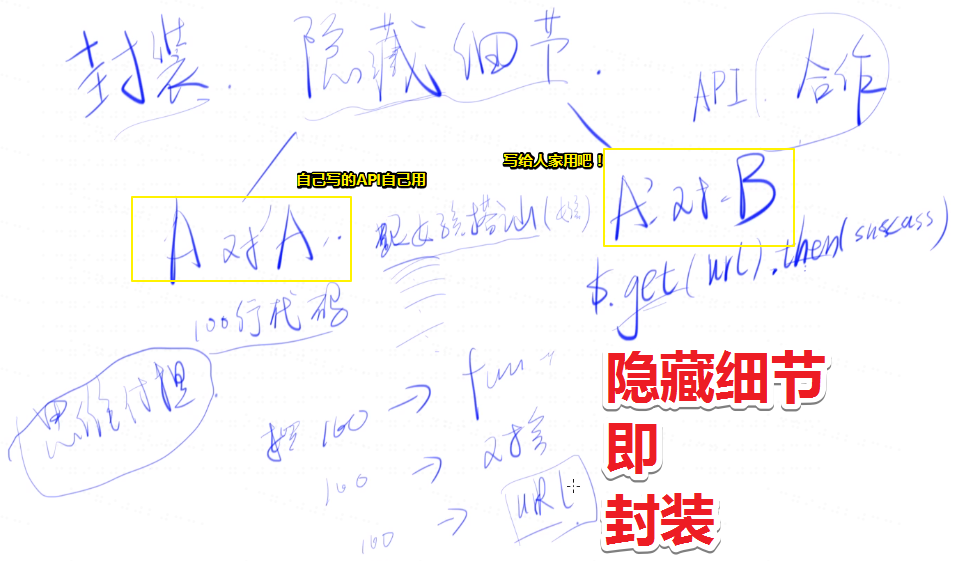
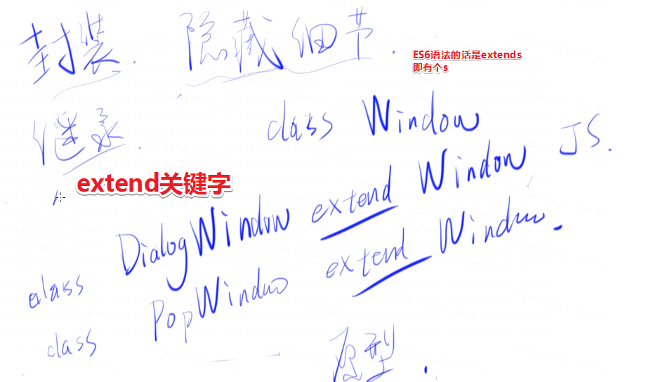

# 面向对象（上）

## ★总览

### ◇上节课答案


用图解释一波：


**➹：**[一个简单的 Promise 实现](https://judes.me/tech/frontend/2017/03/12/a_simple_promise.html)

> 这个答案我没有去看……

### ◇面向对象解决的问题

并不是：封装、继承、多态
而是写代码的套路问题（定势思维）

### ◇对象与函数的关系

JS中对象函数没有关系，JS之父通过this 强行使得它们有关系。

`obj.fn.call(obj,1,2,3)=>obj.fn(1,2,3)`

### ◇对象与对象的关系

## ★封装和继承

接下来，我们要讲的是JS中的面向对象，而不是其它语言的面向对象，毕竟JavaScript的面向对象跟其它语言的都不太一样！

### ◇什么是面向对象？

在上节课里边，我们讲到了异步，但发现没有用到对象！当然，我们用到了很多函数，然而在面向对象这个领域里边，是咩有**函数**这个词的！


画个图解释一波：


我一直觉得面向对象就是一个宗教，即你有信仰，认为世界万物都是有出处的！在这里，我把宗教分为两个，一个是「面向对象」教，还有一个是「函数式」教，当然还有个无教派，即认为这两个教都挺好的，我都可以加入这两个教，总之，无教派者们认为「自己无须一直遵循某种特定的教义，该什么时候用就什么时候用，即需要用面向对象就面向对象，需要用函数式就函数式，而不是要么这个式，要么那个式，选择一个之后，就终身不能选择另外一个了！简而言之，我两个都喜欢！」

回过头来看，函数式教，如我们之前的 `new Promise(fn)`，`Promise(fn)`就是个函数式，而加上个new就变成是面向对象式了！

而在面向对象式教里边，是没有「函数」这个词的！就像有些教义是咩有同性恋的，也没有离婚的，不允许吃荤的等等，总之**一般来说教义都有推崇什么，反对什么**，像面向对象它就没有函数一说！

既然没有函数，那它对应的是什么呢？——就是「类」啦！

你要知道的是面向对象的核心可不是对象呀！而是**类**呀！

但是在JavaScript里边，是**咩有类**的！所以这就很尴尬了呀！


于是，与类对等的东西就出现了，而这个东西叫做「**构造函数**」

那么什么是构造函数呢？我们之前有讲到过，但现在让我们来再次回顾一下它的定义：

> 如果一个函数返回了一个对象，那么这个函数就叫做构造函数啦！

而类呢？**如果一个东西，它返回了对象，那么这个东西就叫做类**！

所以，我们可以看到，它们俩是一个定义的，因此，我们大可认为「**所谓的类就是构造函数！**」

小结：

- 大致理解一下函数式和面向对象式的区别即可，比如关于面向对象：

  - 什么是类？什么是构造函数？

  而关于函数式则是：

  - 只讲函数，没有类，甚至连对象都不想讲！总之，就是全函数！

### ◇面向对象要解决的问题是什么？

> 换言之，就是为什么会有面向对象？

如果你学过面向对象的话，那么你听到最多的就是这三面大旗了——**封装、继承和多态**！

然而，在我看来这是很扯淡的一件事！

为什么这么说呢？——因为所有东西都可以有这三面大旗啊！并不是说只有你面向对象教才有的！只不过，你面向对象特别喜欢这三个东西罢了！

#### 什么是封装？



封装就是隐藏细节！为什么要隐藏细节呢？有这么两种情况：

1. 一个是自己（A）对自己（A）隐藏细节
2. 一个是自己（A）对别人（B）隐藏细节

我们先来看第二种情况，因为这个好说一点。举例来说，假如A是jQuery的作者，他提供了一个方法叫做 `$.get(url)`，而这样对B来说就很very good了！因为B只需要传给url过去，然后 `$.get(url).then(success)`即可！所以这就叫做隐藏细节了！毕竟B只需要传两个参数即可！

所以这样做的好处就是「我们合作起来特别顺畅！」即，你不用管我 `$.get()`到底用了什么技术，我只给了提供一个优雅的API，而你用这个API就能到达你的目的了！而我则保证「我把这个get和then写得好好的！」这样一来，这个就有助于我们双方之间的合作了呀！

所以说，**封装，在人和人之间意义就是有助于合作和交流，甚至不用交流，看这个API的名字就知道怎么做了**！

如果是自己对自己呢？

比如说，我们写了一百行代码！而这100行代码是我们一行行写的！而且这里边的代码是一个很复杂的逻辑，由于我们不想每次都得 把这100行代码都给看一遍，毕竟忒他妈麻烦了！于是我们就对它取了一个名字—— `跟女孩搭讪（女孩名字）`

有了名字之后，我们就可以把代码（假如里边代码是搭讪的套路）封装起来了，我们只需要传一个女孩的名字，然后我们就可以自动的去找这个女孩，自动的去搭讪，然后结果呢？就是成功或失败！

可以看到，我们不需要去了解是如何去搭讪的，只需要传个女孩的名字即可！

那么，这样做到底有什么好处呢？

就是可以解决你自己这个的思维负担！

为什么说可以解决思维负担呢？

因为这100行代码，你只要给它们取一个名字，或者 说给它们封装成一个对象，或者封装成一个类！以后，你只需要看这个名字，你就知道这是要跟女孩搭讪

至于是说「女孩你掉了一块砖？」「你的钱掉了？」还是其它等等什么的搭讪技巧，自己就不需要管了

总之，这就是**自己对自己分装，用于减少自己的思维负担，方便写出条理更清楚的代码**！

那么问题来了？你说这两种情况一定要用面向对象姿势弄出来吗？

显然，这是不一定的！因为，我简单地用一个函数也可以做到啊！

所以说，**面向对象可以实现封装，但不代表只有面向对象可以封装，只要你是隐藏细节，就都可以叫做封装！**

比如说，你把100行代码**变成一个function**，那么这个是不是封装呢？——答案，显然是的！

把100行代码**变成一个对象**，同样也是封装！

把100行代码**变成一个url**，同样也算是封装！

………

为什么说url也行呢？因为，你一旦get我这个url，那么我后台就得去做事情了！然后把结果响应回来给你了！

所以，**你只要把细节隐藏了，那就是封装了！**

#### 什么是继承？

继承是干嘛的呢？继承是为了……

还是先说一下继承之前是怎么样的吧！然后再看一下，继承之后有什么好处！

有这样一个场景：


> 没有继承之前，是没有三根线连在一起的！即，互不产生联系！

假设我们要写一个桌面程序 ，你可以认为是div做的，也可以是其它的东东，总之，不管是什么都行！

有一个叫窗口东西，我们知道每个窗口都是很固定的，如在windows里边，一个窗口它有这样几个元素：

1. 一个×
2. 一个标题栏
3. 一个状态栏


然后我们对这个窗口起一个名字，叫做「window」，而**这个window是一个函数，当然，你也可以认为它是一个类**！不过，这都无所谓啦！总之，它唯一的特点就是「接受一个名字！然后会返回一个对象」，就像下边这样的代码：

```
window = Window(name)
```

你可以加new，也可以不加，之后会说到这个new不new的问题！总之，目前在这里，new不new都一样！

随着时间的流逝，你会发现这有一个问题呀！即，我的窗口可不止上述所描述的这么一种窗口，我还有其它的窗口，比如说，我还有：

对话框的窗口：


它与那个Window窗口大部分是一样的，只是稍微小了一点，而且还有一个确定按钮，需要注意的是，你不能点击该对话框以外的地方关闭这个对话框，而是点击那个「x」或者「确定按钮（ok）」才行！所以这就是为什么叫它为对话框的原因了！

还有一种是什么都没有的窗口：


这是一种把标题栏、×等都隐藏的窗口，总之，这个窗口你不能关闭它，而是用于显示一些信息，然后过一段时间之后它就会消失的这样一个窗口，可以理解为我们右下角的弹窗一样，过一段时间它就消失了！

如果我们不用继承的姿势，写这三个窗口的话，我们就得写3个函数，分别如下：

- Window，要做的事有：

  1. 初始化关闭（`×`）按钮
  2. 出初始化标题栏
  3. 初始化宽高
  4. 初始化状态栏

- 弹窗：

  1. 前4步同上
  2. 点其它地方不关闭窗口
  3. 必须有个`ok`按钮

  总之，前4件事情是一样的，即存在**重复**

- 什么都没有的窗口：

  1. 可以同上的前4步，也可以不同上，如果同上的话，那么第五步，可以是去掉`×`按钮。

如果我们把那4件事情，变成是一个东西的话，那么我们再让窗口去继承的话，即「4件事」等价于「同上」之意。

可见，「同上」这么一个东西就是「继承」了

官方一点的说法就是「我直接用另外一个东西的属性和方法，不再自给自足的去声明了，而是在另外一个东西的基础之上，去加我新的属性和方法。」

这样一来，我们就产生了三种窗口：

1. 基本窗口（1234）
2. 对话框（56）
3. 提示框（5）

至此，我们所写的代码，只需要写7种功能即可！毕竟，后面两种框都继承了第一种框的那4个功能！

所以继承是啥意思呢？

就是这样一个意思——**我拥有你的所有东西，然后，我还有我自己特殊的东西**

如对话框拥有基本窗口的所有东西，而且对话框还有`ok`按钮，以及「点其它地方不关闭窗口」这样特殊的功能

那么，继承可以怎么实现呢？

**面向对象的方法，就是通过一个关键字来实现**，不过，这个关键字，在JavaScript里边是没有这个东西的！当然，在这里是指ES5（包括ES5）之前是没有的。总之，一开始JavaScript是没有的，而最新的JavaScript是有的！

那么这个关键字是啥呢？

它叫`extend`



假设有一个叫`Window`的类或者是构造函数，如果我还有一个叫做 `DialogWindow`的类的话，那么我在声明它时候，我就直接这样写了（JS可不是这样的姿势）：

```
class DialogWindow extend Window
```

那么这是啥意思呢？

就是说Window有的，我`DialogWindow`也都有，然后我还有其它的你Window没有的！

同理，我如果还有个弹出窗口`PopWindow`也继承了Window：

```
class PopWindow extend Window
```

以上的两行代码，实现了继承，不过，你只需要知道关键字extend的意思即可，**无需知道这个关键字到底是不是正确的拼写**！

那么JS的姿势是怎样的呢？

**JS它是用原型来做的！**（之后会讲，JS是如何做到的！）


## ★总结


## ★Q&A