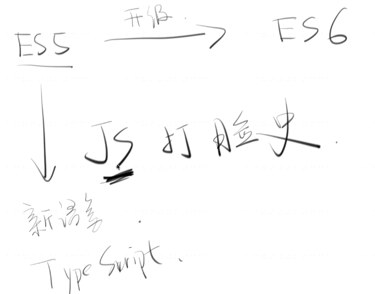

# 新版变量声明：let 和 const

## ★课程简介

ES 6 新特性一览：<https://frankfang.github.io/es-6-tutorials/>

教程：es6.ruanyifeng.com

### ◇先学 ES 5 还是 ES 6

无聊的问题，ES 6 包含 ES 5，你无论如何都必须先学 ES 5，才能看懂 ES 6

### ◇ES 6 如何学

1. 快速通览，然后使用
2. 边使用边加深印象

### ◇自学的问题

你不知道一个语法为什么要存在

1. 触类旁通，去看看其他语言有没有这个语法，怎么用的
2. 反证法，如果不用这个语法，该怎么实现需求

### ◇let & const

[我用了两个月的时间才理解 let](https://zhuanlan.zhihu.com/p/28140450)

1. let 和 var 的区别
2. const 和 let 的区别
3. 相关面试题

### ◇扩展链接

**➹：** [ECMAScript - Wikiwand](https://www.wikiwand.com/en/ECMAScript#/Versions)

## ★概述

### ◇一些问题

这一个系列课只讲ES6的知识点！

什么是ES6？——自己去搜一下就好了！如可以去了解它的历史之类的……

为什么会有这一次系列课？——因为ES6已经是前端的事实标准了！什么叫事实标准呢？即除了IE，所有浏览器都支持了ES6！但是大部分前端只会ES5，那ES6是2015年出的一个语法，而今年是2018年，那么距离现在已经过去3年了！或许你会觉得这语法依旧很新，但其实这已经是旧语法了！为什么这么说呢？因为在今年的6月份ES9已经出来了！

学完ES6后学什么？——学ES7，然后学ES8……总之学习顺序是ES5→☞ES6→☞ES7→☞……那么为什么要这样学呢？**➹：**

总之，不管先学ES5还是ES6，ES6都是包含ES5的，不管你学什么，都得先学核心，然后再学周边的。这次系列课只讲纯语法，不讲对应的在页面上怎么使用！

讲解目录：<https://fangyinghang.com/es-6-tutorials/>。这个是ES6的新特性列表！除了ES5之外的内容就这么多！看上去内容挺多的，讲解顺序——从左到右，一个个往下讲……

在讲解这些新特性之前，我们需要解决一些问题：

为什么JS要升级呢？是因为要加强吗？

芳芳个人认为从ES5到ES6，就是JS的打脸史……怎么个打脸法呢？基本上把它以前认为对的东西都给改掉了！如一开始不要出这个，后来就出了这个；要出这个，后来又不出这个……总之就是一直在打脸……

那为什么JS宁愿去打脸，也不愿意发明一个新的语言呢？

有两种途径，如果你觉得ES5太烂了，你就放弃它，然后产生新的语言，如TypeScript；可为什么我们要选择升级呢？因为JS的生命力太过于顽强，就算它那么烂，全世界所有的开发者却都喜欢使用JS，基本上所有的开发者都会写JS以及会写另一门语言，如写PHP的会写JS，写JAVA也会写JS，写python的也会写JS等等……只有前端是专门学JS的，所以芳芳**建议大家除了学JS以外还要学习另外一门语言**……

为什么特意强调这是一个打脸史过程呢？是为了定义这个系列课的基调——打脸，带着一种有种嘲讽、愉悦的心情去学习它！

如果在学习的过程中有任何不懂的，可以在群里问，或者可以去看阮一峰的！

### ◇目录

目录：

- 先从简单的开始学，然后再学复杂的！所以先学ES5，然后再学ES6

- ES6怎么学？——一般来说，所有语言的特性都是这样的，即快速的全部看一遍，然而这个大部分人都做不到，为什么这么说呢？因为除非你天资很高，如果你是个普通的自学者，你想在没有了解JS的情况下去通览ES6的特性，这很难……

  接下来就是开始用了，即我知道有哪些东西，相当于背了一个字典，如ES可以干什么，有let、const等……然后就开始用了，然后再用的过程中边用边加深印象。那边加深印象有哪些方法呢？

  第一个你可以看阮一峰的[ES6教程](http://es6.ruanyifeng.com/)，第二个你可以看[MDN](https://fangyinghang.com/es-6-tutorials/)（这个内容里面的链接都指向MDN）

  总之先通览，边用边加深！

- 自学的问题？——如果你自学，即你没有人指导的话，那么将会遇到一个比较大问题的就是「你不知道为什么会有这样一个语法存在」，不如说Symbol，JS一开始没有Symbol，但是在ES6中就突然出现一个叫Symbol类型，而到目前为止，前端基本上没有人去使用Symbol类型，因为它们不知道为什么要去用它！换句话说就是「我知道有这个语法，但是我平时用不到！」，那么在这种情况下，基本上你就不能靠自己想了！所以你需要去 ？有些特殊的技巧，比如说：

  1. 触类旁通：就是你去看看其它的语言，比如说ruby这门语言，它是有Symbol的！然后你去看看ruby是怎么用symbol的，为此，你就知道了JS大概会怎么样去用Symbol的！就好像美国和中国一开始，美国好多人买汽车，但中国以前刚解放的时候很穷，咩有钱买汽车，但是现在中国人有钱了，买了自己的小轿车之后，那么该怎么用，有哪些品牌，你参考美国不就好了吗？如美国人说哪个好，我们就去看一下是不是真得好、看美国人是怎么开车的……

     总之：如果某个语言比较先进，那我们JS作为一个后进的语言就去抄袭一下它们，所以这就叫做触类旁通，直白一点就是去看看别的语言是怎么用这个语法的，那就可以快速的知道这JS也是一样的用法，没有什么区别

  2. 反证法：有很多情况下你不知道为什么会这样用，那你就想「那如果不用它，即我就不用这个语法，我该怎么实现某个效果」

  这次系列课中会经常用到这两个方法！

根据 [ES 6 新特性列表](https://fangyinghang.com/es-6-tutorials/) 这个开始讲，第一个就是著名的变量声明—— `var、let、const`这三者的区别

## ★let和const

## ★总结

- 对「触类旁通」这四个字有了更深一层的认识，如语法的互相抄袭。同一个效果，有多种途径可以做到，当你不理解这种途径是怎么做到的时候，你就去看看其它途径是怎么做到的，简而言之，三个字可以概括这一过程——反证法
- 可以叫ES6精讲，也可以叫ES6深入浅出……

## ★Q&A

### ①什么叫基调？

- 音乐作品中主要的曲调
- 比喻基本精神、基本观点等，如会议的 基调是团结奋进
- 风格、主要情感，如rap的flow……

突然想到似乎可以把基调看作是一个变量名，然后应用到句子的时候，就把替换一下就好了，如「会议的基本精神是团结奋进」

### ②触类旁通？

> 接触某一事物并掌握其规律后，就能推知同类的其他事物（旁：别的；通：通晓）。

接触Ruby的Symbol语法后，并了解其用法以及其存在的意义后，就能推知JS的Symbol语法是怎么用的，以及要解决什么问题了……

