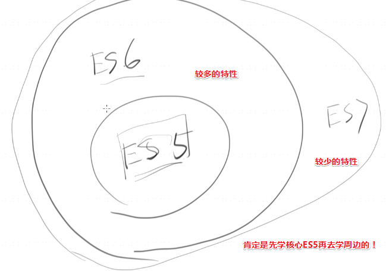
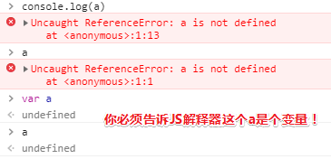
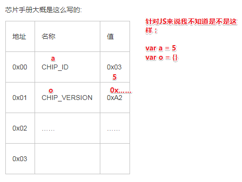

# 新版变量声明：let 和 const

## ★课程简介

ES 6 新特性一览：<https://frankfang.github.io/es-6-tutorials/>

教程：es6.ruanyifeng.com

### ◇先学 ES 5 还是 ES 6

无聊的问题，ES 6 包含 ES 5，你无论如何都必须先学 ES 5，才能看懂 ES 6

### ◇ES 6 如何学

1. 快速通览，然后使用
2. 边使用边加深印象

### ◇自学的问题

你不知道一个语法为什么要存在

1. 触类旁通，去看看其他语言有没有这个语法，怎么用的
2. 反证法，如果不用这个语法，该怎么实现需求

### ◇let & const

[我用了两个月的时间才理解 let](https://zhuanlan.zhihu.com/p/28140450)

1. let 和 var 的区别
2. const 和 let 的区别
3. 相关面试题

### ◇扩展链接

**➹：** [ECMAScript - Wikiwand](https://www.wikiwand.com/en/ECMAScript#/Versions)

## ★概述

### ◇一些问题

这一个系列课只讲ES6的知识点！

什么是ES6？——自己去搜一下就好了！如可以去了解它的历史之类的……

为什么会有这一次系列课？——因为ES6已经是前端的事实标准了！什么叫事实标准呢？即除了IE，所有浏览器都支持了ES6！但是大部分前端只会ES5，那ES6是2015年出的一个语法，而今年是2018年，那么距离现在已经过去3年了！或许你会觉得这语法依旧很新，但其实这已经是旧语法了！为什么这么说呢？因为在今年的6月份ES9已经出来了！

学完ES6后学什么？——学ES7，然后学ES8……总之学习顺序是ES5→☞ES6→☞ES7→☞……那么为什么要这样学呢？**➹：**



总之，不管先学ES5还是ES6，ES6都是包含ES5的，不管你学什么，都得先学核心，然后再学周边的。这次系列课只讲纯语法，不讲对应的在页面上怎么使用！

讲解目录：<https://fangyinghang.com/es-6-tutorials/>。这个是ES6的新特性列表！除了ES5之外的内容就这么多！看上去内容挺多的，讲解顺序——从左到右，一个个往下讲……

在讲解这些新特性之前，我们需要解决一些问题：

为什么JS要升级呢？是因为要加强吗？

芳芳个人认为从ES5到ES6，就是JS的打脸史……怎么个打脸法呢？基本上把它以前认为对的东西都给改掉了！如一开始不要出这个，后来就出了这个；要出这个，后来又不出这个……总之就是一直在打脸……

那为什么JS宁愿去打脸，也不愿意发明一个新的语言呢？

有两种途径，如果你觉得ES5太烂了，你就放弃它，然后产生新的语言，如TypeScript；可为什么我们要选择升级呢？因为JS的生命力太过于顽强，就算它那么烂，全世界所有的开发者却都喜欢使用JS，基本上所有的开发者都会写JS以及会写另一门语言，如写PHP的会写JS，写JAVA也会写JS，写python的也会写JS等等……只有前端是专门学JS的，所以芳芳**建议大家除了学JS以外还要学习另外一门语言**……


为什么特意强调这是一个打脸史过程呢？是为了定义这个系列课的基调——打脸，带着一种有种嘲讽、愉悦的心情去学习它！

如果在学习的过程中有任何不懂的，可以在群里问，或者可以去看阮一峰的！

### ◇目录

目录：

- 先从简单的开始学，然后再学复杂的！所以先学ES5，然后再学ES6

- ES6怎么学？——一般来说，所有语言的特性都是这样的，即快速的全部看一遍，然而这个大部分人都做不到，为什么这么说呢？因为除非你天资很高，如果你是个普通的自学者，你想在没有了解JS的情况下去通览ES6的特性，这很难……

  接下来就是开始用了，即我知道有哪些东西，相当于背了一个字典，如ES可以干什么，有let、const等……然后就开始用了，然后再用的过程中边用边加深印象。那边加深印象有哪些方法呢？

  第一个你可以看阮一峰的[ES6教程](http://es6.ruanyifeng.com/)，第二个你可以看[MDN](https://fangyinghang.com/es-6-tutorials/)（这个内容里面的链接都指向MDN）

  总之先通览，边用边加深！

- 自学的问题？——如果你自学，即你没有人指导的话，那么将会遇到一个比较大问题的就是「你不知道为什么会有这样一个语法存在」，不如说Symbol，JS一开始没有Symbol，但是在ES6中就突然出现一个叫Symbol类型，而到目前为止，前端基本上没有人去使用Symbol类型，因为它们不知道为什么要去用它！换句话说就是「我知道有这个语法，但是我平时用不到！」，那么在这种情况下，基本上你就不能靠自己想了！所以你需要去 ？有些特殊的技巧，比如说：

  1. 触类旁通：就是你去看看其它的语言，比如说ruby这门语言，它是有Symbol的！然后你去看看ruby是怎么用symbol的，为此，你就知道了JS大概会怎么样去用Symbol的！就好像美国和中国一开始，美国好多人买汽车，但中国以前刚解放的时候很穷，咩有钱买汽车，但是现在中国人有钱了，买了自己的小轿车之后，那么该怎么用，有哪些品牌，你参考美国不就好了吗？如美国人说哪个好，我们就去看一下是不是真得好、看美国人是怎么开车的……

     总之：如果某个语言比较先进，那我们JS作为一个后进的语言就去抄袭一下它们，所以这就叫做触类旁通，直白一点就是去看看别的语言是怎么用这个语法的，那就可以快速的知道这JS也是一样的用法，没有什么区别

  2. 反证法：有很多情况下你不知道为什么会这样用，那你就想「那如果不用它，即我就不用这个语法，我该怎么实现某个效果」

  这次系列课中会经常用到这两个方法！

根据 [ES 6 新特性列表](https://fangyinghang.com/es-6-tutorials/) 这个开始讲，第一个就是著名的变量声明—— `var、let、const`这三者的区别

---

## ★let和const

### ◇预习

#### ES6简介

- ES6的目标：是使得 JavaScript 语言可以用来编写复杂的大型应用程序，成为企业级开发语言。

- ES6 既是一个历史名词，也是一个泛指，含义是 5.1 版以后的 JavaScript 的下一代标准，涵盖了 ES2015、ES2016、ES2017 等等，而 ES2015 则是正式名称，特指该年发布的正式版本的语言标准。

  总之ES6一般是指 ES2015 标准，但有时也是泛指“下一代 JavaScript 语言”。

- [你的浏览器支持 ES6 吗？ - ES-Checker](http://ruanyf.github.io/es-checker/index.cn.html)

#### let 和 const 命令


---

## ★总结

- 对「触类旁通」这四个字有了更深一层的认识，如语法的互相抄袭。同一个效果，有多种途径可以做到，当你不理解这种途径是怎么做到的时候，你就去看看其它途径是怎么做到的，简而言之，三个字可以概括这一过程——反证法
- 可以叫ES6精讲，也可以叫ES6深入浅出……
- 可以在这儿查找资料：[翻译 - HTML5 Chinese Interest Group Wiki](https://www.w3.org/html/ig/zh/wiki/%E7%BF%BB%E8%AF%91)

## ★Q&A

### ①什么叫基调？

- 音乐作品中主要的曲调
- 比喻基本精神、基本观点等，如会议的 基调是团结奋进
- 风格、主要情感，如rap的flow……

突然想到似乎可以把基调看作是一个变量名，然后应用到句子的时候，就把替换一下就好了，如「会议的基本精神是团结奋进」

### ②触类旁通？

> 接触某一事物并掌握其规律后，就能推知同类的其他事物（旁：别的；通：通晓）。

接触Ruby的Symbol语法后，并了解其用法以及其存在的意义后，就能推知JS的Symbol语法是怎么用的，以及要解决什么问题了……

### ③为什么要声明变量？

> 其实换句话说就是「定义变量的作用是什么？」

反证法：

- 如果不声明变量的话，那么JS解释器就不认识这个所谓的「变量」，只是一个莫名其妙的字符而已：

  

  唯有声明了变量，解释器或编译器才会设置一个空间来存储所给出的值

变量的定义：

- [变量](https://www.wikiwand.com/zh-cn/%E5%8F%98%E9%87%8F_(%E7%A8%8B%E5%BA%8F%E8%AE%BE%E8%AE%A1))可以指在[计算机存储器](https://www.wikiwand.com/zh-cn/%E9%9B%BB%E8%85%A6%E8%A8%98%E6%86%B6%E9%AB%94)里**存在值的被命名的**存储空间。

我们可对变量做啥：

- 变量通常是可被修改的，即可以用来表示可变的状态

- 为变量命名——每种编程语言都有规则指定什么才可作为[变量](https://www.wikiwand.com/zh-cn/%E5%8F%98%E9%87%8F_(%E7%A8%8B%E5%BA%8F%E8%AE%BE%E8%AE%A1))的名字

如果不理解的话，可以触类旁通：

> 在[初等数学](https://www.wikiwand.com/zh-cn/%E5%88%9D%E7%AD%89%E6%95%B0%E5%AD%A6)里，**变量**或**变元**、**元**是一个用来表示值的[符号](https://www.wikiwand.com/zh-cn/%E7%AC%A6%E8%99%9F)，该值可以是随意的，也可能是未指定或未定的

变量是一个用来表示值的符号！

**➹：**[变量 - Wikiwand](https://www.wikiwand.com/zh-cn/%E8%AE%8A%E6%95%B8)

其它的一些答案：

- 在编程里，变量其实是存放值的存储器地址的别名
- 上帝叫你完成一件任务的时候,你必须存在(声明变量)

**➹：**[编程里定义变量的作用是什么。为什么要给它定义个数据类型，怎么熟练学好这个知识_百度知道](https://zhidao.baidu.com/question/7710070.html)

变量？存储地址？什么鬼？变量与存储地址是等价的吗？

用标签标记文本，用变量名指代变量？

> 变量：用来标识(identify)一块内存区域，这块区域的值一般是可以更改的，这就是它“变”的由来，但是我们可以通过使用如const等一些修饰符号来限定这一内存区域的操作特性(characteristic)，即变量的操作特性。用const修饰的使变量不能更改的就和常量一样的变量叫做常变量。 
>
> 变量名：是一个标识符(identifier)，用来指代一块内存区域，即变量，使用变量使我们操作内存以区域(area)，以块(block)为单位，提高了方便性。 

变量名是用来标识某个内存块的 

变量是地址的别名..就像刚生的小孩,你只知道他在地球上的某个位置,而不能叫出他名字,给你取个名

一般来说，变量名不需要存储，但对于带 eval 的动态语言来说，变量名是储存的，比如 JS 的每个 Environment Record 就存了所有的局部变量，以及访问链。

**➹：**[变量名储存在那里，变量的储存机制是什么？ - 知乎](https://www.zhihu.com/question/34266997)

**➹：**[C 里面 ---变量名-- 和 --地址-- 的关系探讨 - 那些年....的专栏 - CSDN博客](https://blog.csdn.net/jiary5201314/article/details/44684243)

**➹：**[变量名和变量地址 - 天天向上... - 博客园](https://www.cnblogs.com/xuhj001/p/3436177.html)

**➹：**[程序如何根据变量名在内存中找到存放这个变量的地址？ - 知乎](https://www.zhihu.com/question/20086414)

### ④为什么要对变量私有化？

> “‘老王忘记把他的猫封装，后来他的猫就被辗平了⋯⋯’（在捷运站听到的鬼故事）”摘自《Head First Java》

**➹：**[编程中为什么要把一些变量私有？ - 知乎](https://www.zhihu.com/question/21142338)

### ⑤JS 环境记录 访问链？

对于 C/C++ 这种编译成机器代码的语言：
**变量名不需要储存**，所有的局部变量读写都会变成（栈地址 + 偏移）的形式。
允许子程序嵌套的语言比如 Pascal/ML，读写非局部变量会经由访问链（Access link）去读其他的栈帧，但是变量名也会变成一个索引（整数），不会在内存中出现的。

对于带 eval 的动态语言来说，变量名是储存的，比如 JS 的每个 Environment Record 就存了所有的局部变量，以及访问链。

我是否可以这样理解：



再次理解：

我把桌子看作是一份内存空间，桌子上面可摆放一个水杯或者一台电脑，或者二者都存在，只要桌子够大就行！

我们可以把这份内存空间看作是一个变量，换句话说「我们在说变量也就是在说内存地址」，针对我们开发者而言，我们大都使用高级语言来开发程序，如果我们要去读取数据，该怎么读好呢？写个内存地址吗？显然不会，我们可以为变量取个名字，用于标识这个变量，这就是标识符啦！更通俗一点来说就是变量名！

所以：

> 变量名不需要储存，变量名是给人看的，编译器编译的时候知道每个变量所储存的地址，直接使用地址来读写便是。

言归正传：

**➹：**[谈谈JavaScript的词法环境和闭包（一） - 聪豆儿的前端专栏 - SegmentFault 思否](https://segmentfault.com/a/1190000006719728)

**➹：**[理解 JavaScript（二） - 太极客（Very Geek） - SegmentFault 思否](https://segmentfault.com/a/1190000000348228)

- 声明变量：

  ```js
  var a;
  ```

- 定义变量：

  ```js
  var a = 1;
  ```

解释：

- **声明：**是指你声称某样东西的存在，比如一个变量或一个函数；但你没有说明这样东西到底是什么，仅仅是告诉解释器这样东西存在而已；
- **定义：**是指你指明了某样东西的具体实现，比如一个变量的值是多少，一个函数的函数体是什么，确切的表达了这样东西的意义。

所以这个：

```js
var a = 1;   
```

声明并定义变量！即这一句话，解释器是分解成两个步骤来做的！一个是声明（`var a`），另一个是定义（`a = 1`）。

在JS中，关于变量作用域，即是静态作用域，在ES5中使用**词法环境**管理静态作用域。当然还有其它域，如全局作用域和函数作用域，这是针对一个变量是否可以被访问来划分的！不过目前ES6有了块级作用域，要使块级作用域生效需要使用let和const……

关于词法环境，它包含两部分：

- 环境记录
  - 形参
  - 函数声明
  - 变量
  - 其它...
- 对外部词法环境的引用(outer)

关于环境记录初始化：

一段JS代码执行之前，会对环境记录进行初始化（声明提前），即将函数的形参、函数声明和变量先放入函数的环境记录中，特别需要注意的是：

- 形参会在初始化的时候定义值，但是函数内部定义的变量只声明不定义（不赋值），这个需要用JS中的Hoisting机制来解释，具体可以看这一篇文章：[《理解 JavaScript（二）：Scoping & Hoisting》](https://segmentfault.com/a/1190000000348228)。

以下面这段代码为例，解析环境记录初始化和代码执行的过程：

```js
var x = 10;
function foo(y) {
    var z  = 30;
    function bar(q) {
        return x + y + z + q;
    }
    return bar;
}
var bar = foo(20);
bar(40);
```

- **step1:初始化全局环境**


- **step2: 执行x=10**


- **step3：执行var bar = foo(20)语句之前，将foo函数的环境记录初始化**


- **step4：执行var bar = foo(20)语句，变量bar接收foo函数中返回的bar函数**


- **step5：执行bar函数之前，初始化bar的词法环境**


- **step6：在foo函数内执行bar函数**

```js
x + y + z + q = 10 + 20 + 30 + 40 = 100
```

其实说了那么多，也是想强调一点：形参的值在环境初始化的时候就赋值了！因此形参的作用之一就是**保存外部变量的值**！

> 我之所以摘录下来是因为这给了我新的认识！

**➹：**[图解JS词法环境(Lexical environment) - public class Me的博客 - CSDN博客](https://blog.csdn.net/dhassa/article/details/70945016)

### ⑥let声明的变量，无法用window读取它？

**➹：**[javascript’let’全局变量不是’window’的属性,不像全局’var’ - 代码日志](https://codeday.me/bug/20180831/238070.html)


