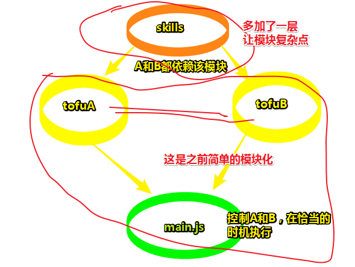
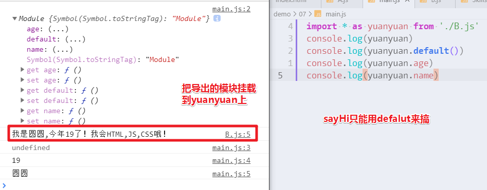
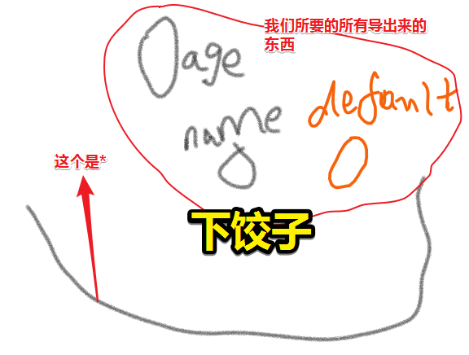
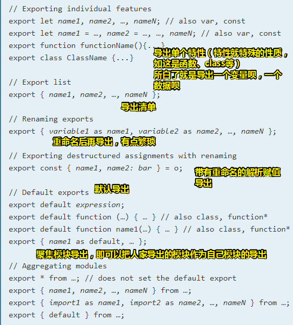
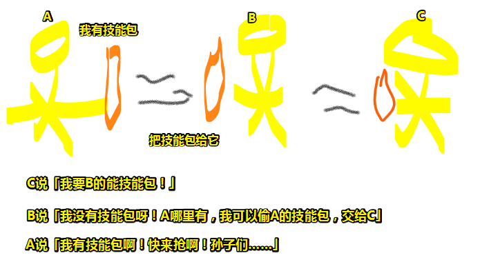
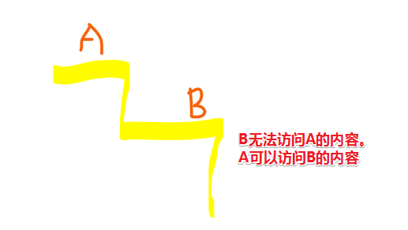

# ES6 模块

> import & export

## ★引子

我发布了一个npm包（如 `warm-ui-wheel`），然而使用者却无法拿到导出的对象！

## ★模块速学

### ◇是什么？

每个前端工程师的定义都不一样，反正认为是个块的就是模块啦！形象点来说，可以脑补成豆腐块！总之，看到或听到「模块」二字，就条件反射般的翻译成豆腐块！

> 模块化咩有特定姿势的，只要你把代码切成一块块就是模块化！说白了，模块化是一个过程。


很多人总是说「我无法理解模块化」，为啥会这样呢？——因为模块化本来就咩有清晰的定义，既然没有定义，那么何来理解呢？反正，你认为xxx的所写的代码有「块」的调调，那么你就认为它的代码很模块化呗！

总之，分块的方式不一样，有些人的代码分块了，但是你看不懂，而有些的代码分块了，你却能看懂！一般来说，都是用一个文件对应一个模块的姿势来划分模块！

### ◇为啥需要模块？

学过Java等后端语言的都知道模块的意义，但ES5是没有模块这个概念的！直到ES6的出现。

### ◇模块化的演进

#### 前置知识

前置知识，遇到script标签浏览器是如何做的：


1. 赤裸一个script标签，遇到它。就停止解析HTML，直接加载 外部JS 资源，然后执行它
2. 有defer？——如果scrip标签里边有代码，那就无视它！如果是外部JS资源，那就等HTMl解析完毕后执行JS，如果遇到多个script标签，那么这是队列操作，想加载完毕的外部JS资源，不会先执行！
3. 有async？——同样是加载和解析HTML同时进行，只要有JS资源加载完毕那就会先执行！总之，这是先加载完就先执行！同样这是针对外部JS资源的。

> 一个页面，全局只有一个window。联想起兄弟组件通信的话，那么window就是个事件中心！兄弟们都能访问它！

讲真，我从未用过 `defer`和 `async`这两个属性！对了，还有可以把「加载完JS文件」看做是「下载完JS文件」，类似于图片加载中，即资源仍然在请求和响应里边徘徊着，毕竟资源是一点一点传过来的！

**➹：**[js文件加载优化 - 前端的bigboom - SegmentFault 思否](https://segmentfault.com/a/1190000004448625)

#### 简单的模块化（能被控制和有局部变量）

假设有模快A和模块B

- 按引入顺序， 随大流执行A和B


```js
//A.js
console.log('我是模块A')

//B.js
console.log('我是模块B')
```


- 想要控制A和B的执行顺序？——引入第三个模块作为主模块！


有人问「这样控制执行顺序有啥用呢？」——延时执行它们就是它们 的用途，表面上看没啥用，但是你想象力有了，代码量上来，就能体现它的用途了！

```js
//A.js
window.tofuA = function () {
  console.log('我是模块A')
}

//B.js
window.tofuB = function () {
  console.log('我是模块B')
}

//main.js
setTimeout(() => {
  window.tofuA()
}, 3000)

setTimeout(() => {
  window.tofuB()
}, 2000)
```

- 全局变量污染

```js
//A.js
var name = '我是模块A'
window.tofuA = function () {
  console.log(name)
}

//B.js
var name = '我是模块B'
window.tofuB = function () {
  console.log(name)
}

//main.js
setTimeout(() => {
  window.tofuA()
}, 3000)

setTimeout(() => {
  window.tofuB()
}, 2000)
```


> 直接改成let是不行的，`script`标签不能隔绝作用域！
>
> 
>
> 这意味，你在写模块的时候，千万不要认为用let声明的变量就万事大吉了！

- 如何解决全局变量污染？
  - 我们需要搞个局部变量，但是在ES6之前，是很难做到的！


```js
//A.js
!function () {
  var name = '我是模块A'
  window.tofuA = function () {
    console.log(name)
  }
}()

//B.js
!function () {
  var name = '我是模块B'
  window.tofuB = function () {
    console.log(name)
  }
}()

//main.js
setTimeout(() => {
  window.tofuA()
}, 3000)

setTimeout(() => {
  window.tofuB()
}, 2000)
```

可以看到，我们想要用一个局部变量，那么就得搞个立即执行函数，而这就是ES5带给我们的做法！直到ES6出来之后，JS程序员终于看到了春天！

- ES6语法——我想要个局部变量，能不能简单点？

```js
//A.js
{
  let name = '我是模块A'
  window.tofuA = function () {
    console.log(name)
  }
}

//B.js
{
  let name = '我是模块B'
  window.tofuB = function () {
    console.log(name)
  }
}

//main.js
setTimeout(() => {
  window.tofuA()
}, 3000)

setTimeout(() => {
  window.tofuB()
}, 2000)
```

 只需要把立即执行函数搞为代码块，然后变量的声明用`let`或者 `const`就可以简洁的搞成为一个局部变量！至此，A和B这两个模块就是互不影响，相互独立，老死不相往来。

总之，我们现在的模块化，朝着正经的模块化更近了一步，即可以有自己的变量！

添加更多变量：

```js
//A.js
{
  let name = '方方'
  let age = '18'
  window.tofuA = function () {
    console.log(`我是${name},今年${age}了！`)
  }
}
//B.js
{
  let name = '圆圆'
  let age = '19'
  window.tofuB = function () {
    console.log(`我是${name},今年${age}了！`)
  }
}
```

目前，看我们的模块化，要比之前厉害很多！如

1. 可以控制A和B这两个模块什么时候执行
2. 每个模块都有自己的变量！

#### 更复杂的模块化（了解3个概念）

我们要做什么？——让A和B都依赖一层模块



代码如下：

```js
//Skills
window.skills = ['HTML', 'JS', 'CSS']

//A
{
  let name = '方方'
  let age = '18'
  let skills = window.skills
  window.tofuA = function () {
    console.log(`我是${name},今年${age}了！我会${skills}哦！`)
  }
}

//B
{
  let name = '圆圆'
  let age = '19'
  let skills = window.skills
  window.tofuB = function () {
    console.log(`我是${name},今年${age}了！我会${skills}哦！`)
  }
}

//main
setTimeout(() => {
  window.tofuA()
}, 3000)

setTimeout(() => {
  window.tofuB()
}, 2000)
```

效果：


在ES6之前，模块之间的通信，只能交给window来做！

*注：文件的加载顺序，可以查看network，如：*


根据之前的前置知识，即defer和async区别的那张图，可以看到JS文件是加载完毕后，才会去执行的！（我不知道浏览器有没有在做优化，比如在下载或执行`Skills.js`这个文件的过程中，能否去下载其它JS资源）

根据这一段描述：

> IE8/Firefox3.5/Safari 4/Chrome 2都允许并行下载js文件，也就是说，script标签在下载外部资源时，不会阻塞其它的script标签。
>
> 但遗憾的是：
>
> 1. js文件的下载过程仍然会阻塞其他资源的下载，比如图片
> 2. 页面仍然必须等到所有js代码下载并执行完毕才能继续渲染

也就是说，**浏览器通过允许并行下载提高了性能**。

不过只要一个JS加载完毕后就会去执行了，而这会阻塞页面的渲染和用户交互！

*注：这是没有defer和async的情况下。总之，JS资源会在下载完毕后才会去执行！还有就是多个带src属性的script标签会并行下载资源！*

学到了什么？

1. 模块（豆腐块、小单元）
2. 「依赖」就是「用到了」，「用到了」就是「依赖」，如 `main.js`用到了 `A.js`和 `B.js`，而它们俩又用到了 `Skills.js`，具体到生活，这个女生依赖这个男的，那么她的吃穿就是用到这个男的；一个男生依赖一个公司，那么这个男的想要生存就得用到这个公司给的工资……
3. 导出：我们的A和B豆腐块，都是通过window导出去的，其它的变量都是局部变量，那么其它模块是无法访问的。白话来说，就是「给别人用」

总之，上面提到的 JS 文件都是个豆腐块、小单元，如果小单元用到了其它小单元，如A和B各自都用到了Skills，那么就说它们俩<mark>依赖</mark>了Skills，用到了SKills的某个功能，反过来，我们可以说Skills是<mark>导出</mark>了一个什么东西给它们俩用！

### ◇ES6 模块语法

> ES6说「不好意思，以前我们ES5忘了写模块这个功能，现在我们写出来给你们用好不好？」
>
> 不需要考虑 JS 文件引入的顺序问题哦！直接写一个程序入口文件即可哦！

#### 基本使用

<mark>**①在浏览器里边使用模块语法**</mark>

代码：

```js
//Skill.js
let skills = ['HTML', 'JS', 'CSS']
export default skills

//A.js
import skills from './Skills.js'
let name = '方方'
let age = '18'
let tofuA = function () {
  console.log(`我是${name},今年${age}了！我会${skills}哦！`)
}
export default tofuA

//B.js
import skills from './Skills.js'
let name = '圆圆'
let age = '19'
let tofuB = function () {
  console.log(`我是${name},今年${age}了！我会${skills}哦！`)
}

export default tofuB

//main.js
import tofuA from './A.js'
import tofuB from './B.js'
setTimeout(() => {
  tofuA()
}, 3000)

setTimeout(() => {
  tofuB()
}, 2000)
```

效果：


<mark>*注：*</mark>

1. 要想在浏览器里边使用模块语法，那么你得做个标记说明该 JS 文件用到了模块语法，如 `type="module"`这样的语法

2. 模块文件的书写姿势：

   1. 需要导出或者说是暴露出一个东西，语法是 `export defalut xxx`，注意，这必须得加上`defalut`，不然无法识别`export`这个语法！
   2. 用到了某个东西？语法是 `import zzz from ‘./xxx.js’`，用到了相对路径或绝对路径就得写上 `/`、`./`、`../`；文件名的后缀也要写，如果你用到webpack等打包工具是不需要写的；`zzz`相当于是用 `const`声明的一个变量，即它不能被赋值修改。

3. 相较于ES5的姿势：

   1. 模块文件里边没有了 `{}`、 `let`、`window`，取而代之的是 `import`、`export`

   2. `index.html`文件里边没有了那么多`script`标签，取而代之的是带`type="module"`的 `main.js`文件，即一个入口文件。当然，其它模块JS资源还是要下载的，而且如果出现重复导入某个模块，那么这并不会重复下载，如A和B都用到了Skills

      

关于defalut存在与否的问题：

**lib.js**

```js
export default somethingDefault
export const demo = ...
```

**main.js**

```js
import whateverDefault from './lib.js' // 导入的是那个 somethingDefault
import {demo} from './lib.js' // 导入的是那个 demo
```

**➹：**[单组件文件中的export default会导出些什么 - 中文 - Vue Forum](https://forum.vuejs.org/t/export-default/43429/3)

以上就是ES6的伟大之处了，而这让 JS 有了模块！

---

#### 吐槽

1. 导入的模块叫啥都无所谓，如 `import daadadakaldg from './A.js'`，只要路径ok就行了。
2. 一个模块只能导出一个东西吗？——可以不止导出一个东西，可以导出多个东西，语法如下：

```js
//A.js
import skills from './Skills.js'
let name = '方方'
let age = '18'
let tofuA = function () {
  console.log(`我是${name},今年${age}了！我会${skills}哦！`)
}
export {
  name,
  age,
  tofuA
}

//main.js
import { name, tofuA } from './A.js'
console.log(name)
tofuA()
```

我之前一直以为是解析赋值，其实不然，你需要导出多个东西，那就用 `{}`，然后写上你要导出的东西，而这种做法也叫「导出列表姿势」。那么如何使用导出的这些东西呢？export 是啥东西，那么就import啥东西，注意，名字必须保证一致。

如果你在导出时添加了`defalut`，那么：


如果你修改export过来的东西的名字，那么：


*注：模块的加载顺序，从main.js开始，遇到一个import就会去请求资源，而且资源不会重复请求，这种姿势，像是「顺腾摸瓜」；不能对import的内容重新赋值，因为导入过来的tofuA等变量同样是用const声明的；在import不需要导入所有东西，你需要什么就导入什么，这个知识点在发布组件时尤其细节！*


> 一个依赖深度无限，那么楼梯的高度也就越来越高，直到无限！

具体语法，参见：[export - JavaScript - MDN](https://developer.mozilla.org/zh-CN/docs/Web/JavaScript/Reference/Statements/export)

3. 目前，可以导出多个东西，但是，我还想导出默认的东西？

```js
//main.js
import x, { name, tofuA } from './A.js'
console.log(name)
x()

//A.js
import skills from './Skills.js'
let name = '方方'
let age = '18'
let tofuA = function () {
  console.log(`我是${name},今年${age}了！我会${skills}哦！`)
}
export {
  name,
  age,
  tofuA
}

export default tofuA
```

可以看到，默认导出的东西，在import时，可以随意起名字呢，而不加 `defalut`的，则需要用上指定的名字。

话说，为啥import一个随意的变量，就给我导出一个东西呢？——因为这是默认导出给你的，如果不想要默认的，那么就请带上花括号 `{}`以及你要的那个的东西的确切名字！

> 注：`import x , y from './A.js'`这样写是GG的，因为默认导出的东西，只能一个变量接收，不然是报语法错误的，总之import~from之间的内容，只能存在一个随意给名字的变量，或者带花括号的，或者二者同时存在，说白了，上限就是`x,{}`，下限就是  `x`or `{}`

4. 如果名字冲突了咋办？

```js
import { name } from './A.js'
import { name } from './B.js' //Uncaught SyntaxError: Identifier 'name' has already been declared

console.log(name)
```

既然是ES6出的语法，显然这种问题是考虑到的。

解决如下：

```js
import { name as name1 } from './A.js'
import { name as name2 } from './B.js'

console.log(name1)
console.log(name2)
```

使用 `as` 重新取个名字即可！

#### 小结


```js
import x, { name as name1 } from './A.js'
import y,{ name as name2 } from './B.js'
```

`x`和`y`拿到的都是默认导出的东西，而 `name` 拿到的是导出的那个叫name的东西，`as name1`表示由于担心 `name` 会冲突，所以我重名一下为 `name1`，即把`name`当作是 `name1`来声明！

至此，ES6的模块语法基本上就讲完了！

话说ES6难吗？——当然难。你要引入一个新的模块概念，与此同时，你还得想清楚引入模块会存在哪些坑？而每个坑又需要用什么语法来搞定它，如导入的东西名字冲突了，需要用as来搞定它！

如果，你光看语法的话，你是不知道为啥要这样设计它的！说白了，记住一个语法的第一要义是知道它是为了解决什么坑而设计的！然后「何时用它」就显而易见了。

#### 进阶使用

> 当你看[import](https://developer.mozilla.org/zh-CN/docs/Web/JavaScript/Reference/Statements/import)的时候，就会发现MDN一下子罗列了 `import`的所有语法：
>
> 

**①直接导入模块，不使用模块里边的东西（就直接模块里边的代码，导出的啥东西都不管）：**

```js
//main.js
import './A.js'

//A.js
console.log('我是豆腐块A')
function xxx() {
  console.log('我是不会被执行的，除非你把我export出去')
}
console.log('我没有代码可以执行了')
```

要想`xxx`被执行，那么就得导出去：


当然，如果你不想`xxx`被执行，那么就不要写 `x from`呗！

从中，我们可以看出，`A.js`的全部被解析执行了一遍，并不是说我导出一个东西，那么就只看导出的那个东西，不然 `A.js`之前依赖的 `Skills.js`又是怎么被执行的呢？

总之，你这样写：

```
//main.js
import x from './A.js'
x()

//A.js
import './Skills.js'
console.log('我是豆腐块A')
function xxx() {
  console.log('我是不会被执行的，除非你把我export出去')
}
console.log('我没有代码可以执行了')

export default xxx

```

那么文件加载顺序是顺序是这样的：

1. main.js
2. A.js
3. Skills.js

代码执行是这样的：遇到一行 `import`，那么就去执行 `A.js`，直到咩有import可以执行，说白了这是一种递归加载执行机制，先递后归！

**②导出所有东西，不想写 `{name,age}`这样的东东：**

```js
//main.js
import * as yuanyuan from './B.js'
console.log(yuanyuan)
console.log(yuanyuan.default())
console.log(yuanyuan.age)
console.log(yuanyuan.name)

//B.js
import skills from './Skills.js'
let name = '圆圆'
let age = '19'
let sayHi = function () {
  console.log(`我是${name},今年${age}了！我会${skills}哦！`)
}

export default sayHi
export {
  name,
  age,
}
```



> 我尝试着能否改变age和name的值，结果用了 `Object.defineProperty`修改了age的属性 的`writable`为`true`态，也无法赋值更改！
>
> 看来Module这个类？做了一些操作禁止修改传过来的东西，不然这就是烂代码了！

`*`的存在，让我们一下子可以导完所有东西，不然，我们得这样：

```js
import {name,age} from './B.js'
```

而且有些时候，我们是不知道 `B`有啥的东西是被导出来的，所有就有了这个：

```js
import * as yuanyuan from './B.js'
```

这表示「我导入B这个模块所有的东西，然后把这个东西挂到yuanyuan上面」

那么什么叫挂到它的上面了，你log一下它就知道它是什么玩意儿了

可见，它是个模块，然后有很多导出来的东西（包扩默认的），注意，这些东西，都是不可被修改的属性。

所以何时使用它呢？

1. 我想把模块里边的东西全部导出来，但是又不想一个个的去写，所以就用 这个 `* as dadaa`语法呗！

把所有的导出来的东西包起来（就是一个有Module功能的对象呀！），然后取个名字为 `dadaa`

> 关于 `*` 号的理解：整体加载，即用星号（`*`）指定一个对象，所有输出值都加载在这个对象上面。
>
> **➹：**[Module 的语法 - ECMAScript 6入门](http://es6.ruanyifeng.com/?search=%E9%9D%99%E6%80%81%E5%88%86%E6%9E%90&x=0&y=0#docs/module#%E6%A8%A1%E5%9D%97%E7%9A%84%E6%95%B4%E4%BD%93%E5%8A%A0%E8%BD%BD)



至此，import的所用用法都已经讲完了！

注：

这种写法表示，即导出默认的没名字，也导出所有的然后取名字的：

```js
import xxx, * as yuanyuan from './B.js'
```

千万不要写成下边这样，因为这会语法报错

```
import * as yuanyuan, xxx from './B.js'
```

> 突然，发现这TM语法太讲究了。

## ★babel webpack parcel

> 旧浏览器不支持import和export，那该咋办呢？

翻译一下呗，之前不是用window可以做到把模块串联起来吗？那么翻译成window姿势的就ok了。于是程序员想了各种办法，其中一种姿势就是babel啦！

### ◇babel

线上版的babel，用不了哈！因为只支持一个文件操作，而我们需要导入多个文件，所以只好用命令行的babel姿势来转义了！

看了文档GG了，因为编译之后的结果用的是node环境，当然浏览器也能用：

**➹：**[ECMAScript 6 简介 - ECMAScript 6入门](http://es6.ruanyifeng.com/?search=%E9%9D%99%E6%80%81%E5%88%86%E6%9E%90&x=0&y=0#docs/intro#%E6%B5%8F%E8%A7%88%E5%99%A8%E7%8E%AF%E5%A2%83)

### ◇webpack

写配置很多东西，我只想要旧的浏览器支持export和import而已，结果还要去学习webpack？而webpack的学习难度要比babel和export、import难好多倍呀！

于是这个方案就GG了

### ◇Parcel

这个是最简单的，直接安装，打包 `index.html` ，然后就可把代码跑在浏览器上了！而这是零配置的操作！

不过打包后的结果，增加了270多行代码！

## ★总结

- name变量在 JS 里边具有特殊性，即它是个空字符串 `“”` ，而不是 `undefined`！而这是 JS 的bug。

- 模块化没有标准，每个人的内心都有衡量模块化的标准。说白了，要做「模块化」这个行为，是可以升级的，而满级就是「特立独行的豆腐块」

- export和import语法能背，但测试例子的功能不能背！

- import语法：

  

  关于第6点，和第5点难道有所不同吗？

  1. 有人认为这是可以使用绝对路径
  2. 有人认为这是可以使用默认的index.js
  3. 有人认为这是可以根据某个特殊的路径规则去拿到相应的模块文件，如安装了npm包，使用这些包，即`import`这些包的路径是它们的包名字，然后默认的模块文件是 `index.js`

  **➹：**[javascript - Understanding ES6 Named Imports - Stack Overflow](https://stackoverflow.com/questions/53136869/understanding-es6-named-imports)

- export语法：

  

  注意，这可以导出表达式呀！即把表达式的值导出去！而且这不能被赋值，不然会包这样的错误：`Uncaught TypeError: Assignment to constant variable`，即便你用`let`声明的变量导出去了，导入进来的都会被改成是 `const`

  总之，记住「导出清单」和「默认导出」就能用了，其它的根本就不需要记忆！毕竟不是所有语法都会用，就只用常用的而已！

  最后一点，可以导出从别的地方导入的东西，即 `from`后面的是另外一个模块

```js
//main.js
import * as xxx from './B.js'
console.log(xxx)

//B.js
export { skills } from './Skills.js' //把有名字的skills拿到手，然后再交给main.js

//Skills.js
let skills = ['HTML', 'JS', 'CSS']
export { skills }
```

结果：


代码的解析过程是这样的，判断 `import~from`、`export~from` 之间是啥内容，如果是 `* as xxx`，那么 `'./B.js'`里边导出的内容可以是「默认导出」和「清单导出」；如果是随便起的变量名字，那么 `./B.js`里边就得有默认导出，不然会语法报错！

以上代码的功能就是接力棒操作呗！



给人一种外包公司的感觉！C是客户，B是外包公司，A是苦逼程序员！

总之，就是把导入的马上导出去的！

- 不要看谷歌公司里边的人，不推荐使用export和import，毕竟他们花几个月的时间就可以搞一门新的语言，新的语法出来了！

- 用了parcel其实也不是很好用，最好用的姿势还是在浏览器里边直接用呀！

- 学完export和import之后，就得知道怎么在实际工作中使用它们了，这门系列课的其它知识点也是如此！

- 英语决定了你前端职业生涯的天花板高低！目前我还未看到天花板……毕竟还很菜！

  **➹：**[ 渐渐看到自己能力的天花板。身处这种状态大家都是如何处理的？ - 知乎](https://www.zhihu.com/question/279087111)

## ★Q&A

### ①怎么写 `script`标签比较好？

- body闭合标签之前，将所有的script标签放到页面底部。这样能确保在脚本执行前页面已经完成了渲染。
- 合并脚本。页面中的script标签越少，加载也就越快，响应也更迅速。
- 无阻塞下载js：
  1. script标签的defer属性
  2. 动态创建script元素来下载并执行代码
  3. 使用XHR对象下载js代码并注入页面中。

*注：关于onload，你写在script标签上的onload属性，会在该script标签里边的代码执行完毕后才会去执行！*

```js
<script onload="console.log('520')" src="./Skills.js"></script>
```

**➹：**[加载和运行JS的正确姿势 - 简书](https://www.jianshu.com/p/a4a7135e2777)

### ②mixin？

> 就是编译的时候把一段代码复制到另一个地方的意思。

**➹：**[Mixin是什么概念? - 知乎](https://www.zhihu.com/question/20778853)

**➹：**[JavaScript 中的 Mixin 模式](https://zh.javascript.info/mixins)

**➹：**[多重继承 - 廖雪峰的官方网站](https://www.liaoxuefeng.com/wiki/897692888725344/923030524000032)

**➹：**[GlobalEventHandlers.onload - Web API 接口参考 - MDN](https://developer.mozilla.org/zh-CN/docs/Web/API/GlobalEventHandlers/onload)

**➹：**[GlobalEventHandlers - Web API 接口参考 - MDN](https://developer.mozilla.org/zh-CN/docs/Web/API/GlobalEventHandlers)


### ③ JS 模块 七日谈？

注意理解ES6出来之前，人家是如何做到模块化的，说白了，就是了解思路，而不是细节。

**➹：**[JavaScript Modularization Journey](https://huangxuan.me/js-module-7day/#/1)

### ④ `*.vue`文件是如何被解析的？

这个文件会被 vue-loader（如果你用的是 Webpack 的话）加工处理。其中 `<template>` 部分会被 `vue-template-compiler` 编译成 render 函数，并插入到上面那一坨导出的 JS 对象中；`<style>` 部分会被转换成样式函数或提取为独立 CSS 文件（取决于你的 Webpack 配置）。

需要注意的是，vue-loader 只会处理 `<script>` 部分默认导出的内容（也就是 `export default` 出来的内容）。所以你修改了导出的类型，或者导出的不是一个正确的 JS 对象，就会出错了。

**➹：**[单组件文件中的export default会导出些什么 - 中文 - Vue Forum](https://forum.vuejs.org/t/export-default/43429)

### ⑤关于模块加载是否会构成循环加载？

```js
//A.js
import { b } from './B.js'
let a = 'a'
console.log(b)
export { a }

//B.js
import { a } from './A.js'
let b = 'b'
console.log(a)
export { b }
```

执行A.js。

结果：


理解这个（有两种姿势）：

1. 同一个脚本不会下载两遍，a.js下载完了，那么b.js就会再次下载 a.js，既然没有下载，那也就咩有执行呗！
2. 脚本执行有两个阶段，脚本加载（静态分析）和实际执行。`import`在脚本加载阶段就生效，但是不执行。也就是说，静态分析 `A`这个模块，看到了`import`这个关键字，就去加载 `B`这个模块，而此时 `A`这个模块还咩有执行，所以是无法访问  `A`模块导出来的 `a`的。说白了，就是这样：



**➹：**[Module 的语法 - ECMAScript 6入门](http://es6.ruanyifeng.com/?search=%E9%9D%99%E6%80%81%E5%88%86%E6%9E%90&x=0&y=0#docs/module#%E6%A6%82%E8%BF%B0)

**➹：**[关于Module的问题 · Issue #321 · ruanyf/es6tutorial](https://github.com/ruanyf/es6tutorial/issues/321)

