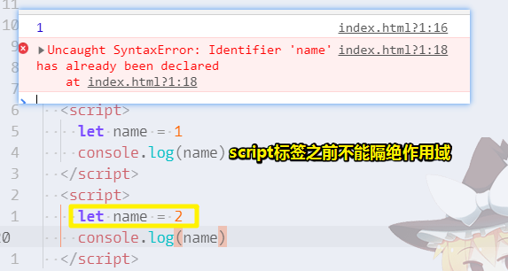

# ES6 模块

> import & export

## ★引子

我发布了一个npm包（如 `warm-ui-wheel`），然而使用者却无法拿到导出的对象！

## ★模块速学

### ◇是什么？

每个前端工程师的定义都不一样，反正认为是个块的就是模块啦！形象点来说，可以脑补成豆腐块！总之，看到或听到「模块」二字，就条件反射般的翻译成豆腐块！

> 模块化咩有特定姿势的，只要你把代码切成一块块就是模块化！说白了，模块化是一个过程。


很多人总是说「我无法理解模块化」，为啥会这样呢？——因为模块化本来就咩有清晰的定义，既然没有定义，那么何来理解呢？反正，你认为xxx的所写的代码有「块」的调调，那么你就认为它的代码很模块化呗！

总之，分块的方式不一样，有些人的代码分块了，但是你看不懂，而有些的代码分块了，你却能看懂！一般来说，都是用一个文件对应一个模块的姿势来划分模块！

### ◇为啥需要模块？

学过Java等后端语言的都知道模块的意义，但ES5是没有模块这个概念的！直到ES6的出现。

### ◇模块化的演进

前置知识，遇到script标签浏览器是如何做的：


1. 赤裸一个script标签，遇到它。就停止解析HTML，直接加载 外部JS 资源，然后执行它
2. 有defer？——如果scrip标签里边有代码，那就无视它！如果是外部JS资源，那就等HTMl解析完毕后执行JS，如果遇到多个script标签，那么这是队列操作，想加载完毕的外部JS资源，不会先执行！
3. 有async？——同样是加载和解析HTML同时进行，只要有JS资源加载完毕那就会先执行！总之，这是先加载完就先执行！同样这是针对外部JS资源的。

> 一个页面，全局只有一个window。联想起兄弟组件通信的话，那么window就是个事件中心！兄弟们都能访问它！

讲真，我从未用过 `defer`和 `async`这两个属性！对了，还有可以把「加载完JS文件」看做是「下载完JS文件」，类似于图片加载中，即资源仍然在请求和响应里边徘徊着，毕竟资源是一点一点传过来的！

**➹：**[js文件加载优化 - 前端的bigboom - SegmentFault 思否](https://segmentfault.com/a/1190000004448625)

假设有模快A和模块B

- 按引入顺序， 随大流执行A和B


```js
//A.js
console.log('我是模块A')

//B.js
console.log('我是模块B')
```


- 想要控制A和B的执行顺序？——引入第三个模块作为主模块！


有人问「这样控制执行顺序有啥用呢？」——延时执行它们就是它们 的用途，表面上看没啥用，但是你想象力有了，代码量上来，就能体现它的用途了！

```js
//A.js
window.tofuA = function () {
  console.log('我是模块A')
}

//B.js
window.tofuB = function () {
  console.log('我是模块B')
}

//main.js
setTimeout(() => {
  window.tofuA()
}, 3000)

setTimeout(() => {
  window.tofuB()
}, 2000)
```

- 全局变量污染

```js
//A.js
var name = '我是模块A'
window.tofuA = function () {
  console.log(name)
}

//B.js
var name = '我是模块B'
window.tofuB = function () {
  console.log(name)
}

//main.js
setTimeout(() => {
  window.tofuA()
}, 3000)

setTimeout(() => {
  window.tofuB()
}, 2000)
```


> 直接改成let是不行的，`script`标签不能隔绝作用域！
>
> 
>
> 这意味，你在写模块的时候，千万不要认为用let声明的变量就万事大吉了！

## ★注意点


## ★总结

- name变量在 JS 里边具有特殊性，即它是个空字符串 `“”` ！这是 JS 的bug。


