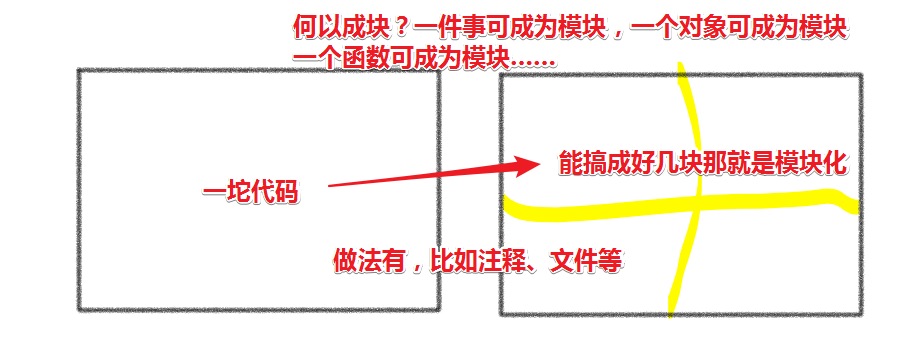

# ES6 模块

> import & export

## ★引子

我发布了一个npm包（如 `warm-ui-wheel`），然而使用者却无法拿到导出的对象！

## ★模块速学

### ◇是什么？

每个前端工程师的定义都不一样，反正认为是个块的就是模块啦！形象点来说，可以脑补成豆腐块！总之，看到或听到「模块」二字，就条件反射般的翻译成豆腐块！

> 模块化咩有特定姿势的，只要你把代码切成一块块就是模块化！说白了，模块化是一个过程。



很多人总是说「我无法理解模块化」，为啥会这样呢？——因为模块化本来就咩有清晰的定义，既然没有定义，那么何来理解呢？反正，你认为xxx的所写的代码有「块」的调调，那么你就认为它的代码很模块化呗！

总之，分块的方式不一样，有些人的代码分块了，但是你看不懂，而有些的代码分块了，你却能看懂！一般来说，都是用一个文件对应一个模块的姿势来划分模块！

### ◇为啥需要模块？

学过Java等后端语言的都知道模块的意义，但ES5是没有模块这个概念的！直到ES6的出现。

### ◇模块化的演进

#### 前置知识

前置知识，遇到script标签浏览器是如何做的：


1. 赤裸一个script标签，遇到它。就停止解析HTML，直接加载 外部JS 资源，然后执行它
2. 有defer？——如果scrip标签里边有代码，那就无视它！如果是外部JS资源，那就等HTMl解析完毕后执行JS，如果遇到多个script标签，那么这是队列操作，想加载完毕的外部JS资源，不会先执行！
3. 有async？——同样是加载和解析HTML同时进行，只要有JS资源加载完毕那就会先执行！总之，这是先加载完就先执行！同样这是针对外部JS资源的。

> 一个页面，全局只有一个window。联想起兄弟组件通信的话，那么window就是个事件中心！兄弟们都能访问它！

讲真，我从未用过 `defer`和 `async`这两个属性！对了，还有可以把「加载完JS文件」看做是「下载完JS文件」，类似于图片加载中，即资源仍然在请求和响应里边徘徊着，毕竟资源是一点一点传过来的！

**➹：**[js文件加载优化 - 前端的bigboom - SegmentFault 思否](https://segmentfault.com/a/1190000004448625)

#### 简单的模块化（能被控制和有局部变量）

假设有模快A和模块B

- 按引入顺序， 随大流执行A和B


```js
//A.js
console.log('我是模块A')

//B.js
console.log('我是模块B')
```


- 想要控制A和B的执行顺序？——引入第三个模块作为主模块！


有人问「这样控制执行顺序有啥用呢？」——延时执行它们就是它们 的用途，表面上看没啥用，但是你想象力有了，代码量上来，就能体现它的用途了！

```js
//A.js
window.tofuA = function () {
  console.log('我是模块A')
}

//B.js
window.tofuB = function () {
  console.log('我是模块B')
}

//main.js
setTimeout(() => {
  window.tofuA()
}, 3000)

setTimeout(() => {
  window.tofuB()
}, 2000)
```

- 全局变量污染

```js
//A.js
var name = '我是模块A'
window.tofuA = function () {
  console.log(name)
}

//B.js
var name = '我是模块B'
window.tofuB = function () {
  console.log(name)
}

//main.js
setTimeout(() => {
  window.tofuA()
}, 3000)

setTimeout(() => {
  window.tofuB()
}, 2000)
```


> 直接改成let是不行的，`script`标签不能隔绝作用域！
>
> 
>
> 这意味，你在写模块的时候，千万不要认为用let声明的变量就万事大吉了！

- 如何解决全局变量污染？
  - 我们需要搞个局部变量，但是在ES6之前，是很难做到的！


```js
//A.js
!function () {
  var name = '我是模块A'
  window.tofuA = function () {
    console.log(name)
  }
}()

//B.js
!function () {
  var name = '我是模块B'
  window.tofuB = function () {
    console.log(name)
  }
}()

//main.js
setTimeout(() => {
  window.tofuA()
}, 3000)

setTimeout(() => {
  window.tofuB()
}, 2000)
```

可以看到，我们想要用一个局部变量，那么就得搞个立即执行函数，而这就是ES5带给我们的做法！直到ES6出来之后，JS程序员终于看到了春天！

- ES6语法——我想要个局部变量，能不能简单点？

```js
//A.js
{
  let name = '我是模块A'
  window.tofuA = function () {
    console.log(name)
  }
}

//B.js
{
  let name = '我是模块B'
  window.tofuB = function () {
    console.log(name)
  }
}

//main.js
setTimeout(() => {
  window.tofuA()
}, 3000)

setTimeout(() => {
  window.tofuB()
}, 2000)
```

 只需要把立即执行函数搞为代码块，然后变量的声明用`let`或者 `const`就可以简洁的搞成为一个局部变量！至此，A和B这两个模块就是互不影响，相互独立，老死不相往来。

总之，我们现在的模块化，朝着正经的模块化更近了一步，即可以有自己的变量！

添加更多变量：

```js
//A.js
{
  let name = '方方'
  let age = '18'
  window.tofuA = function () {
    console.log(`我是${name},今年${age}了！`)
  }
}
//B.js
{
  let name = '圆圆'
  let age = '19'
  window.tofuB = function () {
    console.log(`我是${name},今年${age}了！`)
  }
}
```

目前，看我们的模块化，要比之前厉害很多！如

1. 可以控制A和B这两个模块什么时候执行
2. 每个模块都有自己的变量！

#### 更复杂的模块化（了解3个概念）

我们要做什么？——让A和B都依赖一层模块


代码如下：

```js
//Skills
window.skills = ['HTML', 'JS', 'CSS']

//A
{
  let name = '方方'
  let age = '18'
  let skills = window.skills
  window.tofuA = function () {
    console.log(`我是${name},今年${age}了！我会${skills}哦！`)
  }
}

//B
{
  let name = '圆圆'
  let age = '19'
  let skills = window.skills
  window.tofuB = function () {
    console.log(`我是${name},今年${age}了！我会${skills}哦！`)
  }
}

//main
setTimeout(() => {
  window.tofuA()
}, 3000)

setTimeout(() => {
  window.tofuB()
}, 2000)
```

效果：


在ES6之前，模块之间的通信，只能交给window来做！

*注：文件的加载顺序，可以查看network，如：*


根据之前的前置知识，即defer和async区别的那张图，可以看到JS文件是加载完毕后，才会去执行的！（我不知道浏览器有没有在做优化，比如在下载或执行`Skills.js`这个文件的过程中，能否去下载其它JS资源）

根据这一段描述：

> IE8/Firefox3.5/Safari 4/Chrome 2都允许并行下载js文件，也就是说，script标签在下载外部资源时，不会阻塞其它的script标签。
>
> 但遗憾的是：
>
> 1. js文件的下载过程仍然会阻塞其他资源的下载，比如图片
> 2. 页面仍然必须等到所有js代码下载并执行完毕才能继续渲染

也就是说，**浏览器通过允许并行下载提高了性能**。

不过只要一个JS加载完毕后就会去执行了，而这会阻塞页面的渲染和用户交互！

*注：这是没有defer和async的情况下。总之，JS资源会在下载完毕后才会去执行！还有就是多个带src属性的script标签会并行下载资源！*

学到了什么？

1. 模块（豆腐块、小单元）
2. 「依赖」就是「用到了」，「用到了」就是「依赖」，如 `main.js`用到了 `A.js`和 `B.js`，而它们俩又用到了 `Skills.js`，具体到生活，这个女生依赖这个男的，那么她的吃穿就是用到这个男的；一个男生依赖一个公司，那么这个男的想要生存就得用到这个公司给的工资……
3. 导出：我们的A和B豆腐块，都是通过window导出去的，其它的变量都是局部变量，那么其它模块是无法访问的。白话来说，就是「给别人用」

总之，上面提到的 JS 文件都是个豆腐块、小单元，如果小单元用到了其它小单元，如A和B各自都用到了Skills，那么就说它们俩<mark>依赖</mark>了Skills，用到了SKills的某个功能，反过来，我们可以说Skills是<mark>导出</mark>了一个什么东西给它们俩用！

### ◇ES6 模块语法

> ES6说「不好意思，以前我们ES5忘了写模块这个功能，现在我们写出来给你们用好不好？」

<mark>**①在浏览器里边使用模块语法**</mark>

代码：

```js
//Skill.js
let skills = ['HTML', 'JS', 'CSS']
export default skills

//A.js
import skills from './Skills.js'
let name = '方方'
let age = '18'
let tofuA = function () {
  console.log(`我是${name},今年${age}了！我会${skills}哦！`)
}
export default tofuA

//B.js
import skills from './Skills.js'
let name = '圆圆'
let age = '19'
let tofuB = function () {
  console.log(`我是${name},今年${age}了！我会${skills}哦！`)
}

export default tofuB

//main.js
import tofuA from './A.js'
import tofuB from './B.js'
setTimeout(() => {
  tofuA()
}, 3000)

setTimeout(() => {
  tofuB()
}, 2000)
```

效果：


<mark>*注：*</mark>

1. 要想在浏览器里边使用模块语法，那么你得做个标记说明该 JS 文件用到了模块语法，如 `type="module"`这样的语法

2. 模块文件的书写姿势：

   1. 需要导出一个东西，语法是 `export defalut xxx`，注意，这必须得加上`defalut`，不然无法识别`export`这个语法！
   2. 用到了某个东西？语法是 `import zzz from ‘./xxx.js’`，用到了相对路径或绝对路径就得写上 `/`、`./`、`../`；文件名的后缀也要写，如果你用到webpack等打包工具是不需要写的；`zzz`相当于是用 `const`声明的一个变量，即它不能被赋值修改。

3. 相较于ES5的姿势：

   1. 模块文件里边没有了 `{}`、 `let`、`window`，取而代之的是 `import`、`export`

   2. `index.html`文件里边没有了那么多`script`标签，取而代之的是带`type="module"`的 `main.js`文件，即一个入口文件。当然，其它模块JS资源还是要下载的，而且如果出现重复导入某个模块，那么这并不会重复下载，如A和B都用到了Skills

      

关于defalut存在与否的问题：

**lib.js**

```js
export default somethingDefault
export const demo = ...
```

**main.js**

```js
import whateverDefault from './lib.js' // 导入的是那个 somethingDefault
import {demo} from './lib.js' // 导入的是那个 demo
```

**➹：**[单组件文件中的export default会导出些什么 - 中文 - Vue Forum](https://forum.vuejs.org/t/export-default/43429/3)

---


## ★注意点


## ★总结

- name变量在 JS 里边具有特殊性，即它是个空字符串 `“”` ，而不是 `undefined`！而这是 JS 的bug。
- 模块化没有标准，每个人的内心都有衡量模块化的标准。说白了，要做「模块化」这个行为，是可以升级的，而满级就是「特立独行的豆腐块」


## ★Q&A

### ①怎么写 `script`标签比较好？

- body闭合标签之前，将所有的script标签放到页面底部。这样能确保在脚本执行前页面已经完成了渲染。
- 合并脚本。页面中的script标签越少，加载也就越快，响应也更迅速。
- 无阻塞下载js：
  1. script标签的defer属性
  2. 动态创建script元素来下载并执行代码
  3. 使用XHR对象下载js代码并注入页面中。

*注：关于onload，你写在script标签上的onload属性，会在该script标签里边的代码执行完毕后才会去执行！*

```js
<script onload="console.log('520')" src="./Skills.js"></script>
```

**➹：**[加载和运行JS的正确姿势 - 简书](https://www.jianshu.com/p/a4a7135e2777)

### ②mixin？

> 就是编译的时候把一段代码复制到另一个地方的意思。

**➹：**[Mixin是什么概念? - 知乎](https://www.zhihu.com/question/20778853)

**➹：**[JavaScript 中的 Mixin 模式](https://zh.javascript.info/mixins)

**➹：**[多重继承 - 廖雪峰的官方网站](https://www.liaoxuefeng.com/wiki/897692888725344/923030524000032)

**➹：**[GlobalEventHandlers.onload - Web API 接口参考 - MDN](https://developer.mozilla.org/zh-CN/docs/Web/API/GlobalEventHandlers/onload)

**➹：**[GlobalEventHandlers - Web API 接口参考 - MDN](https://developer.mozilla.org/zh-CN/docs/Web/API/GlobalEventHandlers)


