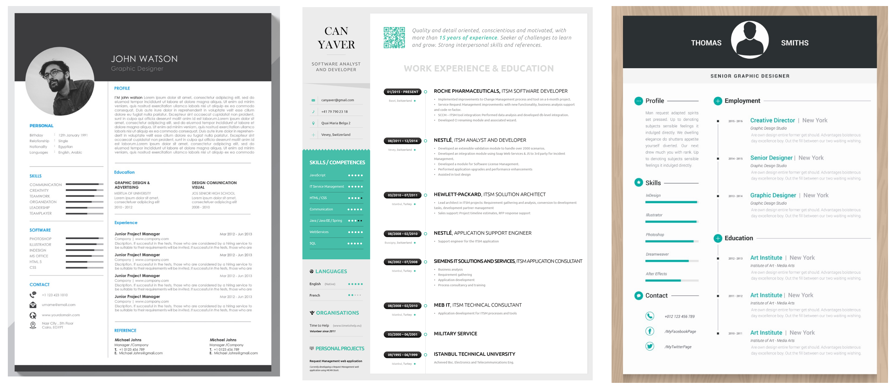
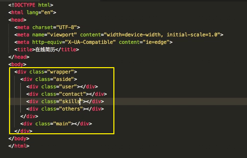
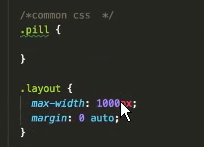

# 实现在线简历

## ★引子

- 年后要出去找工作
- 前几天刚看完了有关[CSS布局](http://zh.learnlayout.com/)的内容，所以需要一个实战项目好好巩固一下

## ★目标

- 不光是学习CSS和HTML，还得顺带去学一学如何去写简历，如需要我们的简历呈现出什么内容？……

总之就是：

1. 基本的网页布局
2. 简历如何去书写

## ★开搞

### ◇简历模板

选择第二个，不需要做得一模一样，根据我们的实际情况来……

总之我们想要做一个跟第二个差不多的在线简历，然后我们该如何去设计这个简历？要展示哪些内容让我们显得更专业？换句话说，一个是技术上的，一个是非技术上的！

### ◇分析

#### 结构

这是一个典型的简历页面

那么其中分为几块呢？

1. 个人信息（姓名、联系方式如手机、邮箱、学历、学校、博客地址……）
2. 技能（掌握哪些语言？掌握程度？……）
3. 应聘职位（如前端工程师……）
4. 掌握的语言（由于是非技术类的，可能不太一样，可以替换成个人的自述等等……）
5. 一个二维码（可以搞成是加我们的微信，或者一扫码就可以看到在线版的简历……），其旁边那部分内容也可以简单的介绍一下自己……
6. 工作经历和项目经历，在这里直接就是工作经历、工作时间、地点、公司名称，然后一些具体的细节，而对于我们来说就有一些不太一样，和前端职位相对应的话，我们可能需要做一些调整，如工作经历、教育经历和项目经历……

#### 怎么做？

1. 简历的整个背景是灰色的，而它的中间则是白色的，然后它杵在页面的中间，所以这是一个典型的居中布局（用一个div，然后设置宽度，或者是最大宽度，然后`margin: 0 auto;`即可）
2. 居中布局之后，里面分为两大块，一个是侧边栏，一个是主要区块。换句话说，内部就是一个典型的两栏布局。还有就是左侧是固定宽度的，由于是左右，那么我们就可以使用浮动，当然我们也可以使用flex布局或者是grid布局，当然我们这次选择的是传统布局，即浮动
3. 知道是分为两块之后，然后就从上往小去写我们的东西

可见整个页面被我们圈圈画画就画完了！画完之后，我们心里大致有个底之后，就可以开始写了！

### ◇开搞

> 边写边穿插写CSS和HTML的套路！

#### 写页面的雏形

##### 简单的描绘一下轮廓

##### 第一点套路

关于命名规则：

> 可以用HTML5新出的语义化标签，如aside、main标签
>
> 也可以都写个class
>
> class的名称全都基本上是小写的！如果比较长，那就用中横线去做连接，如 `skills-area`，而不是去用驼峰，当然有些人习惯用驼峰也可以
>
> 总之这其实就是所谓的编码规范了，而所谓的编码规范就是去定一个规则，然后你一直去遵守它就行了，所有人也一直遵守它就行了
>
> 所以如果有些人习惯这样写，那也没有关系，只要你遵守这个规范，然后你去发扬它也可以！
>
> 只不过用小写的话，个人觉得：
>
> 1. 好看
> 2. 这是谷歌的编码规范，很多大公司都有在采用，所以我们就直接按这个规范去用就行了！
>
> 还有一点就是关于名称的问题：直接根据它的功能去命名即可！，如这一块是干嘛用的？如用户的个人信息，可以叫`user`，也可以叫 `personal-info`
>
> 如果英语不好，那就使用翻译工具，然后挑一个看起来比较短的一个单词就行了，千万不要写一个叫 `cebianlan`侧边栏这样一个拼音出来！

关于元素的其它附加属性：

> 1. 很少出现有id ，总之基本上我们写HTML的时候，很少出现id，一般都会给很大的区块加个id，如aside和main，或者是某一个特殊的按钮，如提交等加一个id……
>
> 总之在正常情况下，我们用样式去操控我们页面的元素时候，全都用class……

#### 下一步干嘛？

可以继续写html，也可以因为看不到样式、看不到效果而感到着急，为此可以先去写样式：

关于样式，正常情况下是写外置的样式，即写一个CSS文件然后引入，或者是一些经过工具处理的样式，为了简单起见，我们主要是演示如何去写页面，所以我们就不去做一些工程化的东西

总之，可以边写样式边写HTML，两边同步进行，没有谁先谁后的问题，就看你个人心情啦！

#### 写样式

##### reset

写样式套路：

分为几个部分去写样式，而不是一上去就直接写，如直接就去搞user里的h1里样式……

你需要先去写一些基础的样式

那这其中有什么套路呢？

第一步：对我们页面的CSS做一个reset，即样式的重置，如做得简单粗暴一点就是：

让外边距和内边距都设为0，毕竟很多元素都有默认样式，比如body上有默认的8px的外边距，还有诸如p、h1~h6等都有默认的外边距，还有有些元素都有内边距……有些情况下，这些边距可能会影响我们元素的宽高或者是边距的计算，所以很多情况下，简单起见都设为0了！然后后面再单独去搞样式设，当然，你也可以一开始不要那么粗暴，然后后面需要什么就加上什么，就像这样：

当然你也可以去引入一些诸如normalize.css或者是reset.css，其实做得事情都差不了多少，只不过做的会更细

**➹：**[normalize.css与reset.css区别 - w3ctech](https://www.w3ctech.com/topic/1804)

关于 `box-sizing:border-box;`是干嘛的呢？——关于元素的大小计算是以边框作为一个元素的计算，总之就是写宽高用起来更方便一点，换句话说就是挤压内容咯！

除了做这些一些reset以外，有时候还得做其它reset，如a链接：

因为a链接默认点完之后有颜色，而且默认也有下划线之类的样式……如果设计稿说是要下划线的，那么你也可以不用去去掉……

还有ul的点的默认样式，如果不需要那就去掉，如果需要那就不去掉好了！

总之CSS最上面这一块就相当于去设置标签的一些基础样式

##### common

> 写通用的样式

通用样式有什么呢？

第一个就是UI组件，举个例子来说，由于我们这个页面比较简单，没有什么特别的组件，而所谓的组件就是它这个东西可以复用，如果做一个红色的很好看的按钮，然后这个网站很多地方都用到了这个按钮，那么你是不得把这个按钮的样式给抽离出来呢？把这个按钮的样式给抽离来之后，然后就写一个class……那么后面你在用它的时候，你就直接写个class就可以了！换句话说是，这就是我们从整个页面、从这个设计稿中抽离出来的UI组件

对于当面我们这个设计稿来说，也没有什么UI组件，毕竟没有什么复用的东西，不过我们还是可以从中挑一个的，如这个黑黑的东西，毕竟这个家伙貌似用得比较多……

，

那么这个黑黑的东西该起个什么名字好呢？——看起来像个药丸……我们可以使用翻译工具看看它的意思，查找得知，它叫pill……

具体样式我们一会儿再加，先把这个位置给留在这里！

除了这些之外，我们可能还有一些，比如说定义我们页面的宽度，叫`layout`，为啥要起这个名字呢？——都是一些套路，你一开始先不要去管，用习惯了你自然就会用了！

后面我们用到了浮动布局，由于没有用flex之类的，所以我么需要写一个 `clearfix`，来用于清除浮动

**➹：**[学习CSS布局 - fe-learn-2018](https://ppambler.github.io/fe-learn-2018/CSS/02-%E5%AD%A6%E4%B9%A0CSS%E5%B8%83%E5%B1%80.html#the-clearfix-hack)

我想此刻的你，肯定会觉得所写的这一堆东西一点用都没有哈！毕竟你无法看到相应的效果，其实我想告诉你的是，这些东西太套路了，由于是套路，为此就先写出来了！等到后面我们就可以去用了！

如果后面你发现还有一些很泛的，很多地方都会去用的，那么你都可以把它加到这里！

那么下面这一块，就可以开始写我们当前页面的样式了，当前的样式就是这些HTML元素的具体细节了！

##### page

## ★总结

## ★Q&A

