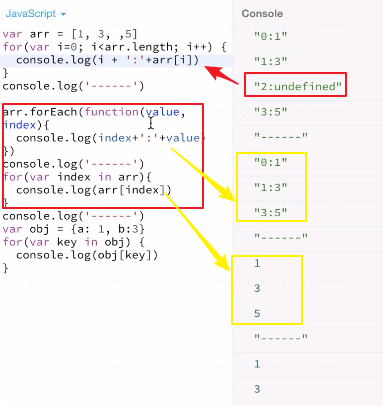
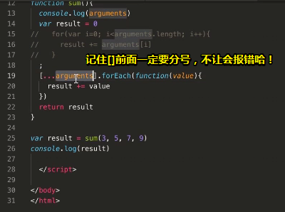
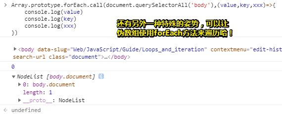
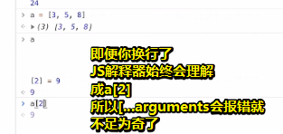
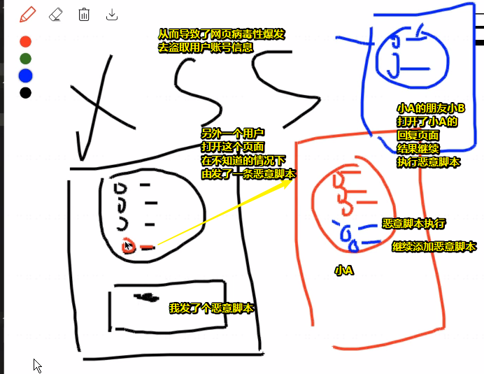

# 实现在线简历（下）

## ★答疑

1. 有关各个位置在项目开发中的职责及协作的
2. 如js里面常见的遍历方式
3. 简单切图吧，毕竟小公司很多岗位还是有这个要求。还有就是canvas可以稍微聊一下
4. web安全吧
5. 饥人谷有没有讲过什么程序员的自我修养，程序员的代码规范，程序员的职业生涯规划这种东西

### ◇项目之职责及协作

关于第一个问题，我猜这应该问的是：

> 在互联网公司如果开发一个产品，那么相关的人员分别做什么事情呢？以及大家如何去协作？如前后端的协作……

毕竟有很多同学是转行过来的，没有在互联网公司待过，也没有做过正式的开发，所以会有这方面的疑问哈！

所以假设我们到了一个互联网公司里，我们要做什么呢？

#### 角色

在互联网公司里边和一个产品相关的角色，一般有几种呢？

1. 产品经理——出需求文档，即提需求的，比如说我们现在有几个人，准备成立一家公司，然后去开发一款产品，那么其中一个角色就是产品经理，那么他负责什么呢？——他负责我们做的这个东西是什么？它有什么功能？然后把其中的一些需求理得比较清楚，甚至会画出一些基础的交互设计图
2. 第二个角色就是设计，有时候产品经理的这个交互设计图是和设计师沟通，然后一块做出来的，比如说产品经理把这个思想传达给设计师，那设计师就画出一个交互图，而交互图其实就是一个很简单的图，举个例子来说，看看我们如何去画交互图

#### 如何画交互图

准备好一个线上工具—— <https://www.figma.com>

在这个工具中，选择一个文件，然后就可以开始去选择手机，接着就是画图了

画完图之后，由于是有很多个页面的，所以接下来就得理清楚图与图之间的关系了！

然后前端你就用CSS把效果给写出来哈！

3. 前端人员
4. 后端人员

> 关于小程序就是vue的翻版，只需要了解一点点小程序的语法规则，然后学习成本多久呢？——两个小时左右，最长不超过一个下午，你就可以做出你所需要的小程序了
>
> 有了前端和后端，那我们就可以开发出移动的页面、小程序，当然什么支付宝小程序、百度小程序等原理类似
>
> 如果想开发app，那么这个时候需要ios和安卓的开发工程师，当然，假设我人手特别不够的话，我的前端工程师的技术比较牛叉的话，那前端也可以出开发，使用react native或者是weex去搞事情，不过一般是react native去开发一个前中期版的app的这么一个产品。换句话说 ，用户看上去就是个app，但是这个东西前端可以去做，因为它是用JavaScript写出来的哈！

5. 还有的就是在开发中会有对应的测试人员

6. 如果是中小公司的话，那么很有可能是咩有运维的，而后端会充当运维的角色

   如果是大公司的话，一两台服务器是不够的，可能需要几十台，甚至是上百台的服务器，那这个时候对服务器的管理，让你的整个网站能够正常的运行，能够高效率地去运行，那么这是一个很重要的问题啦！所以这时需要一个专业的运维人员

如果一个公司特别特别小，那么可能真得会出现一个前端工程师干所有事情，比如说你可以去构思这个产品，你自己可以去做设计，你可以做前端的开发，你可以去做后端的开发，你可以去做线上部署，你可以自己去做测试，总之你可以完全以一个人的姿势去做一个能看得见的产品出来……

这就是公司里面的工作职责了！

**➹：**[互联网公司角色成员解释—-弄懂产品、技术、运营等角色是干嘛的 - 爱运营](http://www.iyunying.org/yunying/yyjc/134871.html)

**➹：**[互联网公司都有哪些岗位？具体是什么职责？ - 知乎](https://www.zhihu.com/question/26755083)

**➹：**[一篇文章看懂互联网公司职位架构 - leon-这个程序员不闷骚的博客 - CSDN博客](https://blog.csdn.net/u011627980/article/details/50765371)

**➹：**[一篇文章读懂互联网公司组织架构 - 简书](https://www.jianshu.com/p/671c876e74ef)

以上就是关于在互联网公司里的职责与分工了！

### ◇JS里的常见遍历方式

> 虽然这个内容比较简单，但是我们还是可以去做一些发散

#### 什么叫遍历？

在JS里边，只有数组、对象、类数组对象才可以遍历，你一个数字或者是某一个特殊的东西，你该怎么遍历它呢？是吧！

**➹：** [循环和迭代 - JavaScript - MDN](https://developer.mozilla.org/zh-CN/docs/Web/JavaScript/Guide/Loops_and_iteration)

#### 测试

##### ①遍历数组

```js
var arr = [1, 3, 5]
```

最常见的、最基础的姿势（换言之资质最老的姿势）就是for循环了呀！就像这样：


之后学到ES5的时候，就学到一个数组方法，叫 `forEach()`


##### ②遍历对象


当然，数组其实也是一个对象，所以我们同样可以对数组使用`for……in`循环……

不过在有些特殊情况下，可能会有点问题！


这跟之前的用for循环咩有啥区别哈！但是有时候会有点区别，区别在于假设数组元素中存在undefined值，如：

```js
var arr = [1,3,,5]
```

那么for in 和 forEach()都是不会去遍历出这个undefined值的：



所以这就是它们之间的差别了，即用for的话，数组长度即为4，而用其它姿势，则是把这个undefined元素给过滤掉了！不过这种差异是很微小的……

> 我测试了一下，只要是隐式undefined值才会过滤掉，如果你直接写了个undefined元素是不会被过滤掉的！总之for循环就是最保险的，不过写的代码最多

以上就是很传统的遍历姿势，接下来解锁新姿势……

##### ③类数组对象

求和函数：


我想这个arguments应该是数组吧！毕竟能用for循环应该只有数组吧！

既然如此，那么我就使用数组的forEach方法来遍历呗，就像这样：


根据报错信息，我们可以知道forEach不是一个函数，毕竟arguments它不是个数组哈！它并没有forEach这个方法！

当然，还有其它的数组方法它同样是咩有的，如reduce、map……

> 其实说白了就是它的原型链并没有 `Array.prototype`

所以arguments是个普通的对象，它没有这些特属于数组的方法，但是它有一个特殊的名字叫类数组对象！

那么什么叫类数组对象呢？——就是它是一个对象，但是它的属性是0123……而正常一个对象，它的属性是比较奇怪的，比如属性是a、是b……但它的属性是0123，而我们的数组也可以像这属性0123这样得到。

总之arguments长得跟数组有点像，而且这个arguments也有个length属性

换句话说，就像这样：


当然它是没有数组特有的API的

那么对于这种类数组对象，我们如何使用数组的方法去操纵它呢？

举个例子来说，假如现在不是简单的累加操作，而是其它更复杂的操作，所以咋办呢？

所以这就有很多办法可以把类数组对象转化成真正的数组了呀！这样一来我们就可以使用数组的方法来进行操作了……

第一种姿势——三个点+中括号：
这种姿势叫解构，通过这三个点，你可以认为是把这个对象的衣服给扒开了，然后通过这个中括号 `[]`，就重新弄成个数组了呀！



除了这个arguments之外，还有哪些是类数组对象呢？

比如说DOM里面的这个选择一系列DOM元素的东东：


 超级变变：


除此之外还有哪些方法可以变成数组呢？


与上面的 `[...array-like]`等价


其中这里的值是value，而for in则是key！

可见一个遍历是很简单的，但有各种各样的方法

#### 总结

1. 最简单的有for循环遍历姿势

2. ES5的数组方法——forEach()

3. 把数组当成是对象看待的——for……in，其中key是对应的下标

4. ES6的for……of，这时这个就不是key了，而是value

   ```js
   let arr = [3, 5, 7];
   arr.foo = "hello";
   
   for (let i in arr) {
      console.log(i); // logs "0", "1", "2", "foo"
   }
   
   for (let i of arr) {
      console.log(i); // logs "3", "5", "7" // 注意这里没有 hello
   }
   ```

5. 对于普通对象的遍历，俺就是for in 和 for of了呀！

6. 对于有些特殊的对象，如类数组对象或者说是伪数组，那么我们想要使用数组的API该咋办呢？

   - `[…arguments]`

   - `Array.from(arguments)`

   - 还有一种传统姿势：

     

7. 如果有面试官问你「遍历姿势」，那么以上几条做法，可以得满分，如果只回答了for循环，那么不好意思，如果满分是100的话，那么你只能是10分了，毕竟学过一两天JS的人都会写哈！

8. 关于一个bug，为啥在用 `[...arguments].forEach(fn)`的时候，这种语法会报错呢？

   正常情况下，在JS里的编码规范里边，对一个语句后面是否加分号，没有规定，换句话说，有些人喜欢加分号，而有些人则不喜欢，像我就不喜欢加了，而且也有很多的库、不过的框架也没有加

   不加分号的好处是什么呢？——看起来好看一点哈！因为JS本来推崇的就是简洁……然后就看起来比较舒服

   而关于加分号，对于一些其它语言，尤其是强类型语言来说，如果你不加分号的话，那是会报错的，所以这必须要加，不过对于JS来说，就没有这些要求

   总之遵循「能省则省的原则，能少写为啥还要多写呢？」，所以就不加了，不过不加是在99%的情况下是可行的，那么在那剩下的1%的情况下，则会出现问题

   所以这就是为什么有人会说，不加分号会出问题了

   那么其中容易出现问题的一个点在哪儿呢？就是我们这个bug哈！

   

   > JS遇到注释直接忽视掉！

   

   同时，这也意味着，为啥我们不这样写的原因：

   ```js
   //危险姿势：
   [].forEach.call(arguments,fn)
   //保险姿势：
   Array.prototype.forEach.call(arguments.fn)
   ```

   总之，你要清楚不加分号的风险，如果因为不加分号而导致的报错，那么你也应该有能力去解决这个bug

### ◇关于切图

关于canvas，用JavaScript去划线和画圈等，然后把图片放上去，把文字放上去就是这么简单！而且没有svg那么复杂，用处也没有那么广泛……

言归正传，回到切图

目前，用Photoshop搞设计图的设计师越来越少了

慢慢地都使用sketch、还有最近刚接触到的网页版的画原型图工具figma（用起来挺方便的）等

画原型图其是设计师的工作，如果你会画图了，那么抠图，甚至是把这个设计稿还原就很简单了，为啥说它简单呢？因为它里面有数据哈！


**➹：**[Google Material Design – Figma](https://www.figma.com/file/crCEkESvfXKEkZtNZ4zEBA/Google-Material-Design?node-id=0%3A224)

可见现在做页面就变得很简单了！

不像以前那样还得用尺子一点点的去量，毕竟在现在看来，这实在是太麻烦了！

所以抠图的东西不需要学了，你只需要设计师用上最新的工具，然后它给你的就是上述的这么一个链接

然后通过点击里面的页面去获取数据即可！

不过你最好还是得对这个工具有一定的了解

关于如何学习它？——youtub上有个视频，不过是英文的，当然，仔细听还是能听懂了，大概需要2、3个小时就可以进行工作了！

然后你就可以自己去设计成你所想要的产品了，如新建一个页面，然后把图片放上去、画方块。加阴影。调整字体大小……


所以说前端工程师就是和产品最接近的家伙！你只要愿意去做会发现我学设计也很简单，稍微学点nodejs，再学个后台语言，做整个产品也很简单

当然也不能说很简单，只是相较于后端去弄一个产品、设计去弄一个产品的话，要容易得多了！

> 建议大家去尝试一下，如后面做项目的时候，可以尝试着把整个流程跑一跑
>
> 毕竟学这样一个figma工具也不是很难，而且你又不是一个想成为专业设计师的人，总之，你就花两个小时学习一下它，然后基本会用了，就做一个简单的页面，关于设计你可以自行设计，也可以参考现有的app，设计好了，就把它给实现出来
>
> 这样的话，你把这个项目放到你的简历里边，我觉得当你跟面试官逼逼的时候，你才会更慷慨激昂（形容满怀正气，情绪、语调激动昂扬。）……而不是仿来仿去的，毫无底气

教程：

**➹：**[ Figma Tutorial - A Free UI Design/Prototyping Tool. It's awesome. - YouTube](https://www.youtube.com/watch?v=3q3FV65ZrUs&t=1886s)

### ◇Web安全

作为前端工程师能接触到的Web安全，第一个就是XSS

#### XSS

**①概述：**

你要知道哪些前端代码有问题的话容易带来XSS……

你要知道什么是XSS，前端的哪些风险可能会导致XSS？然后后端哪些风险可能会导致XSS？就可以了

还有一个叫CSRF

**②解释：**

XSS，即跨站脚本攻击

举个例子来说

现在有个网站，这个网站 里边有个回帖的功能，或者说是一篇文章里，用户可以回复，就像是阮一峰那博客站点一样……

于是我就回复了这样一条由恶意脚本组成的消息

这样一来，我这个回复就会存储到服务器上，同时会展示到页面上

当其它用户打开以后，就会看到我所发的那条消息了，于是我的恶意脚本这个代码就跑到对方浏览器上运行了

既然恶意代码执行了，那么就可以让该用户的浏览器再去发一条消息

形象一点来说，就像这样：



那么为什么我发的这条消息会做一些恶意的事情呢？

因为你提交的数据是这样的姿势：

```html
<script>alert(1)</script>balbalal 
```

假如前端页面是后端拼接而成的，即有用到 `innerHTML`这样的API的话，那么其它用户在拉取评论数据的时候，就会执行这个脚本了！

总之这个script是来自于用户提交上去的，而不是开发者写的

所以这就是XSS出现的一个根源了！即咩有对用户的输入进行操作，而是作为可运行的代码直接去执行！

所以XSS一般是后端导致的！

当然有时候我们前端也会出现类似的问题

比如说我们通过ajax去获取数据，假如我们拿到的是字符串，然后字符串中含有script标签，然后我们前端在渲染的时候使用了innerHTML，然后你懂得……

还有就是在 `json.stringify`出来之前，前端都是用eval把后端发过来的json字符串转化成json语句或者说是一个json对象去用的！

那么在用eval的时候，假设某个字段有恶意代码，那么就真得是evil（魔鬼）了

还有一些奇奇怪怪地是通过拼装而成的恶意代码，如用户把你的script给提前干掉了、用注释语句把你正常的HTML给注释掉了……

不管怎样这都是由用户的恶意输入所导致的！

还有就是你可以通过转义字符把用户输入的HTML进行一个转义过滤！即你可以看到尖括号什么的

不过有些情况下容易会被忽略，就是图片，尤其是当你使用功markdown编辑器的时候，允许用户去上传图片，而这个并不是XSS攻击，而是另外一个CSRF攻击

当然，还有其它的一些，如这次不只是在页面上输入了，而是直接通过url加一些参数去控制，如参数是恶意脚本呢，然后保存到数据库里，之后就GG了

总之导致XSS攻击的姿势有各种各样，奇奇怪怪地姿势！然后大致知道是怎么一回事即可！

**➹：**[浅谈XSS攻击的那些事（附常用绕过姿势） - 知乎](https://zhuanlan.zhihu.com/p/26177815)

#### CSRF

**①概述：**

1. 你要知道CSRF是什么东西
2. 它的一个实现原理是怎样的

**②解释：**

它是跨站请求伪造

那么这个是什么意思呢？

举个例子来说，我们以淘宝为例，假设我们去使用支付宝去转账

那么我们点转账的时候，是不是发一个请求到服务器，告诉支付宝说我要向谁去转账多少钱，如转给小明100块

那么这就有两个参数了，一个是小明，一个是100

那么服务器收到这个请求之后，就会去校验，如这个请求是谁发的呢？如是小花发的请求，那么小花的钱够不够呢？——够了，那么小明这个人存不存在呢？——存在

既然如此，那就转账吧！

如果请求的url是这样的：

```js
/send?to=xiaoming&money=100
```

然后有个xxx用户在你去上厕所的时候，在你这个当前浏览的网页的控制台里发一个ajax请求，如

```js
/send?to=xxx&money=100
```

由于存在Cookie什么的，那么这个请求是可以成功的！

然而现在个人不用登你的电脑也能干这个事情，那么怎么做呢？

假设支付宝里有对应的社区，社区里也有对应的讨论和回复，而这里面的登录信息还是你自己的额

然后有个恶意攻击者，让干了一个事情——回复了一条链接，即 `/send?to=xxx&money=100`

在用户眼中，这就是一个链接，毕竟超文本显示的是「这里有很多免费资源下载啊！想要迎娶白富美，走上人生巅峰吗？那快来点击看看啊！」

然而一点击之后，实际上是在发这个请求 `/send?to=xxx&money=100`

通过登录状态和你在发请求，所以支付宝收到之后，就会认为这是你发的！

所以钱又转走了，总之恶意链接就不要点了！一点钱就GG了

当然，还有很多场景，甚至是你不需要点击

比如它发了张图片，而这个image的地址也是那个地址，然后一刷新页面，又是一次请求，不过这种情况比较极端，简单来说，就是一打开页面钱就没了！

所以这就是所谓的跨站请求伪造

换句话说，就是它伪造了你的一个合法操作，而你是在不知情的情况下做了这个事情

因此，这样是不行的哈，那么我们应该怎么去防范它呢？

所以支付宝就对接口做了升级

那么这又是怎样的一个升级呢？

用户所看到的页面是后端发过来的，而且其中有这么一个HTML：

```html
<input type="hidden" value="abcde……">
```

value中的属性值是后端随机生成的，然后当你发请求转账的时候，需要带上这个随机数：

```js
/send?to=xiaoming&money=100&csrf=abcde……
```

不然转账是无效的，由于一次刷新页面，这个随机数又是会变的，所以即便攻击这知道to和money的参数情况，因为无法知晓csrf的值是什么，而对于支付宝的程序员是很好的通过JavaScript拿到这个值的，然后拼接好参数后再发请求，支付宝校验这个值通过后，就可以转账了，否则GG

总之这个请求就保证了只能在支付宝这个页面下，才能把请求发出去，如果换了个页面，那么别人是不知道这个值是多少的，毕竟这个值是随机数，是可变的

即把 `/send?to=xiaoming&money=100&csrf=abcde……`一拷贝，然后请求，是失效的

所以你经常会看到有这么一个html：

```html
<input type="hidden" name="csrf" value="abcdefg">
```

如谷歌的：


所以对于一些比较关键、比较敏感的数据，必须要通过这种方式去防范CSRF的漏洞

**➹：**[「每日一题」CSRF 是什么？ - 知乎](https://zhuanlan.zhihu.com/p/22521378)

#### HTTPS

如何在数据的传输过程中，保证数据安全……

其实都是对报文进行一个加密

**➹：**[一个故事让你彻底理解 Https - 知乎](https://zhuanlan.zhihu.com/p/31880655)

**➹：**[饥人谷学习2 - 简书](https://www.jianshu.com/p/ded0d221b4bc)

#### 小结

如果你这3个都知道了，那么关于Web安全也就够了！

### ◇程序员的自我修养、代码规范、职业规划

职业规划：

看饥人谷的轻分享，包学习期间如何去学习，你在工作中如何去提高？一开始进入公司之后需要注意什么？后面如何去发展？以及当遇到瓶颈的时候怎么去选择？

自我修养：

> 自我修养是指一个人按照一定社会或一定阶级的要求，经过学习、磨练、涵养和陶冶的工夫，为提高自己的素质和能力，在各方面进行的[自我教育](https://baike.baidu.com/item/%E8%87%AA%E6%88%91%E6%95%99%E8%82%B2/9080984)和自我塑造，是实现自我完善的必由之路。指个人[道德修养](https://baike.baidu.com/item/%E9%81%93%E5%BE%B7%E4%BF%AE%E5%85%BB/906244)能力的培养和自我道德完善的过程。

这个用三句话概括的话就是

1. 追求极致
2. 追求美
3. 追求简洁或者说是简

总之就是，极致、美、简

解释一波就是：

#### 极致

极致是说「你不管做什么，你千万不要凑合就行了，能用就行了，尤其是在找工作的过程中，这点尤其重要，这就是为什么有些同学待遇很高，而有些则是勉强糊口，混口饭吃，勉强能活下去，那么差别在哪儿呢？差别就是在极致这里！」

如这个这个简历项目中提到的cnode项目，优秀人总是会想着怎们优化这个项目，如把ES5换成是ES6，jQuery换成是vue等老技术换新技术、还有优化（代码复用）、弄成是移动端、小程序……这就是极致的体现所在了

在改造这个项目的过程中，会遇到很多新问题，而这些问题正是面试官所问的！

在工作中尤其突出，很多公司其实是看结果的，这个结果需要你真得去用心才能有好的结果

如同样一份工作，你工作了7个小时，而别人工作了8个小时，工作量看上去只比你多了一个小时，可是正是这多出的一个小时，会去体现在打磨项目上、我去对这个结果的负责上、看看我的这个东西的最终结果如何，如有没有到达我的预期、里面的细节有没有到位、用户体验好不好，就换句话说，其实都已经做得差不多了，但是他多做了最后一步，比正常人往前的这一步，可以带来更多的一个收益，而且日积月累，这个差异慢慢地就很明显了，换句话说就是别人做的东西都是有效果的，能看出成绩的，而你做得东西只是能用，满足需求而已

#### 美

很多人之所以做前端，比如若愚老师做前端，他就觉得做前端有一个好处就是「它真得可以很美！」，如我可以自己去做设计，因为这设计太丑了；我可以去实现它，在实现的过程中，我的代码可以写得很丑也可以写得很漂亮

所以如果你对自己有要求，你写得代码真得可以体现出一定的美感，或者是你去看别人代码的时候觉得代码写得又简单，又简短、又漂亮、复用性又强，不管是命名、格式、换行空格、大小写等所有的看起来都很漂亮，就跟读诗一样

这样一来，项目整体呈现的结果呢？——UI很美、代码很美、结构很美、复用性很强

#### 简

简是什么呢？——就是能省则省

举个例子来说，我做一个项目，我可能只用了5000行代码！

你做得这个项目你用了10万行代码，这是最直观的一个体现啦！即代码写得越少，水平越高

这是为什么呢？就是因为你的水平可能高一点，或者是你追求简洁，那你就会把很多复杂的东西进行一个复用，然后会使用一些新的技术去代替一些旧的东西，因为旧东西可能用了一大堆才实现了这么一个功能，而你只需要一句话，所以就是这些东西都加在一起，那就大大地减少代码量了！

或者是你去使用一些新的框架，很多事情框架给你做了就会很简洁

如果这体现在一开始学习的过程中的话，那就是比如说我们在写HTML的时候，一个原则「能省则省」，标签能省则省，命名能省则省，能省的时候咩有办法我只能用些语义化的标签，那这样的话，你会发现的你的HTML一个都不能删，一个东西都不需要加

以上就是若愚老师关于程序员的自我修养的一些看法

#### 代码规范

课程里边都有

## ★简历

话说，面试的时候，如果咩有工作经验，面试官凭啥要我啊？

把工作经历去掉，留下项目经历，而是是4~5个

为什么留4~5个呢？——因为总要把这个简历给填满哈！毕竟把工作经历砍掉之后，就多了一大片空白了！而且由于学校比较差的，就没有写教育经历了，为此空白又多了很多了！所以如果你不把它填满的话，那么这个简历就让人感觉很不完整了，让人感到很空

所以如果有工作经验的话，那就项目少写两个也没有关系的！

还有就是项目必须要有一定的分量，为此面试官才会对你有好感

如果没有分量，什么带着一个仿字一下子就不行了，你就是一个会仿的，入门的初学者

所以我们的项目千万不要出现一个仿字，即是你做的是一个网易云音乐，你也不要写仿网易云音乐，而是一款移动端的音乐，web app，这样一来就不像是仿的了……

接着项目包括：

1. 项目介绍
2. 技术栈
3. 项目源码
4. 项目预览，链接是可以点开的

对于公司的项目不需要项目预览，而对于自己 的项目不让面试官看看的话，那岂不是浪费了吗？

关于项目介绍很重要：

如角色：独自开发的、与别人合作的或者是什么项目负责人

总之，你要在做项目的过程中时刻思考这些问题：

> 为什么做这个项目(解决了什么问题)，提供了哪些功能。我在项目中承担的角色，用到了哪些技术，做了过程中遇到了什么问题，你是如何解决的，在代码复用性、体验、性能、ui上做了哪些优化

换句话说，你一开始选择一个毕设，你要弄清楚这个毕设是干嘛的？如是做一个云笔记或者是做一个小程序，然后小程序有什么功能呢？即当有同学问你这个毕设是干嘛的时候，你这边学到了什么，你必须能够回答出来，然后告诉它……这就是你做一个项目的初衷了！

当然还得说明用到了哪些技术，这也是面试官要问的，这其中的关键点就是「遇到了什么问题，你是如何解决的」

如卡住了，这一块看不懂、不会做，然后想去做一些优化也卡住了等……这不都是问题了，那你需要做得事情就是，遇到问题的时候：

1. 不害怕，不要觉得它烦，而是应该感到高兴，毕竟当面试官问到这个问题的时候，我觉得我有得回答了！当我去简历里面写项目介绍的时候，我有得可写了

   总之你得把这个问题给记下来才可以，而不只是说搞定了，然后人家回头问你遇到了什么问题，你说「没问题呀，或者说全忘了」

   总之遇到问题记录下来

2. 你在做这个项目的过程中，一定想着我一定要想着老师的基础上做一定的优化，做一些改变，全忘不要一模一样，如果一模一样的话，那么它就不是我的东西了，那别人问的时候，那岂不是回答不上来了吗？因为你在跟着别人去做一个项目的时候，难免会投机取巧，有时候觉得跑通了就行了，具体怎么写，为什么这么去写？大致知道，但是你一去改它的时候，你增加一些新功能的时候，那这个问题虽然跟之前遇到的问题是类似的，但这是新的，那你亲自把它动一边，你会更有收获

   所以一定要在原来的基础上做一些优化、增加点功能，把代码的结构做一些优化啊，甚至是你看看还有哪些地方可以做改进，然后做个改进，如加载上弄个懒加载，用些什么骨架图的那种效果，体验上在每个页面切换之间加一些过渡动效，而在代码复用性上，在对代码做一些调整，UI上，设计一个好看的UI，然后多加点功能，总之可以做得事情很多很多

   所以你在做的过程中一定要留意这些问题，同时每个项目都有项目源码，你需要把项目放到github上

   而这个项目的README就是做这个项目介绍的以及技术栈，还有每次的优化，如加个时间，项目优化，项目修复，然后9月1号，我做了什么什么事情，增加了什么功能

   然后9月3号，修复了什么bug

   9月5号，解决了什么问题

   9月10号，做了哪些优化

   这就跟一个产品发布的那个bug修复列表一样，你把它放到README里边，时刻去更新它

   等到你把这个项目做完，这个readme写完，那你说把一个500字，甚至是1000字的一个页面浓缩成这么

   > 为什么做这个项目(解决了什么问题)，提供了哪些功能。我在项目中承担的角色，用到了哪些技术，做了过程中遇到了什么问题，你是如何解决的，在代码复用性、体验、性能、ui上做了哪些优化

   一段话描述的话，是不是贼容易啊！

   它比你现在凭空的去填这些空是不是容易多了？

   所以有些同学给我的简历，只有一行字，那你让我改简历你说叫我怎么改？我给你改的话，还不如重新写一份得了？

   你需要做的事情是，你在这个项目的实现过程中，写了很多素材，那我觉得哪些是没用的，哪些是可优化的，我可以去帮你做个优化，避重就轻

   总之，大家在做项目的时候，一定要把readme写得很细哦！为此你的简历的那些东西，才能够很容易地写出来！

   虽然配色很夸张，但很个性：

   **➹：**[music-player](https://yojinlll.github.io/music-demo/src/index.html)

   挺好的，不过还可以做得更好，如结合一些音乐可视化的东西，甚至结合之前所讲的svg，做一些特效，那么能做什么特效呢？——举个例子：

   1. 背景特效：很复杂的星空变换，各种根据你的这个音乐的频率做一些很炫的效果，当然这里面有对应的一些库，虽然听起来挺复杂的，实际上是很简单的，就调一些API就有了

   2. 你还可以做一些有趣的，如小熊打鼓，那么这怎么打呢？如这个小熊是svg的，这个可以从网上找一些带鼓的svg小熊，当然你也可以画一个简单的svg动物去大鼓，然后你用JavaScript去控制，因为JavaScript能选择svg里面的元素，然后让它进行位移，去动，就可以敲鼓了，相当于提供一个接口，然后JavaScript就可以控制它去敲鼓了

      然后再有一个音乐频谱分析的一个API，那它就可以分析你的音乐了，得到一些对应的节奏点了，然后在对应的节奏点上去打鼓了！

      **➹：**[Three.js + HTML5 Audio API 打造3D音乐频谱，Let’s ROCK! - 刘哇勇 - 博客园](https://www.cnblogs.com/Wayou/p/html5_audio_api_3d_visualizer_with_threejs.html)

      只要 你有想象力，我们的技术储备其实是够的，只要你要想象力，你可以把你的东西做得足够炫


## ★总结

- 关于看视频，或许我应该记录的是那些改变我行为的内容！

- 多参加直播，毕竟不都讲代码，大部分都是能听懂的，如学习经验，如果你不听的话，那么可能不知道写简历的时候还会犯这些错，你不听面试的时候问你什么「XSS」、「CSRF」等什么东西，你还是不会，你还要重新再去学，当你面试官去问你这些东西的时候，问你 你有什么心得，你觉得程序员应该注意什么东西？你对你的未来职业有什么规划？那你就没什么可说的

  所以这就是每次直播的作用和价值

  关于直播：讲难的不听，讲容易的也不听

- 后面即使你找到工作了，我觉得前端的乐趣也不知是在于你追求更高的工资，我觉得你自己再去做一点你觉得比较有趣的小的项目，然后再做的过程中，顺便又可以学一点新的东西了，这样一来就不是为了学而学了

## ★Q&A

### ①最近学习没有什么精神？

有时候学习的时候会遇到几个坎，这个坎过去之后就是一次成长

讲讲若愚老师高中时的感悟：

高中的时候，我就总结了一个规律，就我的学习曲线是这样子的：


有时候感觉很有干劲，心里很旺盛，学什么都很快；但有时候又觉得特别废，特别颓废，什么都不想干！然后烦得要死，然后可能过两天，突然考试了，考试得了一个很低的分数，一下子就觉得不行啊！然后等到下次考试我一定要翻盘，为此状态又来了！

然后考得不错，考得很好，所以可以放松一下了

然后下次考试又下去了

然后不行，我要努力，然后又上去了，然后中间感觉还可以，可以继续保持状态，缓慢提升

然后哪天突然感觉贼鸡儿沮丧，感到很烦，人生没有意义，又下坡了。

就是在高考前夕的那段时间里就是这个样子的


其实还有像我考研的时候，而考研和高考前夕没有什么区别，也是一样的，有时候觉得废，然后这废，废到什么程度呢？——我就想使劲废吧，废到一定程度那我就不废了，比如说我就使劲玩游戏，玩到自己都感觉到不行了，这个不行不是身体的不行，就是觉得自己好心虚呀！觉得废到真得不行了，ok，既然如此，那我就把游戏一删就好了，然后开始学了

坚持了大概一两周之后，然后过段时间又不行了，然后图书馆一坐就坐一天，一个字也没看，想东想西

所以这都是一个很正常的状态，现在回想起来……

就像我现在我也是，有时候感觉在公司做了一天，可能最后一想，我今天干了什么呢？干了一些杂事，然后觉得很颓废，甚至是就觉得就废个几天吧！也不指望自己每天都很高效，为此甚至可以玩玩游戏、熬夜，熬到两三点

然后觉得玩游戏不行啦，就把游戏一删，毕竟游戏一删，你再重装之后总是需要一点代价的，这样一来又可以前进个两周

所以我们遇到这种情况是很正常的，不要把它想得怎么样

自己调节一下，如我这两天就不学了，但是你一定要控制，比如我就是不学了，看到这些就烦，为此这又容易陷入到另外一个极端，即看到就烦的极端

所以学这些东西，自己堕落到一定程度再去反弹的时候，你可别堕落到底了，然后养成了一个逆反心理哈！

之前有个同学，她是女生，说她很想学，但是她就是学不下去，甚至都哭了

其实这跟大家都差不多，那她其实就是进入了一个状态，那就是怕了，比如遇到一些问题卡住了，然后也咩有去问，然后觉得有些痛苦，学得有些痛苦，然后就害怕，越害怕甚至连电脑都不敢开，看到电脑都害怕

所以遇到这种情况该怎么办呢？慢慢调解，先把游戏给删掉，然后做到这里，先给自己定一点点的目标，定个小目标，慢慢地去适应这个状态，那么慢慢地就回来了

你做的时候，其实学东西就是这样子，你越学越上瘾，越学越上瘾，两天不学得话，就不想看了，当然，做什么事情的都是这个样子的

就比如说，像我写代码的时候，上班的时候，磨磨蹭蹭，看东看西，就是不想写

那好吧！一开始去写了，然后就饭也不吃，水也不喝，然后学学，一直学，学得挺有趣的，想把东西弄出来，这是最起码的！

所以大家其实都是一样的，千万不要产生一个抗拒心里，否则的话你将永远都进入这个状态了，如我就很怕很怕，一直怕到晚上12点，没有时间了，我就睡觉了

所以如果你前面磨磨蹭蹭的话，那就赶紧进入一个打鸡血的状态，留出一段让你可以专心致志的学习时间，所以我还是很建议那些大家在学习的时候，比如说像脱产学习，然后空出大量的时间学习

其实说白了，你一打开电脑，总得磨蹭个1两个小时，如看看新闻，看看知乎……

那么后面进入主题的时候你也没有时间了

其实有时候心虚也是前进的一个动力，不是说颓废也是一种美吗？

这个颓废的美不是说你是废掉了，而是就像弹簧一样，压到底之后是会弹起来的！

> 佛系心态：一直将心态维持着不非常喜欢也不讨厌，然后就这样学了几个月
>
> 这种佛系心态学习也是可以的！

像每个班里面极少会出现疯狂的，比如毅力特别强，然后人有很聪明，如每天疯狂学习12个小时，我都做不到，那他能做到，当然，这结果也是很好的！

这样最终找到的工作都是靠前的，待遇也是班里边靠前的，十几K以上

像这种说起来很励志，但是做起来的话，其实不那么容易好做的！

总之，你就找到一个适合自己的学习方法就行了

### ②为什么不要为了学习而去学习？

在我看来，就是你要知道你学习这个东西的目的是什么。如我什么要看两个关于简历视频，因为我要去工作了，然后发觉自己不会写简历啊！所以才要学习。还有我因为想要做一些有趣的东西才去学习的……

当然最主要的原因是靠学习来消遣时间……把学习当作是个目的，然后让你的脑袋瓜子动起来！让你跳出自己的舒适区……

**➹：**[学习是为了什么？ - 知乎](https://www.zhihu.com/question/22698182)

**➹：**[为了学习而学习是什么意思_百度知道](https://zhidao.baidu.com/question/329517145.html)


​	