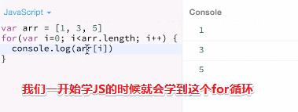
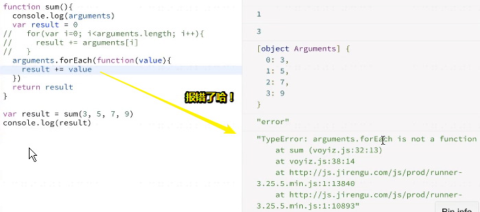
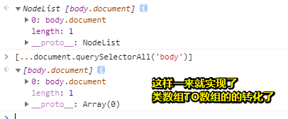

# 实现在线简历（下）

## ★答疑

1. 有关各个位置在项目开发中的职责及协作的
2. 如js里面常见的遍历方式
3. 简单切图吧，毕竟小公司很多岗位还是有这个要求。还有就是canvas可以稍微聊一下
4. web安全吧
5. 饥人谷有没有讲过什么程序员的自我修养，程序员的代码规范，程序员的职业生涯规划这种东西

### ◇项目之职责及协作

关于第一个问题，我猜这应该问的是：

> 在互联网公司如果开发一个产品，那么相关的人员分别做什么事情呢？以及大家如何去协作？如前后端的协作……

毕竟有很多同学是转行过来的，没有在互联网公司待过，也没有做过正式的开发，所以会有这方面的疑问哈！

所以假设我们到了一个互联网公司里，我们要做什么呢？

#### 角色

在互联网公司里边和一个产品相关的角色，一般有几种呢？

1. 产品经理——出需求文档，即提需求的，比如说我们现在有几个人，准备成立一家公司，然后去开发一款产品，那么其中一个角色就是产品经理，那么他负责什么呢？——他负责我们做的这个东西是什么？它有什么功能？然后把其中的一些需求理得比较清楚，甚至会画出一些基础的交互设计图
2. 第二个角色就是设计，有时候产品经理的这个交互设计图是和设计师沟通，然后一块做出来的，比如说产品经理把这个思想传达给设计师，那设计师就画出一个交互图，而交互图其实就是一个很简单的图，举个例子来说，看看我们如何去画交互图

#### 如何画交互图

准备好一个线上工具—— <https://www.figma.com>

在这个工具中，选择一个文件，然后就可以开始去选择手机，接着就是画图了

画完图之后，由于是有很多个页面的，所以接下来就得理清楚图与图之间的关系了！

然后前端你就用CSS把效果给写出来哈！

3. 前端人员
4. 后端人员

> 关于小程序就是vue的翻版，只需要了解一点点小程序的语法规则，然后学习成本多久呢？——两个小时左右，最长不超过一个下午，你就可以做出你所需要的小程序了
>
> 有了前端和后端，那我们就可以开发出移动的页面、小程序，当然什么支付宝小程序、百度小程序等原理类似
>
> 如果想开发app，那么这个时候需要ios和安卓的开发工程师，当然，假设我人手特别不够的话，我的前端工程师的技术比较牛叉的话，那前端也可以出开发，使用react native或者是weex去搞事情，不过一般是react native去开发一个前中期版的app的这么一个产品。换句话说 ，用户看上去就是个app，但是这个东西前端可以去做，因为它是用JavaScript写出来的哈！

5. 还有的就是在开发中会有对应的测试人员

6. 如果是中小公司的话，那么很有可能是咩有运维的，而后端会充当运维的角色

   如果是大公司的话，一两台服务器是不够的，可能需要几十台，甚至是上百台的服务器，那这个时候对服务器的管理，让你的整个网站能够正常的运行，能够高效率地去运行，那么这是一个很重要的问题啦！所以这时需要一个专业的运维人员

如果一个公司特别特别小，那么可能真得会出现一个前端工程师干所有事情，比如说你可以去构思这个产品，你自己可以去做设计，你可以做前端的开发，你可以去做后端的开发，你可以去做线上部署，你可以自己去做测试，总之你可以完全以一个人的姿势去做一个能看得见的产品出来……

这就是公司里面的工作职责了！

**➹：**[互联网公司角色成员解释—-弄懂产品、技术、运营等角色是干嘛的 - 爱运营](http://www.iyunying.org/yunying/yyjc/134871.html)

**➹：**[互联网公司都有哪些岗位？具体是什么职责？ - 知乎](https://www.zhihu.com/question/26755083)

**➹：**[一篇文章看懂互联网公司职位架构 - leon-这个程序员不闷骚的博客 - CSDN博客](https://blog.csdn.net/u011627980/article/details/50765371)

**➹：**[一篇文章读懂互联网公司组织架构 - 简书](https://www.jianshu.com/p/671c876e74ef)

以上就是关于在互联网公司里的职责与分工了！

### ◇JS里的常见遍历方式

> 虽然这个内容比较简单，但是我们还是可以去做一些发散

#### 什么叫遍历？

在JS里边，只有数组、对象、类数组对象才可以遍历，你一个数字或者是某一个特殊的东西，你该怎么遍历它呢？是吧！

**➹：** [循环和迭代 - JavaScript - MDN](https://developer.mozilla.org/zh-CN/docs/Web/JavaScript/Guide/Loops_and_iteration)

#### 测试

##### ①遍历数组

```js
var arr = [1, 3, 5]
```

最常见的、最基础的姿势（换言之资质最老的姿势）就是for循环了呀！就像这样：



之后学到ES5的时候，就学到一个数组方法，叫 `forEach()`


##### ②遍历对象


当然，数组其实也是一个对象，所以我们同样可以对数组使用`for……in`循环……

不过在有些特殊情况下，可能会有点问题！


这跟之前的用for循环咩有啥区别哈！但是有时候会有点区别，区别在于假设数组元素中存在undefined值，如：

```js
var arr = [1,3,,5]
```

那么for in 和 forEach()都是不会去遍历出这个undefined值的：


所以这就是它们之间的差别了，即用for的话，数组长度即为4，而用其它姿势，则是把这个undefined元素给过滤掉了！不过这种差异是很微小的……

> 我测试了一下，只要是隐式undefined值才会过滤掉，如果你直接写了个undefined元素是不会被过滤掉的！总之for循环就是最保险的，不过写的代码最多

以上就是很传统的遍历姿势，接下来解锁新姿势……

##### ③类数组对象

求和函数：


我想这个arguments应该是数组吧！毕竟能用for循环应该只有数组吧！

既然如此，那么我就使用数组的forEach方法来遍历呗，就像这样：



根据报错信息，我们可以知道forEach不是一个函数，毕竟arguments它不是个数组哈！它并没有forEach这个方法！

当然，还有其它的数组方法它同样是咩有的，如reduce、map……

> 其实说白了就是它的原型链并没有 `Array.prototype`

所以arguments是个普通的对象，它没有这些特属于数组的方法，但是它有一个特殊的名字叫类数组对象！

那么什么叫类数组对象呢？——就是它是一个对象，但是它的属性是0123……而正常一个对象，它的属性是比较奇怪的，比如属性是a、是b……但它的属性是0123，而我们的数组也可以像这属性0123这样得到。

总之arguments长得跟数组有点像，而且这个arguments也有个length属性

换句话说，就像这样：


当然它是没有数组特有的API的

那么对于这种类数组对象，我们如何使用数组的方法去操纵它呢？

举个例子来说，假如现在不是简单的累加操作，而是其它更复杂的操作，所以咋办呢？

所以这就有很多办法可以把类数组对象转化成真正的数组了呀！这样一来我们就可以使用数组的方法来进行操作了……

第一种姿势——三个点+中括号：
这种姿势叫解构，通过这三个点，你可以认为是把这个对象的衣服给扒开了，然后通过这个中括号 `[]`，就重新弄成个数组了呀！


除了这个arguments之外，还有哪些是类数组对象呢？

比如说DOM里面的这个选择一系列DOM元素的东东：


 超级变变：



除此之外还有哪些方法可以变成数组呢？


与上面的 `[...array-like]`等价


其中这里的值是value，而for in则是key！

可见一个遍历是很简单的，但有各种各样的方法

#### 总结

1. 最简单的有for循环遍历姿势

2. ES5的数组方法——forEach()

3. 把数组当成是对象看待的——for……in，其中key是对应的下标

4. ES6的for……of，这时这个就不是key了，而是value

   ```js
   let arr = [3, 5, 7];
   arr.foo = "hello";
   
   for (let i in arr) {
      console.log(i); // logs "0", "1", "2", "foo"
   }
   
   for (let i of arr) {
      console.log(i); // logs "3", "5", "7" // 注意这里没有 hello
   }
   ```

5. 对于普通对象的遍历，俺就是for in 和 for of了呀！

6. 对于有些特殊的对象，如类数组对象或者说是伪数组，那么我们想要使用数组的API该咋办呢？

   - `[…arguments]`

   - `Array.from(arguments)`

   - 还有一种传统姿势：

     

7. 如果有面试官问你「遍历姿势」，那么以上几条做法，可以得满分，如果只回答了for循环，那么不好意思，如果满分是100的话，那么你只能是10分了，毕竟学过一两天JS的人都会写哈！

8. 关于一个bug，为啥在用 `[...arguments].forEach(fn)`的时候，这种语法会报错呢？

   正常情况下，在JS里的编码规范里边，对一个语句后面是否加分号，没有规定，换句话说，有些人喜欢加分号，而有些人则不喜欢，像我就不喜欢加了，而且也有很多的库、不过的框架也没有加

   不加分号的好处是什么呢？——看起来好看一点哈！因为JS本来推崇的就是简洁……然后就看起来比较舒服

   而关于加分号，对于一些其它语言，尤其是强类型语言来说，如果你不加分号的话，那是会报错的，所以这必须要加，不过对于JS来说，就没有这些要求

   总之遵循「能省则省的原则，能少写为啥还要多写呢？」，所以就不加了，不过不加是在99%的情况下是可行的，那么在那剩下的1%的情况下，则会出现问题

   所以这就是为什么有人会说，不加分号会出问题了

   那么其中容易出现问题的一个点在哪儿呢？就是我们这个bug哈！

   

   > JS遇到注释直接忽视掉！

   

   同时，这也意味着，为啥我们不这样写的原因：

   ```js
   //危险姿势：
   [].forEach.call(arguments,fn)
   //保险姿势：
   Array.prototype.forEach.call(arguments.fn)
   ```

   总之，你要清楚不加分号的风险，如果因为不加分号而导致的报错，那么你也应该有能力去解决这个bug

### ◇关于切图

关于canvas，用JavaScript去划线和画圈等，然后把图片放上去，把文字放上去就是这么简单！而且没有svg那么复杂，用处也没有那么广泛……

言归正传，回到切图

目前，用Photoshop搞设计图的设计师越来越少了

慢慢地都使用sketch、还有最近刚接触到的网页版的画原型图工具figma（用起来挺方便的）等

画原型图其是设计师的工作，如果你会画图了，那么抠图，甚至是把这个设计稿还原就很简单了，为啥说它简单呢？因为它里面有数据哈！


**➹：**[Google Material Design – Figma](https://www.figma.com/file/crCEkESvfXKEkZtNZ4zEBA/Google-Material-Design?node-id=0%3A224)

可见现在做页面就变得很简单了！

不像以前那样还得用尺子一点点的去量，毕竟在现在看来，这实在是太麻烦了！

所以抠图的东西不需要学了，你只需要设计师用上最新的工具，然后它给你的就是上述的这么一个链接

然后通过点击里面的页面去获取数据即可！

不过你最好还是得对这个工具有一定的了解

关于如何学习它？——youtub上有个视频，不过是英文的，当然，仔细听还是能听懂了，大概需要2、3个小时就可以进行工作了！

然后你就可以自己去设计成你所想要的产品了，如新建一个页面，然后把图片放上去、画方块。加阴影。调整字体大小……


所以说前端工程师就是和产品最接近的家伙！你只要愿意去做会发现我学设计也很简单，稍微学点nodejs，再学个后台语言，做整个产品也很简单

当然也不能说很简单，只是相较于后端去弄一个产品、设计去弄一个产品的话，要容易得多了！

> 建议大家去尝试一下，如后面做项目的时候，可以尝试着把整个流程跑一跑
>
> 毕竟学这样一个figma工具也不是很难，而且你又不是一个想成为专业设计师的人，总之，你就花两个小时学习一下它，然后基本会用了，就做一个简单的页面，关于设计你可以自行设计，也可以参考现有的app，设计好了，就把它给实现出来
>
> 这样的话，你把这个项目放到你的简历里边，我觉得当你跟面试官逼逼的时候，你才会更慷慨激昂（形容满怀正气，情绪、语调激动昂扬。）……而不是仿来仿去的，毫无底气

教程：

**➹：**[ Figma Tutorial - A Free UI Design/Prototyping Tool. It's awesome. - YouTube](https://www.youtube.com/watch?v=3q3FV65ZrUs&t=1886s)


## ★总结

- 关于看视频，或许我应该记录的是那些改变我行为的内容！

## ★Q&A


​	