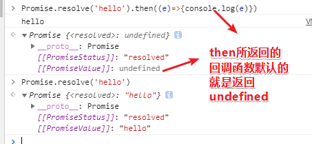

# 异步的各种写法:回调、Promise、异步模块、await/async（上）

## ★课程简介

> 若愚老师主讲：《异步的各种写法:回调、Promise、异步模块、await/async》

资料：

**➹：**[callback/Promise/Generator/async/await · 饥人谷课件](http://book.jirengu.com/fe/%E5%89%8D%E7%AB%AF%E8%BF%9B%E9%98%B6/%E5%BC%82%E6%AD%A5/%E5%90%84%E7%A7%8D%E5%BC%82%E6%AD%A5.html)

## ★回调函数与Promise

### ◇这节课讲什么？

在前端里面，我们常见的异步有几种方式呢？（不单只包括浏览器端，还包括node端）

大概会有5种，分别是：

1. 简单的callback（回调）
2. 对一种进行的该进——Promise
3. 一种新的语法——ES6的Generator
4. 一些现成的模块，即别人封装好的模块，这些模块不是原生的，不像Promise，还是ES6里面其它的如Generator之类的是原生的。总之它就是别人封装好的，我们需要用的时候可以去import、require它，当然，相应的模块还有很多，不单只有这个`co` 模块！
5. ES2017（ES8）的语法——async和await

接下来，我们将会看到这5种异步分别是怎样写的？以及明白为啥有了一种之后，还有第二种、第三种……

### ◇回调

这个例子是针对node端的！

需求：

- 读取 a.md 文件，得到内容
- 把内容转换成 HTML 字符串
- 把HTML 字符串写入 b.html

这个过程在node端该如何实现呢？

```js
var fs = require('fs')
var markdown = require( "markdown" ).markdown
fs.readFile('a.md','utf-8', function(err, str){
  if(err){
    return console.log(err)
  }
  var html = markdown.toHTML(str)
  fs.writeFile('b.html', html, function(err){
    if(err){
      return console.log(err)
    }
    console.log('write success')
  })
})
```

> 在 Node.js 模块系统中，每个文件都视为独立的模块。而require()用于引入（import）模块、JSON 文件、或本地模块。 可以引入 `node_modules` 中的模块。
>
> 在上面这个demo中我们引入了文件系统模块，然后调用它的两个异步API，并分别添加两个回调！此时这两个回调就形成了嵌套姿势……如果接着还要搞点什么幺儿子的异步操作，那么又得继续嵌套，最后十八层地狱……
>
> **➹：**[fs - Node.js API 文档](http://nodejs.cn/api/fs.html)

既然在 Node 环境下执行，那我们就尽量多使用 ES6的语法，比如`let`、`const`、`箭头函数`，上述代码改写如下：

```js
const fs = require('fs')
const markdown = require( "markdown" ).markdown
fs.readFile('a.md','utf-8', (err, str)=>{
  if(err){
    return console.log(err)
  }
  let html = markdown.toHTML(str)

  fs.writeFile('b.html', html, (err)=>{
    if(err){
      return console.log(err)
    }
    console.log('write success')
  })
})
```

看起来还不错哦，那是因为我们的回调只有两层，如果是七层、十层呢？这不是开玩笑

### ◇Promise

#### 一些细节

1. 无法通过 `promise.xxx`  的姿势获取promise对象的内部状态
2. 关于`new Promise((x,y)=>{…这里的代码是同步的…})`，然后返回一个promise对象，在异步结束之前，我们可以先为promise对象设置预案了，一旦有了异步结果，改变了对象的内部状态就立即执行预案……
3. 关于之前那几个获取ip、根据ip获取城市、根据城市获取天气这个三个API，一般后端就直接给你一个API，而不会分三下给

4. 关于then的书写，最好是换一行，就像这样（好看一点，因为会越来越长）：

   ```js
   readFile("a.md")
     .then((mdStr)=>{
       return markdown.toHTML(mdStr)  //返回的结果作为下个回调的参数
     }).then(html=>{
       writeFile('b.html', html)
     }).catch((e)=>{
       console.log(e)
     });
   ```

   由于readFile返回的是Promise对象，为此我们可以级联操作回调！

5. 关于成功预案的返回值不是promise对象：

   

   then函数会返回一个Promise对象给后面用，而且是立刻去resolve()

6. 用了promise之后可以实现一个异步的级联，就像这样一直then：

   ```js
   getIp().then(function(ip){
     return getCityFromIp(ip)
   }).then(function(city){
     return getWeatherFromCity(city)
   }).then(function(data){
     console.log(data)
   }).catch(function(e){
     console.log('出现了错误', e)
   })
   ```

   这里的级联是从上到下，一层一层的，如果还有其它回调，那就继续添加相应的then就好了！而不会像我们以前一样，一层层的嵌套……

   所以使用了promise之后，对回调的可读性会更好一些！

7. Promise.all的使用场景：

   某个网站提供了很多接口供一些开发者去使用，但这个接口比较多，而现在，作为开发者的我们需要一个总的数据，这个数据需要从不同的接口中拿到，但拿到之后呢？由于请求是有先有后的，当然谁先谁后，我们是不知道的！不管怎样，反正我们只是希望得到这几个请求全都成功，然后打包之后的一个总的数据，有了这总的数据，然后我们就可以做页面渲染之类的……

   那么这个时候我们就可以调用Promise.all了……

   注意返回的数组中其元素是有相应的顺序的：

   

   总之使用all之后，就不用关心哪个异步结果先出来了！

8. 

   测试：

   

#### 小结

- 剩下的几种会稍微难一些，而Promise则是不管你是做新式的前端，如使用vue/react技术栈去做一些封装，而经常做的封装就是封装接口，那么一般的话我们会把它封装为Promise，或者是说我们用得很多别人提供的现成的模块 都返回的是Promise对象，然后你就可以直接调用then去用啦！

  如果你是做node端，就服务端的话，那基本上大部分的函数方法都是异步的，如读取文件、读写文件、网络请求以及各种各样数据库的操作都是异步的！那么一般来说我们都会把它封装成Promise

---

## ★generator的用法


---

## ★总结


---

## ★Q&A

### ①什么叫级联？

把二个以上的设备通过某种方式连接起来，能起到扩容的效果就是级联？

每个元件都是头尾衔接就叫级联？

```js
new Promise((x,y)=>{}).then(s1).then(s2).catch(e)……
```

**➹：**[什么叫‘级联’？_百度知道](https://zhidao.baidu.com/question/10706142.html?qbl=relate_question_0)

