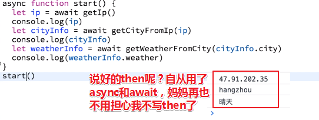

# 异步的各种写法:回调、Promise、异步模块、await/async（下）

## ★回顾

从callback这种嵌套调用，到promise这种then、then……的平级调用、再到绕来绕去的Generator，虽然如此，但其好处是让我们的业务代码清晰明了，如明明是一个异步操作，但给人的感觉就像同步一样，如之前的读一个文件，然后得到结果，再输出结果，然后做处理，写文件：

```js
let gen = function* () {
  try{
    //下面这个核心代码，给人感觉像是同步代码一样，这就是使用generator的价值所在了！不过启动generator的代码可读性不太友好！
    let mdStr = yield readFile('aa.md', 'utf-8')   //line3
    console.log(mdStr)
    let html = markdown.toHTML(mdStr)
    yield fs.writeFile('b.html', html)
  }catch(e){
    console.log('error occur...') //line6
  }
}
```

## ★co 模块

不是JS里面现有的东西，像是Promise、Generator等都是JS现有的！而它则是别人封装好的一些模块（package）

我们可以在npmjs.com里面搜索到很多跟异步相关的package！

常见的有：

1. [co](https://www.npmjs.com/package/co)
2. [async](https://www.npmjs.com/package/async)，这个可不是ES2017里面原生的语法，而是一个package，即别人封装好的一个包
3. [bluebird（蓝知更鸟）](https://www.npmjs.com/package/bluebird)

这些东西功能都差不多，只不过语法层面不太一样！

举个例子来说，如co

> 关于这些异步模块有很多，我们到底要用哪一个，需要看它的一周下载量，下载量高的，意味着这个包有更多人用，所以你也可以跟着去用，毕竟用得多意味着它出问题概率更少。不过我认为这不排除是马太效应的结果！
>
> **➹：**[什么是马太效应？ - 知乎](https://www.zhihu.com/question/21509110)

co 模块是用于处理异步的一个node包，用于 Generator 函数的自动执行。[NPM 地址](http://book.jirengu.com/fe/%E5%89%8D%E7%AB%AF%E8%BF%9B%E9%98%B6/%E5%BC%82%E6%AD%A5/co),模块内部原理可[参考这里](http://book.jirengu.com/fe/%E5%89%8D%E7%AB%AF%E8%BF%9B%E9%98%B6/%E5%BC%82%E6%AD%A5/ECMAScript%206%E5%85%A5%E9%97%A8-%E6%A8%A1%E5%9D%97), 本质上就是 Promise 和 Generator 的结合，和我们上个范例还是很像的。

```js
const fs = require('fs')
const markdown = require('markdown').markdown
const co = require('co')
const thunkify = require('thunkify')

let readFile = thunkify(fs.readFile)
let writeFile = thunkify(fs.writeFile)
let onerror = err=>{
  console.error('something wrong...')
}

let gen = function* () {
    let mdStr = yield readFile('a.md', 'utf-8')
    let html = markdown.toHTML(mdStr)
    yield writeFile('b.html', html)
}

co(gen).catch(onerror)
```

例子中 thunkify模块用于把一个函数thunk化，也就是我们上例中如下形式对异步函数进行包装。gen 的启动由 `co(gen)`来开启，和我们上一个范例类似

```javascript
//thunkify的作用类似于下面这个：代码虽然不多，但很绕……之前接触过curry函数，反正这些函数都难阅读！
function writeFile(url, data){
  return (callback)=>{
    fs.writeFile(url, data, (err, str)=>{
      if(err) throw err
      callback()
    })
  }
}
```

就像回到了男耕女织的田园生活，感觉世界一下子清爽了许多。

## ★async模块

用的时候直接去看它的文档即可！

**➹：**[Home - Documentation](https://caolan.github.io/async/)

这里面有很多很多的方法，直接根据这个文档去用即可！

常用的方法有：

1. 串联的：有一些异步请求可以一个一个串联去执行，叫series
2. 也可以去map，把多个异步请求的结果变成一个总的结果！相当于是Promise.all()这么一个东西
3. 还有every，每一个都去执行，each也是如此！
4. ……

## ★bluebird模块

也是类似的做法，即看对应的文档即可！

## ★async/await

ES2017 标准引入了 async 函数，用于更方便的处理异步。 这个特性太新了，真要用需要babel来转码变成ES5的写法。甚至nodejs也有可能不支持！总之babel在手，天下我有！

```js
const markdown = require('markdown').markdown
const fsp = require('fs-promise')
let onerror = err=>{
  console.error('something wrong...')
}

async function start () {
    let mdStr = await fsp.readFile('a.md', 'utf-8')
    let html = markdown.toHTML(mdStr)
    await fsp.writeFile('b.html', html)
}
//start()返回的是Promise对象，类似于gen().next()操作，同generator一样，会根据await的个数，切换状态，即Promise对象的状态是会在执行这个start函数的过程中切换状态，以及其中所存储的值即传给预案（回调）的参数也会发生变化
start().catch(onerror)
```

> 上面这个代码更多的细节[①](#yi)

这个语法跟我们之前的Generator语法很像，`yield`换成了`await`，`*`换成了`async`

这里的fsp是把一个东西变成一个Promise对象，它就是把一个内置模块给Promise化了！就像我们之前写的这样：

```js
function readFile(url) {
  var promise = new Promise((resolve, reject)=>{
    fs.readFile(url,'utf-8', (err, str)=>{
      if(err){
        reject(new Error('readFile error'))
      }else{
        resolve(str)
      }
    })
  })
  return promise
}
```

> 突然发觉这些变化都是一个形式上的变化

小结：

1. 使用async/await的话，需要把异步操作给Promise化，即 `let mdStr = await fsp.readFile('a.md', 'utf-8')`中的 `fsp.readFile('a.md', 'utf-8')`必须返回的是Promise对象才行！由于得到是一个Promise对象，那么我们就能直接这样 `start().catch(onerror)`了，类似于之前的 `gen().next()`这样……一旦哪个异步操作里面reject了，就可以直接catch了
2. 关于语法：async和await，写函数的时候，第一个先在函数外面async，然后再在函数里面写await

引入async/await的话，当我们写异步的代码的时候，就感觉像同步的代码一样，如首先去读文件，读完之后就赋值给mdStr，然后处理这个mdStr，把处理结果赋值给html，然后再去写文件，写完之后，下面还能干其它的事情：

```js
async function start () {
    //类似于在gen启动时的gen().next().value，也就是异步操作所返回的结果啦！
    let mdStr = await fsp.readFile('a.md', 'utf-8')
    let html = markdown.toHTML(mdStr)
    await fsp.writeFile('b.html', html)
    //还能干其它事
}
start().catch(onerror)
```

总之，我们写代码像是写同步代码一样，但这本质上来说这还是一个异步的过程！

> 用了async和await后，不用写then了！直接在start函数里面写就好了！

以上就是异步的所有使用场景以及使用方法啦！

## ★答疑

**①这节课所讲的内容有啥用？**

很有用，如：

1. 面试的时候，会经常问，其实会Promise就已经很不错了，如果你能把其它写法用到项目里面，会让人对你的JS水平刮目相看

2. 在做实际项目的时候，无可避免地会接触到各种各样的异步操作，特别是你用nodejs做nodejs项目的时候，那么就会随时随地在接触使用异步的操作，那么一般情况下你会看到各种各样的Promise处理后的结果。既然用了Promise，那么你就稍微做一下改造，用一下ES2017出的新特性async/await……这样一来，我们的代码就显得特别干净和整洁了！这就是我们学习它的一个价值了！

**②改写下面这个代码为async/await姿势？**

```js
function getIp() {
  var promise = new Promise(function(resolve, reject){
    var xhr = new XMLHttpRequest()
    xhr.open('GET', 'https://easy-mock.com/mock/5ac2f80c3d211137b3f2843a/promise/getIp', true)
    xhr.onload = function(){
      var retJson = JSON.parse(xhr.responseText)  // {"ip":"58.100.211.137"}
      resolve(retJson.ip)
    }
    xhr.onerror = function(){
      reject('获取IP失败')
    }
    xhr.send()
  })
  return promise
}

function getCityFromIp(ip) {
  var promise = new Promise(function(resolve, reject){
    var xhr = new XMLHttpRequest()
    xhr.open('GET', 'https://easy-mock.com/mock/5ac2f80c3d211137b3f2843a/promise/getCityFromIp?ip='+ip, true)
    xhr.onload = function(){
      var retJson = JSON.parse(xhr.responseText)  // {"city": "hangzhou","ip": "23.45.12.34"}
      resolve(retJson.city)
    }
    xhr.onerror = function(){
      reject('获取city失败')
    }
    xhr.send()
  })
  return promise
}
function getWeatherFromCity(city) {
  var promise = new Promise(function(resolve, reject){
    var xhr = new XMLHttpRequest()
    xhr.open('GET', 'https://easy-mock.com/mock/5ac2f80c3d211137b3f2843a/promise/getWeatherFromCity?city='+city, true)
    xhr.onload = function(){
      var retJson = JSON.parse(xhr.responseText)   //{"weather": "晴天","city": "beijing"}
      resolve(retJson)
    }
    xhr.onerror = function(){
      reject('获取天气失败')
    }
    xhr.send()
  })
  return promise
}

getIp().then(function(ip){
  return getCityFromIp(ip)
}).then(function(city){
  return getWeatherFromCity(city)
}).then(function(data){
  console.log(data)
}).catch(function(e){
  console.log('出现了错误', e)
})
```

改写：



可见改进后的代码用起来特别方便，方便在哪儿呢？就像同步代码一样！你说方便不？

**③async是语法糖？还是创建的API？**

语法糖哈！当然，它们是ES2017新出的关键字！

async/await内部的流程和我们前面所讲的generator的流程是类似的！这就是为啥要按照这种顺序讲5种异步写法的原因了！而不是一开始就讲async/await——这可谓之先苦后甜

总之async/await实际上就是对前面的几种异步写法做了封装！

**④为什么跨域不安全？**

质疑：问这个问题的人应该是对这个东西不太清楚，毕竟问这样的问题很奇怪！

回答：

回顾一下什么是同源策略？什么是跨域？——举个例子来说，正常的我们的网站xiedaimala.com，如这个前端页面：


服务端的接口也是xiedaimala.com/api/……聊天的一些接口，然后我们的js去发请求，向这个接口去获取数据，这个时候我们当前前端页面的url接口和我们js请求的url接口是一个域名的，总之是同源的，即协议、域名、端口都相同，所以这个时候才是正常的！

但有时候会出现一些额外的场景，举个例子：

我现在要做一个云笔记的项目或者是云博客的项目，然后我自己不搭后台，我用一个别人即第三方提供的一些接口，然后我调用这个接口就可以去创建博客、创建笔记、查看笔记、修改笔记，然后我自己做的是一个纯前端的项目，做好之后我就把这个项目放到我的githubpage上，然后部署一下，而这个时候就会出现一个问题了！

当别人打开github的时候，看到的是你的这个项目的页面，但是你的JS请求发的又是另外一个接口，这个时候不就会出现跨域吗？

那正常情况下，跨域会被浏览器阻止掉……

举个例子：

当我打开了你这个github的网站，那这个时候我的浏览器会向对方的那个服务器去发送请求，那服务器其实它是不管的，它收到请求之后，然后就把数据发回来，但发回来之后我的浏览器一看当前域名是github，而你的接口的响应头又不是，那么这个时候这个数据，浏览器虽然得到了，但是不会给你，换句话说你的ajax是拿不到的！这个跨域是被浏览器（当期用户的浏览器）给阻止掉的！

换一种场景：

假设我不是浏览器，我是服务端，举个例子：

我现在用nodejs写了一个server，然后nodejs里面去发请求，找其它第三方的接口要数据，要完数据之后你说能不能到？当然可以……这是为什么呢？因为不存在浏览器呀！既然不存在浏览器，那么这也就不存在所谓的跨域了！

那么这个时候希望整个流程能够跑通，那必须要第三方的服务器允许你去跨域

那么如何才能允许呢？——它可以设置它的响应头（系统班课程里有讲到）

浏览器拿到服务器设置好的响应头，发现服务端是允许我的……那就放行吧，这样ajax就能拿到这个数据啦！

所以这里面没有所谓的安不安全，只有所谓的有没有这个需求

**⑤关于CSRF？**

这是另外一个概念，这和跨域没有什么特别大的关系！

**➹：**[为什么浏览器要限制跨域访问? - 知乎](https://www.zhihu.com/question/26379635)


---

## ★总结

- 突然发觉你看到的那些新特性都是封装了好几层的东西，如果你想要更好的记忆它们的话，你就像扒洋葱一样一层层剥开就好了。

  还有最好是通过对比来学习，如`async/await`和 `*/yield`，即多通过几个类似的例子来学习，如异步的各种写法……

- 关于模块最直接的用途就是，把原始的callback姿势封装成可以配合generator或者async/await使用的姿势。很多时候我们会导入各种模块，模块的存在让我们的代码更精炼，逻辑更清晰，代码更声明式……总之就是提高效率呗！
- 可以经常看逛一下npm社区！

## ★Q&A

### <a id='yi'>①进一步了解async/await<a>

async函数是对 Generator 函数的改进，实际上就是把Generator自动执行给封装起来，同时返回的是 Promise 对象更便于操作。

用的时候需要注意await命令后面是一个 Promise 对象。

上例中 fsp的作用是把内置的fs模块Promise 化，这个其实刚刚做过。

```js
function delay(time) {
  return new Promise((resolve,reject) => {
    setTimeout(()=>{
      if(Math.random()>0.8){
        resolve(time)
      }else{
        reject('error..')
      }
    }, time)
  })
}

async function fn() {
  console.log('start')
  let time = await delay(1000)
  console.log(`${time}ms passed`)
  let time2 = await delay(3000)
  console.log(`${time2}ms passed`)
}
fn().catch(err=>console.log(err))
```

解释一波：

1s过去了，然后3s过去了，如果有reject的情况出现，那么就catch了！

为了测试效果更好一点，可以把delay函数改写一下：


在这里这个time是我们预先设置的异步结果！

这就是异步的终极用法，这些代码甚是干净利落，我们唯一需要的注意是`delay(1000)`的返回值必须是一个Promise对象！当然，这也可以通过某些模块（如fs-promise模块）对它进行Promise化！