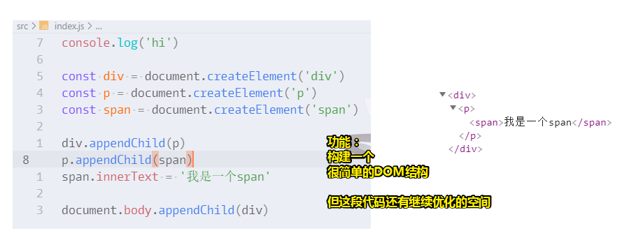
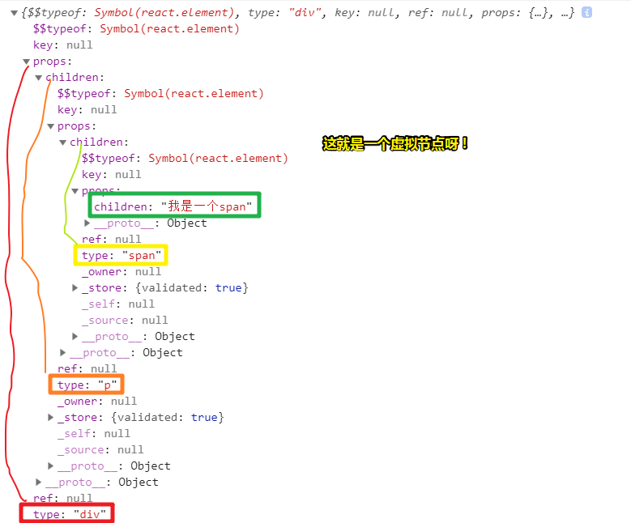

# React入门

## ★引子

从未接触过React…

## ★学习目标

- 知道如何去搭建一个最简单的 React 项目
- 知道如何去看文档、如何去做组件间通信、如何去做组件化

## ★怎么学？

- 对比之前的 「Vue」入门课程，看看 React 是如何做那些事儿的！
- 没有良好JS的基础学不好React，React的优点就是，JS用得多溜，React用得就多溜
- 看 React 文档（相较于Vue的平铺直叙，分门别类，React文档脉络不是很清晰，有种很乱的调调，当然，它更符合哪里不会就看哪里的感官）
- 直接用 React 做项目，做毁它（吸取教训，那样做是不对的！）
- 然后你就 React 入门了
- 再做第二个项目，这次不会毁了

## ★React vs Vue

- 入门搞Vue，因为Vue封装了很多东西！而React需要你自己造很多东西，但是灵活呀！
- 二者只学一个就能找着工作，但两个都学了，那就更好了！
- 如果你用了一段时间 React，发现是真得好用，那么你就真得喜欢用React了。

## ★React 最核心原理

> 通过一个简单的例子来简单了解 React 最核心的原理！

### ◇搭建项目环境（能运行代码就好）

1. 创建一个叫`react-tictactoe`的目录

2. 初始化 react 项目，之前我们初始化一个 vue 项目用的是 `vue-cli`，那么 react 有什么类似的工具吗？——那就是 `create-react-app`

   **➹：**[Create a New React App – React](https://reactjs.org/docs/create-a-new-react-app.html#create-react-app)

   一般芳芳看文档，都是直接看能运行的代码，而不是直接看一大段英文

```bash
npx create-react-app my-app or yarn create react-app my-app
cd my-app
npm start
```

> 一般我们都是先创建一个目录，然后进去一个目录 `yarn create react-app .`一下就好了！
>
> 芳芳用的是  `npx create-react-app .`，但是在安装的时候用的却是`yarn`，为啥不是npm呢？

这个安装用了我大概11min的时间！（可以用npm）


当你查看`node_modules`就会明白，为啥要安装那么久了：


> 关于文件大小和占用空间的关系：
>
> 很多人一起吃饭，这个分配单元就相当于碗的大小，这个文件就好比碗里的饭，每个人的饭量不一样，有人吃的多，就需要两个碗来盛饭，但是有的人吃的少，但也是要占一个碗。
>
> 说白了，有些文件所占用的空间刚好接近分配的最小空间，而有些则是一个文件放一个字符，也要占用分配好的最小空间
>
> 总之，就是文件数量太多了，导致有31MB的空间被浪费了！所以说硬盘空间下，是不足矣运行该项目的！

**➹：**[“文件大小”和“占用空间”的区别 - 向死而生 - CSDN博客](https://blog.csdn.net/duyusean/article/details/78643475)

3. 启动项目：`yarn start`，也可以用 `npm start`，反正都是用于启动 `react-scripts start`这个脚本。 虽然它们俩功能一样，但是yarn的bug相较于小一点！（一般第一次启动 react 项目都很慢，这跟你机器的性能有关！）
4. 拿到一个react项目，那么首先就是看src下的 `index.js`文件，这是约定俗成的！然后对于新手入门来说，你得把一些无关紧要的文件给删掉。
5. 删掉多余的文件，让src目录下有 `index.js`和 `App.js`这两个文件，其中文件的内容如下：

`index.js`：

```react
import React from 'react';
import ReactDOM from 'react-dom';
import App from './App';

ReactDOM.render(<App />, document.getElementById('root'));
```

`App.js`：

```react
import React from 'react';

function App() {
  return (
    <div className="App">
      hi
    </div>
  );
}

export default App;
```

效果：


总之，`index.js`是程序的入口，而 `App.js`则是该项目的第一个组件

### ◇开始讲解 React 的基本原理

**①用原生JS搞一下DOM，然后告知你 React 可以做得更好**

1. 把 `index.js`里边的内容都删掉，写上一些原生JavaScript代码去跑即可，反正它会自动运行，类似于我们在 `index.html`里边写 `<script src="./index.js"><script>`。代码内容如下：



你只要把这个功能搞清楚了，那么你就知道 React 在做什么了

目前，来看这段 JS 代码看起来没啥问题，但是有点繁琐，我们需要把它变得更简单一点，如少写几个 `document`，因此我们需要封装一个 `createElement`函数（给我一个tagName，我就返回一个创建好的DOM元素）

2. 第一次优化，功能不变——创建DOM元素简单点

```js
console.log('hi')

const div = createElement('div')
const p = createElement('p')
const span = createElement('span')

div.appendChild(p)
p.appendChild(span)
span.innerText = '我是一个span'

document.body.appendChild(div)

function createElement(tagName) {
  return document.createElement(tagName)
}
```

3. 第二次优化，功能有变——为 `creatElement`添加第二个参数，该参数作为第一个参数的子元素（可以元素元素节点，也可以是文本节点）

```js
const div = createElement('div', 
                createElement('p', 
                  createElement('span', '我是一个span')))
                                  

document.body.appendChild(div)

function createElement(tagName, children) {
  const element = document.createElement(tagName)
  if(children) {
    if(typeof children === 'string') {
      let childrenTextNode = document.createTextNode(children)
      element.appendChild(childrenTextNode)
    } else {
      element.appendChild(children)
    }
  }
  return element
}
```

此时，创建这样的结构：

```html
<div>
   <p>
   		<span>我是一个span</span>
   </p>
</div>
```

只需要一句话就可以做到！是不是很牛逼？

理解了，这个之后，就好理解 React 在干啥了

目前我们做了啥？——通过以下代码可以创建一个DOM结构（把`createElement`改成是`t`这个简短的名字）

```js
const div = (
  t('div',
    t('p',
      t('span', '我是一个span')))
)
```

> 第一个括号没啥实际意义，只是为了好看点！

这跟在浏览器渲染的DOM结构一模一样（缩进也一模一样）：


那么，我们能否发明一种新的语言，像写标签一样创建我们上边的结构呢？

只要开发者写这样的代码：

```react
const div2 = (
  <div>
    <p>
      <span>'我是一个span'</span>
    </p>  
  </div>
)
```

那么我就写个类似 babel 这样的东西，可以把上边这段代码翻译成这样代码：

```react
const div = (
  t('div',
    t('p',
      t('span', '我是一个span')))
)
```


> 简单意会一下编译过程就好了！

总之，如果某个工具能够简单，非常方便做到以上的翻译过程，那么该工具就是非常牛逼的！

而这一点就是 React 的创举了。

很多人只想到翻译的结果，没想到翻译前的结果，毕竟这需要用到编译原理的知识啊！反正，就是你基础牛逼，那么你写的轮子就牛逼呗！

至此，你理解了这一点之后，那么你就知道 React 的核心是什么了，那就是「你以为自己在写标签（`div2`里边那一坨东西），实际上 React 把你这些标签翻译成 `div`变量 里边那一坨东西」

4. 再次改造——引入 React ，让 React 为我们写`t`


这个假的节点是 React 的第二个创举！即虚拟DOM，而它比DOM的性能要更强大！



我们不能直接把 虚拟DOM 渲染到页面里边去，需要借助`react-dom`这个库，而该库就是支持虚拟节点的，它的用法很简单——**谁要放在谁旗下**！

> ReactDOM 不鼓励我们把虚拟节点放到body旗下，而是放在某个div旗下，以防污染body。
>
> `React.createElement`这个API相较于我们之前的 `createElement`多了一个参数，这个参数我们暂且留空，把它设为 `null`，之后会讲到！

至此，我们又把起初的那个功能用 React 实现了一遍！


至此， React 的基本原理就讲清楚了，那么接下来就是做项目了。

---

## ★如何声明一个组件

### ◇完善写法

> 这是之前说到一个创举，即编译前的代码

```react
const div = (
  <div>
    <p>
      <span>我是一个span</span>
    </p>
  </div>
)
```

当你写了这种语法（ React 的核心），那么你在心里边就默念成这样的：

```js
const div = (
  React.createElement('div', null,
    React.createElement('p', null,
      React.createElement('span', null, '我是一个span')))
)
```

> `<`：`React.createElement`
>
> `>`：`,`

### ◇构建更复杂的东西


> 加个花括号表示引入的是另外一个组件哈！

我们可以看到像任意组合变量那样，组合成一个页面！甚至还可以把`Header`这个变量移到另外一个页面里去！

以上就是 React 提供的组件化思维，而 Vue 则需要你自己写一个vue单文件组件，即 Vue 它自己发明语法，而 React 不发明任何语法，只是告诉你，这可以简写成 `const span = (<span>hi</span>)`，当然，你也不阻止你 `React.createElement('span', null, 'hi')`这样写，不过，应该没有人会这样写吧！毕竟敲那么多字符实在是太麻烦了！

>  React 的第二个思想：使用纯 JS 的组合来实现组件化

### ◇让组件支持参数

在 JS 里边支持参数的就只有函数了

所以，如果我们的 `Header`可以是一个函数的话，那么该组件就可以接受参数了


我们可以发现 React 特别巧妙，它不给你提供任何API，它只在写法上给你做文章！

而这就是 React 作者的思路了——使用很简单的做法，就能实现传参！

回过头来看 Vue ，它的思路是发明一个新的语法！如 `v-if`啥的！

> 其实我们在使用 Vue 组件的时候也是像②那样传参的！不过，你咩有写过 React 的话，你是不知道第二种姿势其实是一种函数调用的简写姿势哈！说白了，你写过 React 之后，才会知道 Vue 组件化那种设计是怎样来的！

### ◇让组件使用自身的变量


> `onClick`这里的代码，是特属于 React 的语法，原生 JS 可不能这么用哈！

这里的 `onClick`必须得是大写，才表示这是在监听一个click事件，而其值必须得要用 `{}`包裹才行，如果直接用 字符串的话，那是会报错的！

以下是翻译之后的写法，在 `()` 用到原生 JS 代码 请一定 使用 `{}`括起来！这表示里边的内容是 JS 代码哈！用于区分普通的字符文本！

```react
const Bottom2 = function() {
  const [n, setN] = React.useState(0)
  return (
    <div>
      {n}
      {React.createElement('button',{
        onClick: function() {
          setN(n+1)
        }
      },'+1')}
    </div>
  )
}
```

关于 `setN`存在的意义：

针对下边这个代码，按照正常的 JS 思路来说，点击 `+1`这个button显然会加1

``` react
const Bottom2 = function() {
  let n = 0
  return (
    <div>
      {n}
      <button onClick={
        function() {
          n = n+1
        }
      }>+1</button>
    </div>
  )
}
```

然而结果是没反应！

而这就涉及到 React 的核心思想了——如果你要在一个组件内边使用一个内部的状态的话，那么你得这样写：

```react
const Bottom2 = function() {
  const [n, setN] = React.useState(0)
  return (
    <div>
      {n}
      <button onClick={
        function() {
          setN(n+1)
        }
      }>+1</button> //为button绑定click事件
    </div>
  )
}
```

`const [n, setN] = React.useState(0)`：表示这个状态的初始值是`0`，而这个状态的值是 `n`，而这个状态的更新方法时 `setN`，`[n, setN]`是个析构赋值

> 我本来想说，状态n的初始值是 `0`，但这样说并不能很好体现一个组件内部可以存在多个状态呀！

用法：

- 显示n：`{n}`
- 改n：`setN(n+1)`，`setN`似乎是这样的 `function setN(n){return n}`，然后把返回值赋值 `n`

回过头来看 `Bottom2`这个变量的代码，我们使用到的 React  API就只有 `React.useState(0)`这个，其它的都是原生 JS 自带的内容（变形那个并不算是使用了 React 的API，因为编译后的结果就是原生 JS 了）

而这也是 React 和 Vue 最大的不同，即 React 的API极少极少，但是与 Vue 的功能是一样的！

总之，如果你喜欢 React ，那就用 React 呗！不喜欢，也没事，毕竟，还可以用 Vue 哈！

### ◇使用类构造一个组件

> 这种写法很麻烦！

```react
class Bottom3 extends React.Component{
  render() {
    return (
      <div>bottom 3</div>
    )
  }
}
```

这是ES6提供的功能，而不是 React 提供的，回顾那句话「如果你 JS 学得不好，那么你就不要学 React 了」

类组件比函数组件要难理解得多，因此函数组件要流行得多！

用法，还是直接 `<Bottom3 />`即可！

总之，我们可以用函数做一个简单的组件，也可以用类做一个简单的组件

不过，我们之后，主要用的就是函数组件了，因为简单、逼格高呀！

而类组件这种语法，只要背就好了，人人都会

而函数组件这种语法是比较新的，还有很多面试官不会！如果你在面试的时候用新语法的话，那么面试官肯定会觉得你很厉害呀！或者说你是一个很好学的人。

总之，首推函数组件写法！

### ◇总结一下 React 的几个功能

- 可以使用标签的形式直接创建一个虚拟div，然后里边可以写上任意的子元素
- 在Xx组件里边，可以通过 `{}`直接把Zzz组件给引进来！ `{Zzz}`
- 把Zzz组件写成一个函数，然后调用一下Zzz引进到Xx组件里边来！ `{Zzz({name:'frank'})}`
- 优化上一个功能，即写成一个标签，`<Zzz name="frank" />`，把参数写成是标签的属性，上一个功能与这个功能的结构一模一样，只是写法上不一样
- 如果你希望一个组件拥有自己的状态，那么你就使用 `React.useState()`这么一个API，然后再给上一个初始化的值，然后再给上一个读的API和一个写的API，如这样 `const [n, setN] = React.useState(0)`，那么读的就是 `n`，写的就是 `setN`
- 使用类创建组件

接下来正式搞那个井字棋项目了，毕竟我们目前已经知道如何声明一个简单组件了！

---


## ★总结


## ★Q&A

### ①yarn 和 npm 切换至淘宝源？

查看目前的源：


切换成淘宝源：


换回原来的默认源：

```bash
 # npm
 npm config set registry 'https://registry.npmjs.org/'
 # yarn
 yarn config set registry 'https://registry.yarnpkg.com'
```

**➹：**[yarn 国内加速，修改镜像源 - Laravel China 社区](https://learnku.com/articles/15976/yarn-accelerate-and-modify-mirror-source-in-china)

**➹：**[npm，yarn如何查看源和换源 - 知乎](https://zhuanlan.zhihu.com/p/35856841)

### ②为啥写在HTML上的onClick能触发callback执行？

**如果你是写在HTML中，那HTML的标签是不分大小写的**     

 比如： 

```html
<a href="#" id="myclick" onclick="dosomething();">Click me!</a>
```

 这里的`onclick`，你可以写成`ONCLICK`，或是别的什么，因为那是HTML，HTML不分大小写。    

 但是如果你写成Javascript，那就不是这样了：     

 比如：     

```js
 var link = document.getElementById('myclick');    
 link.onclick = function(){    
   alert('hello');    
 }     
```

 你要把`onclick`改成`onClick`，那就是一个`onClick`的新方法，和 `onclick`事件无关。

**➹：**[onClick还是onclick，第一个c是否要大写，发现虽然mdn和msdn上都说的是onclick，但是浏览器也能触发onClick事件，这是为什么？ - 知乎](https://www.zhihu.com/question/19942453)

### ③为啥要加 `()`？

> 为了好看呗！

反正不加括号就会报错，而加了括号就会被 `babel-jsx` 翻译成原生 JS 

**➹：**[你对return后面的括号了解多少？ - 简书](https://www.jianshu.com/p/e9230dc06044)

**➹：**[render方法括号的作用 - on the way - SegmentFault 思否](https://segmentfault.com/a/1190000012360432)

