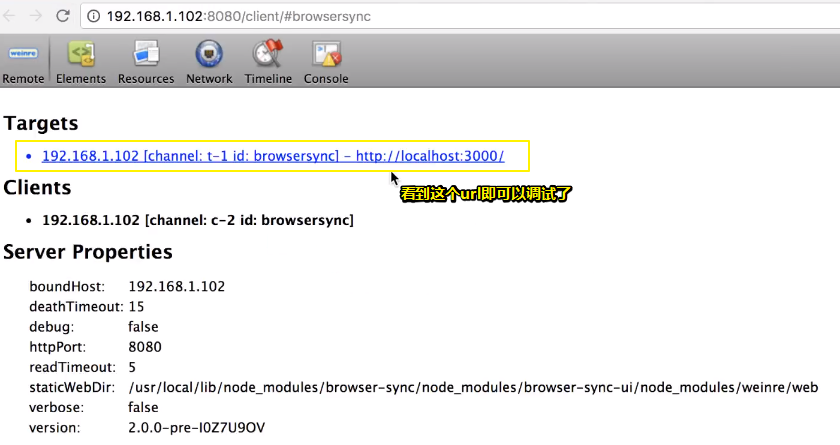
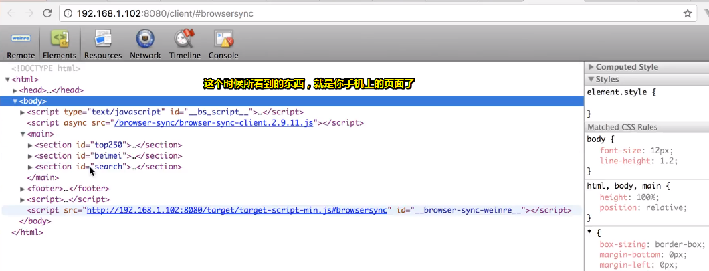
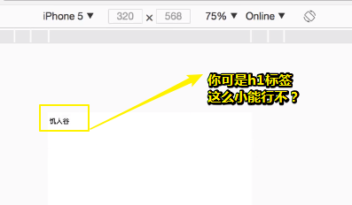
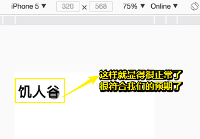
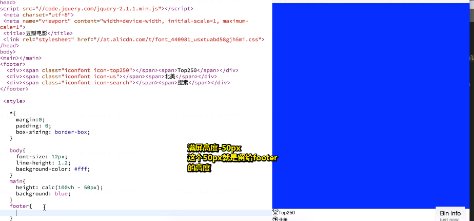
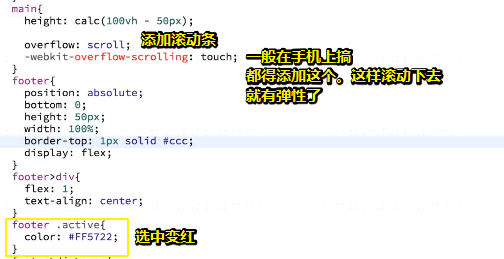
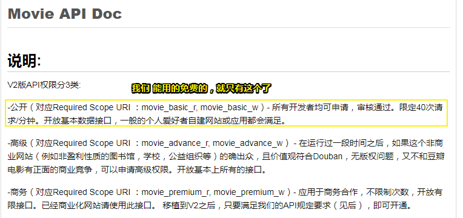
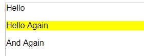

# 豆瓣电影（上）

## ★概述

### ◇效果

**➹：**[豆瓣电影](http://book.jirengu.com/jirengu-inc/js-works/projects/doubanmovie/index.html)

### ◇开搞之前的准备工作

#### 分析

分析：

1. 有个footer，其中有3个tab
2. 点对应的tab的话，会进行一个切换
3. 这是个单页应用，看起来是三个页面，实际上是一个页面

#### 预览页面姿势与移动端调试

预览页面&调试：

> 有时候在PC端的模拟移动端预览可以，但手机却GG了，如对一些API支持的不好等等……

1. 在做之前需要学会移动端的调试，可以在PC端中的浏览器里的开发工具中测试，测试好就用手机测试。不过PC可以通过控制台调试，但手机却是不可以的，那么如何在手机上调试，这又是一个问题了！

   

2. 手机调试：通过使用http-server，获取当前页面的局域网ip地址，然后就可以在手机浏览器上输入这个ip就可以浏览这个页面啦！

   

   不过手机上可无法调试，打log啊！

3. 如果url地址过长的话，难以输入的话，可以这样：

   1. 在PC端登录你的微信，把url发到文件传输助手
   2. 使用草料二维码即可： [草料文本二维码生成器](https://cli.im/text)，通过这个二维码，让手机扫一扫即可，如微信内置的扫一扫
   3. 使用js.jirengu.com测试即可，边写移动端的效果就会自动刷新，这样就可以立即看到效果了

关于手机端调试，即打开控制台：

用npm全局安装一个工具：


那么这个工具如何用呢？

1. 切换到你的项目下，然后 输入 `browser-sync`

2. 由于这是个普通的工具，显然其中的命令你是记不住的，一般我们会通过它的 `--help`或者直接输入这个 `browser-sync`查看这个工具命令提示：

   

3. 启动之后的效果：

   

   下面，那个UI是管理页面：

   

   接着，你要勾选remote（远程） debug：

   

   由于是第一次勾选了，为了安全起见可以重新启动server，接着回到 remote debug，点击勾选按钮下的那个链接：

   

   点击这个url，然后点开Elements这个选项：

   

   如果有报错了，我们就可以在Console看到了

   你在Console输入alert就会在手机浏览器上看到：

   

   以上就是移动端的调试姿势了！

了解了移动端调试姿势就可以开搞了

为了方便，可以看到实时的预览效果，就直接在jsbin中写代码好了

### ◇分析页面功能

1. 这是个单页的应用，而多页即是每次tab切换又是一个全新的页面，只是这三个页面的footer都是一样而已
2. 我们可以借助框架来实现单页，但在这里我们还是通过原生JavaScript来实现！
3. 第一页，我们通过豆瓣电影免费提供的API接口来20、20的来渲染数据，而不是250条数据一次性发过来，如果是这样的话，那么页面就会卡死了！
4. 第二页跟第一页差不多
5. 第三页是搜索查询，然后同样是渲染数据

## ★开搞

### ◇准备工作


> scale表示当你双击屏幕时，页面不会放大，因为我们希望这个页面做得更像APP，所以我们就加了这两句关于scale的话，总之用户在双击的时候，也不会让页面放大！
>
> **➹：**[html - Difference between visual viewport and layout viewport? - Stack Overflow](https://stackoverflow.com/questions/6333927/difference-between-visual-viewport-and-layout-viewport)

写个title & 引入jQuery

既然要做移动端的项目，那么就得加上个`meta:vp`，如果不加的话，假设你在body中写了个h1标签，那么当你在移动端浏览栏时，这个字体就显得特别小了，就像这样：


> 为什么会有这样的状况发生呢？因为我们的屏幕本来就很大的，然后在移动端显示的时候就就进行了一个压缩哈！即页面认为移动端大概是980px这样的，为此就得充满这个屏幕，既然要充满，那么那些文本就得挤压缩小啊！

如果写上了，就像这样：



### ◇写HTML

我们这个页面分为两部分，一个是主要区块main，一个是footer

其中footer里面有3个tab，而且tab上面还有3个icon

> 通过iconfont弄图标，最终完成时，最好把icon的css给下载下来，因为放在iconfont里，很容易挂掉哈！


### ◇写CSS

#### 搞footer

①为了宽度计算方便，所以用了border-box——初始化css

②默认字体为12px，毕竟在手机上这些文字一般都很小哈！至于font-family就用手机的默认字体即可——定义基调

③写footer，如果你打算用固定定位的话，我劝你不要这么干！因为移动端会对此会有很多bug，所以一般来说我们不用fixed，而是用……如`calc()`、`position:absolute;`……

而单位则是用vw和vh，这就是移动端和PC端的差异了



接下来对footer搞绝对定位，为了撑开的这个盒子，我们需要给个100%的宽度，不然无法撑开哈！

> 对body加了relative居然会收缩，所以加了个`height:100%`


接下来，这些tab有一个切换的效果，所以我们需要对footer的div加上个class（如active），用于表示不同的状态！

有了active的div表示这个tab是被选中的，所以需要对active搞写样式声明，如文本颜色变红等等……

④我们的页面内容是可滚动的，即把这个窗口变成main了，即滚动就在这个main里做滚动：



以上的样式，让我们的页面有了个基本的雏形了！

#### 搞main

一个tab，对应一个区块，那就用section好了

测试：默认情况下第一个section是展示的，当我们点切换的时候，让对应的页面给展示出来即可！

1. 把所有section都给`display:none;`，然后main中的第一个孩子为 `display:block;`即可

2. 写JavaScript代码：

   

> 我在想多次点同一个tab的话，会不会有重置的效果？即再次点北美，然后2再次淡入出现哈！
>
> 所以是否需要判断当前所点击的对象是否已经别激活了呢？如果被激活那就不用fadeIn()了呀!

接下来就写对应的页面了

那么第一个页面该怎么写呢？

1. 发个请求，获取数据
2. 获取完数据之后拼装DOM，然后再放到页面上

以上是第一步，之后去滚动的时候再去获取数据，再放到页面上！

> 一开始实现的时候，不要去考虑代码的逻辑，只需要考虑功能上的实现，当然更不用说让代码变得更漂亮，写得更合理，以及复用什么的
>
> 总之一开始做的时候不用想太多，先实现这个功能即可！

那么这个功能是什么呢？

1. 先去获取数据，所以要写个ajax去发请求

> 我们要找到豆瓣电影api的开发文档才行：
>
> 不知怎么回事，豆瓣开发者api挂了，不过数据还是可以拿到的，当然我们可以通过页面的缓存找到以前的页面：
>
> **➹：**[豆瓣Api V2](https://web.archive.org/web/20150912090540/http://developers.douban.com/wiki/?title=api_v2)
>
> 我们找到关于豆瓣电影的API：
>
> 


## ★总结


## ★Q&A

### ①移动端的一些概念？

布局视口：没有设置 `meta:vp`，那么一般在手机端浏览页面的布局视口大概是980px

视觉视口：你无法改变哈！就是那些设备的尺寸，如iPhone4~iPhone5S: 320*480px

完美视口：类似于布局视口，但宽度和视觉视口相同，这就是完美视口（ideal viewport），有了完美视口，用户不用缩放和拖动网页就能够很好的进行网页浏览。而完美视口也是通过viewport meta的某种设置来达到。

> 移动端的浏览和PC端的浏览看来是两个概念啊！

**➹：**[移动前端第一弹：viewport详解 - CSS探索之旅](http://blog.doyoe.com/2015/10/13/mobile/%E7%A7%BB%E5%8A%A8%E5%89%8D%E7%AB%AF%E7%AC%AC%E4%B8%80%E5%BC%B9%EF%BC%9Aviewport%E8%AF%A6%E8%A7%A3/)

### ②`display:none;` 和 `visibility: hidden`的区别？

>  `visibility: hidden` 与 `display: none` 是不一样的。前者隐藏元素，但元素仍占据着布局空间（即将其渲染成一个空框），而后者 (`display: none`) 将元素从渲染树中完全移除，元素既不可见，也不是布局的组成部分。

**➹：**[渲染树构建、布局及绘制  -  Web  -  Google Developers](https://developers.google.com/web/fundamentals/performance/critical-rendering-path/render-tree-construction?hl=zh-cn)

### ③ `this`和 `$(this)`?

后者显然是个jQuery对象哈，可以使用自己旗下的API哈！总之后者的功能要比前者厉害，当然前者有些的操作显然是后者不具备的，即后者不是说兼容前者的！

jQuery对象它是个伪数组（我改成一个div也是如此）：


> 其实这是把this对象包装成jQuery对象罢了！好让我们可以使用jQuery所提供的API去更方便操纵DOM等等

**➹：**[JQuery -- this 和 $(this) 的区别 - RicoRui - 博客园](http://www.cnblogs.com/RuiLei/archive/2009/08/20/1550804.html)

### ④其它jQuery API？

**①index()**

返回指定元素相对于其他指定元素的 index 位置，如果未找到元素，index() 将返回 -1。

没有参数，那就是相对同胞元素的姿势—— `$(selector).index()`，总之结果是父元素的第一个子元素是index 0

有参数，那就相对于选择器—— `$(selector).index(element)`，总之结果是element相对于selector的index，即把selector的index当作是0哈！

**➹：**[jQuery DOM 元素方法 - index() 方法](http://www.w3school.com.cn/jquery/dom_element_methods_index.asp)

**②click()**

**➹：**[.click() : 为 JavaScript 的"click" 事件绑定一个处理器，或者触发元素上的 "click" 事件。 - jQuery API 中文文档 - jQuery 中文网](https://www.jquery123.com/click/)

**③hide()**

没有参数，`.hide()`方法是最简单的方法来隐藏一个元素

```js
$('.target').hide();
```

匹配的元素将被立即隐藏，没有动画。这大致相当于调用`.css('display', 'none')`，但`display`属性值保存在jQuery的数据缓存中，所以`display`可以方便以后可以恢复到其初始值。如果一个元素的`display`属性值为`inline`，那么隐藏再显示时，这个元素将再次显示`inline`。

**➹：**[.hide() : 隐藏匹配的元素。 - jQuery API 中文文档 - jQuery 中文网](https://www.jquery123.com/hide/)

**④eq()**

减少匹配元素的集合为指定的索引的哪一个元素。简而言之就是从10个人中选择一个人单挑！

**➹：**[.eq() : 减少匹配元素的集合为指定的索引的哪一个元素。 - jQuery API 中文文档 - jQuery 中文网](https://www.jquery123.com/eq/)

**⑤fadeIn()**

通过淡入的方式显示匹配元素

**➹：**https://www.jquery123.com/fadeIn/

**⑥siblings()**

语法：`.siblings( [selector ] )`

获得匹配元素集合中每个元素的兄弟元素,可以提供一个可选的选择器。。注意存在自身也会被匹配的可能，因为直接子元素中多个元素存在同样一个类，就像这样：

```html
<ul>
  <li>Eight</li>
  <li class="hilite">Nine</li>
  <li>Ten</li>
  <li class="hilite">Eleven</li>
</ul>
<script>$(".hilite").siblings().css("color", "red").length;</script>
//这4个li都会变红哈！
```


所以最好还是一个类：

```html
<ul>
  <li>One</li>
  <li>Two</li>
  <li class="hilite">Three</li>
  <li>Four</li>
</ul>
<script>$(".hilite").siblings().css("color", "red").length;</script>
```


如果有参数，那么它的兄弟姐妹得有某些标志才行！简单来说就是多了一个「且」

```html
<body>
  <div><span>Hello</span></div>
  //这个Hello Again会变黄
  <p class="selected">Hello Again</p>
  <p>And Again</p>
<script>$("p").siblings(".selected").css("background", "yellow");</script>
</body>
```



可见div这个元素被GG了，因为我们有了「且」是兄弟为 `.selected`的！

**➹：**https://www.jquery123.com/siblings/

**⑦addClass()**

每个匹配的元素添加指定的样式类名

注意：这个方法不会替换一个样式类名。它只是简单的添加一个样式类名到元素上

还可以添加多样式类名：

```js
$("p").addClass("myClass yourClass");
```

这个方法通常和`.removeClass()`一起使用，用来切换元素的样式, 像这样：

```css
$("p").removeClass("myClass noClass").addClass("yourClass");
```

这里, `myClass` 和 `noClass` 样式名在所有段落上被移除， 然后 `yourClass` 被添加。

当然，我们还可以动态的添加class，即使用函数参数哈！其中返回值就是要添加的class

**➹：**https://www.jquery123.com/addClass/

**⑧removeClass()**

 移除集合中每个匹配元素上一个，多个或全部样式。

**➹：**https://www.jquery123.com/removeClass/

> 突然感觉了解了一下jQuery的API之后，对Vue的认识有了更近的一步了解了！