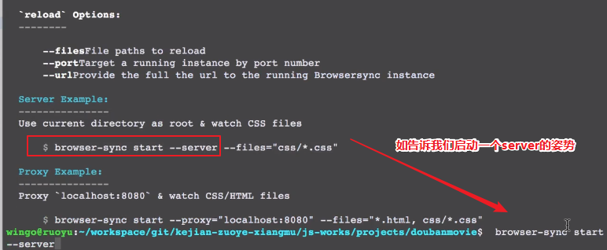
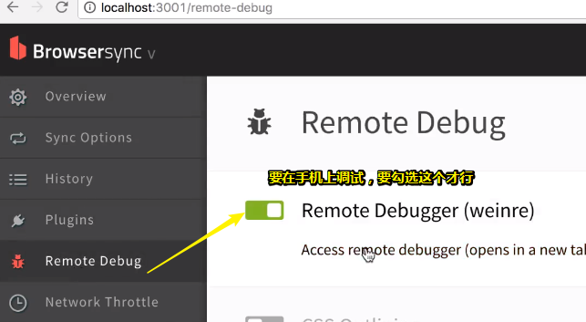
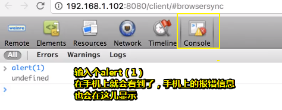

# 豆瓣电影（上）

## ★概述

### ◇效果

**➹：**[豆瓣电影](http://book.jirengu.com/jirengu-inc/js-works/projects/doubanmovie/index.html)

### ◇开搞之前的准备工作

#### 分析

分析：

1. 有个footer，其中有3个tab
2. 点对应的tab的话，会进行一个切换
3. 这是个单页应用，看起来是三个页面，实际上是一个页面

#### 预览页面姿势与移动端调试

预览页面&调试：

> 有时候在PC端的模拟移动端预览可以，但手机却GG了，如对一些API支持的不好等等……

1. 在做之前需要学会移动端的调试，可以在PC端中的浏览器里的开发工具中测试，测试好就用手机测试。不过PC可以通过控制台调试，但手机却是不可以的，那么如何在手机上调试，这又是一个问题了！

   

2. 手机调试：通过使用http-server，获取当前页面的局域网ip地址，然后就可以在手机浏览器上输入这个ip就可以浏览这个页面啦！

   

   不过手机上可无法调试，打log啊！

3. 如果url地址过长的话，难以输入的话，可以这样：

   1. 在PC端登录你的微信，把url发到文件传输助手
   2. 使用草料二维码即可： [草料文本二维码生成器](https://cli.im/text)，通过这个二维码，让手机扫一扫即可，如微信内置的扫一扫
   3. 使用js.jirengu.com测试即可，边写移动端的效果就会自动刷新，这样就可以立即看到效果了

关于手机端调试，即打开控制台：

用npm全局安装一个工具：

那么这个工具如何用呢？

1. 切换到你的项目下，然后 输入 `browser-sync`

2. 由于这是个普通的工具，显然其中的命令你是记不住的，一般我们会通过它的 `--help`或者直接输入这个 `browser-sync`查看这个工具命令提示：

   

3. 启动之后的效果：

   

   下面，那个UI是管理页面：

   

   接着，你要勾选remote（远程） debug：

   

   由于是第一次勾选了，为了安全起见可以重新启动server，接着回到 remote debug，点击勾选按钮下的那个链接：

   

   点击这个url，然后点开Elements这个选项：

   

   如果有报错了，我们就可以在Console看到了

   你在Console输入alert就会在手机浏览器上看到：

   

   以上就是移动端的调试姿势了！

了解了移动端调试姿势就可以开搞了

为了方便，可以看到实时的预览效果，就直接在jsbin中写代码好了

### ◇分析页面功能

1. 这是个单页的应用，而多页即是每次tab切换又是一个全新的页面，只是这三个页面的footer都是一样而已
2. 我们可以借助框架来实现单页，但在这里我们还是通过原生JavaScript来实现！
3. 第一页，我们通过豆瓣电影免费提供的API接口来20、20的来渲染数据，而不是250条数据一次性发过来，如果是这样的话，那么页面就会卡死了！
4. 第二页跟第一页差不多
5. 第三页是搜索查询，然后同样是渲染数据

