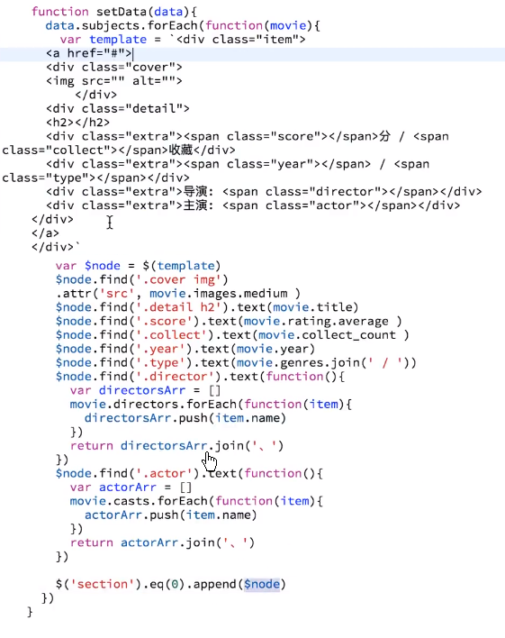
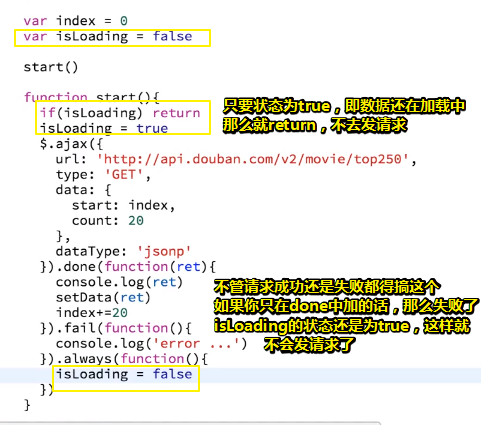

# 豆瓣电影（中）

## ★概述

之前做了一个关于豆瓣电影移动端的页面，那么这节课我们就来继续优化这个页面，去完成它的功能，在完成的过程中你会发现我们的代码会越写越少，然后之后再对我们的这个代码进行一个优化！让整个页面的代码的功能逻辑性会更强、组织会更合理一些！

## ★回顾上节课完成的效果

1. 页面的底部是个footer，其中有三个tab，而这这是一个单页应用，通过tab可以切换到相应的内容

2. 接下来到了首页，即第一个tab的内容，一开始默认就是进来这个top250的tab的，就会自动的获取数据，基于性能考虑，所以一次性不能获取所有的数据，即250条数据，所以这其中涉及到分页的概念。于是我们定义一个全局变量`index=0`，所以一开始获取的是从0开始的20条数据！获取到数据之后，我们就通过setData对所拿到的数据进行一个渲染，当然，渲染之后，index的值就变成了20，即类似于 `data[0]~data[19]`、`data[20]~data[39]`……

   

3. `setData(data)`这个家伙是如何搞事情的？分析所拿到的数据，其中有个subjects字段，它是个数组，我们通过遍历它拿到20条电影条目。在遍历的过程中，我们创建了一个字符串模板（一个电影条目的壳），然后把需要展示到页面上的数据给填充进去！

4. 如何填充数据呢？——借用jQuery所提供的API，把整坨字符串模板弄成是一个jQuery对象，接着就是找元素(`find()`)，即匹配元素，通过 `attr()`、`text`这两个API来填充内容

   

5. 数据都填充好或者说是设置好之后，就把这个已经填充数据的字符串模板dom对象，给扔到三个面板中的第一个section里边去，这个可以通过 `append()`做到，当然，在此之前你需要通过 `eq()`匹配到第一个section才行！接着浏览器就会自动渲染这些dom了！这样你就可以看到一个还不错的页面效果了！

6. 此时页面的大致效果如下：

   

7. 滚动懒加载，当我们滚动到页面底部的时候，那么需要做什么事情呢？我们需要去监听滚动事件，当这个main发生了滚动的时候（我很好奇为啥不是监听section，你就内容的变化不是在section里边吗？照理来说应该是第一个section里的滚动条才对的哈！），然后我们需要去判断是否到达了底部。那么如何判断是否到达了页面的底部呢？借助某些api，拿到一些数据，如section里边的内容高度（a）、mian里边滚动内容的距离（b）、窗口（main）的高度（c），这三者是有关联的，刚好组成一条公式，即`a=b+c`。

   如果公式成立，即为true的话，那么这就表示滚到底了！为了不滚动到底才加载数据，我们可以提前个几十像素来做个请求缓冲，这样用户一滚动底时，就会让人感觉这过渡动画，没有搞很久就有数据出现了，显然这用户体验好很多哈！

   有了判断条件，只要为true，就再做一次之前的操作就好了！即执行`start()`函数

   不过这其中存在一个问题：那就是我们需要去做一些节流，不然滚动到最后一点点的时候，鼠标稍微上下动一下的话，那么条件就都会满足，然后这个start函数就会连续执行很多遍了 ，而一次start就会发送一次请求，所以我们就得做节流才行！

   假设不做节流的话，那么需要注意的是，我们发送这个请求的时候必须一次只能有一条，换句话说，我这个请求发过去以后，如果这个数据还没有到来，我再发请求，你就不要去执行它了，所以我们现在需要一个状态的判断，比如说一个加锁机制或者说一个函数节流方法机制！

   

   那么在这里边，我们简单点就做个加锁就好了！那么是什么样的加锁呢？之后讲！

以上操作就实现了我们整个页面的基本逻辑了！

那么现在我们需要对整个页面进行一个优化

而第一个操作就是对数据进行一个加锁！

第二个就是对样式的优化，比如说一开始在我们加载数据的过程页面上会出现一个loading，当我们滚动到底部的时候，又要加载数据了，这就又出现一个loading了，当数据到了之后，loading就会隐藏！这就是一个UI的优化了！

> 我开始明白一些优化操作无须一开始就弄上，先把页面的基本逻辑给弄出来之后，才考虑这些细节层面上的东西！

第三个：实现「北美」、「搜索」这两块的功能！

## ★加锁

什么是加锁呢？

假设我们连续执行了很多次star函数，即发了很多请求！

> 突然觉得用es6语法比jQuery好使啊！
>
> 这个加锁操作似乎我之前在vue中使用过！

## ★加个loading

很多地方都需要loading

如我们可以在第一个section里边加，也可以在main的尾巴加，就像这样：

如果在②位置加的话，那么这3个页面都会用这个loading，所以我们就得看看这个loading是否和相应的tab的样式吻合……

为了简单起见，我们用①位置

那么loading是什么呢？——就是一个简单的转圈

那么我们该怎么做了？

1. 可以用一张一直转圈的gif图片，不过遵循能不用图片就不用图片原则，那么我就用字体图标好了，但是字体图标就是一个文字，它是不转圈的！所以我们可以加上css3动画，让它无限地转圈