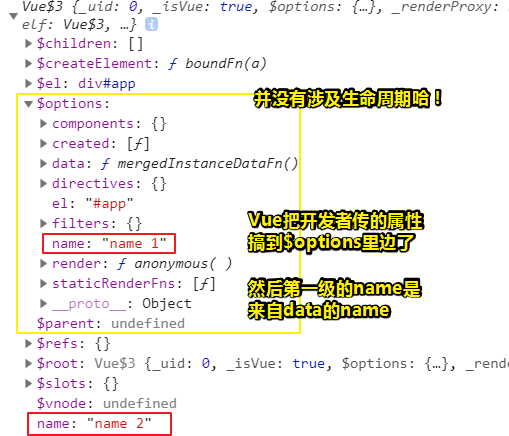
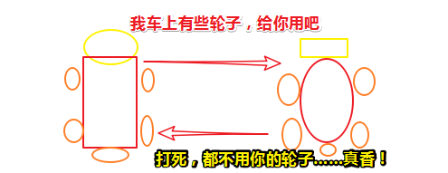
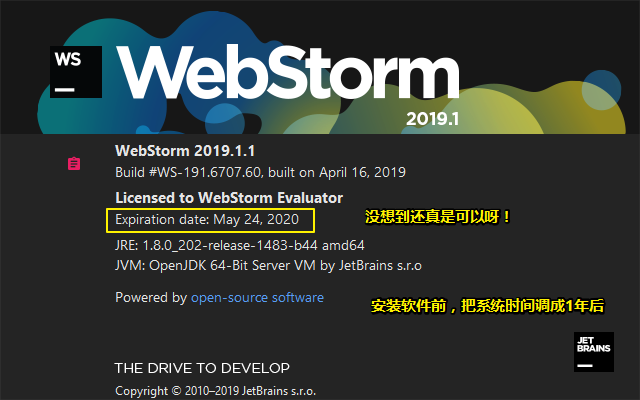

# 课程介绍

## ★课程介绍

> **注意：如果你想直接开始写代码，那就跳过这一课，直接看第四课**
>
> 带头戴式耳机听，选择耳麦，然后音量是24！

### ◇目录

1. 这门课讲什么
2. 学完后有什么好处
3. 这门课适合你吗
4. 学习线路
5. 如何交作业、提问

## ★讲义

### ◇这门课讲什么？

讲初级前端到高级前端的一条必经之路：造轮子。

程序员的几个阶段：

1. **自学基础 - 最多可以去实习**（不是试用）
2. **在别人的指导下工作**（半独立完成工作，这种状态可以买课了！毕竟需要指导，公司里有没有几个前端，尤其是大家都刚用vue，我们可以通过芳芳老师的课，来看看他是如何写vue的！）
3. **独立完成工作**（这个阶段在一线城市的工资水平，大概是14k到20k之间的水平，这个水平可能会维持很长的一段的时间，因为你会发现这是你的瓶颈，总之此刻的你是个非常合格的前端，但是你没有办法更近一步！）
4. **把自己的代码分享给别人使用（轮子）**「造轮子的初衷。你分享给别人用的代码就是轮子 !至于代码的功能是什么，其实没有办法界定！但是你的一个重点是你开始 **分享**了，就好像你以前就在自己的岗位上拧螺丝，而现在你可以生产出一些拧螺丝的套路了！ 如告诉其它拧螺丝的人，帮助他把螺丝拧的更好！虽然说看起来还是在拧螺丝，但实际上对你的水平要求更高了一步，你需要比别人高一个等级，你才可能给别人提供一个帮助，毕竟如果大家都是相同水平的话，你怎么可能给别人提供帮助啊！所以说**这个阶段是突破瓶颈最重要的一个阶段**！」
5. **有一整套自己的方法论和常用代码**（大概阿里P7的要求，即你做任何事情就已经有自己的一套方法和一套代码了！你基本上把所有代码都烂熟于心了！别人给你一个需求，你能在10s钟之内，想出业界最成熟的，或者说相对比较成熟的途径给别人了！这就是一个P7的基本要求了！ps：**难道是CRM大法！**）

> 关于1、2阶段，是初级阶段！
>
> 关于3、4阶段，有的中级一直在3阶段，而有的一直在4阶段
>
> 不管怎样，第5阶段，肯定是比较高级的！

### ◇造轮子有什么好处

1. **提升技能水平**
   你经常用别人写的轮播组件，为何不自己写一个试试？
   你经常用别人写的日期选择器，为何不自己写一个试试？
   **自己写出来之后，你会发现「就那么回事」**（事实是你的能力已经提升了）

2. **让你解决问题的能力更强**
   自己写业务代码的时候，你只需要满足自己业务的逻辑；
   **写轮子的时候，你需要满足大部分人的需求**。
   这很锻炼你提炼需求、分析需求和解决问题的能力。

3. **提升业界影响力**

   大部分程序员出名的途径：

   1. 写文章（MacTalk、阮一峰、陈皓）
   2. **造轮子（TJ、尤小右、玉伯）**
   3. 其他
      你造福社区，社区就会认识你。

### ◇前置知识

学习这门课的你，需要具备以下知识：

1. 常见的 JS 语法和技巧
   import、export、class、Promise、解构赋值、await、try..catch、throw 等语法了解一下
   如果没有了解，请查看 MDN 对应的文档
2. **做过半年左右的需求**
   你应该大概知道前端工程师的工作内容是什么，知道什么是需求，知道需求变更多么令人无语
   你还知道遇到技术问题要去 Google 和 Stackoverflow 查阅
3. 对 DOM 和 AJAX 有一定了解
   能回答「DOM是什么」和「AJAX是什么」即可
4. **看完了 Vue 文档，或者正在看 Vue 文档**
   因为这门课不会带这你看 Vue 文档，需要你自己阅读。
   如果你还没开始读也没关系，我们课后有测试题帮助你阅读 Vue 文档。
5. 已经学会了科学上网
   不多解释

### ◇鸟瞰学习路线

- 这门课会涉及「软件开发过程」的多个阶段，包括

  1. 需求分析（用例图、时序图等）
  2. UI 设计（我使用 Sketch.app 来设计 UI，如果你用的是 macOS，那么可以通过我的设计稿来学习 Sketch 的使用）
  3. 写代码
  4. 测试（单元测试）
  5. 文档撰写（README.md）
  6. 持续集成

- 这门课会从易到难

  1. 轮子会越来越复杂
  2. 一开始不用 webpack，后面会加各种工具
  3. 先实现一个基本版，然后优化，再优化，再再优化

- 二十多个轮子会**尽量涵盖 Vue 的所有特性**
  **虽然 Vue 提供了很多功能，但并不是所有都用得上。**
  一些人只用 component 也能搞定一整个项目，我们的课会尽量用不同的写法。

- 后端接口怎么办

  **按需选择**

  1. 用公共免费 API，比如 GitHub API
  2. 用 LeanCloud
  3. 自己写后端，然后部署到 heroku

### ◇学习约定

#### 代码方面的约定

1. 大部分代码都放在 [FrankFang/gulu](https://github.com/FrankFang/gulu)
2. 设计资源放在 [FrankFang/gulu-design-resources](https://github.com/FrankFang/gulu-design-resources)
3. 代码会十分重视可读性
   1. 不会有废话般的注释
   2. 所有的变量命名都会仔细斟酌
   3. 禁用缩写
      1. 业界统一的缩写可以用，如 HTML、CSS、JS
      2. **其他缩写一律不用，如 btn、cnt、arr、str，应该写为 button、container、array、string 等**
   4. **不写耍小聪明的代码**
   5. **使用 ES6+ 语法**

#### 课业方面的约定

1. 请自觉完成作业
   1. 你的作业应该做成什么样子，每堂课都会说明
   2. 所以你做完之后自己对照就知道自己对错了
   3. 当我们学了单元测试之后，你就可以用代码检查自己的代码
2. 有疑问请发邮件问我
   1. 将你遇到的问题「详细」的说清楚
   2. 代码用 GItHub 上传
   3. 页面用 GitHub Pages 预览
3. **多在微信群里讨论**

#### 工具方面的约定

我们会用到的工具有

1. GitHub
2. **WebStorm**
3. Sketch.app（可选）
4. 普通的编辑器（VSCode、Sublime Text 都行，记事本不行）
5. Node.js + NPM
6. `http-server . -c-1`
7. Google

#### 移动优先（Mobile First）

1. 完全不考虑 IE 浏览器
2. 优先考虑触屏操作、少用 hover
3. 优先使用相对单位，如百分比、em 和 vh

#### 课外资料

1. 本课 UI 轮子的「外观」将参考这些轮子
   - [Framework7](https://framework7.io/docs/button.html)「很全，如按钮有涟漪效果」
   - [Ant Design](https://ant.design/docs/react/introduce-cn)「用react写的，可以参考布局」
   - [Element UI](http://element.eleme.io/#/zh-CN/component/installation) 「组件比较少」
   - [iView](https://www.iviewui.com/docs/guide/install) 「符合中国人的使用姿势，可以参考日期组件」
2. 如果你对设计感兴趣，可以看
   - 《写给大家看的设计书》「网页写得很丑可以看这个，这样你的网页就不丑了」
   - [Sketch中文网](http://www.sketchcn.com/)「有很多教程」
3. 如果你 ES 6 不熟练，可以看
   - [ES 6 新特性列表及教程](https://frankfang.github.io/es-6-tutorials/)
   - [我的《ES6 深入浅出》课程](https://xiedaimala.com/courses/12a78a03-35f9-42ea-9b37-540540460f6e)（未完结）

---

## ★课前测试题答疑

> 这门课针对工作一年的前端，它可以系统地教你把Vue给学会了！
>
> 如果你对Vue感兴趣，或者用Vue用的不是很好，那么可以看看这门课！
>
> 关于课程中的轮子，芳芳在过去的5年中，这每一个轮子都大概造了3、4遍，所以这是一门经验总结性的课程，并不是说「如何做一个简单的东西」，而是要把遇到的坑都给捋清楚，让你知道这是「为什么」？

### ◇题目讲解

> 为啥要你用大脑推测？因为如果你把代码直接给运行一遍，然后得到结果的话，这显然是没啥意思的！毕竟这样一来你就不明白这结果为啥是这个而不是那个了！即便你根据结果来推测程序的行为也是如此的让人感觉没有意义！

我简单记录一下：

1. 咩有传东西

2. 箭头函数的作用域的上一级显然是全局作用域，总之箭头函数并没有 `this`，`this` 会作为变量一直向上级词法作用域查找，直至找到位置

3. 理解class和extends即可

4. reject态（拒绝态）的缘故！具体看Promise规范即可！

5. 有3个name，一个是window的name，一个是作为选项的name，最后一个是作为data的name，根据vue的文档，this是vue实例，然后它的name值是来自data的name，而我们之前传进来的那个name仅仅作为选项，并没有什么乱用，而且也用不到它！

   

   **➹：**[JS Bin - JS Bin](https://jsbin.com/tobagap/1/edit?html,js,output)

   重新理解生命周期：

   这些**生命周期钩子**的函数，这给了用户在**不同阶段**添加**自己的代码**的机会。

   [`created`](https://cn.vuejs.org/v2/api/#created) 钩子可以用来在一个实例被创建之后执行代码（也就是一些属性都初始化配置好了，包括用户传    给Vue这个钩子函数的参数——选项对象！）

   生命周期钩子的 `this` 上下文指向调用它的 Vue 实例。

6. 都是vue官方文档的原话！总之，考察的是你到底有没有看文档

7. 考察的是mixins，看了有关的例子，然后自己试验一下，你就会知道这个mixins是优先使用组件本身的这个属性，如hello方法，如果没有再去看mixins的属性！所以就是优先使用组件本身的属性

8. 很简单！跳过

9. 知道`Object.defineProperty`这个API语法即可！

小结：

一定要把`this`搞清楚，如果搞不清楚那就不要学vue了！

## ★造轮子的益处

> 程序员经常提到这样一个词，但是对于没有做过这件事情的人来说，会觉得很模糊！那就是「造轮子」这3个字啦！

**①为什么说「造轮子」是初级到高级前端的必经之路？**

现状：给我个需求，基本可以完成，完成不了的话，大概加会儿班也可以完成！但是，总觉得在重复自己，即做页面、做页面……没有发现今天的我和一个月前的我有何区别！

那么如何破除这种初级阶段所遭遇的如此尴尬的境地呢？——那就是造轮子啦！

那么造轮子具体是啥意思呢？——其实，你无须要管它是啥意思啦！简单来说，就是你要写一些东西给别的车用，即不只是在你的这趟车上可以用！还可以在别的车上用！那么这就是轮子啦！

**②造轮子属于程序员的哪个阶段？**

2345阶段都要造，总之，这几个阶段都要造！

**③话说，造轮子具体有哪些好处呢？能否使我们从2阶段到3阶段，3到4，4到5吗？**

可以，看你的轮子大和小的区别！

关于造轮子的好处：

### ◇提升你的技能水平

一个程序员和另一个程序员，如果有什么区别的话，那么这个区别在哪里可以得到体现呢？难道是**谁写的代码比较高明**吗？比如说A用一行就搞定了，而B则用了三行。你说A这个程序员要比B高明一些吗？这在新人看来有可能是这样的，但实际上有经验的人会觉得这个不太重要，因为只要你写得质量是好的，那么你**写一行或者3行，其实没啥区别**！有些时候，甚至你写一行别人还看不懂，，所以此时还不如写3行的！总之代码行数不是重点啦！那么什么是重点呢？**重点在于你能不能解决问题呀！**

比如说让你做一个对话框，新人会怎么做呢？用别人的，因为不会做呀！再比如让你做个轮播、日期选择器等，还是不会做，但是**我会用别人的**啊！这样一来，你一直用别人的，那么你就会比别人的水平要差了！所以我们可以看出程序员和程序员最大的区别就在于 **谁能解决的问题更多**！当然，你可以通过抄别人的东西来解决问题！但是你自己会知道「**你比输出代码的那个人肯定要弱一些呀！**」

总之，**谁能遇到不同的问题给出不同的解决方案，那么谁就牛逼一些！**

那么我们怎么就能练成什么问题都能解决呢？——那就是**从最小的问题开始解决**！比如我没有办法解决一个很大的问题，比如说设计一个网站，我不会什么前端架构，我也不知道前端如何选择框架等通通不会！既然这个大问题不会的话，那么我们就试着去解决一个小问题，比如说搞个轮播组件行不行啊？搞个日期选择器行不行啊！等等，这就是**「解决问题」能力提升的一个开始**了！

当你把这些小东西都给写出来之后，你会发现这并不难，也就那么一回事而已！其实，这实际上当你**从以前「不知道怎么做」，变成现在这种「就那么回事」的状态**，你的能力已经提升了！

所以说，**造轮子很能提升你的作为前端的一个基础能力——也就是所谓的解决问题的能力！**

> 一个小轮子，即一个小问题，不断地解决小问题，能力不断地提升，而大问题又是由小问题组合而成的，至此，大问题也被解决了！
>
> 虽然解决小问题无法很直观的体现你的技能水平的提高，但这确实是提高了，而这种提高是潜移默化的！但当你把大问题给解决了，那么这种直观体现，将会放大好几倍！

### ◇**让你解决问题的能力更强！**

那么A解决问题和B解决问题有没有什么不一样呢？反正，我就是想知道A和B之间谁解决的问题的能力更强！

我们需要从两个维度来回答，一个是质量！先不说质量的问题（这个问题比较虚！不好举例子，当然，之后会涉及到）！A解决的问题是A的问题，另一个程序员B解决的问题是另一问题，假如这个时候你俩解决的这个问题都差不多，但是如果有一个程序员C就站出来说「我能解决你们两个人的问题」，那么这个C是不是显得更牛逼一些呢？

打个比方来说：

以前我们写页面，就是使用jQuery找到一个元素，然后绑定事件，然后另一个程序员也跟你一样用jQuery选择元素，绑定事件。这个时候，出现了谁啊？vue的作者或者说React、Angular的作者说「你们就不用做这么麻烦的事情了，我帮你们都解决！」

这个时候，他们能提供的这个轮子有什么能显示出他们能力强的地方呢？——就是他**解决了其它程序员的问题**！

也就是说，一开始你想的是解决自己的问题，那么接下来你就想「那么我该怎么解决普遍的问题呢？」

如，你自己写业务代码的时候，只需要解决你业务代码的逻辑，如用户点击这个按钮就提交，提交完之后报错或者是成功！那么我有米有办法做一个组件——别人只用给我一个URL或者是数据，就能直接帮他做出这些东西呢？

那么当你写轮子的时候，你就得考虑不一样东西了，即**你需要满足大部分人的需求**！至此，你的需求就完全不一样 了，**你知道自己的需求，但是大部分人的需求你是不知道的**！

所以这是一个最难的地方！

**可是我不知道大部分人的需求啊！那我该如何写轮子呢？其实这是一个错误的思维啊！**

你应该写出一个轮子，然后给别人用，然后别人用的时候，就说「你这个轮子不好！你这个轮子不好！完全不能满足我的需求！」

可这样一来，我岂不是被人骂了吗？

网上有这么一句名言，「如何知道你所学习的这个知识是对的还是错的呢？那你就把你的结论放到网上，如果有人喷你，那么就说明你错了！如果没人喷你或者没有看，那么就说明你可能是对的或者是错的！」

同理，轮子也是一样的，如果别人喷你满足「**大部分人的需求**」这一点咩有做好，这个时候你就可以继续重新写你的轮子！但你大概写了两遍、3遍之后，你就会知道「**原来别人是那样做需求的！跟我的可能不一样！**」

所以，**这除了可以解决自己的问题以外，还可以解决大部分的问题**！

那么这锻炼了你什么能力呢？

这个能力就更具体一点了——提炼需求、分析需求（**不是说所有需求都要做的，你得知道它为什么会有这样的需求**）和**解决问题的能力（这个是最终的能力，也就是说这个能力是最根本的）**！ 

总之**，我们从只搞定自己的需求，到帮助到更多得需求！**

> 这给我的感觉就是「你的需求也是我的需求，当然，这是你主动提出来的！然后我会提炼需求，并加以分析，看看它的存在缘由，然后问题就来了，你用代码解决这个问题就好了！」
>
> 这样你有很多莫名其妙的问题，你也解决了很多莫名其妙的问题！
>
> 至此你解决问题的能力就得到了显著的提升了，就像是锻炼肌肉一样，不停地刻意训练，最后的结果就是肌肉的显著提升！

### ◇提升业界影响力

一个非常令人不解的东西就是高级程序员需要有影响力！那么什么是影响力呢？程序员为啥会有影响力？程序员难道不是写代码的吗？

那么你想想「你心目中有影响力的程序员有哪些？」

比如廖雪峰、尤小右、芳芳等

那么这些人是怎样影响你的呢？基本上有两个主要途径：

第一个就是写文章，通过写文章去传播你的思想或者是你的实践经验，这是一种帮助其它程序员的方法。只要你帮助了别人，别人就会知道你，等知道的人多了，你就有影响力了！所以**影响力就是你可以传播你的一些观念或者是传播你的一些技术**，这就叫做影响力了！

在中国比较有名的通过写文章获取影响力的有MacTalk（迟建强，以前写了很多关于程序员的文章，目前出了一本书就叫做MacTalk，当然，你可以去订阅他的公众号，还不错）、阮一峰（写基础教程方面，写了很多！然后影响了很多人，至此，就有影响力了。现在阮一峰说一句话，大家都要点评半天！）、陈皓（他写的酷壳，极客时间的专栏，有兴趣的话可以去看一下！不过，他讲的东西实在是太多了！你不一定有精力去看完！）

当然，**古代也有这个，写书就是为了出名，不是为了钱和利，就是为了出名！我就喜欢有人知道我！**

总之，这就是通过写文章来提高了影响力的一种方式了！

还有一种就是不写文章，但是我们依然知道他！比如所Vue的作者，那么他是怎么样所有前端都知道他的呢？造了一个轮子啊！这个轮子叫做Vue。如果你写过Node代码，你就会知道有个人叫TJ，那TJ呢？他做了很多很多个轮子，其中最出名的就是Koa和express，这两个轮子，目前基本统治了Node的那个web基础框架的这么一个领域！还有玉伯，或许你不是那么熟悉他，但是sea.js就是他的造的一个轮子。

你可以看到，**如果你造了一个比较有用的轮子，基本上别人用到这个轮子的人都会投了一个欣赏的目光！**所以这个时候，你就会有影响力了！

所以当阿里提出这个P7必须要有影响力，或者P6必须要有影响力的时候，那么你就知道它其实就是希望你能去造一些东西或者是传播一些观点！而**不是在那死写代码**！

当然还有其它的途径，比如只要你能够给整个程序员社区带来一些东西，那么你就有可能会收集一些影响力了！

这就是造轮子好处的第三个点——**提升你在前端界或者是编程界的影响力**

> 写文章、造轮子、为社区带来一些东西……讲真学历在这个前端领域似乎没有显得说那么重要！毕竟前端领域出名的就那么几个，而且这也不是充分必要条件啊！
>
> 有些领域，学历确实极其真要！但就我目前所选择的职业来说，似乎没那么重要哈！当然，如果学历高点，确实好点，反之，也不要觉得技不如人哈……

对了，你经常逛知乎的时候经常会听到轮子哥，这就是有影响力了，那么轮子哥是因为什么出名的呢？他一开始造了一个C++的一个GUI的库 ，当然，我不是很熟，毕竟我不是C++这个领域的，然后这个库呢？质量特别好，功能很强大！然后渐渐地就有很多人知道他了！同时他是在微软的，然后他在知乎比较有名，好像是因为他可以带着你逛一些东西，具体是什么东西，你自己去关注他点赞的东西，你就知道是什么东西了，反正就是技术之类的东西！

至此，造轮子的好处，就讲完了，接下来就是讲「学习这门课，你需要去查阅的知识点！」

这些知识在讲这个课的过程中会提到（稍微提及，不会细讲），如果不懂的话，就发邮件给芳芳！

---

## ★前置知识

### ◇常见的JS语法和技巧

如import、export等，你可以去看阮一峰的书或者MDN，或者芳芳的ES6深入浅出视频，当然，没有硬性规定你一定要看书或者是视频什么的，你喜欢用哪种姿势就用哪种姿势呗！

总之，对知识点的认识可以这样：MDN文档、书、视频

### ◇做过半年左右的需求

讲真，我是真得不知道需求是什么哈！需求它是有经验的和咩有经验的一个非常大的一个区别，有经验的人特别理解**什么是需求和需求编撰**。关于需求变更，说多都是泪，这可是一个大难题呀！大部分程序员加班有两个原因，一**个是bug**，这个bug可以是来自于你自己写出来的，也可以是你的同事写出来的，也可能是之前同事离职瞎写写出来的！等等都有可能哈！因此，要解决这些bug的话，你需要额外的时间去解决！毕竟你的工作内容是要你加新功能啊！而这个解决bug只能在深夜偷偷摸摸地改了！有个有意思的现象是，**你自己写的bug不会去声张，而别人写得则会去吐槽一番！不管如何还是得你去改**！不然，还是写不出新功能哈！除了bug以外，令你**加班的第二个原因就是「需求变更」**，如本来做得一个好好的东西，突然说要换，那么我过去这个两天写的代码算什么呢？难道拿去喂狗了吗？——嗯，是的！如果需求变更了，那么你为之前需求所写的代码，那就真得是喂狗了！可以说是「**流水的需求，流水的代码**」，所以说**需求变更是最令人无语的东西**呀！

但你经历过这些过程以后，你才知道芳芳讲解轮子的时候为啥要思考那么多事情！反之，如果你不知道的话，是不是觉得芳芳应该是想多了吧，怎么可能会有那么变态的东西呢？

总之，一句话概括**需求变更就是「非常变态」**

关于遇到问题的查询，建议去Google和Stack Overflow，而且这个是日常基础性操作，那么百度呢？可以用，但不推荐用哈！

因此，**如果是新人的话，那就不要学这个造轮子了，因为你不知道芳芳为啥在造轮子的时候要这样思考哈**！

### ◇对DOM和AJAX有一定理解

这个是JavaScript最常用的两个功能！所以你一定要得了解它们才行！那么怎么样才算了解呢？

比如说面试官问你「请讲一下什么是DOM？」

那么你会怎样回答呢？注意，千万不要回答得太简单，比如说DOM就是文档对象模型之类的！

显然，这句话没啥用啊！就TM只做了一个翻译而已！

你得要用自己的理解去说明DOM是什么才行呀！（**我此刻的理解就是把文档解析成一颗DOM树，然后根据浏览器所提供的DOM API，让我们可以通过JavaScript去修改DOM树里边的节点，借此就可以修改页面的内容和样式了！**）

回答完这个问题之后，面试官会问你第二个问题——「请问AJAX是什么？」

如果你不能用3句话完整得概括一下它的功能，然后它用到的技术，以及它的优缺点或者是它的用途之类的话，那么我想你可能需要去补一些基础！这个基础可以参考芳芳的系统班，毕竟这忒基础了！

> AJAX 就是用 JS 向服务端发起一个请求，并获取服务器返回的内容。用的技术就是`XMLHttpRequest`这个API了，而使用AJAX去发请求的优点就是**页面没有刷新**，即所谓的**局部刷新**哈！
>
> 总之：**只要是JS调用异步通讯组件并使用格式化的数据来更新web页面上的内容或操作过程，那么我们用的方法就可算是AJAX。**
>
> **➹：**[「每日一题」AJAX 是什么？ - 知乎](https://zhuanlan.zhihu.com/p/22564745)
>
> **➹：**[你怎么用最通俗的话解释AJAX是什么东西？ - 知乎](https://www.zhihu.com/question/20874229)

总之，芳芳默认我们都会这些基础了，课上都会说「用DOM接口」、「发送个AJAX」等字眼

### ◇看完了 Vue 文档，或者正在看 Vue 文档

如果你不打算看Vue文档，而是想通过芳芳的课来学会Vue的话，这也是可以的，不过你会学得非常不爽啊！即，你会发现芳芳所讲的内容，你什么都咩有学过，然后你就得回头去看文档，看完之后，然后再回来看看芳芳的视频，至此你就觉得非常不爽了！

当然，芳芳会出一些Vue测试题，大概20个题目，全对，即前三个前置知识ok了，然后再出7个，又全队的话，那么你对Vue文档已经了如指掌了！

所以，**这门课还会附带一门Vue的自测题！通过这些自测题来验证你已经看了这些文档**

这个世界上有很多事情可以花钱解决，如你可以花钱让别人送外卖到你的门口，也可以花钱让快递送到你门口，但是也有很多事情是花钱了也解决不了 的，比如说吃饭你得自己吃吧！总不能别人替你吃吧！或许你会说「别人喂不行么？」，可即便这样，你还是得自己嚼啊！总不能还要让别人嚼吧！如果这么恶心你可以接受的话，那也是可以的，但是你总得自己吞吧！总之吃饭、睡觉等是别人帮你不了的！

当然还有一个东西，就是**学习了！不管你再怎么花钱，你还得自己做呀！**

所以说阅读这个文档，还是得你自己去做的，芳芳只能帮你测试一下说你阅读得怎么样，而不是带你去读！

总之，**建议你还还是先看了Vue文档，然后再来看芳芳的课！**

### ◇已经学会了科学上网

如果你不会这个的话，那么很尴尬的一点就是，芳芳看的很多资料，你都看不了，因为一般芳芳都会用google和Stack Overflow去搜东西呀！

如何搞这个呢？（法律规定不能再视频里边讲那些科学上网的事儿，不然是可以被举报的！）

1. shadowsocks
2. 搭建自己的一台代理服务器，vpn已经被国家禁了！
3. vps，搭建一台远程服务器，通过这台服务器，再去搭上面两个东西！推荐的vps是<https://www.vultr.com/>，最低每个月花个2.5刀，大概17块钱左右吧！

小结：

1. 如果这以上5点，你没有完全满足的话，那么你学起来得话会非常非常困难，非常非常困难！
2. 我用的是shadowsocks，一年97块人民币！一个月也就不到10块钱！而且双十一会有折扣，大概70多块一年！
3.  你之前购买的阿里云ESC也是VPS
4. 如果多人一起买的话，可以不用shadowsocks（简单快捷），而是自己搭建个vps（需要配置一些东西），因为这样比较实惠哈！毕竟5刀一个月就有1000G的流量，而且速度还不错！

**➹：**[一台 VPS 对于一个开发者/普通人意味着什么？ - 知乎](https://www.zhihu.com/question/56620173)

**➹：**[用VPS搭建SSR服务器教程 _ 白石头博客](https://www.baishitou.cn/1524.html)

---

## ★直播答疑

**①为啥有人说程序员最喜欢犯的错误是重复造轮子？**

**你在做一件事情的时候，你需要考虑的一个东西，那就是「目的」啦**：

而我们之所以学芳芳的课的目的是因为学习呀！学习之后，就能提升技能了！这就是我们的**个人目的**了！

我们给公司写代码是为了做出页面，而我们做出页面的目的，以淘宝页面为例，是为了让别人可以在上边进行一些交易啊！那么这就是**商业目的**了！

当你知道，我们可能有个人目的，也有可能是为公司的商业目的在做事的时候，你就知道为啥有人说造轮子好，又有人说造轮子不好了！

如果你是学习的话，那么造轮子是非常好的，而且是造别人造个轮子，这样你就可以跟那些造轮子的人的水平一样了！

但是如果你是站在公司的角度考虑得话，比如说，苹果公司现在要做一部手机，它有两种选择：

1. **芯片、屏幕等各零部件都自己造，造完之后就自己组装，然后一部iPhone手机就出炉啦！**

这种姿势是可以的，但这很有**可能会失败**呀！因为**你花那么多时间去造别人会造的东西干嘛呀！直接买不就好了吗？**

所以一开始苹果公司的做法，就是让富士康去造，然后叫三星公司给它屏幕等这种做法去造一台苹果手机！（第二种做法）

同样地，你在给公司做页面的时候，你有必要把那些轮子全部都造一遍，然后再组装你的页面吗？

显然，**你应该不要造轮子，直接用别人写好的轮子**

所以这又得扯到外包这个话题了

为啥我们都不推荐去外包公司呢？

因为外包公司太重视商业目的 了，它不管你个人目的，你在短时间之内快速做出一个页面之后，然后就把这个页面发送到甲方手上！然后公司拿到钱之后，就分一点给你！

接着做完之后，又做一下个了！

可见，我们无需要去学提升自己能力的东西，你只要不停地去用最快的方法去用别人轮子拼出一个页面就完了！

所以外包的问题就是，你可能会有一些的工资，但是你个人提升是很难提升的，因为**它不注重你提升技能这些目的呀**！

但是如果你在BAT的话，它就会有一个完整的个人成长体系

所以这就是外包它的缺点了！即完全不考虑你的个人目的！

所以你在外包公司呆了三年或者三年以上，那么你很有可能是没有办法跳槽的，因为你这三年重复的在使用用别人轮子造东西呀！

所以关于「有人说重复造轮子不好」这个问题答案是：

> 当你的公司需要你快速地做出东西的时候，它不会给你时间造轮子的，如果这个时候你去造轮子的话，那么结果就是「项目无法如期完成」了

但是如果你要**个人学习的话，你不造轮子，老是用别人轮子的话，那么这有什么进步可言呢？**

所以**尽量别去外包公司，即以商业目的，做出页面，然后卖个甲方为目的的这种公司**……

> 站在个人目的——提升自己能力的角度来看，这种说法可以GG了
>
> 但是站在公司的商业目的来看的话，这种说话是可取的！
>
> 但，利弊权衡一番之后，这种说法可以说是GG的！因为只有能力提高了，你的工资才会长啊！总不能三年经验，都是重复做一年经验时就会做得事儿吧！这舒适区呆得也未免太久了吧！

---

**②vue文档粗略的刷一遍可以吗？还是要背下来？**

为啥说要让大家去看一遍文档呢？

比如说我说一个vue的[directive](https://cn.vuejs.org/v2/guide/custom-directive.html)（自定义指令），然后你就一脸懵逼了，心想「芳芳，你说得是啥啊？我怎么一点都不懂」，为了防止这种情况出现，即芳芳说一个东西，你完全不知道是什么

总之，你只要不出现这种情况的话，你就可以学这个东西了！

但是比如说芳芳讲了10分钟，其中有5分钟你是一脸懵逼的，那么这一来就没啥好学的了呀！毕竟无法沟通呀！

总之，**只要你粗略刷一遍，知道vue有哪些关键性的东西就可以了，而且这也不需要背下来哈**！

话说课程讲得有多深呢？这个之后芳芳会讲

---

**③和ELement UI组件是一样的实现方法吗？**

由于芳芳写代码的过程是直播的，所以你会发现芳芳所写的代码都是自己想出来的！

目前芳芳是没有去看element UI的代码的，如果芳芳看了的话，那么这就是抄袭了！否则我把其vue的代码看一遍之后然后讲一遍，再去收钱的话，那么这就很不地道了！

所以芳芳大概看了不止一种实现，才能讲出来的！

也就是说，如果借鉴目标比较分散的话，那么就没有人说我是抄袭谁的了！

虽然这还是有种抄袭的味道，但程序员能说抄袭吗？只能说借鉴对吧！

总之，**芳芳大概会看5、6个轮子的写法**，然后**总结出自己觉得比较好的写法**！然后就教给大家了！

---

**④这个课程最后mvvm那些是会讲vue的源码？感觉好多公司经常问vue的源码，要怎么去学**

这个同第一个问题一样，得分析一下你的目的才行！

话说，你学习vue的源码的目的是什么呢？

你有想过，你为啥要看vue的源码呢？

或许，你会说「我就是想理解vue的原理呀！」

但是，你有没有发现，其实vue的作者已经把原理告诉你了！你现在再去了解的话，会出现一个问题，那就是你可能会花10个小时，去读vue的几千行代码！

最后你会发现你只不过是印证了vue的作者告诉你的原理罢了！

所以说，这性价比有点低呀！

芳芳学习源码的话，一般不会主动去看源码，毕竟看源码是性价比低的一种方式呀！

或许，你又会问「那质量高不高呢？」

这个在不同人的眼中是不一样的，而芳芳基本没有完整地去看vue的源码！

或许，你又会问「芳芳，你是如何学的呢？」

**我造出一个跟vue的功能差不多的轮子，那么我基本上就知道了，vue的大概原理是这样的！**

> 之前翻译了一篇「只用20行代码实现JavaScript模板引擎」的文章，以及学习了谷里的造一个MVVM框架的过程之后，我就对vue有了一种很感性地认识了！

那么我该什么时候去看vue的源码呢？——**就是你大概原理基本上就理解了，但是你会发现vue总是会比我好一点比如说它的速度总是比我的快一点，然后它的那个执行方式，好像要比我优雅一点，当你有了这种追根究底的态度之后，再去看源码就比较好了！**

总之，**你一开始学习的时候没有必要看源码哈！你就直接通过基本的JavaScript原理去推、去猜就好了！然后发现结果差不多，实现的效果也差不多，等你发现你的轮子代码跟vue的源码有差距的时候，你再去看源码就好 了**。

至此，这个时候，你基本上就知道了vue的源码是怎么写的了！然后你就能精确地知道我应该看哪一部分了，而不是就这样直接去看源码，毕竟这样做的话，还是那句话「性价比有点低呀！」，毕竟大家时间都有限呀，你能用1个小时的功夫去看，为啥还要用10个小时的功夫呢？

可是，有些公司总是问vue的源码啊！那么这个该怎样去学呢？

其实，**大部分公司问vue的源码，只是想让你回答几个重要的点罢了！然后，你把这几个重要的点给答就好了！**

可是问题来了，我怎么知道这些重要的点呢？

很简单，**看那些看了源码的人所给出的分析就好了**，具体姿势就是，**看博客，然后看文档**就可以了！

这样，这种性价比才是比较高的。**如果你只是为了应付面试的话，多看博客和文档那就可以了**。**即便你是在造轮子，也没有必要看源码，你只需要做一个功能差不多的，接口差不多的就行了。**等你**发现你的轮子跟vue的轮子有很大的性能差距或者说是实现上的差距，你再去想去看vue的源码是怎样的？即可**！

那么问题答案就是：

1. **应付面试。看博客，看文档**
2. **要学习。自己去实现差不多的**，无须去看它的代码是怎么写的！最后，你发现上面都做了，你还是**不知道为啥我的轮子比vue差**？那么这时你就可以去看源码了！

总之，不要一开始去看vue的源码啊！当然，如果你是大一的，而且还有JavaScript基础且还不错的话，那么你就去看吧！

可是，通过把src目录编译出来的未压缩版本，有289KB，10947行代码！

假如你每天看一百行的话，需要100天，然而一天看100行能做到吗？显然这很难做到，所以说这个东西，好是好，但是就是太浪费时间了！

总之，就是**不推荐你去看vue源码**！

**➹：**[如何看懂typescript核心源码，并可以参照typescript写一个类似的项目？ - 知乎](https://www.zhihu.com/question/318505680)

轮子哥表示：

> 我建议你照着spec自己实现一次，然后再去看源代码，效率提升至少5倍。TS又不复杂，类型推导的计算都是局部的，瞎JB写都能写出来

与芳芳所讲差不多，都是得自己想一遍搞一遍，然后再对照！但是这说得倒轻巧，可真正搞起来怕是要自闭哦！

---

## ★学习路线（easy-write）

鸟瞰学习路线，所谓鸟瞰即从空中往下看，看看我们到底会学些什么！

参照开头的笔记！

1. 需求分析和UI设计挺难的，后边的单元测试（看看代码质量）、文档撰写（叫人家来用）、持续集成都是套路
2. 我们课程的目的是为了学会VUE所有的特性，而不是只用一个components就搞定所有事情了！
3. 直播写代码过程可以让你看到一个组件是如何诞生的，如不断推倒重来，越来越完善！而不是一上来就给你一条笔直大路，毕竟，这样做的话，你是学不了什么东西，凡事都有个过程啊！
4. 先从简单轮子开始，然后再到复杂的，如简单的按钮，再到复杂的表格（10000条数据更新表格不卡）
5. API的来源

**➹：**[持续集成是什么？ - 阮一峰的网络日志](http://www.ruanyifeng.com/blog/2015/09/continuous-integration.html)

## ★课程准备

### ◇约定

主要有三方面的约定，，而**所谓的约定就是我们所达成的一致，即当我做这件事情的时候，你是知道我是在干什么的！**

#### 代码方面的约定

1. 有两个资源，代码（仅限简单的轮子）、设计稿在yuque

2. 注重可读性，不说奇淫技巧，不写注释也能读懂！如：

3. 所有的变量名都会仔细斟酌，不会因为4而写出像var string这样的变量，毕竟这跟没写差不多呀！

   

4. 不要写缩写呀！除非业界规定的缩写，不然大脑得经过一层转换之后才知道btn是button之意呀！

再次强调一遍约定：所谓约定就是跟大家说好，然后大家不要违反这个规则，当然，你违反了我也不会惩罚你！总之芳芳约定你的代码不要写缩写！

5. 不要写刷小聪明的代码，如你用一行代码就可能做到别人要用3、4行代码要做到事儿，这种代码虽然会看起来很爽 ，但可读性不高呀

6. 全程使用ES6+语法，如果没有学过这些语法就补一下！

#### 课业方面的约定

跟课程相关的作业！

不需给芳芳看作业：

如你做的按钮跟芳芳的一样，功能ok，单元测试过了，集成测试通过了，那么这就行了。毕竟如果芳芳要看的话，也只是会看你的测试用例有咩有通过

如果有问题（这一段代码里边第3句代码是啥意思等）就发邮件（把截图贴后，把代码地址写上），48小时之内会回复，如果没有回复就在微信里边通知一下老师即可！这样沟通起来效率才会高！

尽量不要发QQ和微信！不要说「在吗？」等字眼，即时通信软件，在的时候自然就在啊！基本上拿到手机就看到了，而且这很不礼貌啊！你还不如直接敞开门说你的问题是什么就好了！

细小问题的话，比如语法不懂，可以在微信群里交流，毕竟不是所有人的基础都是很好的，而且这也是建微信群的目的之一！

#### 工具方面的约定

我们用到的工具比较少！

一个webstorm基本上就ok了！

关于webstorm你可以适用一个月，然后你把安装webstorm时的时间调到一年之后，这样你就可以试用13个月了！

关于设计工具，是可选的：

> 是有标注

关于nodejs的安装，请不要换盘，C盘就C盘，毕竟换盘很有可能会有问题啊！

### ◇兼容性

1. 兼容IE11，IE10以下，不用看了，写了兼容性代码也不会加工资！毕竟IE8，在2016年，天猫就不去兼容它了！

2. 手机优先，因为2016年，移动端浏览网页的流量就超过PC了！

3. 不使用像素单位！因为使用之后，假如我们的按钮默认给出的标注释14px：

   

   当我们用某个浏览器打开这个网页的时候，假如浏览器默认把字体大小的最小值设置为16px或12px的话，那么这个14px就很尴尬了，我们的14p，默认就是针对16px的默认值，假如是12px的话，那么显然是10px比较合理对吧！这样一来，按钮里边的文字，才不会和那些留白有过分的不和谐对吧！

   因此我们把那些内外边距什么的弄成是em的话，那么文字缩放，那么整个按钮的边距也就会等比的缩放

   我们有两种姿势可以做到这一点：

   ①可配置，使用CSS变量（less或sass），其它东西就根据这个变量算就好了！

   ②用em作为font-size的单位！

   总之尽量做到不要写死任何一个东西！话又说回来，为啥要考虑这个问题呢？因为以前的PC端，大家都是12px、14px的，你写死是没有问题的，但是移动端很多东西都是等比放大缩小的，你太大的话，屏幕就显示不下 了。所以尽量用百分比、em、vh这三个单位吧！

### ◇课外资料

1. 参考外观，不参考代码！第一个

## ★作业

总共有20多道自测题，每周搞几道就好了！

## ★课后题

### ①第 一 题

查看： [yi](./00-课后习题.md#yi)

### ②第 二 题

请安装以下软件

1. WebStorm
2. Node.js（自带 npm）
3. 翻墙软件（SS、VPN 皆可）
4. 一款普通的编辑器（VSCode、Sublime Text 皆可）
5. 注册一个 GitHub 账号

### ③关于轮子的面试题

很多公司的面试官为了考察你的知识面，会问这么一个问题：

> 你知道哪些 JS 的库或者框架，他们的作用分别是什么？请至少说出 5 个

请试着回答这一个面试题。如果回答不上来请自行百度几个常见的 JS 库并查看其文档即可。

## ★总结

- 关于那些自测题，请不要看了答案再做，不然就啥意义了！毕竟这些自测题存在的意义是看看**你有没有很顺利达到听懂这门课的水平**，如果没有达到，也米有关系的哈！边听边补也是ok的！
- 关于「你学完之后有什么好处的？」的回答：你花了钱，代码也写了，那么与没花钱的，没写代码的相比有啥好处？
- 如果你没有对一个知识用得很熟，那么就不要讲了！像芳芳这门课，芳芳都是讲了两年的JavaScript基础知识，以及用了好几年的Vue，且很熟练，做了好几个项目（如写代码啦官网等），积累了很多经验，才可以拎出来讲的！所以识别一个课的质量好不好，就得看这个人对此付出了多少心血！而不是你叫一个学了一年的vue的来教你如何用Vue来造一个UI轮子！
- 芳芳之后会有react native的课，至于weex是咩有的！
- 这节课主要讲了，我们要讲什么，讲到什么程度，学完之后有什么好处，还有一些约定等等。下节课讲UI设计，挑个复杂的出来讲就好了，然后在设计的时候需要去考虑一些原则，如一致性等……还有如果你想预热一下，即先搞个轮子看看的话，可以看设计稿直接做（有标注，不需要自己去量），当然，其实如果你能把CSS还原出来就已经很不错了，毕竟，如按钮，需要考虑icon怎么做以及其间距有哪些规则等

## ★Q&A

### ①告诉你解决一个问题的心路历程？

2019-04-21，中午12点47分，我在看「鬼灭之刃」的第三集，看到第10min，突然来了这么一句话「老夫已经没有什么好教你的了，接下来就靠你自己了，看你是否能将老夫教的事融会贯通、加以升华」

这一句话，让我重新认识了「教」的定义！没有人可以教你一辈子，你终究要做的事儿是「把所学的东西融化贯通，即刻到骨子里去，变成自己的东西，并借此加以升华，与时俱进，更好地让所学知识兼容自己或者兼容所有人！」

学习芳芳的造轮子课程，同样也是如此……

回想起芳芳的那句话「你必须把要教的知识理解个90%之后，才能让他人听懂个60%、70%左右！」

剩下的理解，就得靠你自己了！

回过头来，如何融会贯通呢？动漫中是给个任务你，如「把这块大岩石，用刀给劈了，你自己看着办就好了」。

显然，你一开始是想不出什么好办法的，只能不停地去试，不停地回顾你庆幸自己有记录下来的日记（或者说是每天学习的笔记）

然而半年过去了，这块岩石还是没有被劈开！难道就没有办法了吗？

至此，这让我开始变得焦虑了！

但，我并没有因此而变得意志消沉，而是认为「这还不够呀！我锻炼得还不够呀！我得再多锻炼一些！再多一些……」

每天数次的挥刀，但这岩石始终无动于衷：

可是一想起「妹妹会因自己没有能力而死掉！」

> 我之所以努力的信念啊！「没有能力」这4个字，触之逆鳞，必然会死磕「能力」!

但，我真得快要心灰意冷了，快要认输了！

但，我还是在不断地呐喊「要加油！我要加油！」

突然，似乎救星来了：

> 这位仁兄能用木刀把这块岩石给劈了！起初主角还认为用刀与他决斗会让他受伤，于是表示「不打」，但显然「主角，你想太多了，不要以为现在自己已经很强了好吧！既然人家说跟你决斗，肯定是吊打你的啊！」

不然，这很难看！

然后他说了一句话：

如果你还是一个男人的话，就不要「迟钝」、「软弱」、「不成熟」，此时主角就是这样的人！

接着这位仁兄和主角展开了激烈的对决（其实是吊打主角），并说了以下这番话：

> 自以为是，嗯，此刻的我就是这样的！认为学到了很多东西，其实只是记住了知识罢了！

再怼一句：

> 你的努力，被否定了！是不是很想反驳呀！

接下来，那位仁兄打算这样干：

这位仁兄认为：

「主角你是偷懒了！」

但其实不然啊！

主角他有练习，每天都练习，拼命地练，可是就是完全行不通啊！

但仁兄表示：

既然你说没法进步了，那你就使劲让我见识你的能力吧！看看你与我之间的差距！

> 差距很大，显然主角是没有找对方法！或许，这就是努力，并不一定有所想要结果的原因！

主角被吊打了……

但主角起来后，并没有觉得被人吊打是件很难以启齿的事儿：

而是满满地赞扬！然后表示：

> 或许，这就是看到牛逼的人之后，加大了自己的上限了吧！而不是原先那个挂着「我无法进步了」这样的话在嘴边的自己！

接下来，这位女……叫真孤，把主角的缺点都告诉主角自己了，然后还把他纠正像是多余的动作或者是坏习惯等等：

> 这就是别人眼中的自己吧！这些是自己无法看到的！所以你必须走出去，而不是闭门造车！因为这就像自己说得那样「继续下去的话，始终无法进步！」

然而就说到了，如何劈开这块岩石的方法！

当然这个方法，之前那个 仁兄也说到了，那就是**「全面集中的呼吸**」

而其中这里边的原理就是：

1. 能让血液的流动和心脏的跳动加速
2. 这样一来体温就会上升，然后明明是人却能变得像鬼一样强
3. 总之，就是会让肺变大，让更多更多的空气进入血液，血液在受到惊吓时，骨头与肌肉就会紧急发热让人变强

主角内心表示「一脸懵逼，完全听不懂」：

虽然如此，但还是：

做法：

开搞：

主角拼命练习挥刀，可即便如此，还是打不赢那位仁兄（靖兔）

就这样半年过去了……

主角再次挑战靖兔，此时靖兔显然是拿真刀了，因为他认可了主角的表情终于像个男人了！

主角的表情：

面对面的决斗的规则：

十分单纯，更强更快的一方就能赢！

当然，这次赢了，对手也漏出了欣慰的一笑：

那是看起来很安心的笑容呀！

这段时间一直指导主角的真孤也表示：

也要打赢那家伙！（这个家伙是谁呢？）

然后，帮助主角儿的靖兔和真孤就这样消失于雾中了，而当主角回过神来：

从中可以见到：

努力的前期是按自己的方式来不断地试错，如果没有结果，那就请教，找到真正地解决姿势，然后努力的后期，就是学会这种姿势，最后就把岩石给劈开了！

贯穿这整个过程的就是「**坚持**」二字！

### ②什么叫实习？

实习，不是试用！实习就是你还在大三，或者是研二，然后你找到公司去实习，然后有个人专门教你，然后你犯了错别人也不会骂你！毕竟，你是来实习的！总之实习，就是实践学习。

这个阶段也叫程序员的自学基础阶段！

### ③关于这个tree插件？

**➹：**[API 文档 [zTree -- jQuery 树插件]](http://www.treejs.cn/v3/api.php)

它的功能看上去很多

如果一个东西它把功能设计得那么多的话，那么这很有可能是它没有设计好，即他想让这个tree能做任何事情，但实际上是没有那么复杂的，我们可以通过轮子的组合来做！

而这个tree插件，之所以做成这样的是因为它没有办法让你去扩展啊！即所有的功能它必须提供给你，否则你就没有办法去用它了！

而像这种理念对于芳芳来说，可能不太一致！

总之，芳芳会根据大家的需求变更，去调整代码哈！

### ④rem转换？

可以使用px2rem loader转换哈！

**➹：**[px转rem - 程序员在线工具](http://www.ofmonkey.com/front/rem)

**➹：**[css之px自动转rem—“懒人”必备 - 简书](https://www.jianshu.com/p/d0fe770b07ae)

