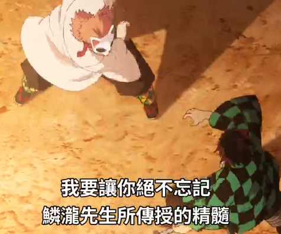
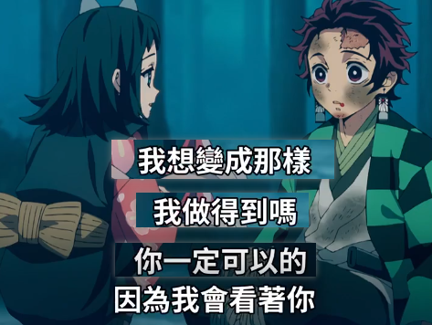

# 课程介绍

## ★课程介绍

> **注意：如果你想直接开始写代码，那就跳过这一课，直接看第四课**

### ◇目录

1. 这门课讲什么
2. 学完后有什么好处
3. 这门课适合你吗
4. 学习线路
5. 如何交作业、提问

## ★讲义

### ◇这门课讲什么？

讲初级前端到高级前端的一条必经之路：造轮子。

程序员的几个阶段：

1. **自学基础 - 最多可以去实习**（不是试用）
2. **在别人的指导下工作**（半独立完成工作，这种状态可以买课了！毕竟需要指导，公司里有没有几个前端，尤其是大家都刚用vue，我们可以通过芳芳老师的课，来看看他是如何写vue的！）
3. **独立完成工作**（这个阶段在一线城市的工资水平，大概是14k到20k之间的水平，这个水平可能会维持很长的一段的时间，因为你会发现这是你的瓶颈，总之此刻的你是个非常合格的前端，但是你没有办法更近一步！）
4. **把自己的代码分享给别人使用（轮子）**「造轮子的初衷。你分享给别人用的代码就是轮子 !至于代码的功能是什么，其实没有办法界定！但是你的一个重点是你开始 **分享**了，就好像你以前就在自己的岗位上拧螺丝，而现在你可以生产出一些拧螺丝的套路了！ 如告诉其它拧螺丝的人，帮助他把螺丝拧的更好！虽然说看起来还是在拧螺丝，但实际上对你的水平要求更高了一步，你需要比别人高一个等级，你才可能给别人提供一个帮助，毕竟如果大家都是相同水平的话，你怎么可能给别人提供帮助啊！所以说**这个阶段是突破瓶颈最重要的一个阶段**！」
5. **有一整套自己的方法论和常用代码**（大概阿里P7的要求，即你做任何事情就已经有自己的一套方法和一套代码了！你基本上把所有代码都烂熟于心了！别人给你一个需求，你能在10s钟之内，想出业界最成熟的，或者说相对比较成熟的途径给别人了！这就是一个P7的基本要求了！）

> 关于1、2阶段，是初级阶段！
>
> 关于3、4阶段，有的中级一直在3阶段，而有的一直在4阶段
>
> 不管怎样，第5阶段，肯定比较高级的！

### ◇造轮子有什么好处

1. **提升技能水平**
   你经常用别人写的轮播组件，为何不自己写一个试试？
   你经常用别人写的日期选择器，为何不自己写一个试试？
   **自己写出来之后，你会发现「就那么回事」**（事实是你的能力已经提升了）

2. **让你解决问题的能力更强**
   自己写业务代码的时候，你只需要满足自己业务的逻辑；
   **写轮子的时候，你需要满足大部分人的需求**。
   这很锻炼你提炼需求、分析需求和解决问题的能力。

3. **提升业界影响力**

   大部分程序员出名的途径：

   1. 写文章（MacTalk、阮一峰、陈皓）
   2. **造轮子（TJ、尤小右、玉伯）**
   3. 其他
      你造福社区，社区就会认识你。

### ◇前置知识

学习这门课的你，需要具备以下知识：

1. 常见的 JS 语法和技巧
   import、export、class、Promise、解构赋值、await、try..catch、throw 等语法了解一下
   如果没有了解，请查看 MDN 对应的文档
2. **做过半年左右的需求**
   你应该大概知道前端工程师的工作内容是什么，知道什么是需求，知道需求变更多么令人无语
   你还知道遇到技术问题要去 Google 和 Stackoverflow 查阅
3. 对 DOM 和 AJAX 有一定了解
   能回答「DOM是什么」和「AJAX是什么」即可
4. **看完了 Vue 文档，或者正在看 Vue 文档**
   因为这门课不会带这你看 Vue 文档，需要你自己阅读。
   如果你还没开始读也没关系，我们课后有测试题帮助你阅读 Vue 文档。
5. 已经学会了科学上网
   不多解释

### ◇鸟瞰学习路线

- 这门课会涉及「软件开发过程」的多个阶段，包括

  1. 需求分析（用例图、时序图等）
  2. UI 设计（我使用 Sketch.app 来设计 UI，如果你用的是 macOS，那么可以通过我的设计稿来学习 Sketch 的使用）
  3. 写代码
  4. 测试（单元测试）
  5. 文档撰写（README.md）
  6. 持续集成

- 这门课会从易到难

  1. 轮子会越来越复杂
  2. 一开始不用 webpack，后面会加各种工具
  3. 先实现一个基本版，然后优化，再优化，再再优化

- 二十多个轮子会**尽量涵盖 Vue 的所有特性**
  **虽然 Vue 提供了很多功能，但并不是所有都用得上。**
  一些人只用 component 也能搞定一整个项目，我们的课会尽量用不同的写法。

- 后端接口怎么办

  **按需选择**

  1. 用公共免费 API，比如 GitHub API
  2. 用 LeanCloud
  3. 自己写后端，然后部署到 heroku

### ◇学习约定

#### 代码方面的约定

1. 大部分代码都放在 [FrankFang/gulu](https://github.com/FrankFang/gulu)
2. 设计资源放在 [FrankFang/gulu-design-resources](https://github.com/FrankFang/gulu-design-resources)
3. 代码会十分重视可读性
   1. 不会有废话般的注释
   2. 所有的变量命名都会仔细斟酌
   3. 禁用缩写
      1. 业界统一的缩写可以用，如 HTML、CSS、JS
      2. **其他缩写一律不用，如 btn、cnt、arr、str，应该写为 button、container、array、string 等**
   4. **不写耍小聪明的代码**
   5. **使用 ES6+ 语法**

#### 课业方面的约定

1. 请自觉完成作业
   1. 你的作业应该做成什么样子，每堂课都会说明
   2. 所以你做完之后自己对照就知道自己对错了
   3. 当我们学了单元测试之后，你就可以用代码检查自己的代码
2. 有疑问请发邮件问我
   1. 将你遇到的问题「详细」的说清楚
   2. 代码用 GItHub 上传
   3. 页面用 GitHub Pages 预览
3. **多在微信群里讨论**

#### 工具方面的约定

我们会用到的工具有

1. GitHub
2. **WebStorm**
3. Sketch.app（可选）
4. 普通的编辑器（VSCode、Sublime Text 都行，记事本不行）
5. Node.js + NPM
6. `http-server . -c-1`
7. Google

#### 移动优先（Mobile First）

1. 完全不考虑 IE 浏览器
2. 优先考虑触屏操作、少用 hover
3. 优先使用相对单位，如百分比、em 和 vh

#### 课外资料

1. 本课 UI 轮子的「外观」将参考这些轮子
   - [Framework7](https://framework7.io/docs/button.html)
   - [Ant Design](https://ant.design/docs/react/introduce-cn)
   - [Element UI](http://element.eleme.io/#/zh-CN/component/installation)
   - [iView](https://www.iviewui.com/docs/guide/install)
2. 如果你对设计感兴趣，可以看
   - 《写给大家看的设计书》
   - [Sketch中文网](http://www.sketchcn.com/)
3. 如果你 ES 6 不熟练，可以看
   - [ES 6 新特性列表及教程](https://frankfang.github.io/es-6-tutorials/)
   - [我的《ES6 深入浅出》课程](https://xiedaimala.com/courses/12a78a03-35f9-42ea-9b37-540540460f6e)（未完结）

---

## ★课前测试题答疑

> 这门课针对工作一年的前端，它可以系统地教你把Vue给学会了！
>
> 如果你对Vue感兴趣，或者用Vue用的不是很好，那么可以看看这门课！
>
> 关于课程中的轮子，芳芳在过去的5年中，这每一个轮子都大概造了3、4遍，所以这是一门经验总结性的课程，并不是说「如何做一个简单的东西」，而是要把遇到的坑都给捋清楚，让你知道这是「为什么」？

### ◇题目讲解

> 为啥要你用大脑推测？因为如果你把代码直接给运行一遍，然后得到结果的话，这显然是没啥意思的！毕竟这样一来你就不明白这结果为啥是这个而不是那个了！即便你根据结果来推测程序的行为也是如此的让人感觉没有意义！

我简单记录一下：

1. 咩有传东西

2. 箭头函数的作用域的上一级显然是全局作用域，总之箭头函数并没有 `this`，`this` 会作为变量一直向上级词法作用域查找，直至找到位置

3. 理解class和extends即可

4. reject态（拒绝态）的缘故！具体看Promise规范即可！

5. 有3个name，一个是window的name，一个是作为选项的name，最后一个是作为data的name，根据vue的文档，this是vue实例，然后它的name值是来自data的name，而我们之前传进来的那个name仅仅作为选项，并没有什么乱用，而且也用不到它！

   

   **➹：**[JS Bin - JS Bin](https://jsbin.com/tobagap/1/edit?html,js,output)

   重新理解生命周期：

   这些**生命周期钩子**的函数，这给了用户在**不同阶段**添加**自己的代码**的机会。

   [`created`](https://cn.vuejs.org/v2/api/#created) 钩子可以用来在一个实例被创建之后执行代码（也就是一些属性都初始化配置好了，包括用户传    给Vue这个钩子函数的参数——选项对象！）

   生命周期钩子的 `this` 上下文指向调用它的 Vue 实例。

6. 都是vue官方文档的原话！总之，考察的是你到底有没有看文档

7. 考察的是mixins，看了有关的例子，然后自己试验一下，你就会知道这个mixins是优先使用组件本身的这个属性，如hello方法，如果没有再去看mixins的属性！所以就是优先使用组件本身的属性

8. 很简单！跳过

9. 知道`Object.defineProperty`这个API语法即可！

小结：

一定要把`this`搞清楚，如果搞不清楚那就不要学vue了！

## ★造轮子的益处

> 程序员经常提到这样一个词，但是对于没有做过这件事情的人来说，会觉得很模糊！那就是「造轮子」这3个字啦！

**①为什么说「造轮子」是初级到高级前端的必经之路？**

现状：给我个需求，基本可以完成，完成不了的话，大概加会儿班也可以完成！但是，总觉得在重复自己，即做页面、做页面……没有发现今天的我和一个月前的我有何区别！

那么如何破除这种初级阶段所遭遇的如此尴尬的境地呢？——那就是造轮子啦！

那么造轮子具体是啥意思呢？——其实，你无须要管它是啥意思啦！简单来说，就是你要写一些东西给别的车用，即不只是在你的这趟车上可以用！还可以在别的车上用！那么这就是轮子啦！

**②造轮子属于程序员的哪个阶段？**

## ★总结

- 关于那些自测题，请不要看了答案再做，不然就啥意义了！毕竟这些自测题存在的意义是看看**你有没有很顺利达到听懂这门课的水平**，如果没有达到，也米有关系的哈！边听边补也是ok的！
- 关于「你学完之后有什么好处的？」的回答：你花了钱，代码也写了，那么与没花钱的，没写代码的相比有啥好处？
- 如果你没有对一个知识用得很熟，那么就不要讲了！像芳芳这门课，芳芳都是讲了两年的JavaScript基础知识，以及用了好几年的Vue，且很熟练，做了好几个项目（如写代码啦官网等），积累了很多经验，才可以拎出来讲的！所以识别一个课的质量好不好，就得看这个人对此付出了多少心血！而不是你叫一个学了一年的vue的来教你如何用Vue来造一个UI轮子！

## ★Q&A

### ①告诉你解决一个问题的心路历程？

2019-04-21，中午12点47分，我在看「鬼灭之刃」的第三集，看到第10min，突然来了这么一句话「老夫已经没有什么好教你的了，接下来就靠你自己了，看你是否能将老夫教的事融会贯通、加以升华」

这一句话，让我重新认识了「教」的定义！没有人可以教你一辈子，你终究要做的事儿是「把所学的东西融化贯通，即刻到骨子里去，变成自己的东西，并借此加以升华，与时俱进，更好地让所学知识兼容自己或者兼容所有人！」

学习芳芳的造轮子课程，同样也是如此……

回想起芳芳的那句话「你必须把要教的知识理解个90%之后，才能让他人听懂个60%、70%左右！」

剩下的理解，就得靠你自己了！

回过头来，如何融会贯通呢？动漫中是给个任务你，如「把这块大岩石，用刀给劈了，你自己看着办就好了」。

显然，你一开始是想不出什么好办法的，只能不停地去试，不停地回顾你庆幸自己有记录下来的日记（或者说是每天学习的笔记）

然而半年过去了，这块岩石还是没有被劈开！难道就没有办法了吗？

至此，这让我开始变得焦虑了！

但，我并没有因此而变得意志消沉，而是认为「这还不够呀！我锻炼得还不够呀！我得再多锻炼一些！再多一些……」

每天数次的挥刀，但这岩石始终无动于衷：

可是一想起「妹妹会因自己没有能力而死掉！」

> 我之所以努力的信念啊！「没有能力」这4个字，触之逆鳞，必然会死磕「能力」!

但，我真得快要心灰意冷了，快要认输了！

但，我还是在不断地呐喊「要加油！我要加油！」

突然，似乎救星来了：

> 这位仁兄能用木刀把这块岩石给劈了！起初主角还认为用刀与他决斗会让他受伤，于是表示「不打」，但显然「主角，你想太多了，不要以为现在自己已经很强了好吧！既然人家说跟你决斗，肯定是吊打你的啊！」

不然，这很难看！

然后他说了一句话：

如果你还是一个男人的话，就不要「迟钝」、「软弱」、「不成熟」，此时主角就是这样的人！

接着这位仁兄和主角展开了激烈的对决（其实是吊打主角），并说了以下这番话：

> 自以为是，嗯，此刻的我就是这样的！认为学到了很多东西，其实只是记住了知识罢了！

再怼一句：

> 你的努力，被否定了！是不是很想反驳呀！

接下来，那位仁兄打算这样干：

这位仁兄认为：

「主角你是偷懒了！」

但其实不然啊！

主角他有练习，每天都练习，拼命地练，可是就是完全行不通啊！

但仁兄表示：

既然你说没法进步了，那你就使劲让我见识你的能力吧！看看你与我之间的差距！

> 差距很大，显然主角是没有找对方法！或许，这就是努力，并不一定有所想要结果的原因！

主角被吊打了……

但主角起来后，并没有觉得被人吊打是件很难以启齿的事儿：

而是满满地赞扬！然后表示：

> 或许，这就是看到牛逼的人之后，加大了自己的上限了吧！而不是原先那个挂着「我无法进步了」这样的话在嘴边的自己！

接下来，这位女……叫真孤，把主角的缺点都告诉主角自己了，然后还把他纠正像是多余的动作或者是坏习惯等等：

> 这就是别人眼中的自己吧！这些是自己无法看到的！所以你必须走出去，而不是闭门造车！因为这就像自己说得那样「继续下去的话，始终无法进步！」

然而就说到了，如何劈开这块岩石的方法！

当然这个方法，之前那个 仁兄也说到了，那就是**「全面集中的呼吸**」

而其中这里边的原理就是：

1. 能让血液的流动和心脏的跳动加速
2. 这样一来体温就会上升，然后明明是人却能变得像鬼一样强
3. 总之，就是会让肺变大，让更多更多的空气进入血液，血液在受到惊吓时，骨头与肌肉就会紧急发热让人变强

主角内心表示「一脸懵逼，完全听不懂」：

虽然如此，但还是：

做法：

开搞：

主角拼命练习挥刀，可即便如此，还是打不赢那位仁兄（靖兔）

就这样半年过去了……

主角再次挑战靖兔，此时靖兔显然是拿真刀了，因为他认可了主角的表情终于像个男人了！

主角的表情：

面对面的决斗的规则：

十分单纯，更强更快的一方就能赢！

当然，这次赢了，对手也漏出了欣慰的一笑：

那是看起来很安心的笑容呀！

这段时间一直指导主角的真孤也表示：

也要打赢那家伙！（这个家伙是谁呢？）

然后，帮助主角儿的靖兔和真孤就这样消失于雾中了，而当主角回过神来：

从中可以见到：

努力的前期是按自己的方式来不断地试错，如果没有结果，那就请教，找到真正地解决姿势，然后努力的后期，就是学会这种姿势，最后就把岩石给劈开了！

贯穿这整个过程的就是「**坚持**」二字！

### ②什么叫实习？

实习，不是试用！实习就是你还在大三，或者是研二，然后你找到公司去实习，然后有个人专门教你，然后你犯了错别人也不会骂你！毕竟，你是来实习的！总之实习，就是实践学习。

这个阶段也叫程序员的自学基础阶段！

