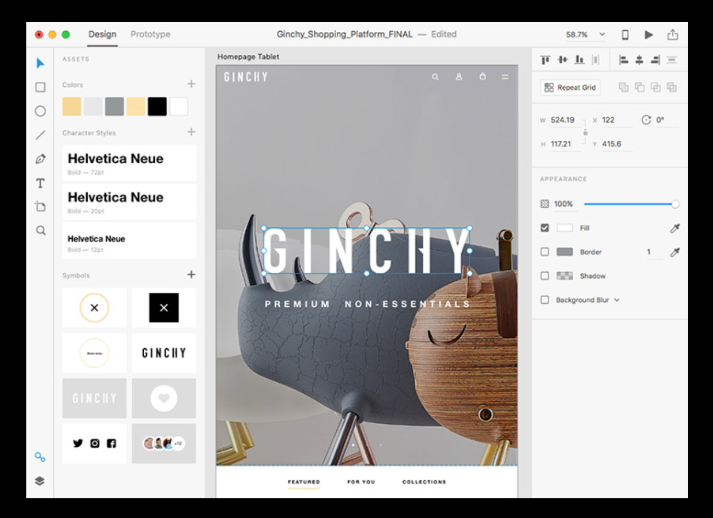
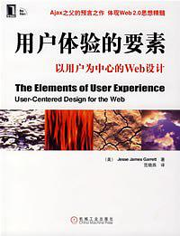
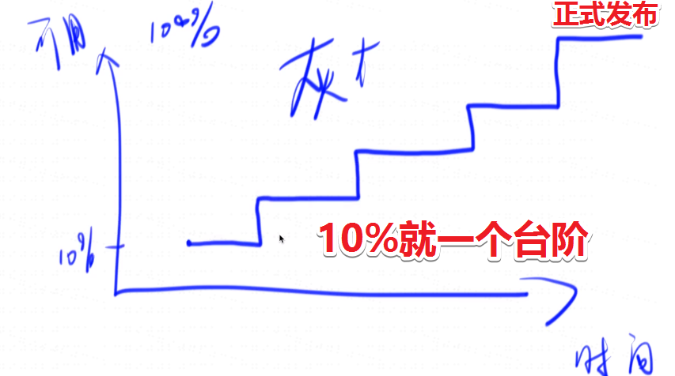
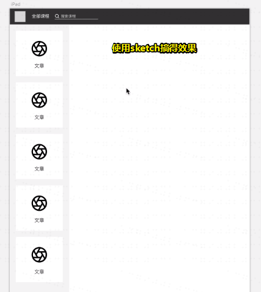
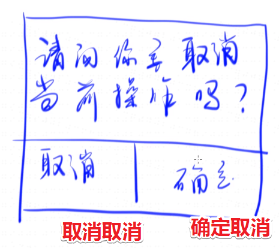

# UI设计（可不看）

> 为了提升一下效率，我就简单记一下就好了，当然，之后我会补上！毕竟这一块内容需要常看！

## ★课程简介

### ◇目录

1. 用户体验的要素
2. 网站开发的流程
3. Sketch 简介
4. 交互设计简介
5. 本课约定

各位，Windows 上终于也有了像 Sketch 一样的工具了 <https://www.adobe.com/cn/products/xd.html>

> 按照[最低系统要求](https://helpx.adobe.com/cn/xd/system-requirements.html?promoid=65FN7WF2&mv=other)「Windows 10 创意者更新（64 位）— 版本 1703（内部版本 10.0.15063）或更高版本」，我的是1607版的，显然已经GG了



配色网站推荐：

- <https://colorhunt.co/>
- <https://color.adobe.com/explore/>
- <https://www.materialpalette.com/>

## ★讲义

### ◇《[用户体验的要素](https://book.douban.com/subject/2297549/)》

对用户体验（User Experience）把握的好坏，是衡量一个前端工程师的重要标准。

这本书系统的讲述了用户体验，[推荐各位前端阅读](https://www.cnblogs.com/frankfang/archive/2011/04/21/2023618.html)。



很多时候你会感觉一个网站不好用，但是你不知道哪里出现了问题。

有的时候一个网站很难看，但是你觉得很好用。

用的时候一个网站很好看，但是你觉得很难用。

这就是「可用性」、「易用性」和「美观」的区别了。

我们应该优先考虑「可用性」，再考虑「易用性」和「美观」。

###  ◇网站开发的流程

1. 立项 - 确定要做，确定人员，确定预算等
2. 需求 - 需求收集和分析
   - 收集比分析更难，有的时候用户也不知道自己的需求
   - 亨利·福特曾说过，「如果我最初是问消费者他们想要什么，他们应该是会告诉我，要一匹更快的马！」
   - 可以用「用例图」来分析需求
3. 可行性分析
4. 系统设计（功能设计、框架设计）
   - UML 图、时序图等
5. 原型设计（草图、线框图）
   - 草图用纸和笔画
   - 线框图可以用 Balsamiq
6. 交互设计
   - 可以用 Axure RP、墨刀、Sketch.app
7. 视觉设计
   - 可以用 Photoshop、Fireworks、Sketch.app
8. 程序开发
9. 测试
10. 功能预演
11. 内测
12. 灰度发布
13. 正式发布

### ◇Sketch 简介

Sketch.app 是 macOS 专有的一款软件，目前 BAT 等大公司的网页设计师基本都在用 Sketch。

它的好处是：

1. 功能少（相比与 PhotoShop），所以更好掌握
2. 操作方便
3. 贴近前端（可导出 CSS、矢量图、可复用、插件多）

以仿制当前页面为例说明。

### ◇交互设计简介

要点

1. 有反馈
2. 一致性（可学习）
3. 可预测

以表单提交为例

1. 用户按 tab 要有反馈，用户按回车要有反馈
2. 用户点击提交，提交按钮要变成 disabled 和 loading
3. 如果确定放在左边，取消放在右边，那么就要一直坚持这个习惯
4. 用户提交后如果出错，那么已经填写的内容不能消失

### ◇本课约定

1. 尽量使用「黑白灰」经典配色
   如果你不会配色，就不要强行自己配色
2. 如果你希望个性化你的配色，可以使用 Kuler
3. 设计稿体现不出交互设计，所以会在需求分析中讲交互设计

## ★网站开发流程

1. 缺少任意一个流程的话，总会出现某种问题！而且有些流程一旦缺少 了，那么这个网站项目可以凉凉了！

2. 当有新项目来的时候，你需要实时跟进一下，如跟产品经理、设计师交流一下，不然，等设计稿出来的那一天，还差一天就得项目交付了，此时你需要一天的时间就把网站给写出来呀！那就真得是加班24小时了！

3. 有一点很重要，那就是关于可用、易用和美观，先有可用性（如考虑鼠标坏了，这个网站还能点击，如tab键和上下左右键），再谈易用性（好用，不满足仅仅是能用），最后在考虑美观！这三个点就是工程师的思维，而设计师则只是考虑美观这一点，一旦不美观那就宁愿不搞了！对于前端工程师来说做得丑没事，但一定要保证做得好用才行！

4. 老实说前端要干得活儿是真得种类多啊！要懂点产品、要懂点设计、懂点后端等等，基本整个开发流程都得参与！

5. 关于内侧，给个别基友或者用户使用一下，给点建议哈！

6. 关于灰度发布，可以用一行代码搞定，如限定只在北京地区的人有「找到附近的女人」这个功能，以免服务器因为大量人群来使用这个功能，导致服务器瘫痪，毕竟公司不大啊！至此，再慢慢地提高覆盖区域，最后所有人都能用了，那就是正式发布了！

   

小结：

必须要有的步骤：

1. 需求
2. 视觉
3. 开发
4. 测试
5. 发布

其它的可以没有，但是没有的话，会导致你前端加班，甚至会导致你整个项目失败

## ★Sketch与墨刀



咩有Mac电脑，那就用线上的墨刀吧！

## ★设计约定

- 有反馈

  1. 不要把用户的行为反馈给搞没了，如摁tab键，会聚焦某个按钮，此时也会有蓝色的outline：

     

  2. 

  所以，我们在做轮子的时候，一定要注意的一个问题就是「你所弄得网站不要让用户看上去什么事都没有做，就把用户的东西给搞没了，然后用户就以为自己的东西坏了」，如用户刚刚还能输入数字，而现在就无法输入东西了……

  而且你会发现，很多前端工程师是违反这个东西的，点了个按钮没反馈、按了个按键没反馈、按个tab没有高亮……

- 一致性

  1. 你的网站，比如说红色按钮都表示危险操作，蓝色按钮都表示推荐操作，然后绿色按钮都表示成功了，这样一来，只要用户看到红色的按钮就会谨慎的点，然后看到蓝色的就随便点了

  如果你的界面一致性做得比较好的话，那么用户就能很快学会你的界面要怎么使用了！

- 可预测

  什么叫可预测呢？比如，以写代码啦这个网站为例，如果我们进入课程页面的话，那么就会出现课程购买按钮了，或者说我点了购买按钮之后，你会弹出一个可以购买或者不可以购买的东西给我，对吧！但是如果你的网站反其道而行之的话，如我的网页就没有购买按钮，或者说你点了购买按钮之后，也不告诉你是否可购买还是不可购买，而是等到你付账的那一刻才告诉你「你不能购买！」

  所以说这个东西就是用户觉得很莫名其妙了，毕竟跟自己想的不一样啊！

  因此，这种东西我们应该避免它！

以输入框为例，归纳一下这三个点：

有反馈：


一致性：



如果你想左边按钮表示确定的 话，那么请保证你的所有对话框都是确定在左边，而不是有几个弹出框的确定按钮是在右边的！

预测性：

假如我们在注册一个用户名，然后填了10个信息，结果一点了提交，提示你的手机号出错了，或者说用户名已被注册，结果之前所填的内容都被刷掉了！

这样就很咩有预测性呀！因为大部分网站都不会刷掉啊！只有辣鸡网站才会被刷掉！

所以我们在设计表单的时候，一定要给它一个这样的功能——能不能把之前用户所填的内容都给保留下来！

就算用户刷新页面，我也可以 包留下来的这么一个接口呢？

如果你造轮子的时候，不考虑这个问题的话，那么你的这个可用性或者易用性就会特别差了！

所以当你在弄交互设计的时候，请每次都看看这3个点，问问自己「我的东西是不是有反馈的？」「我的不同地方是不是一致的？」「然后我的这个交互，用户是否可预测？」

如果以上都ok的话，那么你的这个设计就是非常符合人类直觉的！

接下来说说设计约定：

如果本人不是很会配色的话，那么就尽量使用黑白灰吧！

毕竟黑白灰基本上就不会配错了，如果你使用的是什么红黄蓝、红黄绿呀，假设是第一次做的话，一定会丑死别人的！

总之，尽量大面积使用黑白灰，顶多再搞个点缀色红色、绿色就好了！


如果你像让自己的轮子个性化点的话，可以看看这个网站：

**➹：**[Color](https://color.adobe.com/zh/search?q=summer)

直接用这个网站所建议的颜色就好了，你可以通过一些搜索关键字，如summer、cool等去获取一些推荐的颜色：


通过取色软件，一个个取即可，或者直接用网站提供的颜色信息直接复制拷贝即可！

总之，不要自己取配啊！

其实我们看vue的官网，其实大概也就那么三四种颜色！

还有一个问题就是，我们的设计稿无法体现出交互设计，那么什么是交互设计呢？请看下图：


这个东西似乎某些设计工具可以做到，但我们还是通过文字描述或者语言给叙述出来吧！当然，你不要忘记了你身为一个前端得预测这些应该会有交互的效果，毕竟看了那么多网页！

## ★UI测试题

请使用墨刀或者Adobe XD实现一个简单的按钮，效果在此：<https://modao.cc/app/UFnhPBsERfRcU4yIHlAMJZKAyOpNMEY>

要求：

1. 按钮高度为 32px
2. 按钮内文字高度为 14px
3. 按钮内 icon 和文字的距离为 4px
4. 按钮内容左右居中，上下居中

这个倒是做了，只是间距该如何设置啊？总不能用肉眼观察吧！

芳芳的：


我的：


## ★总结

- 平时你写笔记，画线框图时请用那个Balsamiq Mockups，这样你就不需要用截图工具搞事情了！
- 如果你有心往产品方向发展的话，那么「用户体验的要素」这本书是必看的！
- 对于前端开发来说，我们网站开发有哪些流程是必须的？——需求、视觉设计、程序开发、测试、正式发布！剩下的那几个，越多越好！
- sketch有的话，那就用它，没有的话，那就用墨刀吧！
- 交互设计的三个要点：
  1. 必须要有反馈
  2. 必须要一致，即确定按钮在左边的话，那就其它类似的弹框，点击确定按钮就得一直在左边才行，可千万不要跑到右边去哈！因为这样一来才会让用户觉得这是可学习的，而不是无厘头，毫无规律可言！
  3. 可预测——你做的行为不会让用户感觉特别惊讶！
- 颜色方面的约定：
  1. 尽量使用黑白灰
  2. 如果你要配色的话，那就用[color](https://color.adobe.com/search?q=cool)这个网站
- 交互设计的方式：
  1. 芳芳会通过语音的方式说明！
- 以上就是对UI设计做了一个非常简单的科普了，但是这个科普在后面是非常有用的，很多时候你不知道你为什么错，那么你就回顾一下这3个词：可用性、易用性、美观，然后问问自己你是违反了「可用性」，还是「易用性」，又或者是「美观」，当然，美观一般你是发现不了的！但是违反了可用性和易用性的话，这是很容易就被发现的！
- 在这里交互设计，有视觉以及行为的交互！


## ★Q&A

### ①安装Balsamiq Mockups？

下载地址：[Balsamiq for Desktop - Balsamiq](https://balsamiq.com/wireframes/desktop/#)

注册码：

```
Name: personal
Key: eJzzzU/OLi0odswsqilILSrOz0vMqbFEAjXONYY1fu6ufgA/CA4X

Name: helloWorld
Key: eJzzzU/OLi0odswsqslIzcnJD88vykmpsUQCNc41hjV+7q5+AF74Ds8=

Name: china
Key: eJzzzU/OLi0odswsqknOyMxLrLFEAjXONYY1fu6ufgAJ5gy2

Name: ketty
Key: eJzzzU/OLi0odswsqslOLSmprLFEAjXONYY1fu6ufgAOOwzk
```

表示用第二个注册成功

**➹：**[Balsamiq Mockups注册码（有效中） - 我是小强的个人空间 - OSCHINA](https://my.oschina.net/dongwq/blog/201323)

