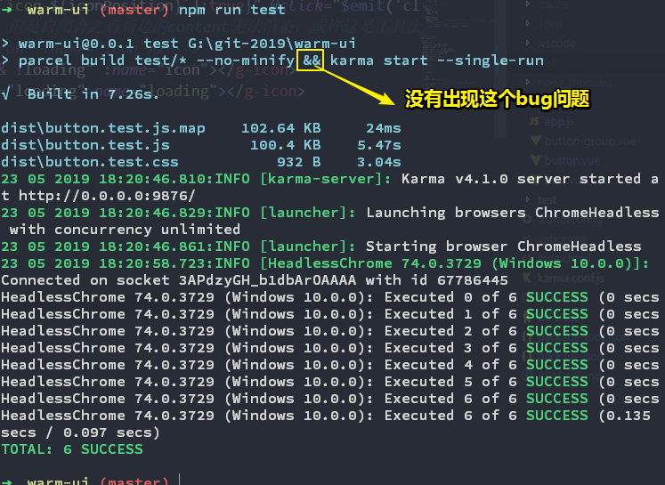
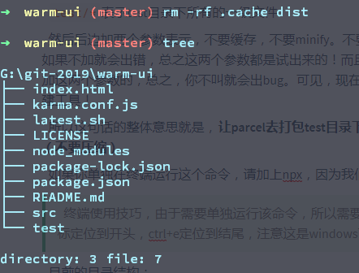

# 框架搭建 & 持续集成（下）

## ★课程简介

### ◇注意：Windows 用户运行 `npm run dev-test` 时会出现 BUG

1. 从这节课开始，你需要用 `npx parcel index.html --no-cache` 来开启项目（可以把这个命令写到 `npm start` 里）
2. Windows 用户运行 `npm run dev-test`时会出现 BUG，貌似是因为 Windows 不支持 `&&` 符号，解决办法是：将 dev-test 对应的命令  `parcel watch test/* --no-cache & karma start`分别运行，运行方式如下：
   1. 新开一个 Git Bash 窗口运行 `npx parcel watch test/* --no-cache`
   2. 再开一个 Git Bash 窗口运行 `npx karma start`

### ◇npm publish 遇到 403 怎么办？


首先看log里面有没有 taobao 字样（截图中有）

* 如果有这说明你没有切换到 npm 原始源，那么你只需要用 `npm config delete registry` 删除淘宝源，然后再 publish。
    publish 成功之后再切换回淘宝源 `npm config set registry https://registry.npm.taobao.org`
    如果嫌切换不方便，可以安装 [nrm](https://github.com/Pana/nrm) 来快速切换源。
* 如果没有 taobao 字样，继续往下看


看看 log 里面有没有「spam detection」字样

* 如果有
    这说明你的 package name 看起来像是 spam（垃圾邮件），你需要换一个更正常的名字。比如 `china-number-one-haha`
* 如果没有
    可能是你的 pacakge name 已经被人注册了，换个 name 试试

### ◇目录

1. 自动化测试
2. 持续集成
3. 重写所有代码
4. 发布 npm 包
5. 完善 README

## ★警告：npm link 在 Windows 上会抽风

如果你 npm link 之后项目报错，你就不要再用 npm link 了

你只需要每次改完代码后 npm publish ，然后再在另一个地方 npm install [xxx@0.0.x](mailto:xxx@0.0.x) 即可。

## ★自动化测试

### ◇使用 Karma + Mocha做单元测试

1. Karma（`[ˈkɑrmə]` 卡玛）是一个测试运行器，它可以呼起浏览器，加载测试脚本，然后运行测试用例
2. Mocha（`[ˈmoʊkə]` 摩卡）是一个单元测试框架/库，它可以用来写测试用例
3. Sinon（西农）是一个 spy / stub / mock 库，用以辅助测试（使用后才能理解）

### ◇<a id="yi">步骤</a>

1. 安装各种工具
   `npm i -D karma karma-chrome-launcher karma-mocha karma-sinon-chai mocha sinon sinon-chai karma-chai karma-chai-spies`

2. 创建 karma 配置

   ```js
   // 新建 karma.conf.js，内容如下
   module.exports = function (config) {
     config.set({
   
       // base path that will be used to resolve all patterns (eg. files, exclude)
       basePath: '',
       // frameworks to use
       // available frameworks: https://npmjs.org/browse/keyword/karma-adapter
       frameworks: ['mocha', 'sinon-chai'],
       client: {
         chai: {
           includeStack: true
         }
       },
   
   
       // list of files / patterns to load in the browser
       files: [
         'dist/**/*.test.js',
         'dist/**/*.test.css'
       ],
   
   
       // list of files / patterns to exclude
       exclude: [],
   
   
       // preprocess matching files before serving them to the browser
       // available preprocessors: https://npmjs.org/browse/keyword/karma-preprocessor
       preprocessors: {},
   
   
       // test results reporter to use
       // possible values: 'dots', 'progress'
       // available reporters: https://npmjs.org/browse/keyword/karma-reporter
       reporters: ['progress'],
   
   
       // web server port
       port: 9876,
   
   
       // enable / disable colors in the output (reporters and logs)
       colors: true,
   
   
       // level of logging
       // possible values: config.LOG_DISABLE || config.LOG_ERROR || config.LOG_WARN || config.LOG_INFO || config.LOG_DEBUG
       logLevel: config.LOG_INFO,
   
   
       // enable / disable watching file and executing tests whenever any file changes
       autoWatch: true,
   
   
       // start these browsers
       // available browser launchers: https://npmjs.org/browse/keyword/karma-launcher
       browsers: ['ChromeHeadless'],
   
   
       // Continuous Integration mode
       // if true, Karma captures browsers, runs the tests and exits
       singleRun: false,
   
       // Concurrency level
       // how many browser should be started simultaneous
       concurrency: Infinity
     })
   }
   ```

3. 创建 test/button.test.js 文件

   ```js
   const expect = chai.expect;
   import Vue from 'vue'
   import Button from '../src/button'
   
   Vue.config.productionTip = false
   Vue.config.devtools = false
   
   describe('Button', () => {
     it('存在.', () => {
       expect(Button).to.be.ok
     })
     it('可以设置icon.', () => {
       const Constructor = Vue.extend(Button)
       const vm = new Constructor({
         propsData: {
           icon: 'settings'
         }
       }).$mount()
       const useElement = vm.$el.querySelector('use')
       expect(useElement.getAttribute('xlink:href')).to.equal('#i-settings')
       vm.$destroy()
     })
     it('可以设置loading.', () => {
       const Constructor = Vue.extend(Button)
       const vm = new Constructor({
         propsData: {
           icon: 'settings',
           loading: true
         }
       }).$mount()
       const useElements = vm.$el.querySelectorAll('use')
       expect(useElements.length).to.equal(1)
       expect(useElements[0].getAttribute('xlink:href')).to.equal('#i-loading')
       vm.$destroy()
     })
     it('icon 默认的 order 是 1', () => {
       const div = document.createElement('div')
       document.body.appendChild(div)
       const Constructor = Vue.extend(Button)
       const vm = new Constructor({
         propsData: {
           icon: 'settings',
         }
       }).$mount(div)
       const icon = vm.$el.querySelector('svg')
       expect(getComputedStyle(icon).order).to.eq('1')
       vm.$el.remove()
       vm.$destroy()
     })
     it('设置 iconPosition 可以改变 order', () => {
       const div = document.createElement('div')
       document.body.appendChild(div)
       const Constructor = Vue.extend(Button)
       const vm = new Constructor({
         propsData: {
           icon: 'settings',
           iconPosition: 'right'
         }
       }).$mount(div)
       const icon = vm.$el.querySelector('svg')
       expect(getComputedStyle(icon).order).to.eq('2')
       vm.$el.remove()
       vm.$destroy()
     })
     it('点击 button 触发 click 事件', () => {
       const Constructor = Vue.extend(Button)
       const vm = new Constructor({
         propsData: {
           icon: 'settings',
         }
       }).$mount()
   
       const callback = sinon.fake();
       vm.$on('click', callback)
       vm.$el.click()
       expect(callback).to.have.been.called
   
     })
   })
   ```

4. 创建测试脚本

   在 package.json 里面找到 scripts 并改写 scripts

   ```json
   "scripts": {
        "dev-test": "parcel watch test/* --no-cache & karma start",
        "test": "parcel build test/* --no-minify && karma start --single-run"
    },
   ```

5. 运行测试脚本

   1. 要么使用 `npm run test` 一次性运行

      

   2. 要么使用 `npm run dev-test` 进行 watch 运行

      

### ◇成果

如此一来，你开发的时候新开一个命令行窗口运行 `npm run dev-test` 就可以实时查看测试结果。
如果你只想看一次结果，就只用运行 `npm run test`

## ★发布 npm 包

### ◇确保你的代码测试通过了

`npm run test` 全部是绿色（原谅色）才行。

### ◇上传代码到 npmjs.org

1. 更新 package.json
   1. 在 package.json 里将版本号改为 0.0.1，等我们做完了再改成 1.0.0
   2. 创建 index.js，在 index.js 里将你想要导出的内容全部导出
2. 去 <https://www.npmjs.com/> 注册一个账户
3. 确认一下邮箱（必须）
4. 在 gulu 项目根目录运行 npm adduser
   - 如果错误提示里面含有 [https://registry.npm.taobao.org](https://registry.npm.taobao.org/) 则说明你的 npm 源目前为淘宝源，需要更换为 npm 官方源
5. 运行 npm publish

### ◇使用自己的包

1. 预测其他使用你的包的人会怎么使用
   - 使用 vue-cli
   - 使用 webpack
   - 使用 parcel
2. 分别使用这些方式来使用自己的包（我们只以 vue-cli 为例）
   1. 使用过程中我们发现报错说 import 语法有问题，那时因为 node 目前确实不支持 import，我们需要用 babel 转译 import
      1. 你可以要求使用者自己用 babel 来转译
      2. 你也可以转义好了再给他用
         - `npx parcel build index.js --no-minify` （本来不应该加 --no-minify 的，奈何不加会有 bug，HTML 压缩把 slot 标签全删了）
         - 将 package.json 的 main 改为 dist/index.js
3. 使用 npm link 或者 yarn link 来加速调试
   1. 你每次修改源码之后，有两条路让别人得到最新效果
      1. 更新 package.json 里的 version，然后 npm publish。别人通过 npm update xxx 来更新。
      2. 如果你只是为了本地调试，可以在项目目录使用 npm link，然后在使用之处运行 npm link xxx，就是最新了

## ★持续集成

我们一开始要自己打开 Chrome 测试我们的代码
后来使用 Karma 可以做到一行命令测试我们的代码

想一想，还能不能再自动化一点。

这就是持续集成

---

## ★这次课讲什么？

> 这次课让上节课的代码变得非常的完善

这次课讲什么？（很多都咩有接触过）

1. 自动化测试
2. 持续集成
3. 重写所有代码（这一部分讲真很不喜欢，但是不得不这样做）
4. 发布 npm 包（让别人可以使用我们的轮子，只要安装了这个包就可以使用20多个轮子，目前只做了一个button轮子）
5. 完善 README

如果你的前端生涯未经历过以上过程，那么这次课是非常重要的！

之后的课，大都重复前4节的课！因为都是重复造轮子哈！

## ★使用Karma做自动化测试

### ◇为什么需要自动化测试

> 本来芳芳的自动化测试用的是 puppeteer（这个安装下载特别大），奈何GG了。
>
> **➹：**[自动化测试 · FrankFang/frank-test-1@05084aa](https://github.com/FrankFang/frank-test-1/commit/05084aa2afd48681d909f5ec9060cfee28e64d36?diff=unified)
>
> **➹：**[大前端神器安利之 Puppeteer - 前端 - 掘金](https://juejin.im/entry/5a3aa0e86fb9a045076fd385)

目前的单元测试做法：通过打开浏览器，刷新页面就测完了。

简单说一下我们做了哪些几个测试：

1. 测试按钮含有icon：生成一个vm，把vm挂载到内存里……
2. 测试假如loading存在，icon是否还会显示？
3. ……

可见单元测试使得我们可以通过代码来测试我们所写的代码是不是对的！

我们知道，所写的5个测试，每次都得打开浏览器刷新页面才能看到测试结果。

自动刷新，我们借助parcel可以做到，可是自动打开浏览器可以做到吗？

### ◇如何让电脑自动打开浏览器？自动点刷新呢？全都自动化呢？

> 只需要输入一行命令，就可以知道我们的代码到底有没有问题！
>
> 接下来，我们要做什么呢？
>
> 把我们打开浏览器，然后加载JavaScript，然后看出没出错的这个过程，完全自动化哈！

#### 做法

> 参考 [①](#yi)

1. 安装各种工具：

   1. Karma，可以运行我们的测试，如它可以自动呼起浏览器，自动加载测试脚本，自动运行我们的测试用例，简而言之，它就是一个测试运行器
   2. Mocha，咖啡的名字，摩卡咖啡，可见JavaScript老是跟咖啡过不去！它是一个单元测试库，当然也有人认为它是个框架，它可以用来干嘛了？可以用来写测试用例！
   3. Sinon，是一个 spy / stub / mock 库，用以辅助测试（使用后才能理解）

   > 或许以上3个工具你都不懂，但是这没有关系呀！因为它们都是工具呀！既然它们是工具，那么只需要照着芳芳的做法过程做一遍，那么你就学会了，无须知道中间的原因是什么！
   >
   > 请设置好淘宝源！如果需要下载很久，那么肯定是在package.json里边添加了什么东西：
   >
   > 
   >
   > 也就是npm会自动的去读依赖安装，即便你没有显示说安装它们，换言之，先把安装版本写到 `devDependencies`里边去，然后去安装咩有安装过的！

   安装结果：

   

2. 创建karma配置（可以简单认为karma就是一个可以帮我们打开浏览器的的工具）

   在root目录里边，创建一个 `karma.conf.js`文件，文件名必须一样，不然会报错哈！

3. 

   创建test/button.test.js

4. 创建运行测试用例的脚本，之后会解释这个脚本为何意，先跑通这个过程再说！这个脚本的步骤过程还挺复杂的，如果直接讲是听不懂的，还是得先看到效果之后才去讲，才比较好！

   

5. 运行测试脚本 `npm run test`

#### 解释以上过程做了什么？

> 即 `npm run test`做了什么

1. 把js打包一下
2. 打开chrome
3. 在chrome里边输入网址，运行网页
4. 测试用例试运行完毕后，就自动关闭那个chrome浏览器
5. 然后把浏览器的输出显示到终端里边

以上就是这一句话所做的事情了。

然而报错了：


这个报错是芳芳故意而为之的！根据错误信息，我们来来看看button这个组件是怎么写的：


我们直接用了`g-icon`这个自定义组件，而使用这个自定义组件有两种方式：

1. 全局注册

   

   > webstorm使用技巧：如果单词拼写错了，会搞个绿色波浪线；如果import过来的变量没有被使用，那么 `import Icon from ‘./icon’`是咩有被高亮的，呈现为灰色

2. 局部注册

做了上边那个1步骤之后，请清掉缓存，不然依旧会报错，为什么要清呢？没有理由，经验之谈，做多了，就会这样：


再次说说这个清掉缓存的方案是如何产生的：

1. 代码没有错，就是莫名出现这样的错误：

   

2. 那么是哪里出错了呢？搜索结果，然后没有找到答案。

3. 之后大概花了10多分钟，用了7、8种方法，发现把上次打包的东西给删掉，然后重新打包就好了

这就是为什么芳芳要输入 `rm -rf .cache dist`的原因所在了！这是很多书都不会讲的内容！

> 所以很多时候，你写代码遇到了问题，不是因为你代码写不好，是因为你尝试得不够多！

知道结果很简单，但实际上却不是这样的！

回顾一下，我们是如何解决bug的？

在button.vue里边，把icon组件注册为全局组件即可！

然而在button.vue里边注册全局是不太好的行为，虽然这可以注册！

于是。我们就使用另一种方法，来解决这个问题了，即局部注册icon组件！


告诉button，你里边的g-icon对应是我写的icon.vue这个组件

再次运行 `npm run test`

然而还是报错，于是又运行 `rm -rf .cache dist`之后，再`npm run test`

结果跑通了

难道我们每次修改了一下button.vue的内容，都得 `rm -rf .cache dist`一下吗？这未免也太麻烦了吧！

话说，能不能不删啊！

可以啊，修改一下脚本即可（追加`--no-cache`）：


以上，我们就跑通了项目了！

我的测试结果：



### ◇回顾自动化测试，做了哪些事情才能到达我们想要的效果

现在，我们就可以看到一个自动化测试的结果了！而这个时候，我们再来解释自动化测试的过程就很好理解了。

我们运行 `npm run test`实际上会调用什么呢？

①看我们在package.json里边写的test命令，毕竟run了一下test，即运行一下test命令哈！

②那么test做了什么呢？

1. 首先运行 `parcel build test/* --no-cache --no-minify `

   `test/*`表示test目录下所有的一级文件

   然后后边加两个参数表示，不要缓存，不要minify。不要缓存好理解，而不要minify呢？也好理解，因为如果不加就会出错，总之这两个参数都是试出来的！而且这两个参数，芳芳并没有看到哪个文档说必须要加这两个参数的，总之，你不叫就会出bug。可见，现在的parcel不是那么完善，后面我们会改成其它的构建工具！

   所以这句话的整体意思就是，**让parcel去打包test目录下的所有一级文件，而且不要缓存，不要最小化（不要压缩）**

   如果你单独在终端运行这个命令，请加上npx，因为我们并咩有全局安装parcel！

   > 终端使用技巧，由于需要单独运行该命令，所以需要添加npx，而这个npx处于开头，可以ctrl+a让光标定位到开头，ctrl+e定位到结尾，注意这是windows下的做法！

   目前的目录结构：

   

   单独运行这个命令的结果：

   

   话又说回来，这打包做了啥？或者说为啥我们需要用parcel去打包呢？因为我们用了一些语法，比如说 `import Vue from 'vue'`这一句浏览器是不认识的，至少目前浏览器是不认识的，所以当浏览器执行到这儿：

   

   所以，打包会把vue的源代码给拷进来！

   然后把vue做成一个变量暴露出来！

   总之，这句代码会被parcel打包成把vue的源代码拷过来这么一个事情！同理button也是如此！

   所以为啥要打包呢？因为这些语句浏览器以及node都不认识呀！所以需要把它们翻译成浏览器所认识的才行呀！

   查看打包效果：

   没有打包：79行代码

   打包之后：10191行代码，为什么多了这么多行代码呢？因为大部分都是vue的源码啊！总之打包出来的代码都是parcel自己翻译的，无须去理解这里边的代码是啥意思，毕竟这没必要呀！总之打包这个过程就是把浏览器不懂的变成懂的！

2.  `karma start --single-run`

   来到这一句了！这表示karma启动，然后只运行一次哈！

   那么karma该如何启动呢？

   > 再次回顾一下我们在做什么，在做自动化测试哦！
   >
   > 那么怎么做的呢？只要运行 `npm run test`即可
   >
   > 然后 分析 `npm run test`做了什么！
   >
   > 1. 把test目录下一级文件打包
   > 2. 运行karma

   karma如何运行呢？这就需要在另外一个文件里去描述了，这个文件叫做karma.conf.js ，表示karma配置js

   查看该配置文件中一些特别配置：

   

   > `**`表示可以跨级

   需要注意的是 ，虽然我们的单元测试代码 `button.test.js`没有css，但是我们还是得写上 `'dist/**/*.test.css'`，如果你不写的话，那么运行 `parcel build test/* --no-cache --no-minify && karma start --single-run`是会报错的，报错如下：

   

   由于没有加载默认的CSS，那么涉及CSS测试的单元测试，那就GG了。

   可是这个CSS是来自哪儿的呢？

   

   可见，parcel在打包的时候，会把该文件button.test.js里边的js和css分开！

   这样一来就方便我们去引用了！

   所以说parcel并咩有把整个button.vue文件打包成js哈！

   所以如果你不加 `'dist/**/*.test.css'`上这句话的话，那么所有跟样式相关的测试用例，全部都会挂！

   接下来：

   

   注意，选择哪个浏览器打开，都是需要装插件的：

   

   不是说你想用啥浏览器打开就用啥打开！我们在这里默认打开的是chrome

   总之知道该配置文件的两个即可！

### ◇小结

1. 运行 `npm run test`

   1. 打包
   2. 启动karma
   3. karma去启动chrome
   4. 运行完测试用例就关闭chrome
   5. 退出chrome

   以上就是我们目前的自动化过程了！

2. 我们看了哪些文件：

   1. package.json：

      ```json
      "test": "parcel build test/* --no-cache --no-minify && karma start --single-run"
      ```

   2. karma.conf.js：

      ```js
      files: [
          'dist/**/*.test.js',
          'dist/**/*.test.css'
      ],
      browsers: ['ChromeHeadless'],
      ```

3. 接下来看我们的测试用例 `button.test.js` 该怎么写，这个问题很重要！

---

## ★使用Mocha&Chai做单元测试


## ★总结

- 「为什么」就像是一根线一样，串联起了那些游离的知识点。为什么上节课做了单元测试之后，还要做自动化的单元测试。因为「懒」啊！我们不想打开浏览器，刷新页面，然后运行我们的单元测试。我们只想在终端敲下一个命令就能把这些活儿给做了。


