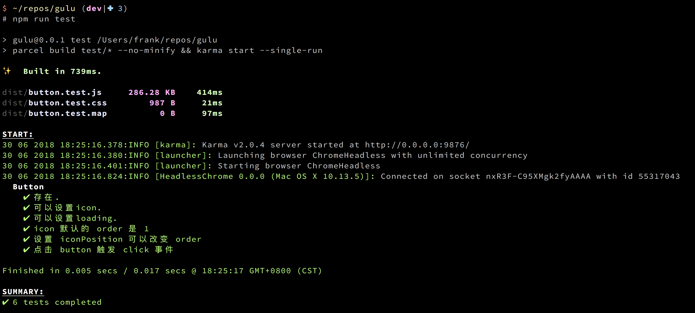

# 框架搭建 & 持续集成（下）

## ★课程简介

### ◇注意：Windows 用户运行 `npm run dev-test` 时会出现 BUG

1. 从这节课开始，你需要用 `npx parcel index.html --no-cache` 来开启项目（可以把这个命令写到 `npm start` 里）
2. Windows 用户运行 `npm run dev-test`时会出现 BUG，貌似是因为 Windows 不支持 `&&` 符号，解决办法是：将 dev-test 对应的命令  `parcel watch test/* --no-cache & karma start`分别运行，运行方式如下：
   1. 新开一个 Git Bash 窗口运行 `npx parcel watch test/* --no-cache`
   2. 再开一个 Git Bash 窗口运行 `npx karma start`

### ◇npm publish 遇到 403 怎么办？


首先看log里面有没有 taobao 字样（截图中有）

* 如果有这说明你没有切换到 npm 原始源，那么你只需要用 `npm config delete registry` 删除淘宝源，然后再 publish。
    publish 成功之后再切换回淘宝源 `npm config set registry https://registry.npm.taobao.org`
    如果嫌切换不方便，可以安装 [nrm](https://github.com/Pana/nrm) 来快速切换源。
* 如果没有 taobao 字样，继续往下看


看看 log 里面有没有「spam detection」字样

* 如果有
    这说明你的 package name 看起来像是 spam（垃圾邮件），你需要换一个更正常的名字。比如 `china-number-one-haha`
* 如果没有
    可能是你的 pacakge name 已经被人注册了，换个 name 试试

### ◇目录

1. 自动化测试
2. 持续集成
3. 重写所有代码
4. 发布 npm 包
5. 完善 README

## ★警告：npm link 在 Windows 上会抽风

如果你 npm link 之后项目报错，你就不要再用 npm link 了

你只需要每次改完代码后 npm publish ，然后再在另一个地方 npm install [xxx@0.0.x](mailto:xxx@0.0.x) 即可。

## ★自动化测试

### ◇使用 Karma + Mocha做单元测试

1. Karma（`[ˈkɑrmə]` 卡玛）是一个测试运行器，它可以呼起浏览器，加载测试脚本，然后运行测试用例
2. Mocha（`[ˈmoʊkə]` 摩卡）是一个单元测试框架/库，它可以用来写测试用例
3. Sinon（西农）是一个 spy / stub / mock 库，用以辅助测试（使用后才能理解）

### ◇步骤

1. 安装各种工具
   `npm i -D karma karma-chrome-launcher karma-mocha karma-sinon-chai mocha sinon sinon-chai karma-chai karma-chai-spies`

2. 创建 karma 配置

   ```js
   // 新建 karma.conf.js，内容如下
   module.exports = function (config) {
     config.set({
   
       // base path that will be used to resolve all patterns (eg. files, exclude)
       basePath: '',
       // frameworks to use
       // available frameworks: https://npmjs.org/browse/keyword/karma-adapter
       frameworks: ['mocha', 'sinon-chai'],
       client: {
         chai: {
           includeStack: true
         }
       },
   
   
       // list of files / patterns to load in the browser
       files: [
         'dist/**/*.test.js',
         'dist/**/*.test.css'
       ],
   
   
       // list of files / patterns to exclude
       exclude: [],
   
   
       // preprocess matching files before serving them to the browser
       // available preprocessors: https://npmjs.org/browse/keyword/karma-preprocessor
       preprocessors: {},
   
   
       // test results reporter to use
       // possible values: 'dots', 'progress'
       // available reporters: https://npmjs.org/browse/keyword/karma-reporter
       reporters: ['progress'],
   
   
       // web server port
       port: 9876,
   
   
       // enable / disable colors in the output (reporters and logs)
       colors: true,
   
   
       // level of logging
       // possible values: config.LOG_DISABLE || config.LOG_ERROR || config.LOG_WARN || config.LOG_INFO || config.LOG_DEBUG
       logLevel: config.LOG_INFO,
   
   
       // enable / disable watching file and executing tests whenever any file changes
       autoWatch: true,
   
   
       // start these browsers
       // available browser launchers: https://npmjs.org/browse/keyword/karma-launcher
       browsers: ['ChromeHeadless'],
   
   
       // Continuous Integration mode
       // if true, Karma captures browsers, runs the tests and exits
       singleRun: false,
   
       // Concurrency level
       // how many browser should be started simultaneous
       concurrency: Infinity
     })
   }
   ```

3. 创建 test/button.test.js 文件

   ```js
   const expect = chai.expect;
   import Vue from 'vue'
   import Button from '../src/button'
   
   Vue.config.productionTip = false
   Vue.config.devtools = false
   
   describe('Button', () => {
     it('存在.', () => {
       expect(Button).to.be.ok
     })
     it('可以设置icon.', () => {
       const Constructor = Vue.extend(Button)
       const vm = new Constructor({
         propsData: {
           icon: 'settings'
         }
       }).$mount()
       const useElement = vm.$el.querySelector('use')
       expect(useElement.getAttribute('xlink:href')).to.equal('#i-settings')
       vm.$destroy()
     })
     it('可以设置loading.', () => {
       const Constructor = Vue.extend(Button)
       const vm = new Constructor({
         propsData: {
           icon: 'settings',
           loading: true
         }
       }).$mount()
       const useElements = vm.$el.querySelectorAll('use')
       expect(useElements.length).to.equal(1)
       expect(useElements[0].getAttribute('xlink:href')).to.equal('#i-loading')
       vm.$destroy()
     })
     it('icon 默认的 order 是 1', () => {
       const div = document.createElement('div')
       document.body.appendChild(div)
       const Constructor = Vue.extend(Button)
       const vm = new Constructor({
         propsData: {
           icon: 'settings',
         }
       }).$mount(div)
       const icon = vm.$el.querySelector('svg')
       expect(getComputedStyle(icon).order).to.eq('1')
       vm.$el.remove()
       vm.$destroy()
     })
     it('设置 iconPosition 可以改变 order', () => {
       const div = document.createElement('div')
       document.body.appendChild(div)
       const Constructor = Vue.extend(Button)
       const vm = new Constructor({
         propsData: {
           icon: 'settings',
           iconPosition: 'right'
         }
       }).$mount(div)
       const icon = vm.$el.querySelector('svg')
       expect(getComputedStyle(icon).order).to.eq('2')
       vm.$el.remove()
       vm.$destroy()
     })
     it('点击 button 触发 click 事件', () => {
       const Constructor = Vue.extend(Button)
       const vm = new Constructor({
         propsData: {
           icon: 'settings',
         }
       }).$mount()
   
       const callback = sinon.fake();
       vm.$on('click', callback)
       vm.$el.click()
       expect(callback).to.have.been.called
   
     })
   })
   ```

4. 创建测试脚本

   在 package.json 里面找到 scripts 并改写 scripts

   ```json
   "scripts": {
        "dev-test": "parcel watch test/* --no-cache & karma start",
        "test": "parcel build test/* --no-minify && karma start --single-run"
    },
   ```

5. 运行测试脚本

   1. 要么使用 `npm run test` 一次性运行

      

   2. 要么使用 `npm run dev-test` 进行 watch 运行

      

### ◇成果

如此一来，你开发的时候新开一个命令行窗口运行 `npm run dev-test` 就可以实时查看测试结果。
如果你只想看一次结果，就只用运行 `npm run test`

## ★发布 npm 包

### ◇确保你的代码测试通过了

`npm run test` 全部是绿色（原谅色）才行。

### ◇上传代码到 npmjs.org

1. 更新 package.json
   1. 在 package.json 里将版本号改为 0.0.1，等我们做完了再改成 1.0.0
   2. 创建 index.js，在 index.js 里将你想要导出的内容全部导出
2. 去 <https://www.npmjs.com/> 注册一个账户
3. 确认一下邮箱（必须）
4. 在 gulu 项目根目录运行 npm adduser
   - 如果错误提示里面含有 [https://registry.npm.taobao.org](https://registry.npm.taobao.org/) 则说明你的 npm 源目前为淘宝源，需要更换为 npm 官方源
5. 运行 npm publish

### ◇使用自己的包

1. 预测其他使用你的包的人会怎么使用
   - 使用 vue-cli
   - 使用 webpack
   - 使用 parcel
2. 分别使用这些方式来使用自己的包（我们只以 vue-cli 为例）
   1. 使用过程中我们发现报错说 import 语法有问题，那时因为 node 目前确实不支持 import，我们需要用 babel 转译 import
      1. 你可以要求使用者自己用 babel 来转译
      2. 你也可以转义好了再给他用
         - `npx parcel build index.js --no-minify` （本来不应该加 --no-minify 的，奈何不加会有 bug，HTML 压缩把 slot 标签全删了）
         - 将 package.json 的 main 改为 dist/index.js
3. 使用 npm link 或者 yarn link 来加速调试
   1. 你每次修改源码之后，有两条路让别人得到最新效果
      1. 更新 package.json 里的 version，然后 npm publish。别人通过 npm update xxx 来更新。
      2. 如果你只是为了本地调试，可以在项目目录使用 npm link，然后在使用之处运行 npm link xxx，就是最新了

## ★持续集成

我们一开始要自己打开 Chrome 测试我们的代码
后来使用 Karma 可以做到一行命令测试我们的代码

想一想，还能不能再自动化一点。

这就是持续集成

---

