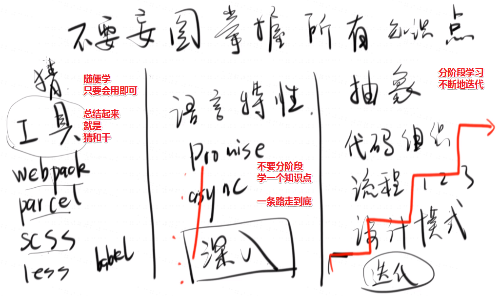

# 框架搭建 & 持续集成（中）

## ★添加icon

## ★Q&A

### ①前端有很多知识点，那么我们该如何把这些知识点都掌握好呢？

答案是： 不要妄图把所有知识点都掌握好！

前端的一个特点就是非常的宽泛，像后端呢？可能就更集中一点了，就那一圈知识点，但是需要很深入去理解它们！而前端我们就需要知道很多点了！

大部分知识，我们可以分为三类知识：

- 工具类（特点是大概过一年就全都没有用了）：webpack……

  现在很火的一些东西全都属于工具，假设有一天出了一个新工具比webpack还好用的话，那么webpack就是辣鸡了！所以说这种工具是更新特别快的！

  总之，一句话概括这类知识的学习就是「**知道怎么用就行了！**」，贯穿它们的学习的靠「**猜**」

- 语言特性（不会去刻意讲，用到的时候说，用不到的时候就不说）：Promise、async……

  对于这类知识，我们要深入了解才行！

- 抽象（靠时间堆积，慢慢地去迭代学习）：代码如何组织、写代码时想什么做什么的流程（如第一步做啥、第二步做啥、第三步做啥……）、设计模式、迭代……

  关于这类知识，我们会通过迭代的姿势去讲，去理解，而迭代就是从一个「基本的点」，然后过几天再升一个级，如走台阶一样……像是语言特性这类知识，就是直接一条线一下子深到最下面去了，把它所有的用法全都给了解了，而且**不要分开学**，即学一点Promise的内容，然后过几天再学一点……这样的不断深入！

总之，工具随便学，只要会用即可！

一图概括之：

> 我最近看的JavaScript忍者秘籍2就是这样，涉及到语言特性，那就是不断深入干到底呀！如讲一个函数需要讲4个章节，155页的内容！
>
> 之前学习的parcel，就是安装，然后打包运行测试即可！
>
> 至于抽象类的知识，就是做项目了！

