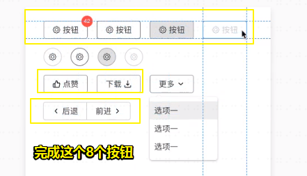
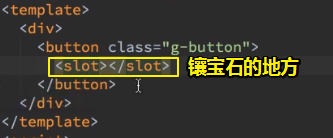
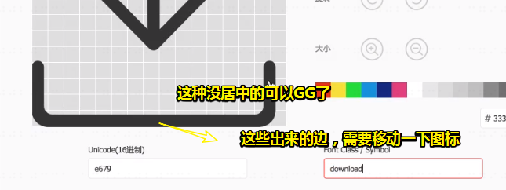
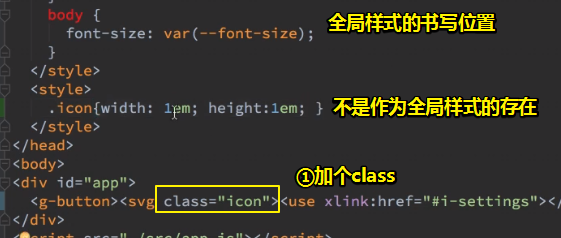
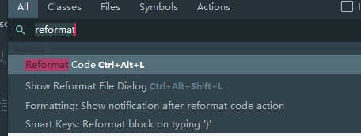
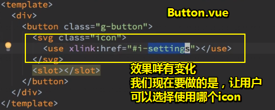
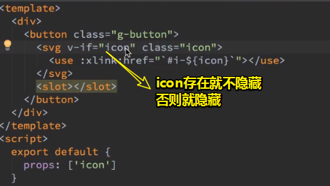
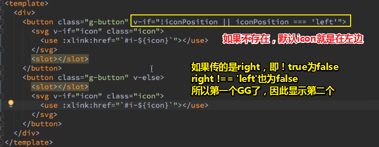

# 框架搭建 & 持续集成（中）

## ★添加icon

> 今天的任务：**把button全部实现，重点是单元测试！**

### ◇测试之前的代码能否正常运行

运行之前的代码，直接用webstorm打开页面，结果报错了：


于是我们用了log大法（工具类知识，会用即可）：


> 我们的代码就注册了一个全局组件而已

结果：


由于我们这个代码过于简单，且代码量少得可怜，所以不应该是我们代码的问题，而是很有可能是工具的问题，即parcel的问题：（估计是缓存的问题）


清空缓存重新编译后，结果按钮也就出来了！报错信息什么的也不复存在了！

总之，确定代码没有问题的话，那么你就开始怀疑工具的问题，而且强烈认为这一定是工具的问题哈！毕竟我们这个代码实在是够简单的，是不可能出错的！

### ◇开搞

按钮里边的两个字应该传进去，而现在我们的代码所呈现的是写死的状态，即写死在button里边

接下来我们要做什么（根据样式，即设计稿来决定做啥）：



1. button里边的「文字」二字是可以直接传进去的
2. 搞icon
3. 搞两个放在一起的button

总之就是把8个按钮（除了那个下拉选择按钮）以及其样式做出来即可！

#### 处理文字

如果没有插槽，你把g-button当作是普通元素来使用的话，直接添加内容是没有效果的，因为此刻的作用域是属于`#app`的！为了可以让我们的g-button元素能像button元素一样使用，于是我们使用了slot，即插槽！

至此：


slot的作用就是把「我爱JS」这样的内容放到一个槽里边，这类似于暗黑破坏神里边的每个武器（button组件）都有一个镶宝石的地方，这个：



而我们宝石（我爱JS）就是从那个 g-button标签里边镶进去的！


#### 添加icon

设计稿中的icon，前端是搞不出来的，除非这是个简单，可能有点丑陋的icon，所以别想着自己去做一个icon出来！

因此，我们需要借助别人的工具，即去iconfont.cn里边找一些漂亮的icon出来！

关于icon的选择，尽量选简洁一点的！

**①图标选择好后，需要修改一下它们：**


**②项目编辑操作：**


**③图标修剪：**



还有一个细节：


处理「右」这个图标，如果我们直接去搜一个「右」图标的话，那么很有可能是跟这个左图标是不匹配的！

因此，根据这些图标是svg做的，即它们是可以编辑的，于是我们就把它下载下来，然后顺时针旋转个180°，接着就是上传到iconfont所对应的项目里边即可！

关于svg的编辑软件：Photoshop、sketch等都可以，在线编辑器都行，当然你用css也行！

**④上传到iconfont.cn：**


**⑤批量取色和生成代码：**


做完之后，我们拿到的JavaScript代码：


那么这个JavaScript代码怎么用呢？——可以查看帮助文档：「[代码应用](https://www.iconfont.cn/help/detail?helptype=code)」里边的「symbol引用」，看完这个小节，你就知道怎么用了！

需要注意的是，你拷贝的JavaScript代码是我们项目生成的那个，而不是文档里边所给出的那个！

至此，我们就把该JavaScript代码放到我们的index.html里边，你可以随便放：


效果：


以上的操作，归根到底就是想办法生成这个JavaScript，然后当浏览器解析到这个JavaScrip的时候，就会生成一个svg标签到页面里边去了！

> 以上是工具方面的知识，所以你只需要知道会用即可！

如何使用我们添加到页面上的那些图标？——可以参考文档


效果：


如何加默认样式呢？——为svg加个class属性，然后添加样式即可，需要注意的是这个可不是全局样式哈！所以不要把这个样式写到那个有 `*{padding：0；margin：0；}`的style标签里边去：



此刻，这个svg图标就咩有那么高和那么宽了：


> 以上就是对svg图标的引入方式的操作
>
> 回顾以前的做法，我们用的是雪碧图，而这个技术就目前而言早就过时了！
>
> 目前，我们用icon都不用雪碧图了！
>
> 关于em：1em与当前元素的字体大小相同（更具体地说，一个大写字母M的宽度）

话说，为什么我们要写em，而不是px呢？——因为我们的icon默认跟字一样高！而且我们不想管字有多高！或许你会说用这个不也行吗？


我们不需要这样做，我们只需要这个跟字体一样宽就好了，而高呢？在iconfont里边，所有图标的比例都是1:1的，所以你写一样的值就好了！

总之，这像个接力赛一样，A号选手接默认的棒，B号选手接A的棒，而不是把默认的棒给接了！

格式化代码，让代码好看起来：



目前的结果：


这是CSS最恶心的一个地方，CSS已经发展了这么多年了，但是简单的两个文字对齐都很难很难做！

#### icon动态化，父子通信

在说文字对齐之前，我们需要先来想一个问题「我们想要让svg图标与`我爱JS`这个图标对齐，我们应该在哪里写样式呢？」


我们应该在外面写样式，还是在按钮里边写样式呢？——额，表示懵逼，不理解你在说啥！

简单来说，就是假设我们不是写button的这个人（A），而是用这个button的人（B），你觉得B会在乎icon和文字是否对齐这个事儿吗？

显然，不会啊！B会认为「这个button组件应该帮我解决好啊！你凭什么要让我自己想这个问题，然后让我自己去解决呢？」

也就说，你要换位思考，去想想、去揣测一下使用这个button组件的人是怎么去想的！

举个栗子来说，有个开发者B在用你这个库，他会觉得这种写法


忒他妈蛋疼了，我不想写这么多字呀！

其实唯一重要的就是那个 `settings`，用于指明B想要哪个icon

因此，我们需要把这一坨东西写到button组件里边：



因此，我们需要让B传一个参数进来。那么Vue是如何接收外部的传参的呢？——使用props


让icon跟随B所传的参数动态变化起来：


用户的使用姿势：


> 第一次这样写很难接受，写熟了就很好懂了！
>
> icon属性似乎就只是个控制样式或者元素显示为何物的这么一个东西的存在！

不过，这有一个bug啊！即用户咩有传icon，也就是说它没有写icon属性，然后页面所呈现的效果还是有svg：


所以，你不能默认用户B会传个参数给你，因此你得想办法把这个svg给隐藏起来才行哈！



当icon这个变量存在的时候，我才会出现svg，反之，则不出现！

目前的效果：


#### icon位置处理（if-else）

如果用户B想把icon放到文字的右边，那么这该怎么做呢？也就是说，我们现在需要加一个什么样的参数，可以让B选择把icon放到左边还是右边呢？或者说两边都有！

此时，我们该如何思考呢？而这就涉及到需求的分析问题了。


需求分析如下：

1. 排除两边都有icon的可能，毕竟如果两边都有的icon的这样一种情况，是很不常见的！当然，如果你非要做，也很简单，叫用户自己加一个就好了！
2. 左或者右这个需求是很常见的，可以做！

思路：

1. 在button组件里边，添加一个很直观的变量，用于接收用户传过来的参数—— `iconPosition`（只有两个值可取——left和right）

   

2. 假设用户传了个right过来，我们该如何让svg跑到右边去呢？有两种做法，第一种是 `if-else`：

   

   话说，这种写法到底好不好呢？如果是新手的话，这勉强还可以，但是如果说你想尽量做得好一点的话，那么这是不ok的！毕竟，这里得重复代码忒TM多了！

   那么我们该如何优化呢？——先一点点的来优化

3. 优化代码：

   判断语句有点复杂，由于left是默认值，所以我们换过来写会简洁很多：

   

   可见，我们简化了判断语句，但是还是存在重复的代码哈！根据这样一个原则「只要重复，就会有bug！」，为什么这么说呢？因为有时候你**改了上边那一处某个位置的代码，然后忘记了下边那一处代码同样的位置也需要改**，如那个  `:xlink:href`的值！

   那么我们该如何解决呢？——**我们尽量用CSS来做样式相关的东西！即使用CSS来做！**

测试：

1. 在根组件里边再次添加个g-button组件，而这次多追加一个属性—— `icon-position`（webstorm会有提示你加横杠），或许你会问，这个属性名跟我们在button组件里边定义的props数组里边所添加的 `iconPosition`变量不一致啊？HTML规范里说到，这里必须要用中划线写，而Vue会自动的把这种规范写法转成是大写的！

#### icon位置处理（CSS姿势）


## ★总结

- 当我想回顾之前学习vue时所作的笔记，我发现我看不懂我当时所写的笔记了！回想起芳芳所讲过的学习技巧：「忘记了，就去官网看！」，因此，我放下了笔记，转而去看官网的内容，如插槽的用法！
- 关于框架特性，也是需要我们去深入了解的，这就是我为啥买了一本叫「深入浅出vue.js」的书！

## ★Q&A

### ①前端有很多知识点，那么我们该如何把这些知识点都掌握好呢？

答案是： 不要妄图把所有知识点都掌握好！

前端的一个特点就是非常的宽泛，像后端呢？可能就更集中一点了，就那一圈知识点，但是需要很深入去理解它们！而前端我们就需要知道很多点了！

大部分知识，我们可以分为三类知识：

- 工具类（特点是大概过一年就全都没有用了）：webpack……

  现在很火的一些东西全都属于工具，假设有一天出了一个新工具比webpack还好用的话，那么webpack就是辣鸡了！所以说这种工具是更新特别快的！

  总之，一句话概括这类知识的学习就是「**知道怎么用就行了！**」，贯穿它们的学习的靠「**猜**」

- 语言特性（不会去刻意讲，用到的时候说，用不到的时候就不说）：Promise、async……

  对于这类知识，我们要深入了解才行！

- 抽象（靠时间堆积，慢慢地去迭代学习）：代码如何组织、写代码时想什么做什么的流程（如第一步做啥、第二步做啥、第三步做啥……）、设计模式、迭代……

  关于这类知识，我们会通过迭代的姿势去讲，去理解，而迭代就是从一个「基本的点」，然后过几天再升一个级，如走台阶一样……像是语言特性这类知识，就是直接一条线一下子深到最下面去了，把它所有的用法全都给了解了，而且**不要分开学**，即「学一点Promise的内容，然后过几天再学一点……」这样的不断深入！

总之，工具类随便学，只要会用即可！

一图概括之：


> 我最近看的JavaScript忍者秘籍2就是这样，涉及到语言特性，那就是不断深入干到底呀！如讲一个函数需要讲4个章节，155页的内容！
>
> 之前学习的parcel，就是安装，然后打包运行测试即可！
>
> 至于抽象类的知识，就是做项目了！

当然，后端的知识也是可以这样学的！

如果涉及到学习其它领域所有知识的套路的话，总结起来就是：

1. 对知识分类，针对每一类知识作出不同的学习策略！
2. 输出，如博客、项目……总之就是输出的结果，可以让我们能赚到钱、能帮助到人家、能让自己变得更好等等！

ps：我们上一节课所学的内容：

1. parcel
   1. [官方推荐的配置](https://cn.vuejs.org/v2/guide/installation.html#Parcel)
2. scss
3. Vue 单文件组件（着重学，相当于是vue的框架特性、同语言特性一样，同样是需要深入了解的）
4. WebStorm 的快捷键（愿意记就记，不愿意记那就算了）
5. CSS变量和:root选择器（属于语言特性，需要深入了解）
6. Vue.component（框架特性，需要深入了解）

### ②em单位的好处？

**➹：**[EM单位的好处是什么？ - 知乎](https://www.zhihu.com/question/23660843)

**➹：**[CSS: em, px, pt, cm, in…](https://www.w3.org/Style/Examples/007/units.zh_CN.html)


③ `aria-hidden="true"`？

使用icon图标的时候都有这个属性

```html
<svg class="icon" aria-hidden="true">
    <use xlink:href="#icon-xxx"></use>
</svg>
```

在屏幕阅读器看来，这个表明图标不需要朗读出来，只是单纯作为修饰之用！

**➹：**[aria-hidden="true"是什么意思 aria代表什么？_慕课问答](https://www.imooc.com/qadetail/62014)

**➹：**[Iconfont-阿里巴巴矢量图标库](https://www.iconfont.cn/help/detail?helptype=code)

