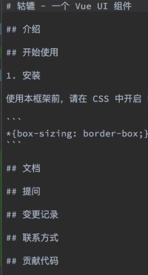

# 简单轮子：文本输入框

## ★课程简介

### ◇UI

<https://yuque.com/u29422/gulu/197282>

### ◇代码

<https://github.com/FrankFang/frank-test-1/blob/button-and-input/src/input.vue>

### ◇注意

1. 从这节课开始，你需要用 `npx parcel index.html --no-cache` 来开启项目（可以把这个命令写到 `npm start` 里）

2. Windows 用户运行 `npm run dev-test` 时会出现 BUG，解决办法是：

   将 dev-test 对应的命令 `parcel watch test/* --no-cache & karma start` 分别运行，运行方式如下

   1. 新开一个 Git Bash 窗口运行 `npx parcel watch test/* --no-cache`
   2. 再开一个 Git Bash 窗口运行 `npx karma start`

## ★如何书写README（遇到一个BUG）

### ◇收尾工作

> 上节课遗留了一些问题，通过README归纳一下

#### 如何写一个规范的README？

> webstorm技巧：
>
> 
>
> 注意，不要在你的代码以及README里边出现公司的密码以及你的密码、服务器密码之类的

那么如何写呢？

看看vue是怎么写的，然后你就尽量去模仿它即可，如

1. logo

2. 一堆标签

3. 浏览器兼容性

4. 谁支撑着Vue，如尤雨溪等，以及谁捐钱了，如xx机构，可见vue作者不需要在公司呆着就有收入了，毕竟有人或机构捐钱供其开发vue框架

5. 介绍

6. 生态系统：vue周边的一些工具

   

7. 文档

8. 问题

9. 提问（issues）

10. 变更记录：第一个版本有哪些东西，第二个版本有哪些东西……都要写在这里边

11. 如何取得联系方式

12. vue的源代码贡献者：主要是尤雨溪在编辑，但实际上全世界都有很多程序员在参与

所以可有我们这个UI库的README的大致结构：



至此，我们要写哪些内容基本上就弄完了

### ◇开搞

1. 得到持续集成的标（搜索关键字：travis ci badge）：[Embedding Status Images - Travis CI](https://docs.travis-ci.com/user/status-images/)

   

   [](https://travis-ci.org/ppambler/warm-ui)

   commit：`更新 README.md`

   使用 `git open`打开我们的当前项目的github

   那么除了加这个标以外，还能加哪些标呢？——搜索「npm badge」（badge：标记、徽章）

   找到一个标的集中营：<https://shields.io/category/analysis>，shield（盾牌、护照、盾形奖牌）

   总之，当你知道一个标怎么加之后，那么剩下的其它标的叫法，也就轻而易举了

2. 介绍一下我们这个项目。目前做个简单介绍就好，如 「这是我在学习Vue过程中做的一个UI框架，希望对你有用。」

3. 开始使用：

   1. 添加样式：

      

   2. 安装

      

   3. 引入：

      

      如何让用户不需要引入svg symbols，就能用svg图标呢？——很简单，你帮它引入即可

      

      

      

      


## ★总结


## ★Q&A

### ①.zshrc？


 `$1`就是函数参数，如：


被node这个程序或者说是进程给监听了

### ②如何杀死node进程？

```bash
killall node
```

Mac下也是这样做

**➹：**[ubuntu - How to kill a nodejs process in Linux? - Stack Overflow](https://stackoverflow.com/questions/31649267/how-to-kill-a-nodejs-process-in-linux)

### ③睡了一觉之后，发现啥也没做，结果用npx启动server之后，浏览器访问无效之后？

你可以：

1. curl一下：

   

   发现咩有结果

2. 猜测是否端口冲突，于是杀死所以node进程，再来一遍：

   

3. 是否是系统代理问题

4. 查看是否有node在监听1234端口

5. 换个浏览器

6. 删掉node_modules，重新下载npm包

7. 最终姿势：重启机器

不管怎样，很多时候你无须搞清楚为啥会这样，也许是你开的xxx程序把1234端口给怎么了。


