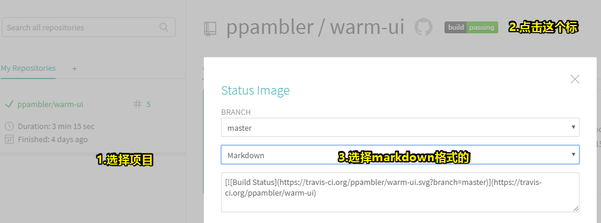
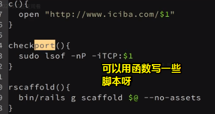
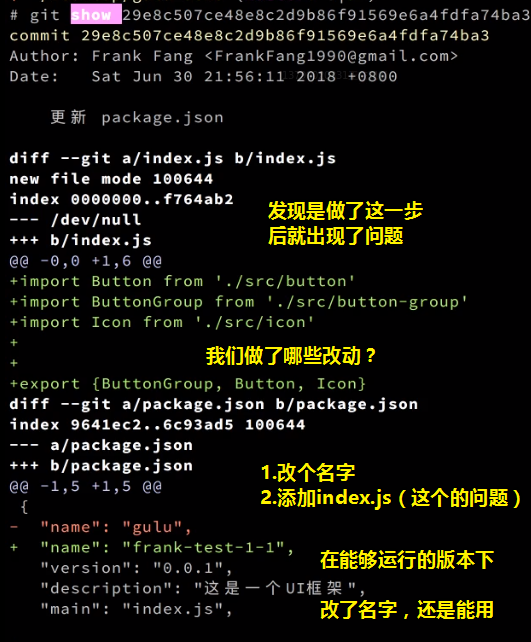

# 简单轮子：文本输入框

## ★课程简介

### ◇UI

<https://yuque.com/u29422/gulu/197282>

### ◇代码

<https://github.com/FrankFang/frank-test-1/blob/button-and-input/src/input.vue>

### ◇注意

1. 从这节课开始，你需要用 `npx parcel index.html --no-cache` 来开启项目（可以把这个命令写到 `npm start` 里）

2. Windows 用户运行 `npm run dev-test` 时会出现 BUG，解决办法是：

   将 dev-test 对应的命令 `parcel watch test/* --no-cache & karma start` 分别运行，运行方式如下

   1. 新开一个 Git Bash 窗口运行 `npx parcel watch test/* --no-cache`
   2. 再开一个 Git Bash 窗口运行 `npx karma start`

## ★如何书写README（遇到一个BUG）

### ◇收尾工作

> 上节课遗留了一些问题，通过README归纳一下

#### 如何写一个规范的README？

> webstorm技巧：
>
> 
>
> 注意，不要在你的代码以及README里边出现公司的密码以及你的密码、服务器密码之类的

那么如何写呢？

看看vue是怎么写的，然后你就尽量去模仿它即可，如

1. logo

2. 一堆标签

3. 浏览器兼容性

4. 谁支撑着Vue，如尤雨溪等，以及谁捐钱了，如xx机构，可见vue作者不需要在公司呆着就有收入了，毕竟有人或机构捐钱供其开发vue框架

5. 介绍

6. 生态系统：vue周边的一些工具

   

7. 文档

8. 问题

9. 提问（issues）

10. 变更记录：第一个版本有哪些东西，第二个版本有哪些东西……都要写在这里边

11. 如何取得联系方式

12. vue的源代码贡献者：主要是尤雨溪在编辑，但实际上全世界都有很多程序员在参与

所以可有我们这个UI库的README的大致结构：


至此，我们要写哪些内容基本上就弄完了

### ◇开搞

1. 得到持续集成的标（搜索关键字：travis ci badge）：[Embedding Status Images - Travis CI](https://docs.travis-ci.com/user/status-images/)

   

   [](https://travis-ci.org/ppambler/warm-ui)

   commit：`更新 README.md`

   使用 `git open`打开我们的当前项目的github

   那么除了加这个标以外，还能加哪些标呢？——搜索「npm badge」（badge：标记、徽章）

   找到一个标的集中营：<https://shields.io/category/analysis>，shield（盾牌、护照、盾形奖牌）

   总之，当你知道一个标怎么加之后，那么剩下的其它标的做法，也就轻而易举了

2. 介绍一下我们这个项目。目前做个简单介绍就好，如 「这是我在学习Vue过程中做的一个UI框架，希望对你有用。」

3. 开始使用：

   1. 添加样式：

      

   2. 安装

      

   3. 引入：

      

      如何让用户不需要引入svg symbols，就能用svg图标呢？——很简单，你帮它引入即可

      

      

## ★遇到xxx问题的解决思路？

问题：[③](#san)


## ★总结


## ★Q&A

### ①.zshrc？



 `$1`就是函数参数，如：


被node这个程序或者说是进程给监听了

### ②如何杀死node进程？

```bash
killall node
```

Mac下也是这样做

**➹：**[ubuntu - How to kill a nodejs process in Linux? - Stack Overflow](https://stackoverflow.com/questions/31649267/how-to-kill-a-nodejs-process-in-linux)

### <a id='san'>③睡了一觉之后，发现啥也没做，结果用npx启动server之后，浏览器访问无效之后？</a>

你可以：

1. curl一下：

   

   发现咩有结果

2. 猜测是否端口冲突，于是杀死所以node进程，再来一遍：

   

3. 是否是系统代理问题

4. 查看是否有node在监听1234端口

5. 换个浏览器

6. 删掉node_modules，重新下载npm包

7. 最终姿势：重启机器

不管怎样，很多时候你无须搞清楚为啥会这样，也许是你开的xxx程序把1234端口给怎么了。

然而重启机器之后，依旧无用

而这个时候，你需要注意的时候，一旦出现类似这样的问题，你就得先提交代码，这样你之前写的代码就不会消失了


commit之后，在执行这个命令，保证了我们的代码还能回来，不然一旦马虎了，代码也就GG了

回退之后， 请 `npm i`一下

保证之前安装的依赖

此时，倒是可以能访问server了

但是有点小问题

于是开始猜测我们之前是做了哪一步才会出现这样的问题

通过git log查看我们知道，我们使用二分法回到之前的版本，当然，你可以使用bisect这个工具来做到


**➹：**[Git 二分调试法，火速定位疑难Bug！ - 掘金](https://juejin.im/post/5a39dbfe6fb9a044fc44e0ea)

然而在`npm i`一下，结果又回到了之前无法在浏览器访问这个url的问题

当然，此时，我们又缩小了范围



nodejs的作者曾经说过一个问题：

他之前曾经把index.js文件当作是入口文件

即当我们运行 `npx parcel`的时候，首先找的文件是 index.js

简而言之，这命令等价于 `npx parcel index.js`

然而实际上我们要的是 `npx parcel index.html`

错误原因知道之后，就回到之前最后提交的那个版本


芳芳也不知道为啥要这样做，但是自己猜测就是ok的，而这样做确实成功了

总之，nodejs留了一个坑，而parcel又没有提示这个坑

总之，这个错误来自于我们需要导出我们需要的文件之后，就出错了，之前没有index.js这个文件之前是ok的，有了它之后就GG了

> 很多时候，你需要靠灵感来解决这些bug，如nodejs作者把index.js当作是入口文件

以上所有分析，都是芳芳的猜测

反正提高问题的解决效率，就能很快解决问题了

当然，如果你要证实这些分析，你要去看parcel代码了，去看看没有参数的时候会干嘛，如是找index.js还是index.html？


