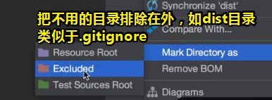
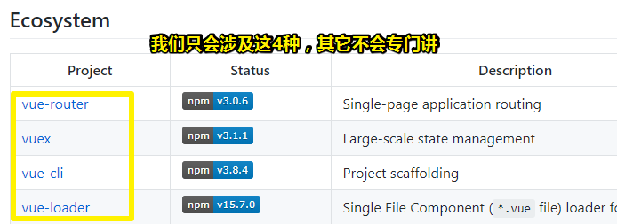
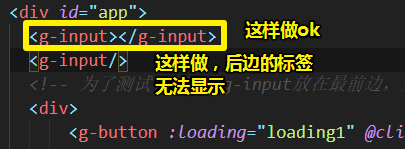
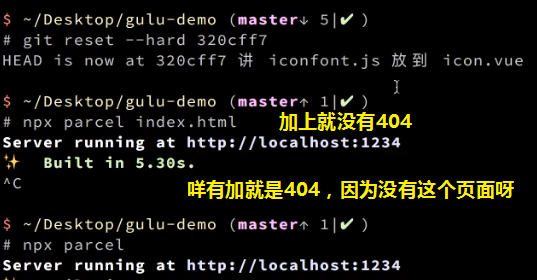
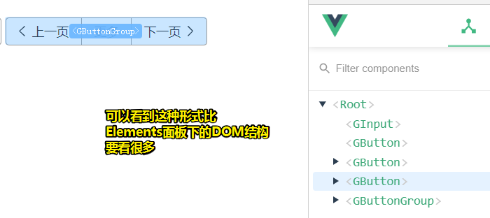
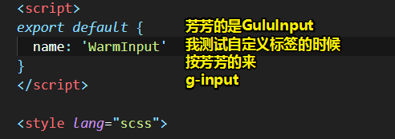
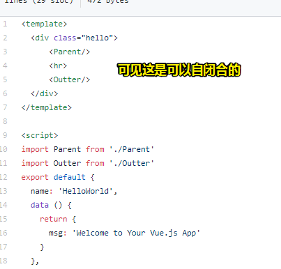

# 简单轮子：文本输入框

## ★课程简介

### ◇UI

<https://yuque.com/u29422/gulu/197282>

### ◇代码

<https://github.com/FrankFang/frank-test-1/blob/button-and-input/src/input.vue>

### ◇注意

1. 从这节课开始，你需要用 `npx parcel index.html --no-cache` 来开启项目（可以把这个命令写到 `npm start` 里）

2. Windows 用户运行 `npm run dev-test` 时会出现 BUG，解决办法是：

   将 dev-test 对应的命令 `parcel watch test/* --no-cache & karma start` 分别运行，运行方式如下

   1. 新开一个 Git Bash 窗口运行 `npx parcel watch test/* --no-cache`
   2. 再开一个 Git Bash 窗口运行 `npx karma start`

## ★如何书写README（遇到一个BUG）

### ◇收尾工作

> 上节课遗留了一些问题，通过README归纳一下

#### 如何写一个规范的README？

> webstorm技巧：
>
> 
>
> 注意，不要在你的代码以及README里边出现公司的密码以及你的密码、服务器密码之类的

那么如何写呢？

看看[vue](https://github.com/vuejs/vue)是怎么写的，然后你就尽量去模仿它即可，如

1. logo

2. 一堆标签

3. 浏览器兼容性

4. 谁支撑着Vue，如尤雨溪等，以及谁捐钱了，如xx机构，可见vue作者不需要在公司呆着就有收入了，毕竟有人或机构捐钱供其开发vue框架

5. 介绍

6. 生态系统：vue周边的一些工具

   

7. 文档

8. 问题

9. 提问（issues）

10. 变更记录：第一个版本有哪些东西，第二个版本有哪些东西……都要写在这里边

11. 如何取得联系方式

12. vue的源代码贡献者：主要是尤雨溪在编辑，但实际上全世界都有很多程序员在参与

所以可有我们这个UI库的README的大致结构：


至此，我们要写哪些内容基本上就弄完了

### ◇开搞

1. 得到持续集成的标（搜索关键字：travis ci badge）：[Embedding Status Images - Travis CI](https://docs.travis-ci.com/user/status-images/)

   

   [](https://travis-ci.org/ppambler/warm-ui)

   commit：`更新 README.md`

   使用 `git open`打开我们的当前项目的github

   那么除了加这个标以外，还能加哪些标呢？——搜索「npm badge」（badge：标记、徽章）

   找到一个标的集中营：<https://shields.io/category/analysis>，shield（盾牌、护照、盾形奖牌）

   总之，当你知道一个标怎么加之后，那么剩下的其它标的做法，也就轻而易举了

2. 介绍一下我们这个项目。目前做个简单介绍就好，如 「这是我在学习Vue过程中做的一个UI框架，希望对你有用。」

3. 开始使用：

   1. 添加样式：

      

   2. 安装

      

   3. 引入：

      

      如何让用户不需要引入svg symbols，就能用svg图标呢？——很简单，你帮它引入即可

      

      

## ★遇到xxx问题的解决思路？

问题：[③](#san)

这个思路一般是看不到的，只要遇到了才能讲，没有遇到的话说了你也不懂！


还做了添加一个index.js文件这样的变更，突然想起来nodejs作者说到一个坏的设计——index.js作为入口文件，于是怀疑是index.js的问题。

然后测试，果然是它的问题。

> 使用变量A、B这样来替代一个个版本，来讲解解决这个问题的思路

由于我们经常习惯性的 `npx parcel`这样

所以我们可以这样：


> 我在想是 npm start 而不是 npx start
>
> 
>
> 相当于是 执行了parcel index.html
>
> 难道npx 可以默认不写？即执行npm start 相当于是`npx parcel index.html`
>
> 而npx的作用之一就是让项目内部安装的模块用起来更方便
>
> 如之前：
>
> ```bash
>  npm install -D mocha
>  node-modules/.bin/mocha --version
> ```
>
> 现在：
>
> ```bash
> npx mocha --version
> ```
>
> 其原理很简单，就是运行的时候，会到`node_modules/.bin`路径和环境变量`$PATH`里面，检查命令是否存在
>
> 由于 npx 会检查环境变量`$PATH`，所以系统命令也可以调用。
>
> 所以我们可以这样：
>
> ```bash
> # 等同于 ls
> $ npx ls
> ```
>
> 
>
> 需要注意，Bash 内置的命令不在`$PATH`里面，所以不能用。比如，`cd`是 Bash 命令，因此就不能用`npx cd`。
>
> **➹：**[npx 使用教程 - 阮一峰的网络日志](http://www.ruanyifeng.com/blog/2019/02/npx.html)

接着，我们运行一下测试用例 `npm run test`看看能否跑通

查看最近一个版本的改动 `git show HEAD`

修改一下README（有关iconfont的引入），然后commit：`去除对 iconfont 的依赖`

接下来做另外一个轮子（第二个）——input

那么怎么做呢？

还是根据以前的思路来做一下这个需求：

1. input有哪几种用例以及有哪些状态

---

## ★input组件需求分析

### ◇分析input有哪些用例

> 或者说是使用场景
>
> 可以参照：[输入框 Input - Ant Design](https://ant.design/components/input-cn/)


目前先收集这些需求，等我们在做的时候，大脑就有个大概的map了，即我们要完成这个input组件的过程中，即中间要走的路需要关注以上这么几个点。

### ◇一个input有哪些状态？


1. 最典型的就是直接一个input框，告诉你这个框可以输入内容
2. focused状态，输入内容时，或者说按tab键定位到该input时，会有阴影之类的
3. hovered状态，鼠标移到input框上边，就搞点阴影
4. disabled状态，虽然你能看到文字，但是就不能给你输入
5. readonly状态，这个状态对于大家来说其实很模糊，而且我们经常性的和disabled状态给搞混起来了，即很难分得清此时的input是disable状态还是readonly状态。稍微解释一下，这个状态，其实很简单，就是我输入了文字，但是不能改。总之，其实它们俩其实没有啥区别，如果说有区别的话，那么disabled状态就是更强调你不能动这个input。（这个状态在页面期间，可以通过JS更改）
6. 错误状态，有5种情况：error（红色阴影）、error+focused（在error的状态下聚焦）、hovered（在error状态下hovered）……。其实说白了，上面1、2、3情况，就是输入前和输入时的状态，而错误状态则是输入结束后的状态
7. 成功状态，同样是，success、success+focused、hovered……

> 目前，我们在考虑有哪些状态的时候，就先都考虑完，至于要不要做，就看我们自己的时间了

总之正常情况下有15（3*5）种状态。

分别是：

1. normal态/error态/success态
2. hovered态
3. focused态
4. disabled态
5. readonly态

我们要完成哪些状态呢？

success这一类状态就不用写了，因为这normal态太像了，只需要改个颜色就好了

总之，我们一定要完成10个状态，即normal态和error态这两大类

> 有人说到warming态，其实理论上来说，这跟error态差不多。只是颜色变了而已，如变成黄色
>
> 而success态，则是绿色的、原谅色的……

### ◇UI

> 看一下我们的UI能否满足我们以上所说的那么15种状态


芳芳的设计想法：

> 左上角的是normal态，然后有个错误提示，即所谓的离开输入框后有个异步请求校验或者提交后报错

1. 有的时候我们需要一个很简洁的的输入框，即咩有label，然后加个提交按钮即可。加入输入不合法，那就报错呗，即最左上角那种
2. 更简洁的，一个input+按钮。它们俩之间没有空隙，跟我们之前的group-button组件一样，总之，就TM合在一起。
3. 有的时候需要做复杂的组件，如在input框的上边或左边有个label，然后默认会有个提示文字。当然如果错误了，其提示内容，可以放在input框的下边（假如一行放不下），总之，这应该是可以配置的

今天的内容看起来不多

但实际上做起来，其实这可能要比button还要复杂很多

毕竟，我们在分析状态的时候，它的状态要比button多

---

## ★写input样式

### ◇开搞

1. 在src目录下，新建一个input.vue，并写上基本的结构，即那3个标签呀——template、script、style：

   

   如果你从未遇到过咩有加上scoped后出现的bug，那么直接告诉你加上这个scoped，是会让你缺少一个知识的

2. 先写一个最简单标签

   > 去掉之前在app.js里边写的测试代码以及全局注册input组件
   >
   > 
   >
   > 目前先用最朴素的姿势来弄

   一个bug，我们知道input是没有子元素的，即它是自闭合的，那么我们在使用g-input标签理应是自闭合的才对，然而这样做却出错了，为啥会不行呢？为啥现实和理想中的情况会不一致呢？

   

   总之问题是：为啥自闭合不行呢？

   因为vue的文档里边说得很清楚了，当然，vue文档里边说到这个点其实是很不起眼的，但是很容易导致莫名其妙的bug出现。总之，这里边大概是说「**vue的模板使用的语法是HTML，而不是说它是XML语法**」

   我们这样做 `<g-input/>`其实是XML语法，因为这个语法允许我们自闭合呀，而HTML语法是允许自闭合的，或者说vue会优先认为自定义标签应该是不闭合的，由于我们这个是自定义标签，所以你还是老老实实写上闭合吧！

   而且你在单文件组件的template里边，也不能写自闭合。还有你只写这样也不行 `<g-input>`

   总之，你用自定义标签，那么你就加上结束标签

   > 以上介绍并不好理解，具体解释参考这个：[⑤](#wu)

   **➹：**[html自闭合标签加斜杠问题？ - 知乎](https://www.zhihu.com/question/33300917)

   

   

   

   

   


## ★总结


## ★Q&A

### ①.zshrc？


 `$1`就是函数参数，如：


被node这个程序或者说是进程给监听了

至此，我不需要之前的  latest.sh 了，因为我可以这样提交：


如果参数含有空格，那么你就加双引号


毕竟函数/脚本调用的最一般的写法是这样的：

```bash
函数名/脚本文件路径 参数1 参数2 参数3
```

**➹：**[SHELL与空格 - hyman.lu - CSDN博客](https://blog.csdn.net/gg_18826075157/article/details/78077602)

然而这做了，还是不行呀！依旧会报错

于是，继续找寻答案

发现了这种：

```bash
myFunction()
{
  echo "$1"
  echo "$2"
  echo "$3"
}
```

然而我测试了一下，还是不行

**➹：**[Passing a string with spaces as a function argument in bash - Stack Overflow](https://stackoverflow.com/questions/1983048/passing-a-string-with-spaces-as-a-function-argument-in-bash)

然而，最高票那么多赞，显然是我的bash有问题呀

于是，我们不用source .bashrc了

而是关掉bash，然后重新打开

而且我加了

### ②如何杀死node进程？

```bash
killall node
```

Mac下也是这样做

**➹：**[ubuntu - How to kill a nodejs process in Linux? - Stack Overflow](https://stackoverflow.com/questions/31649267/how-to-kill-a-nodejs-process-in-linux)

### <a id='san'>③睡了一觉之后，发现啥也没做，结果用npx启动server之后，浏览器访问无效之后？</a>

你可以：

1. curl一下：

   

   发现咩有结果

2. 猜测是否端口冲突，于是杀死所以node进程，再来一遍：

   

3. 是否是系统代理问题

4. 查看是否有node在监听1234端口

5. 换个浏览器

6. 删掉node_modules，重新下载npm包

7. 最终姿势：重启机器

不管怎样，很多时候你无须搞清楚为啥会这样，也许是你开的xxx程序把1234端口给怎么了。

然而重启机器之后，依旧无用

而这个时候，你需要注意的时候，一旦出现类似这样的问题，你就得先提交代码，这样你之前写的代码就不会消失了


commit之后，在执行这个命令，保证了我们的代码还能回来，不然一旦马虎了，代码也就GG了

回退之后， 请 `npm i`一下

保证之前安装的依赖

此时，倒是可以能访问server了

但是有点小问题

于是开始猜测我们之前是做了哪一步才会出现这样的问题

通过git log查看我们知道，我们使用二分法回到之前的版本，当然，你可以使用bisect这个工具来做到


**➹：**[Git 二分调试法，火速定位疑难Bug！ - 掘金](https://juejin.im/post/5a39dbfe6fb9a044fc44e0ea)

然而在`npm i`一下，结果又回到了之前无法在浏览器访问这个url的问题

当然，此时，我们又缩小了范围


nodejs的作者曾经说过一个问题：

他之前曾经把index.js文件当作是入口文件

即当我们运行 `npx parcel`的时候，首先找的文件是 index.js

简而言之，这命令等价于 `npx parcel index.js`

然而实际上我们要的是 `npx parcel index.html`

错误原因知道之后，就回到之前最后提交的那个版本



芳芳也不知道为啥要这样做，但是自己猜测就是ok的，而这样做确实成功了

总之，nodejs留了一个坑，而parcel又没有提示这个坑

总之，这个错误来自于我们需要导出我们需要的文件之后，就出错了，之前没有index.js这个文件之前是ok的，有了它之后就GG了

> 很多时候，你需要靠灵感来解决这些bug，如nodejs作者把index.js当作是入口文件

以上所有分析，都是芳芳的猜测

反正提高问题的解决效率，就能很快解决问题了

当然，如果你要证实这些分析，你要去看parcel代码了，去看看没有参数的时候会干嘛，如是找index.js还是index.html？

### ④为啥我们要在声明一个组件的时候，要写name呢？

大部分时候写这个name是没有用的，当然，在调试的时候，就有区别了。

```vue
<template>
  
</template>

<script>
export default {
  name: 'xxx'
}
</script>

<style lang="scss">

</style>
```

那么有名字和没名字的区别是怎样的呢？

很简单，你安装个vue开发者插件就知道了

安装后之后，刷新页面，重新打开开发者工具，你就会看到一个叫Vue的面板

可以看到：



关于name的值：

一般是按照我们所写的自定义标签名来，毕竟可以一一对应

如果写了 `name:"x-input"`，那么显示的结果就是 `XInput`

如果你不写，那么就根据你所写的自定义标签来大驼峰化了

而我们写单文件组件时的组件名，一般也是大驼峰命名，即如果你是input.vue，那么通常来说应该是Input.vue才对

而name则是与单文件组件名一致，这样文件名与调试时所呈现的组件名也就是一致的。

总之，name是用来调试的，方便你知道这个组件是什么，不然，就是拿变量名


所以可有：



总之，照理说，我的自定义标签应该改为  `w-input`哈！

但为了方便抄芳芳的代码，我只好用 `g-input`了。

### <a id="wu">⑤字符串模板和HTML模版的区别？</a>

字符串模板与非字符串模板(DOM模板或HTML模板)

字符串模板：

```js
Vue.component('c-first',{
 template: '<div>c-first用在了字符串模板中！</div>'
});
new Vue({
  el: '#app',
  data: {
    htmlStr: '<cFirst>c-first的使用算字符串模板</cFirst>'
  }
})
```

HTML模板：

```html
<div id="app">
  <div v-html="htmlStr"></div>
</div>
```

再看这个规则：

> **在单文件组件、字符串模板和 JSX 中没有内容的组件应该是自闭合的——但在 DOM 模板里永远不要这样做。**
>
> 自闭合组件表示它们不仅没有内容，而且**刻意**没有内容。其不同之处就好像书上的一页白纸对比贴有“本页有意留白”标签的白纸。而且没有了额外的闭合标签，你的代码也更简洁。
>
> 不幸的是，HTML 并不支持自闭合的自定义元素——只有[官方的“空”元素](https://www.w3.org/TR/html/syntax.html#void-elements)。所以上述策略仅适用于进入 DOM 之前 Vue 的模板编译器能够触达的地方，然后再产出符合 DOM 规范的 HTML。

好例子：

```vue
<!-- 在单文件组件、字符串模板和 JSX 中 -->
<MyComponent/>
<!-- 在 DOM 模板中 -->
<my-component></my-component>
```

在我的测试里边单文件组件里边同样不能用自闭合标签啊！然而照理说是可以写自闭合标签的。



哎，不管了，反正我就死写闭合标签

反正，挂载点——DOM里边，你写的自定义标签一定要闭合。

**➹：**[风格指南 — Vue.js](https://cn.vuejs.org/v2/style-guide/index.html#%E8%87%AA%E9%97%AD%E5%90%88%E7%BB%84%E4%BB%B6-%E5%BC%BA%E7%83%88%E6%8E%A8%E8%8D%90)

**➹：**[Vue文档中的字符串模板和HTML模版的区别？ · Issue #5 · GeekaholicLin/fragment](https://github.com/GeekaholicLin/fragment/issues/5)

