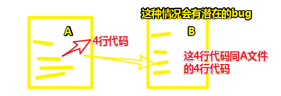

# 简单轮子：网格系统（下）

## ★重构与重写

我们之前 基本实现了 row 和 col 的功能。

由于全是CSS，以致于并不知道如何测，所以就不写关于它的单元测试了，毕竟眼睛直接看效果会好使很多。

接下来，大概一半的时间写基本思路；剩下的一半时间就是把之前所写的代码给删掉，然后重写。

那么哪种情况下要重写代码呢？或者说哪种情况下要重构？

简而言之，就是判断依据是啥？

### ◇重构与重写的区别？

#### 误区

很多人不理解重构，而这些人都把重构理解成了重写。

而且很多人认为重写仅仅就是把某个功能的代码全部给删掉，然后再重写一遍（行为上的重写），即认为改一点代码不算是重写，算是重构。

> 其实对代码的一种遗忘，然后再回忆理解，也是一种精神上的重写。当然，如果你记忆力牛逼，当我没说。

#### 区别

- 重构就是通过一些**微小的调整**，使你的代码变得更好，并且持续的去做微小的调整，而这就是重构啦！而其中的重点就是「微小的调整」
- 重写就是**大调整**

#### 一个重写场景

很多时候我们在做工程师的时候，会遇到这么一个情况：「由于时间很仓促，所以我们急急忙忙地写完了代码，然后第二天就发布了，同时我们知道代码很烂，但是我们安慰自己说『这没有关系，等我们有空了，我就会把我的烂代码给重写一下』，或者说是重构一下，这都无所谓」

总之，「一旦我有空了，我就会去改代码 」这句话或多或少会对自己或者其它人说过。

如果真得说过这样的话，那么你就真得完全错误的理解了重构和重写

因为只要你说了「一有空就去做什么」，而这一定就是重写啦！而不是所谓的「重构」

毕竟，当你积累了一大堆的问题之后，这个时候再去写的话，这是很难写的。

此时，你只能删掉，然后再重写。

毕竟，你不可能把历史的bug、这么错综复杂的代码给理清楚。

#### 一个重构场景

什么情况下我们才叫真正的重构呢？

你只要记住一句话即可「重构是每天都要做的事情」

而重写则是「隔一段时间做」，这跟你要改的代码多少没有关系，你不能说改一小点代码就不是重构了，当然，这说法是大概率是这样的。

#### 什么时候重构，什么时候重写

- 重构：每天做。如果不每天做，那么就是骗自己，即所谓的「一有空就去做」
- 重写：隔一段时间做。你骗自己，那就是费时费力的重写。

**为啥重构要每天做？**

你完成一个小功能，你就应该重构一下代码，再完成一个小功能就再重构，不存在什么我完成10个、100个功能之后再重构，毕竟你这个时候你都不知道你7天前做了什么功能，所以你还要重构什么呢？你还得要重想一遍代码呀！所以，这时候你会发现这不是重写吗？我TM以前写的代码都忘记了，让我再想一遍当初的逻辑，这岂不是相当于是全部重写一遍代码？

> 所谓的重写并不是说你改了多少行代码，而是说你对这段的代码已经遗忘了，你想「重构」一下这段代码，其实，这个实际上，你TM是在重写啊！因为你需要重新理解或者重想一遍代码的逻辑，即便你修改这段代码的代码量并没有多少。

总之，不要去做重写这件事情，也不要相信自己会去做这件事情。

### ◇哪些代码需要重构？

#### 特征

有一些很明显的特征：

1. 重复2次及以上的代码
2. 一眼看，看不懂的代码

#### ①重复2次及以上的代码

解释一波：

什么叫「重复2次及以上的代码就需要重构」呢？

比如说，你发现有一个功能经常写，于是你在A文件写一次，B文件再写一次。

那么什么时候会出现bug呢？

突然有一天，你发现这4行代码有bug，于是你发现B文件有这4行代码。于是你就更新了B文件的这4行代码，如添加一行新的代码，此时这个功能是5行代码。

你以为这样就完事了，但其实你忘了还有一个地方，如A，也用到了这4行代码。

不要觉得自己不会忘记自己曾经所写的代码，比如我现在就忘记了button组件是怎么写的了。

总之，没有人记得上一个功能是在哪个文件写的，所以说遗忘是件很正常的事。

所以，这就有bug了呀，一旦你两个地方，只改了一个地方，那么另一个地方就有bug了。（如果用户出问题了，就不要说忘了改了）

解决方案：

- 一旦出现了相同的两段代码，那么你就把它们给提取出来，封装成一个函数，A文件需要该函数，就引入进来，然后传入相应的参数。同理，B文件也是如此。如果需要更新，那么只需要更新这个函数即可。

总之，**重复两次及以上的代码，如果你不改，那么很有可能会因为需求变更，而变成1/2的bug，1/3的bug等等**……

> 两处重复，改一处，那么总体上看，就会出现1/2的bug

有人问到「多少行代码算重复？3行？5行？」——这得看重复次数，即使是一行代码也算重复，毕竟即使是一行代码你也可以变成一个函数，如DOM API 选择一个元素。

总之，具体问题具体分析，没有具体行数说这就算是重复了。（直接看芳芳操作就好了）

#### ②一眼看，看不懂的代码

什么叫一眼看，看不懂的代码呢？

举个栗子你就明白了，如这个：

所以这个时候，我们就需要减轻眼睛的负担，让用户一眼就知道，我们在干什么

那么如何让用户知道呢？

很简单，你只需要加个中间变量就好了！

比如说 `:style`，其实这TM就是个对象而已，为啥不把它放在vm里边呢？

所以，有的时候重构并没有任何的逻辑优化，只是为了让用户能一眼看出来「这是什么玩意啊？这个对象colStyle是什么玩意儿啊或者说这个对象有几个key或者说这个对象到底是一个什么样的结构？」，反正就不需要做逻辑优化。

然而，你这样改了很有可能是有bug的，也就是说「**重构是有风险的，任何一个小重构都会有风险**」

就拿上边这个小重构的来说，你把它放在data里边，意味着，col一开始只会去读一次data里边的colStyle，毕竟这是个对象呀（引用地址没变）！简而言之，如果后面的this.gutter变了，colStyle它是不会变的

如果你想要「只要this.gutter一变，colStyle就变」，那么你应该用的是computed的属性，这在vue的文档里边说得很清楚

> - 对于任何复杂逻辑，你都应当使用**计算属性**。
> - **计算属性是基于它们的响应式依赖进行缓存的**。（依赖的this.gutter变化了，就会重写求值，即重新执行一遍函数，如果没有变化，就不会执行函数，直接拿到结果）
>
> **➹：**[计算属性和侦听器 — Vue.js](https://cn.vuejs.org/v2/guide/computed.html)

话说，gutter是什么时候变化的呢？——是在mounted之后才传进来的，而写成data的话，那么就只会在created的时候去读一次，之后就不会再读了。

至此，我们小重构一波，这个template模板也好看了很多，

同理，`:class`也要重构一波，毕竟也很长，而且还有 `&&`

而做法，也是用个中间变量，把它们给提取出来。

对了，你还得把内联的style给去掉，毕竟这显得很奇怪，当然我们这里添加的div只是为了做标记测试负margin而已，所以你可以无痛去掉它。

同样row组件里边的也要改一下。

至此，我们这两个组件看起来就显得很舒服了。

关于col里边的scss ，虽然看起不舒服，但没有办法，毕竟scss的语法就是有点丑。

总之，这两个组件，唯一除了css有点丑以外，都很好。

`commit：重构 row 和 col`

小结：

- 我们的重构就是把复杂的变成简易的
- 代码该是多少行数还是多少行数，不过清爽看很多
- 我们在学重构的时候，就不要一开始学什么原则，而是学一些小例子，于是你就会知道原来可以这样重构，可以那样重构，然后就ok啦

### ◇为啥需要computed的属性？

如果一个属性是根据另一个属性变的，那么你写在data里边是不会变的。

你应该写在computed里边，而这才会变。

总之，computed的好处就是gutter变了，colStyle也会变，而这也是**使用这个属性的经典场景**

总之，一个属性是根据另一个属性变的，那么你就不能把它放在data里边，而是放在computed里边。

### ◇提取变量法

如果要给我们这次的重构姿势叫个名字的话，那就叫做提取变量法，即把一个复杂的东西，取一个变量名，然后你用的时候就简单一点，即用个变量即可。

---

## ★手动测试

## ★总结

- 功能实现了，就马上commit，如之前 `基本实现了 row 和 col 的功能`
- 千万不要把无用代码提交到代码库里边，因为这很无聊，如`console.log()`等……
- 如果你隔了一段时间重想了某段代码，而你打算重构这段代码，而这TM的其实是在重写啊！

## ★Q&A

