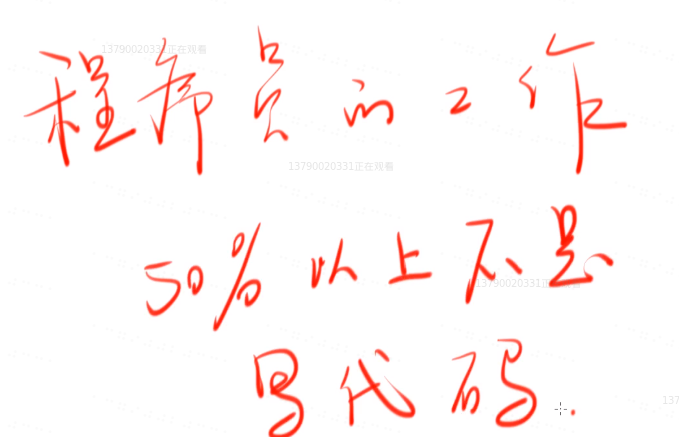
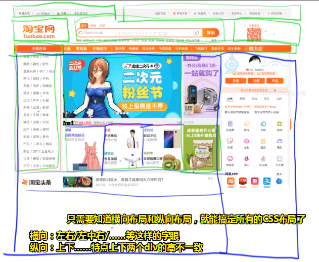
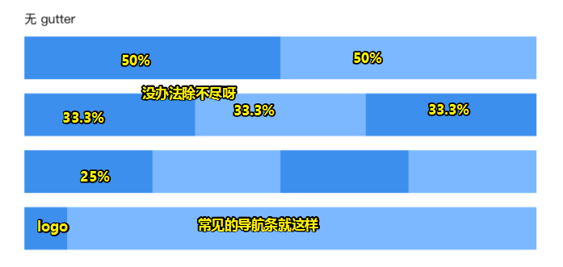

# 简单轮子：网格系统

## ★课程简介

网格系统

1. 什么是 Grid
2. UI
3. 代码
4. 测试

## ★讲义

### ◇什么是网格系统/栅格系统？

[知乎问答](https://www.zhihu.com/question/19602912)

就是把一个 div 分成 N 个部分（N = 12,16,24...），每个部分无空隙或者有空隙。
完。

### ◇设计图


[语雀链接](https://yuque.com/u29422/gulu/228198)

### ◇代码

[链接](https://github.com/FrankFang/frank-test-1/tree/grid/src)
请注意看 row.vue 和 col.vue，已经对应的 test 文件

### ◇测试

[代码](https://github.com/FrankFang/frank-test-1/blob/grid/test/row.test.js#L14)

这次测试多了一个知识点：done 的使用

---

## ★网格系统

### ◇回顾前几节课

01、02、03这三节课不记得讲了什么，也没有啥关系，你只需要记住一句话即可，而这句话需要在你的工作生涯里边反复的去理解，最终你会发现这句话是多么的真实。

那么这句话是什么呢？——那就是：



> 是工程师的工作，而不是程序员的工作

这句话就是前三课里边的核心内容啦！

可是，不写代码，我们能干嘛呢？

1. 你可以回顾一下我们整个网站的开发流程

你就会知道，剩下的不是写代码的50%工作是在讨论需求、跟UI设计师扯皮、跟后台设计师协商设计接口、测试……

这4项内容一定要超过工作内容的40%，至此，你才是一个合格的程序员，或者说应该是工程师（我们要做的东西是工程，你可以看到应聘岗位都叫前端工程师，而不是前端程序员），毕竟程序员主要是写程序的。

总之工程师和程序员的区别是：**工程师大部分的工作不是写代码，而程序员主要是写代码。**

越到高级你会发现，一开始你有90%的时间在写代码，后来80%、40%、30%，最后你做到高级程序员，你会发现我只需要有10%的时间在写代码就已经非常不错了，即**一周能有一天写代码的时间就已经非常不错了，而这就叫做高级程序员啦，毕竟TA要关心很多其它的事情。**

话又说来，前三节课所讲的内容是50%以上的时间不是在写程序，而45课则是告诉大家「如果你要从0开始搭建一个稍微大型一点的项目，你要考虑哪些东西？」

比如你要用哪些工具、哪些测试框架、以及我要如何去分我的目录之类的……

接下来的几节课就专心写代码吧！不用去管那些配置之类的问题了，总之之后就不停地写代码就好了。

### ◇什么是网格系统？

在一些地方也可以叫栅（读zha吧，如果你喜欢可以读shan）格系统

那么它是什么呢？——你可以到知乎里边搜搜

但其实它并没有明确定义，当然，我们自己可以给它一个定义：

> 就是把一个 div 分成 N 个部分（N = 12,16,24...），每个部分无空隙或者有空隙。

网格系统是**Web设计师**的一个方法论，注意这不是前端的一个方法论

我们以淘宝为例，看看淘宝是否使用了网格系统，当然它或许不是一个非常典型的网格系统，但是我觉得它应该也是用到了：



我们可以用眼睛来看看淘宝首页的结构是怎样的，如

从上往下看（分析）：

1. 左右结构
2. 左中右结构
3. ……

在CSS里边有个特别简单的规则，在CSS grid （未来的语法）出来之前，CSS只有两种布局，一种是横向布局，一种是纵向布局。

你可以看到左右结构是横向布局，如果你把左右两部分当作一个整体，把左中右这三部分同样当作是一个整体，那么这两个整体之间就是上下布局啦！

而每个上下布局里边就是左右和左中右结构啦！

而左中右的中，又是上中下这样的纵向布局！


除了这横向和纵向两种布局方式以外，就没有其它布局方式了。

而我们的网格系统主要研究的是「如何做横向布局？」

继续分析淘宝首页：


> 有种木桶效应的感觉，如果一个div针对水平另一个div来说是短板，那么这个短板很有可能是因为上下结构而来的。
>
> 

经过分析之后，你可以发现，CSS的所有布局方式都可以简化为横向布局和纵向布局

可是我知道这个又能怎样呢？

呵呵，知道这个之后，你就可以进一步去想想「我能不能把这种东西简化成一个组件呢？然后以后所有的横向布局和纵向布局都可以通过这个组件搞定！这样一来，就不用自己去想这些布局该如何写了」

于是，我们就借鉴了一个设计师的概念——栅格系统

而前端可没有这个概念，这个概念可是设计师发明出来的

### ◇看看芳芳的设计图

**➹：**[Grid · 轱辘 · 语雀](https://www.yuque.com/u29422/gulu/228198)

无Gutter：



水平div之间是没有空隙的，而这个空隙在英文里边叫做Gutter（中间有一条小沟）

如果你想要让它们俩中间有空隙，那么就是这样：


那么我们现在要做一个什么样的东西呢？——能实现左右布局，而且可以有空隙，也可以没有空隙，而这就是我们的目的啦！
在这里用例就不用画了，即那些所谓的交互。毕竟它就是一种CSS布局而已

既然如此，那么我们只好想想这API应该怎么设计了？

### ◇API设计

> 这API该如何设计呢？即这自定义元素的DOM该如何写呢？

假设一个用户使用你的组件，你觉得他会怎么使用？

当然，你可以去参考一下各个大牌的UI厂商是怎么做的：

**➹：**[组件 - Element](https://element.eleme.cn/#/zh-CN/component/layout)

**➹：**[栅格 Grid - Ant Design](https://ant.design/components/grid-cn/)

**➹：**[栅格 Grid - Ant Design Vue](https://vue.ant.design/components/grid-cn/)

芳芳主要参看ant design 是怎么做的

分析如下：


而ele则是这样的：


> 如果你发现打开ele很慢，那么你就打开network看看是哪个请求慢了

不管怎样，一般我们在设计轮子的时候，一定要防止「其它的轮子做成是圆的，而你的轮子则是做成方的」

通过对比，我们打算仿制的是ant design的

接下来，让我们来想想我们应该做成什么样的：

1. 做个左右结构，左边50%，右边50%。

   ```vue
   <g-row>
   	<g-col></g-col>
   	<g-col></g-col>
   </g-row>
   ```

   上边这种姿势并不好，因为你内置自动计算为50%，可是假如是40% 和 60%呢？这该怎么自动计算？
   所以我们设置了这样一个规则，默认整体的宽度为24，当然，也有人搞为12和16的，不过这都没有24好算。

   如果左右50%，那么一个div的跨度（span）就是12了。

   

   所以你应该这样（表示我各占一半）：

   ```vue
   <g-row>
   	<g-col span="12"></g-col>
   	<g-col span="12"></g-col>
   </g-row>
   ```

   同理，其它的也是如此。

2. 如果一列有三个，那么写三个g-col，跨度（24/3）都为8。

3. 如果logo占用1/12，那么就是2和22啦

4. ……

通过上边这样的语法，就可以表达无gutter这样的布局。

那么有gutter，即row div 里边有空隙呢？

在这里我们可以看到，其实每个空隙都是相等的，如果空隙不相等，是比较难弄的，当然，我们只满足相等的即可！

那么相等的gutter该怎么写呢？

直接写到g-row里边：

```
<g-row gutter="12">
	<g-col span="12"></g-col>
	<g-col span="12"></g-col>
</g-row>
```

同理，其它的g-row的gutter也是12，而不是8、6之类的。

到此为止，我们已经把一个简单的需求——把如何设计API给写完了，即不用去想用例（交互），只需要想用户怎么用就好了

有人问到「栅格有什么用呢？我工作中并没有用到。」

做出来之后，你就知道有什么用了，比如做个淘宝布局，用我们这个栅格布局，那是分分钟的事儿啊！

> 如果轮子的UI设计跟ant design、ele等重复了，你说会侵权吗？
>
> 或许他们并咩有打算说自己的这么一个框架可以用20年，所以就先这样设计一下呗！你爱重复就重复……

既然API写好了，那么接下来我们就可以开始写组件了。

## ★git branch & git checkout 的使用

在正式开始写组件之前，来稍微学习一下一个知识点：「git branch如何使用」

根据芳芳的实际工作经验来说：

1. 发现一些老员工反而不会用这个命令，毕竟他们以前主要用的是svn，而git branch 他们有点难理解，毕竟一旦你习惯了某种姿势做一件事，那么再转过来，其实是件很困难的事儿

   总之，如果你一开始用的是git，那么你就会对git branch理解得更好一点。

   像是芳芳就是很理解git branch怎么用了，也很经常用。但是理解svn的branch就不怎么好理解了，而且也不敢用，毕竟怕自己用错了，而git就可以随便用啦！

### ◇ git branch的用法？

为啥需要？


> HEAD：在git里边表示当前所处的提交名字，即最开头的

如果我们在原来的基础上继续写这个布局组件的话，那么这就会有一个很大的问题呀！

比如说，我们把所有组件都写完以后，那么这提交大概有几百次吧，那么当你回顾这个布局组件的提交过程时，显然，不知道在哪写提交记录是属于它的啊！

所以我们能否把每做一个阶段的代码都给保存一份呢？

形象点来说就是，你从出生到现在23岁，你每过一个生日都给你照张相，那么当你老了的时候，你就会想「我10岁时是长啥样的？」，于是你就拿出了一张自己10岁时的照片，一看「嗯，老太婆，你看我当初是不是风华正茂？」

芳芳是这样的比喻的：master是一个代码宇宙。建一个分支branch1，即把宇宙分裂开来！branch1是为当前的glog做了一次备份，之后我们继续在master里边提交代码。而branch1始终不变。

How？

新建一个branch分支（名字是button-and-input）：

```bash
git branch button-and-input
```

简简单单的一句话，就完成了芳芳所说的宇宙分裂。

总之，这句话执行了，此时还是处在master分支里边，代码啥的都咩有变化，说白了就是声明了一下宇宙一分为二了，一个叫master，一个叫button-and-input


此时你并没有切换分支，还是在master里边，于是，你创建了两个文件测试一下branch（button-and-input）里边会不有刚刚提交的新纪录：


目前这个button-and-input分支还在本地，所以我们需要把它push到远程分支里边去，那么这该如何push呢？

很简单，直接这样：


这句话说的是把本地的分支push到远程分支里边去。相当于到远程里边做了一个备份。

我们可以看到，这该命令之后，log出来的信息表示啥也没干，而远程仓库有个新的分支

远程仓库效果：


> 突然感觉github的存在就是让本地仓库可视化了。

我们在远程仓库里边很容易就能切换到另一个宇宙了，那么本地仓库切换宇宙呢？

同样很简单：


此时它的glog：


此时HEAD在button-and-input这个宇宙的里边，而且指向的是这个提交

所以当你切换到这个分支以后，你所看到的代码并咩有看到在你创建这个分支之后，而master又更新了最新的代码。

总之，你看到这个分支，是历史代码，这个代码未来会发生啥事情你都不知道，除非你切换到了master里边去。

一图胜千言：


> 之后会分裂十几次。

小结（回顾操作方法）：

1.  `git branch`：新建分支
2.  `git push orgin 本地分支名:远程分支名"`：把本地分支提交到远程分支里边去
3.  `git checkout`：切换分支

之后会讲到merge

**➹：**[创建与合并分支 - 廖雪峰的官方网站](https://www.liaoxuefeng.com/wiki/896043488029600/900003767775424)

> 我们本地分支是可以继续提交代码的，可是合并分支到master里边会出现啥情况呢？

有人问「为啥芳芳要讲Git呢？」——在芳芳看来，涉及到什么就讲什么

---

## ★用Vue钩子实现基本功能

之前介绍了git branch的使用，那么现在就回到正题啦！

> 关于webstorm的版本，请用最新版的。如芳芳目前的2018版对Vue的支持是非常好的，当然目前是2019年，那你就用2019年的版本咯！


## ★总结

- 为啥要写个网格系统组件？——那是因为在grid布局出来之前，CSS的所有布局方式都可以简化为横向布局和纵向布局，那么我们为何不把这种布局方式抽象为一个组件呢？这样一来，不用每写一个页面都得重新写一遍布局了。

- 为啥g-col需要span属性？——那是需要跨度；为啥g-row需要gutter属性？——那是需要间隙。

- 为啥要`git branch`？——我只想回顾有关布局组件实现的提交历史。而不是master里边的几百个commit。

- 我似乎养成了一套学习姿势：先why，后how，最后what。为啥要 `git branch`？如何做到 `git branch`？ `git branch`到底是啥？

  我之前了解过黄金圈法则，但是你问我为啥需要黄金圈法则呢？当时我是不知道的。而你现在问我，我可能会说「它可以让我对一个知识点记得更牢固一点。但是目前我并不能通过这个知识点做到举一反三。」

  不管怎样，我发现自己是进步了，这是件可喜的事儿，而这也是我之所以学习编程的缘故之一。

## ★Q&A

### ①为啥是xxx-xxx(g-row)？

关于g-row（为啥要加 `g-`），因为Vue官方建议自定义标签，最好是这样格式的 `xxx-xxx`，而这样可以避免万一哪一天「HTML6」出来了，然后自带了一个叫row的标签，这样一来岂不是跟我们的冲突了吗？所以我们应该尽量避免这种简单单词情况的发生，即我们要加个前缀 `g-`。可以看看ant design的vue实现：


React可没有这种打算，或许可以使用大写以作区别

至于为啥叫col，那是因为程序员习惯了叫col为列，即我们这个是习俗的叫法，所以入乡随乡，就叫它col好了。而它的全称是column（列、栏）。难怪叫通栏，二分栏……


