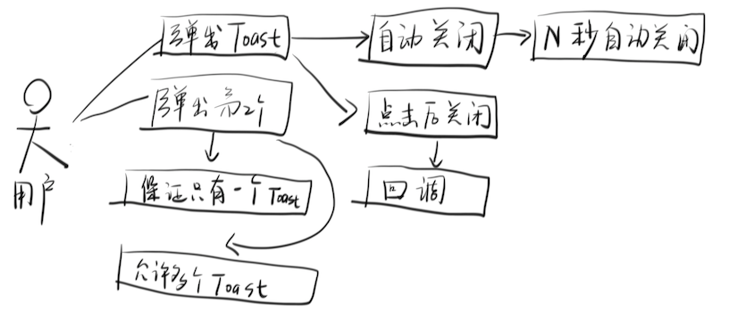

# 简单轮子：Toast 组件

## ★课程简介

- 代码
  <https://github.com/FrankFang/frank-test-1/blob/toast/src/toast.vue>

- UI
  <https://yuque.com/u29422/gulu/244946>

- 需求

  

  

## ★需求分析

### ◇注意点

- 所有样式相关的都不要写在JavaScript里边，除非你有强烈的动机要去写！如组件开发者是否需要帮助用户设置toast的宽高？——不需要，让用户自行设置样式

- 前端在设计UI时，主要考虑的是可用性，如toast的关闭按钮是`×`还是直接一个大大的关闭按钮，前者很有可能用户无法点击到，而后者则可以点击到，虽然后者较为丑点，但是可以轻松被点击到。

  

- 芳芳设计的UI组件样式可以自行配色

- 用户要如何使用这个Toast？即如何调出一个Toast？——用户的做法（点击某个东西触发一个回调咯）：

  ```js
  new Vue({
  	methods: {
  		showToast() {
  			//this.$toast('当前功能不稳定，如果遇到 bug 请关闭该功能')
  		}
  	}
  })
  ```

  我们应该为用户封装一个叫 `$toast`的API，当然，如果你怕用户记不住的话，你可以把它叫做 `$msg`

  那么我如何才能做到 `this`上边有个 `$toast`呢？即如何改造`this`呢？——可以使用 Vue提供的`install`API，而该API甚是常用，比如常用于开发插件！

  根据对比其它UI框架，发现用户不需要自行去 `use`插件，而是框架自己帮用户`use`的，所以我们也要这样来！

  当然，还有一种更简单的做法，那就是改`Vue` 这个Class的`prototype`：

  ```js
  import Vue from 'vue'
  Vue.prototype.$toast = function() {
  	console.log('我是 toast')
  }
  
  ```

  注意，在toast.vue里边，你要使用`Vue`，那么你得导入 `Vue`这个class（除了输出变量，还可以输出函数或类（class））

  这样一来，只要是个Vue实例，那么就能使用 `$toast`这个API了。

## ★初步实现

### ◇注意点

- 使用webstorm的时候注意exclude一下，不然会很慢

- 工程问题（在工程项目中会实际发生的问题，这可不是你通过分析就能分析出来的）。如「用修改 `prototype`的姿势去为每个vm添加 `$toast` 」

  这种姿势其实是很有问题的：

  1. 我们无法确定用户引入的 vue是哪个版本的，假如是 `import Vue from 'vue2'`呢？毕竟这是用户自行配置的——即便你认为这不99%不可能发生，但是根据墨菲定律，小概率事件必然会发生，所以你不得不防。

  2. 我们无法确定用户是否自行为`Vue`旗下添加了 `$toast`这个API，如果添加了，那么就会被我们覆盖，当然，如果你这样做的话：

     ```js
     if(Vue.prototype.$toast === undefined) {
       Vue.prototype.$toast = function() {
         console.log('我是 toast')
       }
     }
     ```

     也是不行的。假如它确实不存在，那么还是不能解决我们强行修改的问题呀！总之，这样做的姿势是「侵入性太强」的做法，而这有可能会造成bug。

  可见，我们改造this的这种姿势是违反工程的，如我们无法确定用户引入vue的姿势是我们所想的那样（假如用户是 `import Vue from ‘vue1’`，那么 `import Vue from 'vue'`就是无效的）、无法确定能不能修改全局Vue的prototype……

  所以我们只好用插件姿势，而这也是为啥用插件的原因所在了。

  那么这插件是干嘛的呢？——正如vue的文档所说，你应该写一个插件，然后让用户主动的去使用你，而这才是正确的方式！

- 在写轮子的时候一定要考虑一个定律——墨菲定律：

  

  如果你不相信这个事件，那么你就存在侥幸心理，即自己骗自己，而程序不同人类社会活动，程序它本来就意味着逻辑严谨紧密的，所以只要存在小概率事件，你都得把它给解决掉！

- `install`姿势：

  

  以上就是告诉了你为啥要使用插件的姿势去做这件事了

- 接下来就是看看如何写这个 `$toast`API。

  - 简单姿势：一个`alert`，但这很丑

- 优化：

  - 把alert变成是一个div

    - 不用vue很简单，但是如果不用vue的话，那vue有啥用呢？

      

    - 生成一个toast组件放到body里边（使用JavaScript动态创建一个toast组件，或者说是toast实例）：

      

      >  `toast.$mount()` 可以让toast实例出现在内存里边，但没有出现在页面里边，所以我们需要把它append到页面里边。
      >
      > 不加 `toast.$mount`的话，那么toast组件所有的生命周期钩子都不会执行，如 `toast.$el`啥也没有。
      >
      >  `toast.$slots.default`是给Toast组件里的 `<slot></slot>`放默认的内容的，而且是 <mark>数组姿势</mark>
      >
      > <mark>注意 `toast.$slots.default`一定要放在 `$mount`的前面</mark>
      >
      > 
      >
      > 芳芳在写这个时候曾经写过博客介绍过，但是也忘记了，所以博客的作用是为了让你回忆的！
      >
      > 只看代码很简单，但是你得弄懂这背后之所以这样写的原因，如为啥 「 `toast.$slots.default`一定要放在 `$mount`的前面」?

- 为动态生成的toast组件加样式：

  - 移动屏幕的中间（用到`translateX(-50%)`，之前我用的是 `top: calc(50vh - 0.5em);` 这样的姿势，显然前者要好很多，因为我无法确定这个div是否有padding之类的）
  - 文字居中（搞成是flex容器）
  - box-shadow等可以从芳芳的设计稿抄
  - 字与边框的间距，一般是4的倍数或8的倍数

- 目前初步达成了，接下来完善功能

## ★更多需求


## ★总结


## ★Q&A

### ①为什么在写 `.vue`文件时，把 `script`标签写在 `style`标签前面呢？

因为CSS是最不重要的！

而且我们很多时候写CSS都喜欢换行，导致CSS代码所占行数过多。

可见，如果把 `style`标签写在前面的话，那么我们写`script`的时候，就得每次回顾CSS代码了。

毕竟 更新JavaScript和HTML代码的频率要比CSS高得多！

所以为了减少肉眼负担，提高书写代码效率，只好这样做了。


