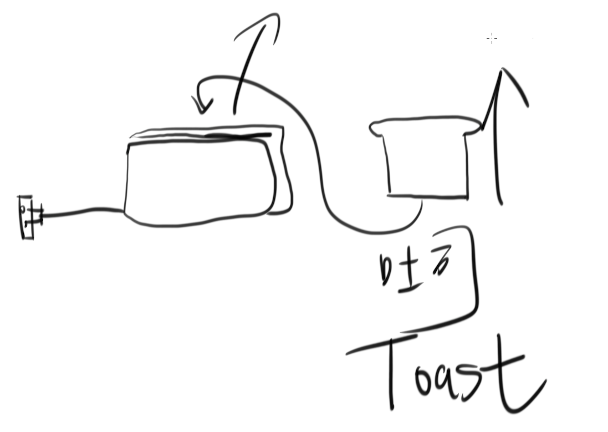

# 简单轮子：Toast 组件

## ★课程简介

- 代码
  <https://github.com/FrankFang/frank-test-1/blob/toast/src/toast.vue>

- UI
  <https://yuque.com/u29422/gulu/244946>

- 需求

  

  

## ★需求分析

### ◇注意点

- 所有样式相关的都不要写在JavaScript里边，除非你有强烈的动机要去写！如组件开发者是否需要帮助用户设置toast的宽高？——不需要，让用户自行设置样式

- 前端在设计UI时，主要考虑的是可用性，如toast的关闭按钮是`×`还是直接一个大大的关闭按钮，前者很有可能用户无法点击到，而后者则可以点击到，虽然后者较为丑点，但是可以轻松被点击到。

  

- 芳芳设计的UI组件样式可以自行配色

- 用户要如何使用这个Toast？即如何调出一个Toast？——用户的做法（点击某个东西触发一个回调咯）：

  ```js
  new Vue({
  	methods: {
  		showToast() {
  			//this.$toast('当前功能不稳定，如果遇到 bug 请关闭该功能')
  		}
  	}
  })
  ```

  我们应该为用户封装一个叫 `$toast`的API，当然，如果你怕用户记不住的话，你可以把它叫做 `$msg`

  那么我如何才能做到 `this`上边有个 `$toast`呢？即如何改造`this`呢？——可以使用 Vue提供的`install`API，而该API甚是常用，比如常用于开发插件！

  根据对比其它UI框架，发现用户不需要自行去 `use`插件，而是框架自己帮用户`use`的，所以我们也要这样来！

  当然，还有一种更简单的做法，那就是改`Vue` 这个Class的`prototype`：

  ```js
  import Vue from 'vue'
  Vue.prototype.$toast = function() {
  	console.log('我是 toast')
  }
  
  ```

  注意，在toast.vue里边，你要使用`Vue`，那么你得导入 `Vue`这个class（除了输出变量，还可以输出函数或类（class））

  这样一来，只要是个Vue实例，那么就能使用 `$toast`这个API了。


## ★总结


## ★Q&A

### ①为什么在写 `.vue`文件时，把 `script`标签写在 `style`标签前面呢？

因为CSS是最不重要的！

而且我们很多时候写CSS都喜欢换行，导致CSS代码所占行数过多。

可见，如果把 `style`标签写在前面的话，那么我们写`script`的时候，就得每次回顾CSS代码了。

毕竟 更新JavaScript和HTML代码的频率要比CSS高得多！

所以为了减少肉眼负担，提高书写代码效率，只好这样做了。


