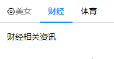

# 简单轮子：Tab组件（下）

## ★Tabs测试（上）

- 注意点
  - `.vue`里边的name属性是来自于options的，而props的name是可以直接 `this.name`的
  - left不能做3D加速，而transform是可以的
- 可交互区域——点击item的区域
- 使用JS做动画——切换每个item时的下边框是滑动的
  - 触发自定义事件时需要告知每个item和pane是哪个item，以及改item的DOM是啥
  - 

### ◇注意点

- item触发了自定义事件，它可以传递当前vm实例给监听了该事件的tabs-item的callback，说白了，监听事件的callback可以接收多个参数，而触发事件的也可以传递多个参数，而这是一一对应的。之前我一直以为只能穿一个参数，如果传过个参数的话，只能用数组了，就像是apply这个API一样。

### ◇我要做什么

- 增大 tab item 可点击区域

  - 为啥要增大？

    

    你会发现这些item的上空白和下空白是无法被点击的，而这就是不可交互的体现，而这种体验对用户并不好，所以我们需要增大

  - 思路

    - 修改CSS——tabs-head有多高，那么tabs-item就有多高

  - How

    - 每个item的高度为100%
    - 让item的文字内容垂直居中：item flex容器化，再搞个 `align-items: center;`就好了，它的左右居中是用padding 1em搞出来的
    - 删掉item的爸爸，即tabs-head的 `align-items: center;`，毕竟不需要它去上下居中，如果不删，就是冗余了

  - 效果：

    

- 触发 update:selected 事件的时候添加一个 item 数据

  - why？

    - 我想要切换item的时候有个下划线边框效果，而这个只能用JS来做了，可是我们该如何确定点击哪个item就会滑到哪个item下边呢？也就说这涉及到每个item距离viewport的left的问题，而这个距离问题需要我们得到每个item的样式数据才能解决。

      

  - 思路
    - 很简单，在item触发自定义事件的时候，传一个this过去给head的callback就好了。不过需要注意的是，tabs模板创建好后，还需要默认触发一下自定义事件，而这个在mounted执行就好了，毕竟此时的mounted能访问所有子组件，然后就把默认选中的item交给head的callback就好了。
  - How？
    - 在head的template新增个叫 `line`的div，毕竟我们能页面能看到它！然后对它就是一顿绝对定位操作，不过我们只给了bottom这个属性，至于left属性为啥不给，你之后就明白了
    - 点击item时需要触发自定义事件，然后传个this给head的callback
    - 页面没有进行任何交互时，即默认某个item是被激活的，此时这个默认的状态，也是需要通知head触发callback，而这个触发在tabs的mounted里边进行，毕竟此时这个钩子能访问儿子和孙子了，通过两次遍历筛选找到了那个默认的item实例，至此，head的callback也拿到了默认被激活的item实例了

- 完成 tab 切换动画

  - 思路

    - 通过`getBoundingClientRect()`拿到item的外联样式，通过 `style`属性修改item的内联样式，至此，就完成对line样式（width和left）的更改了。
    - width决定了item有多宽，其下划线就有多宽
    - left决定了下滑线距离父元素左边的距离

  - How？

    - 在head的mounted里边监听自定义事件，毕竟它的callback里边需要用到 ` this.$refs.line.style.width`这样的API，也就说head的template需要挂载到页面后，才能访问到line这个div元素的style属性，而如果是created的话，显然是不行的。
    - 搞点transition 过渡动画，让样式的变化不会那么突兀

  - 效果：

    

- 完善tabs的样式

  - why？——还能为什么，太丑了呗！

  - 思路

    - 处理一下那个「actions」按钮的样式，比如垂直居中，左右有间隙……
    - 总之，就看ant-design的ui就好了

    你会发现多一个head和body，样式写起来是真得方便！

  - How？

    - 处理actions按钮
    - 处理item的文字颜色
    - 处理head的底部边框与line是重合的，line是2px，而head是1px
    - 为item添加hover……

  - 效果：

    

- 支持 disabled 功能

  - why？——需求决定，咩有为什么

  - 思路：（外面：组件标签；里面：`.vue`这个文件，即组件的内部构造）

    - item标签上只要写有 `disabled`属性的，那里面的disabled就是true值，通过disabled的是true or false，来决定该item是否有disabled这个class
    - 根据元素有无disabled这个class来选择合适的样式

  - How？

    - 某个item组件标签写有disabled属性，那么它就会有disabled这个class
    - 当我们点击该被disabled的item时，直接返回，而不是继续触发自定义事件，而没有触发该事件，也就没有所谓的下划线了。
    - 为disabled添加一些样式

  - 效果：

    

---

## ★Tabs测试（下）


## ★总结

- 上传代码的时候，请把项目的serve给关掉！

## ★Q&A

### ①元素是absolute的，只写bottom，是否就够了？

如果用户给absolute至少指定了`left/right`中的一个，则水平方向的相对特性丢失，垂直方向上继续保持相对特性；如果用户给absolute至少指定了`top/bottom`中的一个，则保持水平方向上的相对特性，垂直方向上的相对特性丢失。例如：

```html
<div class='box'></div>
.box{
    position: absolute;
    right: 0;
}
```

此时，元素水平方向相对特性丢失，具有了绝对定位特性，而垂直方向的定位依然保持了相对特性。

**➹：**[【前端Talkking】CSS系列——CSS深入理解之absolute定位 - 前端Talkking - SegmentFault 思否](https://segmentfault.com/a/1190000014736711#articleHeader8)

