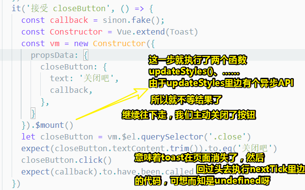
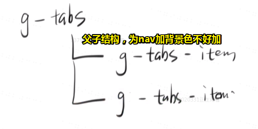
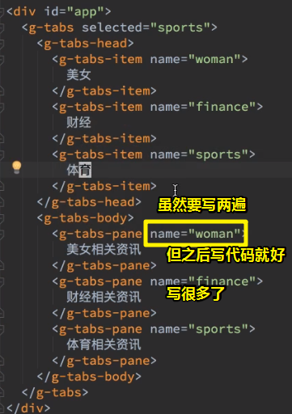
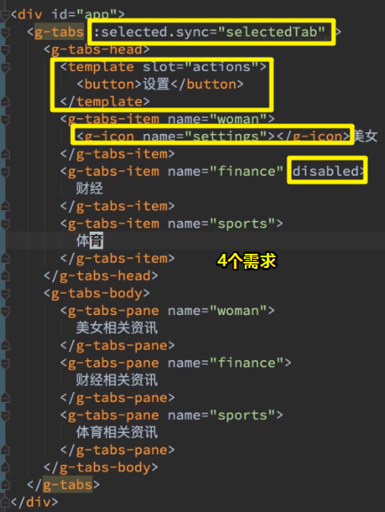
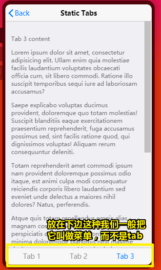
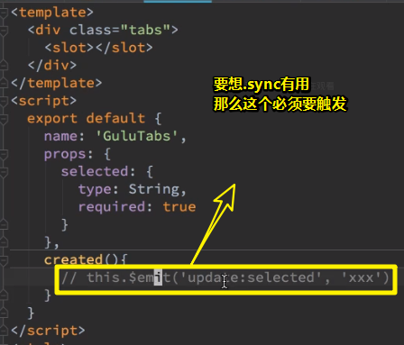
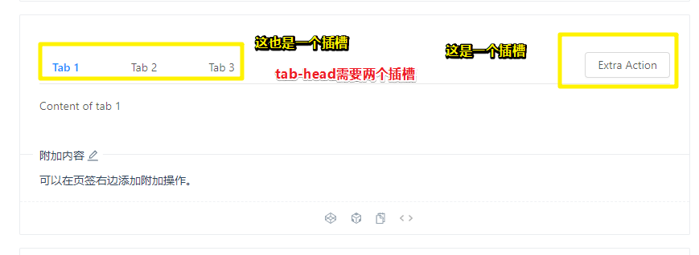
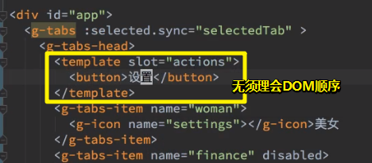

# 简单轮子：Tab 组件

## ★课程简介

代码链接： <https://github.com/FrankFang/frank-test-1/tree/tabs>

UI：<https://www.yuque.com/u29422/gulu/268970>


## ★最近反馈的问题解答

1. github发现 了潜在的隐患，这是因为我们的代码用了很多其它的库的缘故（可以查看package.json的依赖和开发依赖字段以及package-lock.json）。

   

   隐患缘由：

   

   因此所有人都需要重新登录，然后换个token后，这些包才是有保障的！不然，该包风险就很大了。

   > `.npmrc`文件下会有个缓存的token

   解决方案：

   要么点击去看隐患代码，看看能不能解决（需要更lodash版本为最新之类的，但是我找不到是那个库依赖了它，万一更新了，导致整个项目都蹦了？）；要么就是dismiss，即风险自担。

   

2. 用了cnpm的话，那就把它卸载掉吧！因为该工具的维护目前并不活跃呀！总之，你就设置淘宝源即可！而cnpm没有使用价值了

3. 如果项目是用npm这个包管理器来init，那么就不要随便改成是yarn这个包管理，不然这是很容易出问题的！

4. `parcel watch test/* --no-cache & karma start`，window不支持 `&`，即无法让终端同时运行二者，你可以打开两个终端，分别使用 `npx`来执行它们。改成两个 `&&`也是不行的，因为 `&`和 `&&`意思是不一样的。

5. 如果你想学命令行，那就装个深度系统或者是Ubuntu系统…毕竟windows的功能太差了

6. vue有没有好的文章推荐？——芳芳觉得搞清楚官网文档就非常好了，当然，你就关注那个点，然后 就如「vue 响应式数据」这样去搜索文章呗！

7. 如果遇到使用工具的报错信息，那么就复制报错信息到google上搜索

## ★解决bug的思路

> 如何解决突然出现的bug？（如 `npm run test`发现一个测试用例不通过）——不用问人，因为这有亘古不变的debug办法


分析：

1. 在1万多行的位置？——显然这是parcel打包后的结果，因此我们并不知道报错点在哪儿，但是我们知道这跟 `toast.test.js`这个文件有关

   我的是在这行：

   

2. 可以看到可能是我们的 `this.$refs.line`为undefined，因此我们需要通过log大法看看它是什么，当然，你也可以用debug，但这忒TM麻烦了。

   > 通过报错信息提示，定位到有bug的代码

3. 分析产生bug的原因：二分法确定是哪个测试用例报错了，然而，令人无语的是，单独打开每个测试用例都不报错，但是全部打开就报错了。——存在缓存的问题，其实是第二个测试用例的问题呀！

   

   > 在 `$nextTick`执行前，是你在mounted里边log `this.$refs` 是有的，但执行nextTick之后，就为undefined了，所以可见这中间是存在某种过程导致了（异步执行的时间差），`this.$refs`消失了

4. 分析

   

5. 解决bug——搞个定时器执行后边两行代码即可：

   ```js
   let closeButton = vm.$el.querySelector('.close')
   expect(closeButton.textContent.trim()).to.eq('关闭吧')
   setTimeout(()=>{
     closeButton.click()
     expect(callback).to.have.been.called
     done()
   })
   ```

   测试，发现这个bug消失了。可见这是我们测试用例写得不周全呀！而且也可以看到，nextTick的回调先于setTimeout的回调先执行呀！

> 总之，你得分析清楚，这个测试用例的代码执行是如何走的，比如哪个函数先执行后执行。总之注意时间差的问题，即异步那些事儿。

小结：


---

## ★需求分析

### ◇我想造个轮子？

做每一个轮子之前都要经历这4步，如果少了任何一步都会出现很大的问题：

1. 需求
2. UI
3. 代码
4. 测试

大部分程序员只管代码，导致ta做的需求有问题、UI有问题，或者说测试不通过

总之，你自己一定要把这4个都得过一遍

有的时候需求不是你写的，但你也要看一遍

UI不是你做的，你也要核对一下

测试虽然有帮你测，但你自已也要测一下

而这样才算一个完整的开发流程

### ◇Tabs的需求

1. 需求：

   

   你切换得分，就展示得分相关的内容；你切换篮板就展示篮板相关的内容……

2. 分析这个需求（画个用例图就好了）：

   一分析得知，就是个tab的切换，似乎就没有了。

   当你想不到任何分析的时候，那就去参考业界的，有很多人认为抄袭是很可耻的，但是在软件工程里边有个原则就是，尽量让你的东西跟业界里的差不多，比如360的杀毒软件，和QQ的安全管家，你看它们俩是不是差不多的？而这样做的原因是为了减少用户的学习成本呀！

   所以抄袭人家是怎么做的轮子并不可耻呀！

   分析ant-design的tabs：

   - 可以禁用tab，不过这个tab挺鸡肋的，如果在做后天管理系统时，需要权限的话，才能访问这个tab的话，那倒不如不显示这个tab嘞！
   - 字体放大就不做了，让用户自己用CSS调吧！
   - 有好几个需求，我们就挑了4个需求来做，其余的需求，有时间可以自行去做

   

   

3. 分析要做需求的UI，直接抄ant-design的UI就好了

4. 其它人如何用你的tabs？

   1. element-ui的姿势：

      

   2. 芳芳提供的姿势（代码复杂点，但结构清晰）：

      

      为了让我们的代码好写，所以需要加上个name属性，而这是权衡出来的结果，反正你如果因为需要取个名字而犯难的话，那么我劝你还是不要用这个库了：

      

   为啥选择第二种？——因为保证了层次结构：

   

   而element-ui则是父子关系层次结构：

   

   总之各有各的好处咯！随你喜欢

   以上是芳芳所规定的API，而我们也可以规定自己所想要的API

5. 想好怎么用之后，就可以开始想想怎么用代码做了，当然，这tab的组件会稍微有点复杂哈！

---

## ★创建五个组件

> 想好别人怎么用我们的组件，就可以开始写组件了。

1. 根据设计的API，需要搞5个组件，即一个标签一个组件
2. 从最外边那个组件（tabs）开始写（当你不知道要写啥的时候，就直接写那3个标签即可）
   1. 写个root元素，即div
   2. 根据设计的div，我们需要把内容插进去，因此用到 `<slot></slot>`，如果不写这个，那么Vue就会删掉用户写上的子元素
3. 写tabs-header（也可以叫tabs-nav，算一个好记的就可以了）。
   1. 我们为root元素写上了class `tabs-header`，这里的中划线表示父子关系
4. 写tabs-item（都以tabs为前缀好了，写代码最烦的就是起名字了，如果名字起得好，代码就好看了，而名字起得烂，就很容写错代码了，总之你要花点时间起名字）。
5. 写tabs-body
6. 写tabs-pane

芳芳起得名字都很规整，多想想自己能否做到这样

接下来用index.hml来做测试，这个文件最后最终都会被删掉哈！

还有app.js这个文件最后也会被删掉，目前来看虽然import了很多东西，但并不需要去优化它哈！毕竟我们人的精力是有限的，该优化的地方就去优化，不该优化的（最终都是被删掉的），那就无脑的去抄就好了，如 `import`组件，注册组件，而不是什么都要去优化。

> 关于vim的学习，芳芳都学了好几年。而如果学会了，那么这代码就写得贼快了。

注意：**由于HTML的风格是head对应body，header对应footer，所以那个tabs-header组件，最好改为tabs-head。**

至此，tabs-head、tabs-body、tabs-item、tabs-pane，都是4个字母结尾的，这让处女座的人看起来是非常舒服的！

当然，你不改也没有任何关系，随你喜欢。

此时的API：（你会发现element-ui那种设计是有它的道理的，即更简洁，而芳芳的则是为了结构更为清晰，所以各有千秋呀！）




- 规定输入参数以及需求：

  - tabs组件只有一个参数，好不好呢？——显然这不好呀！因为我们需要tab切换呀！一旦tab切换，那么selected的值也要变啊！于是我们加了个事件监听，可是为啥要加事件监听呢？

    那是因为：子组件是不能改父组件的任何值的，如果用户要改变一个tab，那么不能在子组件里边改，而是一定要通知爸爸 `#app`去改，为啥要这样呢？——因为selectedTab是 `#app`的数据呀！所以这不能由别人改。

    因此，就必须要有一个事件了。

    **➹：** [②](#er)

  - 方向（决定tabs是竖着还是横着）：tabs

  - disabled（禁用）：tabs-item

  - 添加icon：只需要加个icon标签即可

  - 额外的按钮：tabs-head，需要多加一个插槽，[③](#san)

其它诸如删除或添加tabs就不做了。

目前的API结构：



`commit:添加 tabs 相关组件，添加基本 props`

---

## ★依赖注入和eventBus


## ★总结


## ★Q&A

### ①framework7的tab？



不过framework7做的是真得好啊，可以动画（高级的时候芳芳会讲动画），可以手指滑动，还可以路由等等……

### <a id="er">②tab切换需要触发事件？</a>

当xxx用户，点击 `item` 美女，那么就需要更新 `g-tabs`上的 `selected`值。

为啥需要事件？——因为子组件不能改父组件的数据，这只能由爸爸 `#app` 去改g-tabs上的数据 

事件的名字：


当用户点击美女item，那么就会触发 `update:selected`事件

总之`update`后边接收的是属性的名字。

> 加冒号是表示 `selectedTab`是个变量，而不是字符串

selected值，目前是不需要的，如果不爽，那就给个默认值。

在某个时期，就会触发 `update:selected` 事件，而事件的值目前还不知道。

为了是 `.sync`修饰符有用，我们必须要触发这个事件：



**➹：**[自定义事件 — Vue.js](https://cn.vuejs.org/v2/guide/components-custom-events.html#sync-%E4%BF%AE%E9%A5%B0%E7%AC%A6)

### <a id="san">③如何在一个组件里边添加多个插槽？</a>



如何让tab-head组件有两个插槽呢？


测试多加的action插槽：



编译后的结果：


