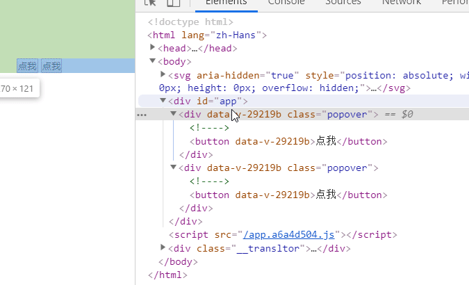
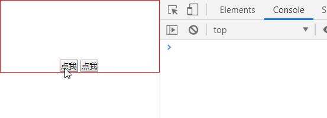
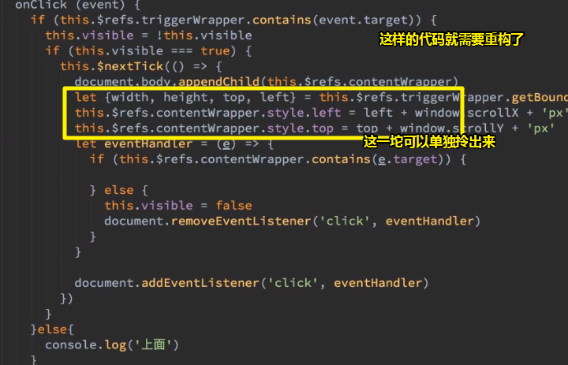
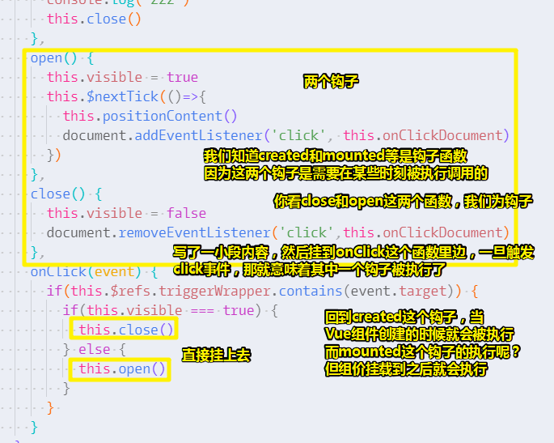
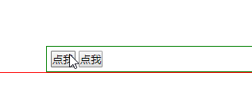
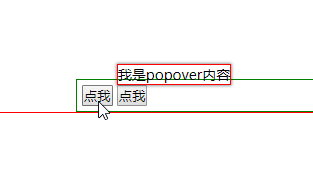
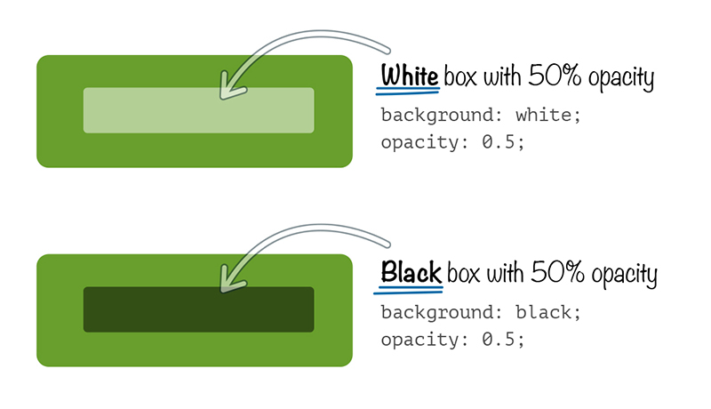

# 简单轮子：Popover 组件（上）

## ★开始Popover组件

### ◇准备工作

- 它是什么？——对一个东西发生交互行为，就会弹出一个东西出来

- 看看人家做的Popover有哪些需求？（并稍微分析一下，如发生交互时，打开控制台看看页面的DOM结构发生了什么变化）

  **➹：**[组件 - Element](https://element.eleme.cn/#/zh-CN/component/popover)

  **➹：**[气泡卡片 Popover - Ant Design](https://ant.design/components/popover-cn/#header)

- 芳芳的设计稿：[Popover · 轱辘 · 语雀](https://www.yuque.com/u29422/gulu/289546?artboard_type=)

### ◇注意点

- 点击按钮弹出一个div，然后查看页面的DOM结构，你会发现该div出现在 `</body>`闭合标签的前边，而不是`button`元素的身边
- 实现popover的难点在于书写CSS
- 每个`div.popover`都是一个 `inline-flex`

### ◇直接看代码理解

> 再次强调，可以把组件看成是函数，写在组价标签上的属性是实参（前端开发者决定传啥），组件里边的data是局部变量（组件自己维护）！

- 创建 popover 组件
  
  - why？
  
    - 造轮子需求
  
  - 思路？
  
    - 点击按钮，触发click事件，执行callback，在按钮旁边弹出一个`div`
    - API设计：参看element-ui、ant-design
  
  - how？
  
    1. 设计使用 popover 组件的 API：
  
       
  
    2. 当我们点击button元素，就会控制popover内容的显示与否，然而有个bug，那就是点击弹出的div也会隐藏自己，明明已经脱离文档流，但是DOM结构还是存在于 `div.popover`里边，所以它也是可以被点击，然后触发click事件的吗？——我一直认为元素的盒子范围就是可click范围，但是现在弹出的div显然不是 `div.popover`的范围，而结果它是可被点击的！
  
  - 效果：
  
    

- 实现最简单的 popover（为了书写方便，叫「弹出的div」为 **A**）

  - why？

    - 继续完善——如A不能自己关闭自己，document也能关闭A

  - 思路？

    - 关于上个点的那个bug——点击 A 也会关闭自己，这是因为冒泡的缘故啊！毕竟我们的 `click`事件时绑定到 `div.popover`这个元素上的
    - `document`被click后也是需要关闭「弹出的div（A）」的
    - 注意， slot标签上可不能绑定事件

  - how？

    1. 阻止 `div.popover`的冒泡，阻止 `div.content-wrapperd`的冒泡
    2. click事件的callback：A出现后（需要nextTick），才为document绑定click事件，document被点击，那么就隐藏A，并且移除事件监听，不然，点击一次document，就会触发多个callback了，显然这很费性能呀！

  - 效果：

    

## ★解决新手常见的三个问题

### ◇注意点

- 当移动一个vue组件里边的元素的位置，是不影响它的任何功能的，如把A扔到 `</body>`前边，还是可以触发它自身的诸如click事件之类的！、`scoped`的效果所添加的`data-v-29219b`还是存在的等等……

- `v-show`和 `v-if`的区别，前者DOM结构好在，而后者则GG了，这在弄异步操作的时候尤其需要注意！

- 一个 `{}` 同时存在两个 `mounted`，那么后来的 `mouted`会覆盖前边的 `mounted`，所以不要出现两个一模一样的key。

  

- `slot`不支持引用，即不支持 `ref`属性，即不能这样 `<slot ref="trigger"></slot>`

- 使用`ref`的缘故，是为了可以直接拿到DOM元素！而不是要用 `getElementById()`这样的API去获取DOM元素！

- 当你把  A 扔到 `div.popover`外边的时候，那么你之前这样写的样式：

  

  所以你得把 `.content-wrapper`给移出来！这样才会样式生效！

- 为啥要加 `window.scrollX`和 `window.scrollY`呢？因为A是相对于body元素绝对定位的，而button元素的left和top值是相对于视口的。`document.documentElement.scrollHeight`是整个页面可滚动的高度，而 `scrollY`则是滚了多少距离。

  

- 为了拿到 `<slot></slot>`的实际内容（DOM元素），一般会使用`ref`属性，而该属性需要为 `<slot></slot>` 套个`div`或 `span`才行！

- 第一次写代码很乱，可以不用重构，但写完之后一定要重构哦！必须一眼就能看出代码是在干嘛！

  

  对 了，别忘了重构完，还得测测有没有bug哦！

- 关于`onXXX`这样的名字，表示事件触发就执行这个动作，如 `onShow`、`onClickDocument`等

- 为啥不一开始就在组件的 `created`钩子监听document呢（用的是`addEventListener`）？——因为如果用户写了100个popover组件的话，那么document就会绑定100个callback，而这样一来就很浪费内存了！所以这就是为什么我们创建一个popover组件，监听了document onClick 事件，然后触发了document的点击事件，就得移除该监听器的原因所在了！

- 把关闭入口收拢起来，如果非得用个设计模式的、称呼给它的话，那就叫做「高内聚，低耦合」，耦合我们知道这是什么，不然也不会有模块化了，那么内聚呢？——就是如果你这个代码是特别重要的，那么你就不要分散到各个地方，而是把它们内聚到一个方法里边！如 `close()`，把所有收尾的事情聚拢到一个函数里边，如document的callback的移除，不然每个地方都有一个 `document.removeEventListener('click',this.onClickDocument)`了，这种做法类似于关闭数据库连接一样！

  总之，所有重要的操作， 你都应该把它们收拢到一个函数里边，方便做这个钩子！如`open`和 `close`

  关于钩子：

  > 在程序里来说就是你定义了一个小功能，可以在任何想用的地方挂上去。这个小功能利用钩子挂上去，比如评论列表展示，可以是一个钩子，在需要的地方挂上去。
  > 这个东西和插件其实差不多，但是我觉得的话，插件的功能相对于钩子来说，更复杂，钩子的话，功能更单一更灵活。
  >
  > 所以，我觉得符合钩子思想的东西就是钩子，程序如此，生活中的东西也如此
  >
  > **➹：**[javascript - 麻烦帮解释一下，什么叫“钩子”？ - SegmentFault 思否](https://segmentfault.com/q/1010000004335505)

  

  其实这TM可以理解为钩子函数就是一个callback啊！而这样做的目的就是为了解耦！

  总之，我定义了一个叫close的钩子函数，让挂到onClick里边了，至于它执不执行就得看onClick的执行逻辑了！

  总之在JavaScript里边，这个函数如果叫做钩子函数的话，那么它一定会在某个函数体里边有着 `xxx()`这样的代码！

- 有些函数名最好是对仗的，如有个叫close的函数，那么就有个叫open的函数！


### ◇直接看代码理解

- 解决当容器有 overflow hidden 造成的 bug（还有水平滚动条和垂直滚动条定位的问题）

  - why？

    - 前端开发者搞事情呀！popover组件的爸爸溢出隐藏了（我很好奇A都已经脱离文档流了，居然还可以受到溢出隐藏的影响）

      

    - 假如用户为爸爸绑定了click事件，那么你点击 `点我`，却咩有触发爸爸的click事件，显然这也是bug啊！总之我们的组件把用户的事件链给打断了。

  - 思路？

    - 把A扔到 `</body>`前边
    - 拿到button元素的top和left
    - 计算A应该放到button元素的上边去！

  - how？

    - 没啥可说的！

  - 效果：

    

    可见解决了溢出隐藏的bug，又引发了另外一些bug，如点击A冒泡触发了document的click事件，效果类似于自己关闭自己。还有点击按钮，不会触发用户为父元素绑定的click事件，这样一来，可以看到 popover组件 对用户写的代码干扰性太强了！

- 功能方面基本完成

  - 思路？

    - 确定用户点击是弹出层还是按钮，如果是按钮那就弹出popover，如果是弹出层，那就什么也不做！

    - 如何关闭popover呢？——点一次按钮就会弹出popover，再点一次就会关闭popover；同样，点击document也会关闭popover。

    - popover组件不能有阻止冒泡的行为出现，因为假如popover组件的爸爸绑定了点击事件的话，那么点击popover组件就不会冒泡的到爸爸身上了

    - 每次关闭popover，document的事件监听也会被移除！即出现弹出层，那就document有事件监听；反之则没有！

      

    - 如何解决popover组件的父元素有溢出隐藏？

    - 如何解决页面有横向或竖向滚动条？

  - 一个问题？

    弹窗关闭功能中，如果有其他按钮点击事件，但这个按钮把点击事件捕获、冒泡都止了，导致document没有监控到点击事件，此时如何关闭弹窗呢？

    这问题是说，我们点击document也是能关闭popover的，但是其它开发者自己绑定的按钮事件，阻止了冒泡，导致popover没有消失。

    这是前端开发者自己的问题，不是我们组件开发者的问题，总之我们的组件一定不能阻止冒泡，你要把组件当作是普通button元素那样，只是它多了点样式和有个popover功能罢了！

    总之，阻止冒泡是一个危险的功能！

  - How？

    - `popover.vue`的`template`里边的内容是咩有阻止冒泡的代码的！如 `@click.stop`之类的！
    - 借助`ref`属性，拿到`template`里边的 DOM 元素，如 `button`和弹出层这个div，可以借助 `Node.contains()`这个API来判断用户点的是DOM元素！
    - 点击`button`，触发click事件，如果用户点的是button元素，那么就会显示popover浮层，接着还得确定浮层在哪里显示的位置（解决「溢出隐藏」和「出现横向和竖向滚动条）的问题——显然默认在button元素的顶部呀！然后为document添加事件监听，该callback用于关闭popover浮层！
    - 每次关闭popover浮层都得移除对document添加的事件监听函数
    - 如果用户点击popover浮层，那么 `onClickDocument`不会关闭popover浮层！反之你点击 整个popover组件或者其它非浮层元素的，那么都会借由 `onClickDocument`来关闭浮层元素！即触发 `close`方法，并且该方法触发还得移除对`document`的 click事件监听函数——`onClickDocument`

  - 效果：

    

---

## ★支持四个方位


## ★总结


## ★Q&A

### ①rgba与background-color的那些事儿？



我们可以通过**改变前景色的透明度来生成更深或更浅的颜色**。如上边的背景色是绿色，前景色 分别是浅绿色和深绿色！

**➹：**[【转载】CSS技巧-rgba函数的妙用_CSS 教程_w3cplus](https://www.w3cplus.com/css/the-power-of-rgba.html)

### ②关于ref？

**ref**：被用来给元素或子组件注册引用信息，引用信息将会注册在父组件的$refs对象上。如果在普通的DOM元素上使用，那么指向的就是普通的DOM元素。

**➹：**[详解vue中的ref和$refs的使用 - 掘金](https://juejin.im/post/5c068829e51d451db767b8c0)

### ③把页面里边已经渲染好的DOM移到其它位置里边去？

本来是xx的儿子，现在通过 `appendChild`这个API却可以成为xx的兄弟！

**➹：** [demo](./demo/10/如何移动已经在页面渲染好的dom.html)

### ④js get element offset relative to document？

如何获取一个元素相对于整个页面的top和left（top和left就叫做offset）

简单姿势：

```js
function getOffsetLeft( elem )
{
    var offsetLeft = 0;
    do {
      if ( !isNaN( elem.offsetLeft ) )
      {
          offsetLeft += elem.offsetLeft;
      }
    } while( elem = elem.offsetParent );
    return offsetLeft;
}
```

再好点的姿势：

```js
function getCoords(elem) { // crossbrowser version
    var box = elem.getBoundingClientRect();

    var body = document.body;
    var docEl = document.documentElement;

    var scrollTop = window.pageYOffset || docEl.scrollTop || body.scrollTop;
    var scrollLeft = window.pageXOffset || docEl.scrollLeft || body.scrollLeft;

    var clientTop = docEl.clientTop || body.clientTop || 0;
    var clientLeft = docEl.clientLeft || body.clientLeft || 0;

    var top  = box.top +  scrollTop - clientTop;
    var left = box.left + scrollLeft - clientLeft;

    return { top: Math.round(top), left: Math.round(left) };
}
```

最简洁姿势：

```js
element.getBoundingClientRect().top + document.documentElement.scrollTop
```

芳芳就是用了最简洁姿势，只不过是用了 `window.scrollY`，不过，这个兼容性可没有那么好呀！

**➹：**[javascript - Finding element's position relative to the document - Stack Overflow](https://stackoverflow.com/questions/5598743/finding-elements-position-relative-to-the-document)

