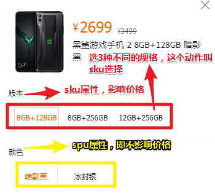

# 课程介绍

## ★课程介绍

### ◇课程简介

**➹：**[小米商城](https://m.mi.com/)

### ◇课程设置

| 课程内容     | 课时 |
| ------------ | ---- |
| 课程介绍     | 1节  |
| 开发环境配置 | 2节  |
| 项目目录结构 | 1节  |
| 注册、登陆   | 2节  |
| 首页         | 4节  |
| 分类页       | 2节  |
| 商品列表页   | 2节  |
| 商品详情页   | 4节  |
| 购物车       | 4节  |
| 订单提交     | 4节  |
| 订单列表     | 4节  |
| 订单详情     | 2节  |
| 地址管理     | 2节  |
| 个人资料设置 | 2节  |

### ◇课程涉及的技术栈

- vue全家桶：[vue](https://cn.vuejs.org/v2/guide/)、[vue-router](https://router.vuejs.org/zh-cn/)、[vuex](https://vuex.vuejs.org/zh-cn/)、[vue-cli](https://github.com/vuejs/vue-cli)、[vue-devtools](https://github.com/vuejs/vue-devtools)、[vue-loader v14](https://vue-loader-v14.vuejs.org/zh-cn/)、[vue-loader v15](https://vue-loader.vuejs.org/)
- 组件化：单vue文件、生命周期、通信
- 模块化：ES2015 Module、CommonJS
- 第三方模块：[axios](https://github.com/axios/axios)、[swiper](https://github.com/nolimits4web/swiper)、[iscroll](https://github.com/cubiq/iscroll)、[anime](https://github.com/juliangarnier/anime)、[nprogress](https://github.com/rstacruz/nprogress)等
- 接口管理平台：[RAP2](https://github.com/thx/rap2-delos)、[DOClever](https://github.com/sx1989827/DOClever)、[yapi](https://github.com/YMFE/yapi)
- 数据模拟：[Mockjs](http://mockjs.com/examples.html)
- 基础开发环境和包管理：[node](https://nodejs.org/en/)、[yarn](https://yarnpkg.com/zh-Hans/)、[cnpm](https://npm.taobao.org/)
- 构建工具：[webpack](https://github.com/webpack/webpack)、[gulp](https://github.com/gulpjs/gulp)
- 编辑器：[VSCode](https://code.visualstudio.com/)

### ◇前置知识

- vue全家桶的文档
- 基于vue的UI库：[vant](https://github.com/youzan/vant)、[mint-ui](https://github.com/ElemeFE/mint-ui)、[vux](https://github.com/airyland/vux)
- ES2015常用语法：[ECMAScript6入门](http://es6.ruanyifeng.com/)、[Learn ES2015](http://babeljs.io/learn-es2015/)
- 组件化：[vue](http://cn.vuejs.org/v2/guide/components.html)、[react](https://facebook.github.io/react/docs/components-and-props.html)、[angular](https://angular.io/guide/displaying-data)
- 模块化：[webpack-modules](https://webpack.js.org/api/module-methods/)、[ES6 Module](http://es6.ruanyifeng.com/#docs/module)

## ★课程简介

### **1、如何知道小米商城是基于 Vue 开发的？**

查看它的首页源码就知道了，那么是看那部分的源码呢？——看它的打包文件即可：

### 2、什么叫 SKU 选择？

> 一个商品有很多属性。

SKU（*Stock Keeping Unit*），我们常说 sku 属性，指的就是销售属性，即会影响到库存和价格的属性。还有个与之差不多的属性的叫做 spu 属性，即不会影响到库存和价格的属性，而这又叫做关键属性！

那么 SKU 选择，指的就是选择一些销售属性呗！如这样：

**➹：**[商品SKU选择实现 - csdn924618338的博客 - CSDN博客](https://blog.csdn.net/csdn924618338/article/details/51455595)

**➹：**[产品 SKU 是什么意思？与之相关的还有哪些？ - 知乎](https://www.zhihu.com/question/19841574)

### 3、我要做什么？

- 清楚用户购买一个商品的流程是怎样的

  1. 罗列了一堆商品
  2. 查看某个感兴趣的商品的详情，选择规格，加入购物车
  3. ……

  总之，就是知道我要制作哪些页面，以及页面与页面之间的交互是怎样的。

- 把自己当作是这个小米前端商城项目里边的开发人员

## ★课程技术栈

### ◇注意点

1. 小米商城有用到 [normalize.css](https://github.com/necolas/normalize.css/) v7.0.0 做样式重置
2. 小米商城用的是路由的方式做页面过渡（之前老师的重构有赞商城项目用的是多页面应用），如何体现出来的？——切换底部的 tab 时，没有页面刷新，仅仅是url多了一个路径。对了，你切换了一个路由之后，那么，接下来基于这个路由的再次切换，可叫做它的子路由！
3. 关于技术重构，小米商城用什么技术，你就用什么技术去重构！（有些方案可能会比小米商城的要好）
4. 简单查看小米商城用到哪些技术栈：（点开[这个](https://m.mi.com/static/js/vue.1cf7a9af10394e88fd6e.bundle.js)，ctrl+f，输入 `* vue` 即可看到）
   1. 与服务器通信，不会使用[vue-resource](https://github.com/pagekit/vue-resource)，而是axios（vue2.0之后推荐的）	
   2. [vue-meta](https://github.com/nuxt/vue-meta) 支持 SSR：[vue-meta让你更优雅的管理头部标签 - yingye技术分享 - SegmentFault 思否](https://segmentfault.com/a/1190000012849210)
   3. 状态管理用的是 vuex
5. 关于「风格指南」，在一个团队里边，是必须要去准守的！当然，一个团队里边或多或少会有点不同！但遵守官方的是前提。
6. 官网的 「[Examples](https://vuejs.org/v2/examples/) 」需要搞一遍
7. [介绍 - Vue Loader](https://vue-loader.vuejs.org/zh/#vue-loader-%E6%98%AF%E4%BB%80%E4%B9%88%EF%BC%9F)
8. 不管你学 Vue 、 React  还是 angular，那么基于它们的全家桶你都应该去涉猎一番，如学 Vue ，那么vue-router、vuex、vue-loader等是要去学习一番的！（官方出品的衍生物会好很多！）

## ★总结

- 完成一个项目的开发，需要把很多东西给组合起来！而你必须要清楚的：
  - 用啥技术栈
  - 前置知识
  - 要做什么
  - 怎么做以及为啥要这样做

## ★Q&A

### ①多页和单页？

**➹：**[【前端词典】一文读懂单页应用和多页应用的区别 - 掘金](https://juejin.im/post/5cffa35a6fb9a07ec63b0bb0)

