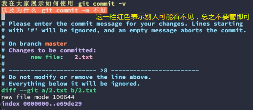
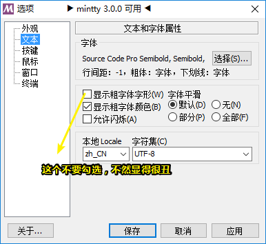

# 命令行技巧1

> 写程序不学命令行，不如回家卖红薯

## ★自动跳转目录

### ◇为什么？

因为我们平时经常性的cd来cd去的，显然这很麻烦哈！

如果有个工具可以让我们不需要知道目录的全称和路径，就可以跳转到该目录，那该多好啊！

### ◇怎么做

1. 找个好位置（如我在  `/g/temp-git-2019`目录下），clone这个仓库：[rupa/z: z - jump around](https://github.com/rupa/z)，一般来说clone自己的仓库用ssh，其它人的就用https就好了

   

   结果：

   

2. 获取z路径：

   ```bash
   # 直接敲下pwd，就可直接拿到当前目录的路径
   pwd
   # 选中即复制（bash默认的，但也可以设置）
   # 鼠标中键即粘贴
   ```

   把拿到的路径加个 `z.sh`，我的如下：

   ```
   /g/temp-git-2019/z/z.sh
   ```

   这个就是 `z.sh`的绝对路径啦！

3. 把这个路径写到 `~/.bashrc`里边去，那么这该如何写呢？可以使用bash在安装时选择的自带vi编辑器（`i`「插入」、`!wq`「保存并退出」），也可以使用你的vscode，我在这里是使用vscode的，在安装这个软件的时候，它自动就配置到环境变量里边去了，所以可有：

   ```bash
   code ~/.bashrc
   ```

   然后你就在该文件里边，添加这行代码，然后保存即可：

   ```bash
   # 这个点.是source的缩写，一般用.即可，注意一定要确保这个z.sh文件存在
   . /g/temp-git-2019/z/z.sh
   ```

   接着，重启你的gitbash，让上边这行代码生效

4. 为`z`添加别名 `j`

   ```bash
   alias j='z'
   ```

小结：

- 去过哪个目录`j`都会记录下来，当你想进入你曾经想去过的目录时，只需要写**一小段提示**即可进入该目录！
- 直接敲下一个 `j`命令，会展示你曾去过哪些目录，这样当你忘记了曾去过哪些目录的时候，它的作用就体现出来了！
- 修改了 `.bashrc`这个文件 之后，就得重新启动一下GitBash，来让这个文件生效，而这种姿势是最快的！还有一种姿势是 `. ~/.bashrc`，这种姿势不需要重启！不过相较于前者来说，还是前者更简单方便些！
- 注意，别把`z.sh`给删了，不然这个 `j`命令就无法使用了！

## ★使用bash alias 快速输入命令

> 注意：在为命令给别名的时候，一般使用的是单引号，当然，双引号也能用，不过，很有可能会出问题！

```bash
alias j='z'
alias cdd="cd /g/git-2019"
alias gst='git status -sb'
alias ga="git add"
alias gc="git commit -v" 
alias gcc="git commit . -m update"
alias gp="git push"
alias st="start"
alias ll="ls -la"
alias glog="git log --color --graph --pretty=format:'%Cred%h%Creset -%C(yellow)%d%Creset %s %Cgreen(%cr) %C(bold blue)<%an>%Creset' --abbrev-commit --"
```

一个小细节：


关于`git commit -v`，它会让你在vim编辑器之下输入一大串文本用来解释你刚刚对仓库所做出的更改（会提示你之前做 哪些更改，当然你也可以用vscode内置的git管理工具），这样当你在浏览历史的时候，就会知道你当时做了什么操作，而直接 `gcc`那种姿势，显然不能让你写很多字符，而且也很难回忆起之前所做的种种改动！



其它alias：


小结：

1. 如何设置alias？——很简单直接 `alias xx=’balabala……‘` ，优先使用单引号，有些特殊的语句用双引号，如后边的`glog`（默认的`git log`有很多信息噪音，而且显得很长），注意历史记录有点长，你可以摁`q` 推出，摁回车往下查看。看了以往的历史记录，真得不知道当时都干了哪些操作！
2. 设置完成后，重启或 `. ~/.bashrc`或 `source ~/.bashrc`让该文件生效起来！

## ★让Git Bash外观变得更好看些

1. 调整当前窗口大小，选择一个你合适的，你可以在拉伸窗口的时候，看到相应的数值，然后在设置即可：

   

2. 字体：[fonts/SourceCodePro at master · powerline/fonts](https://github.com/powerline/fonts/tree/master/SourceCodePro)

   选择**倒数第三个**这个默认字体，然后点一下**鼠标中间**，那么就会在**新窗口打开**！而不是你用鼠标左键在当前窗口里边打开

   

   那么下载这个字体是否已经足够了呢？——足够了，不过，还是推荐你再下载一个粗体！当然，你可以全部都下载下来（先把所有窗口打开，然后在一个个下载，而不是点开一个窗口就下载一个）然后都安装即可，芳芳就是这种姿势

   

   于GitBash里边的配置：

   

   

   我最终配置的是半粗体 [fonts/Source Code Pro Semibold for Powerline.otf at master · powerline/fonts](https://github.com/powerline/fonts/blob/master/SourceCodePro/Source%20Code%20Pro%20Semibold%20for%20Powerline.otf)

3. 关于乱码的问题：

   在gbk下：

   

   但是当你使用`curl` 等命令时，就会出现乱码了：（这个里边的文字颜色是改不了的，都是程序自己设定的）

   

   而在utf-8下：

   

   

   所以为啥会这样呢？——因为这个`ping`命令时windows里边的，而windows里边的命令默认使用GBK，而我们大部分网页默认使用的是utf-8。所以要么这个乱码，要么那个乱码，不可能两个都不乱码！不管怎样，还是选择utf-8，毕竟ping出来的结果是可以看得出的！或者你可以使用cmd去ping！

4. 还有可以更选主题，我用的是「无」

   

## ★让windows 支持 tree

tree命令是啥？——就是把你当前目录的所有结构给打印出来！

默认情况下：


我们是没有这个tree命令的

所以我们需要去安装这个命令才行，那么如何安装呢？

先去这里：

[lukesampson/scoop: A command-line installer for Windows.](https://github.com/lukesampson/scoop)

安装一个叫`scoop`的工具

这个工具的安装需要在另外一个命令行工具PowerShell里边才能安装，因为它支持 `iex`命令呀！而Git Bash则不支持这个命令，总之「**每个命令行所支持的命令是不一样的，如cmd支持tree，而Git Bash则不支持tree**」

**①打开PowerShell，执行以下命令：**

```bash
iex (new-object net.webclient).downloadstring('https://get.scoop.sh')
```


那么就执行这行呗：


一些小技巧：

关于配置用户环境变量：


```bash
[environment]::setEnvironmentVariable('SCOOP','D:\App\Scoop','User')
$env:SCOOP='D:\App\Scoop'
```

在这里边，第一行表示初始化`SCOOP`环境变量为 `'D:\App\Scoop`。而第三个参数 `User`则是用户级别，还有`Process`是仅当前进程有效，`Machine`是系统环境变量且需要管理员权限。

在你安装scoop前，如果执行了上面的两条命令的话，那么这个scoop就会安装在这儿：


**➹：**[做一个自动配置JDK环境变量的Powershell脚本 - 简书](https://www.jianshu.com/p/f1d1ed3344a1)

接着我们要配置程序的自定义安装目录：

```bash
[environment]::setEnvironmentVariable('SCOOP_GLOBAL','D:\GlobalScoopApps','Machine')
$env:SCOOP_GLOBAL='D:\GlobalScoopApps'
```


额……算了，我还是不继续下去了……万一改了啥东西，然后系统蹦了咋办，毕竟我没有系统学习过PowerShell啊，况且现在并不是到了非得这样搞的地步……所以，千万不要说我「你很**怂**」

**➹：**[PowerShell注册表（五）注册表权限 – PowerShell 中文博客](https://www.pstips.net/permissions-in-the-registry.html#i-2)

**②去Bash里边看看，有没有这个scoop命令**

> 在安装这个scoop工具的时候，我们就在用户环境变量里边给配置了，所以必然是能找到这个scoop的


**③安装tree**

```bash
 scoop install tree
```

然而没有找到这个工具哈！

所以这种姿势是无法安装tree的！

至此，我们就去看看另外一种姿势：

来自 <https://xiedaimala.com/bbs/topics/184#/>：

> 1. 下载 [GnuTree.exe](https://newcontinuum.dl.sourceforge.net/project/gnuwin32/tree/1.5.2.2/tree-1.5.2.2-setup.exe) 双击安装，一路下一步（注意安装路径里不要有空格，建议安装在 C:\GnuWin32
> 2. 将 C:\GnuWin32\bin 添加到 PATH 里，添加方法如下：
>    1. Git Bash 添加方法
>       1. 运行 `touch ~/.bashrc; echo 'export PATH="$PATH:/c/GnuWin32/bin/"' > ~/.bashrc` 
>       2. 重启 Git Bash
>    2. 图形界面添加方法
>       1. 在 Windows 的环境变量 PATH 里添加 C:\GnuWin32\bin
>       2. 如果不知道 Windows 怎么添加环境变量 PATH，百度『Windows 环境变量 PATH』即可
> 3. 然后你就可以运行 tree 命令了

注意：如果 `.bashrc`这个文件已经存在了，即里边有内容了，那么你echo的时候，是追加（两个`>>`），而不是覆盖：（我没有找到撤销echo的操作）

> 注意一定要用双引号包裹这个路径，而不是单引号，不然这是不行的

```bash
echo 'export PATH="$PATH:/d/GnuWin32/bin/"' >> ~/.bashrc
```

那么如何查看是否添加成功呢？

```bash
env
#使用Bash的搜索功能，匹配GnuWin32即可
```

你会发现在用户的PATH变量里边追加了这么一个路径

**④测试tree的功能：**

中文路径没有显示出来，我试了好几个方案都不行

于是我就用了基于node的一个工具 `tree-cli`：

安装（我之前装了node了，所以npm是自带的！）：

```
npm install -g tree-cli
```

重启bash，测试如下：


当然，这种姿势，相较于之前那种，会显得文件比较大！不过也就是不到2M吧！

**➹：**[在windows终端里面使用tree命令 - zihan-smile](http://sunshiyong.com/2018/05/13/tree-win/)

## ★小结

- 为什么学会使用命令行？——因为命令行是最能表达一个程序的意图的这么一个界面！你使用鼠标点，虽然简单快捷，但始终咩有命令行方便快捷！

  如芳芳的vim里边的操作：

  1. 删除单引号里边的值（如配置alias），`CI'`:change in 单引号里边的值，同理双引号也是如此
  2. 删除当前行：`dd`
  3. 删除最后一行： `G+dd`

  总之，命令行永远比鼠标要快，只要你记得快捷键足够多，那么就可以让别人看不出来你在摁什么！


## ★Q&A

### ①什么时候使用命令行？什么时候使用图形界面？

只有浏览器是使用图形界面，其它的能用命令行就用命令行

如写代码进入编辑器（如vim）写，看页面的时候就进入浏览器呗！总之，作为一个程序员，完成我们的日常工作，就只需要命令行（如Bash）、编辑器（如VS Code）、浏览器（如 Chrome）

对于我而言（使用图形界面的）还有：

1. 需要记笔记的：Typora
2. 需要听歌的：网易云音乐


