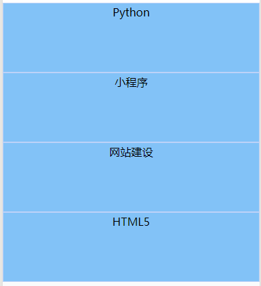
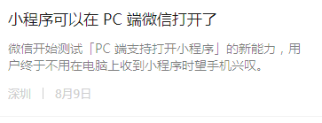
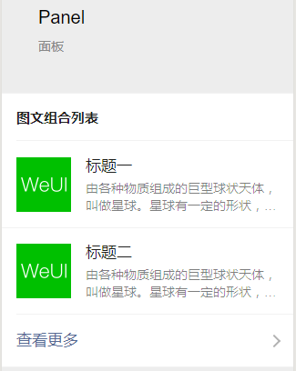
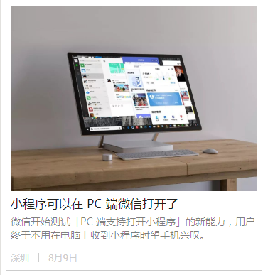
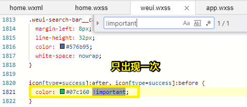

# WeUI框架

## ★概述

> WeUI是一套小程序的UI框架，所谓UI框架就是一套**界面设计**方案。有了组件，我们可以用它来拼接出一个内容丰富的小程序，而有了一个UI框架，就能让我们的小程序变得更加美观。

## ★体验WeUI小程序

> WeUI 是微信官方设计团队设计的一套同微信原生视觉体验一致的基础样式库。在手机微信里搜索**WeUI**小程序或者扫描[WeUI小程序码](https://user-images.githubusercontent.com/2395166/29502325-ada080f6-8661-11e7-94c2-23d638210f45.jpg)即可在手机里体验。

**Task：**

下载WeUI小程序的源码在开发者工具里查看它具体是怎么做的

**源码下载：**[WeUI小程序源码](https://github.com/Tencent/weui-wxss/archive/master.zip)

**How？**

1. 解压下载下来的东东，得到一个 `weui-wxss-master`目录
2. 点击开发者工具工具栏里的**项目**菜单选择**导入项目**
3. 项目名称随意，如叫「体验WeUI」、「WeUI 演示」等
4. 目录，选择**weui-wxss-master**下**dist**文件夹，因为该目录时小程序的root目录，即在开发者工具里边运行的！
5. 选择appid
6. 在开发者工具查看到WeUI的源代码

**具体做法分析：**

结合WeUI在开发者工具**模拟器的实际体验**以及**WeUI的源代码**，找到WeUI基础组件里的article、flex、grid、panel，表单组件里的button、list与之对应的pages文件夹下的页面文件，并**查看该页面文件的wxml、wxss代码**，**了解它们是如何写的**。

> 说白了，就是看效果，然后找到该效果实现的源码，接着就是分析它是如何写的，分析可见，到处都是 `view`组件，以及用`class`来语义化这个 `view`组件是定义啥内容的！

---

> **小任务：**点击开发者工具栏里的**预览**，用手机微信扫描二维码体验，看看与官方的WeUI小程序有什么不同。

没啥不同呀！

小结：WeUI的界面虽然非常简单，但是背后却**包含着非常多的设计理念**，这一点我们可以阅读[小程序设计指南](https://developers.weixin.qq.com/miniprogram/design/)，来加深对UI设计的理解。

> 大概看了一下这个[小程序设计指南](https://developers.weixin.qq.com/miniprogram/design/)，这给我的感觉就是告诉你  「样式该怎么写比较好？」「交互该怎样做比较好？」

## ★WeUI的使用

> WeUI的核心文件是**weui.wxss**

如何**在我们的模板小程序里**使用WeUI的样式？

1. 在**模板小程序**的根目录（**注意是在第一节建好的模板小程序里**）下新建一个`style`的文件夹
2. 把weui小程序dist/style目录下的weui.wxss文件粘贴到style的文件夹里
3. 使用开发者工具打开模板小程序的app.wxss文件的第二行添加这个代码：`@import 'style/weui.wxss';`

至此，weui的css样式就被引入到我们的小程序中，那么我们该如何**使用WeUI已经写好的样式**呢？

## ★Flex布局

**之前了解了啥？**

> 已经了解了如何给wxml文件添加文字、链接、图片等元素和组件

**现在想干啥？**

那么现在我们希望给这些元素和组件的**排版更加结构化**，不再是单纯的上下关系，还有**左右关系**，以及左右上下嵌套的关系，这个时候就需要**了解布局方面的知识**啦。

**在哪里弄布局的东西？**

> **布局也是一种样式**，也属于css方面的知识哦，所以大家应该知道该在哪里给组件添加布局样式啦！没错，就是在wxss文件里

**是什么？**

> 小程序的布局采用的是Flex布局。Flex是Flexible Box的缩写，意为”**弹性布局**”，用来**为盒状模型提供最大的灵活性**。

*注：这是以盒子为粒度的布局，如把盒子从上下关系，变为左右关系*

**How？**

①在home.wxml输入以下代码：

```html
<view class="flex-box">
  <view class='list-item'>Python</view>
  <view class='list-item'>小程序</view>
  <view class='list-item'>网站建设</view>
  <view class='list-item'>HTML5</view>
</view>
```

为了让list-item更加明显我们给他们添加一个边框、背景、高度以及居中处理，比如在home.wxss文件写入以下样式代码：

```css
.list-item{
  background-color: #82c2f7;
  height: 100px;
  text-align: center;
  border:1px solid #bdd2f8;
}
```

效果：



②**让组件变成左右关系**

这四个项目是上下关系，但要改成左右关系，所以可在home.wxss文件写入以下样式：

```css
.flex-box{
  display: flex;
}
```

效果：


我们给外层（也可以叫做父级）的view组件添加`display:flex`之后，这四个项目就成了左右结构的布局啦~

> 目前是四栏布局

③**让组件的宽度均分**

**我们希望**这四个list-item的view组件四等分该如何处理呢？我们只需要给list-item添加一个`flex:1`的样式：

```css
.list-item{
  flex:1;
} 
```

效果：


同样，弄二等分、三等分、五等分呢，只需要相应增减list-item即可，有多少个list-item就有多少等分，比如三等分：

```html
<view class="flex-box">
  <view class='list-item'>Python</view>
  <view class='list-item'>小程序</view>
  <view class='list-item'>网站建设</view>
</view>
```

> flex是弹性布局，`flex:1`这个样式是一个相对概念，这里的相对是指这每个list-item的宽度之比都为1。如横向是375px，那么均分就是375/4

④**让组件内的内容垂直居中**

我们看到list-item组件里的文字都不是垂直居中的，**我们希望**文字垂直居中该如何处理呢？我们需要给list-item的组件添加以下样式。

```css
.list-item {
  display: flex;
  align-items: center; /*垂直居中*/
  justify-content: center; /*水平居中*/
}
```

效果：


为什么会给list-item加了一个display:flex的样式呢？和前面一样display:flex是要给父级标签添加的样式，要让list-item里面的内容实现flex布局，就需要给list-item添加display:flex样式啦。

> 类似把内容看做是隐藏掉了span的东西，即隐藏了 `<text>`

你以为flex只能做简单的左右布局以及宽度等分布局吗？——那你就大错特错了！

> flex还可以表示更加复杂的布局结构，比如左中右，左1/4，中1/2，右1/4等等，由于**小程序以及手机UI设计不会弄那么复杂**，所以这里就不做更多介绍啦。

## ★全局样式与局部样式

全局样式与局部样式的概念大家需要了解一下，在[app.wxss技术文档](https://developers.weixin.qq.com/miniprogram/dev/framework/view/wxss.html)里是这样描述的：

> 定义在 app.wxss 中的样式为全局样式，作用于每一个页面。在 page 的 wxss 文件中定义的样式为局部样式，只作用在对应的页面，并会覆盖 app.wxss 中相同的选择器。

也就是说我们在app.wxss引入了weui.wxss，我们新建的所有的二级页面，都会自动拥有weui的样式

> 当然也包括一级页面哈！

## ★Flex样式参考

在WeUI小程序里我们发现在基础组件里也有Flex，它的**目的就是把内容给几等分**。我们可以在模拟器里看到有一等分（100%），二等分、三等分、四等分。它**实现的原理和我们上面讲的一样**。

可以找到WeUI文件结构下example文件夹里的flex页面，我们可以阅读一下flex.wxml的代码。比如我们找到二等分的代码：

```html
<view class="weui-flex">
  <view class="weui-flex__item">
    <view class="placeholder">weui</view>
  </view>
  <view class="weui-flex__item">
    <view class="placeholder">weui</view>
  </view>
</view>
```

我们可以直接把这段代码复制粘贴到home.wxml里，我们发现即使我们没有给weui-flex和weui-flex__item添加样式，但是它们自动就有了flex布局，这是因为我们之前把weui.wxss引入到了app.wxss文件里，关于flex布局weui.wxss都已经给我们写好啦，是不是省了我们很多的麻烦？

> 也就是说，WeUI框架的引入是因为它把很多css样式写好啦，省去了我们的一些麻烦，我们要使用它就是需要**把我们的组件的选择器如class、id和WeUI框架的保持一致**即可。

## ★使用WeUI美化文章排版

前面我们在写home.wxml文章内容的时候，不同的标题要设置不同的大小、间距，文章正文也要设置内外边距，图片也要设置模式，当然这些样式我们都可以自己写，但是看起来会不那么美观，由于是小程序，如果文章的外观和微信的设计风格一致，看起来就会舒服很多。

WeUI的设计风格符合小程序设计指南，所以它的一些样式标准值得我们参考。

设计规范：[微信小程序设计指南](https://developers.weixin.qq.com/miniprogram/design/index.html?t=2018724)

> 哦，原来WeUI框架不仅可以让我们少写一些CSS样式，引入它还可以使我们的小程序设计符合规范。我们觉得它不好看，可以不引入它自己写css吗？当然可以啦，WeUI框架只是一个方便我们的辅助工具而已，所使用的也都是我们之前掌握到的CSS的知识，在大家CSS熟练之后，我们也可以抛开它自由发挥。

**如何使用WeUI框架美化文章？**

1. 先体验WeUI小程序基础组件下的article
2. 打开WeUI小程序文件结构下的example的article页面下的article.wxml
3. copy参考它的代码
4. 改成以下的代码：

```html
<view class="page__bd">
  <view class="weui-article">
    <view class="weui-article__h1">HackWork技术工坊</view>
    <view class="weui-article__section">
      <view class="weui-article__p">HackWork技术工坊是技术普及的活动，致力于以有趣的形式让参与者学到有用的技术。任务式实战、系统指导以及社区学习能有效提高技术小白学习技术的效率以及热情。
      </view>
      <view class="weui-article__section">
        <view class="weui-article__h3">任务式实战</view>
        <view class="weui-article__p">
          每节都会有非常明确的学习任务，会引导你循序渐进地通过实战来掌握各个知识点。只有动手做过的技术才属于自己。
        </view>
        <view class="weui-article__p">
          <image class="weui-article__img" src="https://hackweek.oss-cn-shanghai.aliyuncs.com/hw18/hackwork/weapp/img1.jpg" mode="aspectFit" style="height: 180px" />
        </view>
        <view class="weui-article__h3">系统指导</view>
        <view class="weui-article__p">
          针对所有学习问题我们都会耐心解答，我们会提供详细的学习文档，对大家的学习进行系统指导。
        </view>
        <view class="weui-article__p">
          <image class="weui-article__img" src="https://hackweek.oss-cn-shanghai.aliyuncs.com/hw18/hackwork/weapp/img2.jpg" mode="aspectFit" style="height: 180px" />
        </view>
        <view class="weui-article__h3">社区学习</view>
        <view class="weui-article__p">
          参与活动即加入了我们的技术社区，我们会长期提供教学指导，不必担心学不会，也不用担心没有一起学习的伙伴。
        </view>
      </view>
    </view>
  </view>
</view>
```

## ★WeUI框架的核心与延伸

使用WeUI框架的核心在于**使用它写好了样式的选择器，结构与形式不完全受限制**。比如上面的class为weui-article的view组件的样式在我们之前引入的weui.wxss就写好了，样式为

```
.weui-article{
  padding:20px 15px;
  font-size:15px;
}
```

weui.wxss默认提供的是：

```css
.weui-article{
  padding: 24px 16px;
  font-size: 17px;
}
```

> 可见，你即便引入了WeUI之后，也不会覆盖你之前所写的样式！

总之，我们只需要给view组件添加weui-article的class，view组件就有了这个写好了的样式。如`weui-article__h3`，`weui-article__p`等

如果我们想给weui-article__h3这个小标题换一个颜色，那么这该怎么处理呢？

通常我们不推荐直接修改weui.wxss（**除非你希望所有的小标题颜色都替换掉**）。我们可以给要替换颜色的view组件再**增加一个class选择器**，再来添加样式即可。比如把社区学习这里的代码改成：

```html
<view class="weui-article__h3 hw__h3">社区学习</view>
```

然后在home.wxss文件里添加：

```css
.hw__h3{
  color:#1772cb;
}
```

一个view组件**可以有多个class**，这样就非常方便我们**定向给某个组件添加一个特定的样式**啦。

> 面对同级别的class选择器，那么局部样式的权重要大于全局样式，触发全局样式对某个样式声明添加了 `!important`

## ★模板样式的更改

默认是这样的效果：



WeUI提供图片的效果：



新闻列表的样式很多人不喜欢，想换一个其他的排版样式，**数据分离有个好处就是我们可以不用修改数据本身**，而直接修改wxml里的排版即可。**修改排版样式的核心在wxss**，也就是修改css样式。

我们想让图文结构是**上下结构**，我们可以**删掉weui框架所特有的一些选择器**，也就是删掉一些class，比如`weui-media-box__hd_in-appmsg`，`weui-media-box__thumb`等等，然后**添加一些选择器**，也就是**加入一些自己命令的id和class**

```html
<view class="page__bd" id="news-list">
  <view class="weui-panel__bd">
    <navigator url="" class="news-item" hover-class="weui-cell_active">
      <view class="news-img">
        <image mode="widthFix" class="" src="https://img.36krcdn.com/20190810/v2_1565404308155_img_000" />
      </view>
      <view class="news-desc">
        <view class="weui-media-box__title">小程序可以在 PC 端微信打开了</view>
        <view class="weui-media-box__desc">微信开始测试「PC 端支持打开小程序」的新能力，用户终于不用在电脑上收到小程序时望手机兴叹。</view>
        <view class="weui-media-box__info">
          <view class="weui-media-box__info__meta">深圳</view>
          <view class="weui-media-box__info__meta weui-media-box__info__meta_extra">8月9日</view>
        </view>
      </view>
    </navigator>
  </view>
</view>
```

然后我们在home.wxss里添加我们想要添加的css样式：

```css
#news-list .news-item {
  margin: 15rpx;
  padding: 15rpx;
  border-bottom: 1rpx solid #ccc;
}

#news-list .news-img image {
  width: 100%;
}

#news-list .news-desc {
  width: 100%;
}

```

效果：



> pc网页、移动端网页等也会有非常丰富的UI框架，它们和小程序的WeUI框架的核心与原理都是一样。由于它们可以大大提升我们写页面的开发速度，所以应用得非常普遍

关于删掉选择器和添加选择器的问题，你怎么删怎么添加，真得是看你的CSS能力！如你为啥要删除这个class呢？因为这个class影响了我的排版！

关于WeUI提供的样式命名所代表的含义，有点表意不明啊！如 `page__bd`、`page__hd`等是啥意思？

## ★总结

- 做笔记：输入（记录）、输出（总结）、复习

- 什么是UI框架？——一套有关「界面设计」的方案，如 WeUI，就是针对小程序而出现的一套UI框架！有了这个框架，就可以让我们快速写出一个更加美观的小程序！

- 多去看看这个[小程序设计指南](https://developers.weixin.qq.com/miniprogram/design/)，因为这给我的感觉就是在告诉我  「样式该怎么写比较好？」「交互该怎样做比较好？」

- 导入他人的小程序项目的时候，请找到`dist`目录，即小程序的root目录，一般都叫 `dist`

- 一般使用WeUI都得做二次的样式开发！因为WeUI的样式实在是忒朴素简洁了！

- 使用WeUI之个框架，需要在小程序项目里边全局引入 `weui.wxss`。即在 `app.wxss`里边 `@import 'style/weui.wxss';`

- 小程序使用flex布局一般都是用作左右布局以及等分布局！

- 全局样式和局部样式，在全局样式里边引入一个样式文件（如WeUI这个UI框架的核心样式文件），那么你在其它页面里边对某些组件元素上给上相应的class，就会有WeUI提供的样式啦！

- 如果你引入了WeUI，然后你要使用WeUI提供的组件，那么你可以查看WeUI在模拟器里边的预览效果，然后看看有哪些组件，接着你就找到你想要的那个组件效果的wxml代码（注意选择器是否保持一致）！这样一来，wxml代码不用你写，wxss代码也不用你写了！如果你想自定义样式，那么你只需要选择WeUI提供的选择器即可！需要注意的是，关于CSS权重问题，如果全局样式的权重大于你在页面写选择器权重，那么覆盖样式就GG了，不过一般WeUI很少会出现有 `!important`，所以你直接用一个class覆盖 即可！反正选择器就只有6种！

  

  总之，全局样式<局部页面样式<元素内联样式

  **➹：**[优先级 - CSS（层叠样式表） - MDN](https://developer.mozilla.org/zh-CN/docs/Web/CSS/Specificity)

- 引入WeUI的原因：

  - 写少点HTML和CSS
  - 让界面的设计规范，符合小程序设计指南

- 如何对引入的组件进行CRM操作？

  1. 修改HTML内容
  2. 删掉或增加HTML
  3. 删掉或增加Class
  4. 得到你想要的效果

  完成以上过程，得熟悉，这个组件默认提供的class到底代表着什么样式！删掉这个class会产生什么影响！

  说白了，是否熟悉使用UI框架，得看你的CSS水平如何！

  **➹：**[WeUI 的命名规范，各位还习惯吗？ - V2EX](https://www.v2ex.com/t/561399)

  **➹：**[用BEM命名规范组织CSS代码 - 掘金](https://juejin.im/post/5ae13586f265da0b84551dce)

  **➹：**[BEM命名规范 - 掘金](https://juejin.im/post/5bab8625e51d450e8a661b39)

  **➹：**[BEM命名法-InfoQ](https://www.infoq.cn/article/VfNFwdlE0zmGa9pSVBuG)

## ★Q&A

### ①把书读厚，再薄？

我如何看这小程序训练营提供的文档？

如果我不记笔记的话，那我很快就读完了！但要不了多久，我就会忘记之前做了什么

如果我记笔记，把每一篇都抄下来，并且添加点自己理解的东西，然后再最后来个总结，那这种姿势会浪费很多时间，当然，这学习效果对于目前的我来说算是最好的！

我如何权衡时间呢？「书读厚」这个「书」也包括技术书籍吗？我能先薄再厚吗？

看了很多答案，觉得采用「index」大法来看书，关于index大法，就是记标题的关键字，如「dual quaternion skinning」

不过，对于我来说，应该得加上大概内容，细节内容最好少记 或者 不记！

总之，你最后的输出是个快捷键，而不是一坨富有很多细节的东西！

**➹：**[什么叫做把书读厚，再把书读薄？如何做到？ - 知乎](https://www.zhihu.com/question/22115080)

**➹：**[在写作上你有些小技巧和小套路？ - 知乎](https://www.zhihu.com/question/53083560)

**➹：**[技术性书籍如何做读书笔记和总结？ - 叛逆者的回答 - 知乎](https://www.zhihu.com/question/29451585/answer/44458396)


### ②逆向思维？

逆向思维的中心思想：

> 你最后要干什么？为了干这个，你需要求出什么？为了求出这个，你需要知道什么？为了知道这个，你还需要知道什么？那为了知道这些之中的每一个，你需要求出什么？如此层层递进，找出所有需要的知识

干，求 ，知道……知道，求……

> 所谓“逆向思维”，当时说逆就逆在不遵从教科书的经典思维：【好了我们一开始知道这个，知道了这个我们还可以知道什么？我就告诉你我们还能知道那个！来来来我们还给定了那么一个，给定了那么一个我们就可以求出内个！来来来我们把那个和内个放在一起，诶你看我们就可以得到我们想要的。我们再把我们想要的和他们想要的拼在一起，诶我们就能得到她们想要的。好了问题解决了，考试就考这个啊记住了！】

整理笔记其实是一门艺术，你是在【创作】你的笔记，而**不单单是把书上的原文【誊写】在纸**上。从最终的目的出发，以逆向的逻辑为基础，带上自己的创造力，放开笔记形式的枷锁，把你从书上获得的知识整理成地图画在纸上吧。

*注：誊写，照底稿或原文抄写*

所以我该怎么做？把老师要讲什么，然后自己重新按自己理解的方式讲一篇？如要讲「WeUI框架」，老师是这样讲的，那么你能否按自己理解的方式讲一遍？

**➹：**[技术性书籍如何做读书笔记和总结？ - 汤睿的回答 - 知乎](https://www.zhihu.com/question/29451585/answer/44839847)

### ③技术书籍如何做笔记？

尽量在一周或两周时间内把一本书看完，如果看不完，那么之后想看完，那就是做梦了，因为你会忘记你前边所看的，既然忘记了，那么再续上后边的内容就有点吃力了！当然，你可以为前边的内容做上笔记！

**➹：**[技术性书籍如何做读书笔记和总结？ - 知乎](https://www.zhihu.com/question/29451585)

**➹：**[你读过哪些深入浅出的（技术）书籍？ - 知乎](https://www.zhihu.com/question/29093609)

**➹：**[读完一本技术书籍需要多久？ - 知乎](https://www.zhihu.com/question/25655847)

**➹：**[康奈尔笔记法的作用是否言过其实？ - 知乎](https://www.zhihu.com/question/23549869)

**➹：**[技术类的书籍怎么阅读才能达到最好的效果呢？ - 知乎](https://www.zhihu.com/question/20230133)

