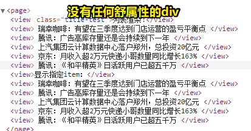

# 列表渲染与条件渲染


## ★总结

- 当你需要了解某个语法的时候，那就写一些demo吧！如为了体现这个语法，我需要怎样怎样，即想个需求出来！
- 如果你在搞列表渲染的时候，不指定 `wx:key="*this"`，如这样：

```html
<view wx:for="{{newstitle}}">
  {{item}}
</view>
```

那么就会报这样的错误：


因此正确的代码是这样的：

```html
<view wx:for="{{newstitle}}" wx:key="*this">
  {{item}}
</view>
```

`*this`（保留关键字）代表在 for 循环中的 item 本身，而大胡子里边的`item`是规定好的当前项的默认变量名，即它是代表的是数组里边的元素值！

当然，你也可以显示指定item的变量名：

```html
<view wx:for-items="{{newstitle}}" wx:for-item="title" wx:key="*this">
  {{title}}
</view>
```

以上的wx指令属性，不会在DOM里边呈现：



- `block`组件类似于`template`标签，参考 WeUI的grid组件，渲染出来的东西是咩有`block`这个元素的！
- 页面起名可以这样`list-if-render` ，之后每看一篇文章就添加个页面！

## ★Q&A

### ①`*this`是关键字，那么在指定 `wx:key`时，为啥可以用诸如 `*xx`这样的值？

**➹：**[最难点For的wx:key，您肯定不知道的！（框架细节十一）-微信小程序俱乐部 www.wxappclub.com](http://www.wxappclub.com/topic/536)

