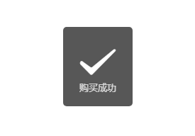
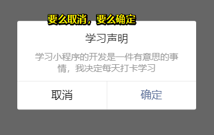

# 点击事件

**事件**是视图层到逻辑层的通信方式，当我们**点击tap**、**触摸touch**、**长按longpress**小程序**绑定了事件的组件**时，就会触发事件，执行逻辑层中对应的**事件处理函数**。

> 小程序框架的视图层由 WXML 与 WXSS 来编写的，由组件来进行展示。将逻辑层的数据反应成视图，同时将视图层的事件发送给逻辑层。逻辑层将数据进行处理后发送给视图层，同时接受视图层的事件反馈。

## ★页面滚动

**滚动API技术文档：**[wx.pageScrollTo(Object object)](https://developers.weixin.qq.com/miniprogram/dev/api/ui/scroll/wx.pageScrollTo.html)

事件处理 `bindtap="scrollToPosition"`、`bindtap="scrollToTop"`

可以量化滚动，即 指定滚动到多少px位置

```js
  scrollToTop() {
    wx.pageScrollTo({
      scrollTop: 0,
      duration: 300
    })
  },

  scrollToPosition() {
    wx.pageScrollTo({
      scrollTop: 6000,
      duration: 300
    })
  },
```

可以指定滚动到哪个元素，指定方式是使用选择器！

```js
scrollToTop() {
    wx.pageScrollTo({
      duration: 3000,
      selector: ".pagetop"
    })
  },

  scrollToPosition() {
    wx.pageScrollTo({
      duration: 300,
      selector: "#pageblock"
    })
  },
```

如果指定的事件处理函数，没有在 JS 里边写，那么就会报这样的警告：


注意点：

> 不要误以为只有button组件才可以绑定事件哦，还记得我们小程序组件里看的技术文档[小程序组件](https://developers.weixin.qq.com/miniprogram/dev/framework/view/component.html)吗？在公共属性部分，可以看到**所有组件都有以下属性bind\* / catch\***，这个属性的类型是EventHandler，bindtap就是bind*的一个类型。也就是说小程序的所有组件都可以通过以上方法触发事件处理函数，达到滚动等效果。使用button为案例只是为了便于展示而已。

小技巧：

> **命名规范：**JavaScript的项目名、函数名、变量等都应该遵循简洁、语义化的原则。函数名推荐使用驼峰法来命名(**camelCase**)，比如scrollToTop、pageScrollTo，也就是由**小写字母开始**，**后续每个单词首字母都大写**，长得跟骆驼的驼峰似的。

## ★消息提示框Toast

**消息提示技术文档：**[wx.showToast(Object object)](https://developers.weixin.qq.com/miniprogram/dev/api/ui/interaction/wx.showToast.html)

消息提示框是移动端App、H5(WebApp)、小程序经常会使用到的一个交互界面。

测试：

```html
<button type="primary" bindtap="toastTap">点击弹出消息对话框</button>
```

```js
  toastTap() {
    wx.showToast({
      title: '购买成功',
      icon: 'success',
      duration: 2000
    })
  },
```

2000表示toast消失的时间！

> **小任务：**修改title、icon和duration，以及添加image属性，看看会有什么样不同的表现形式，以及你在哪个App的何种场景下见过类似的消息提示信息？



## ★模态对话框

> **模态对话框技术文档：**[wx.showModal(Object object)](https://developers.weixin.qq.com/miniprogram/dev/api/ui/interaction/wx.showModal.html)

这次我们会调用一下小程序的模态框（还是强调modalTap是你可以根据命名规范任意命名的，只需要在js里添加相应的事件处理函数就可以调用API）:

```html
<button type="primary" bindtap="modalTap">显示模态对话框</button>
```

```js
modalTap() {
    wx.showModal({
      title: '学习声明',
      content: '学习小程序的开发是一件有意思的事情，我决定每天打卡学习',
      showCancel: true,
      confirmText: '确定',
      success(res) {
        if (res.confirm) {
          console.log('用户点击了确定')
        } else if (res.cancel) {
          console.log('用户点击了取消')
        }
      }
    })
  },
```

保存编译之后，点击模拟器上的按钮，就可以显示出一个对话框，这个对话框我们称之为Modal模态对话框。



### ◇**千变万化之API**（学习技巧）

阅读API的技术文档，就要了解该API有哪些属性，属性代表得是什么含义，属性是什么类型（**这一点非常重要**），以及它的默认值是什么，可以有哪些取值。


> 如果有默认值，那就意味着，该属性是隐式帮你写的，如上边的代码，你去掉 `showCancel: true,`也没事！你写上也没事！

简单分析一下如何看每个属性（明确该属性是否存在，不管是显式指定，还是隐式就已经指定好的！接着CRUD它！）

- title属性不是必填，删除title的赋值，就不会显示标题啦；
- content属性也不是必填，为提示的内容；
- showCancel默认值就是true，意思是默认显示取消按钮，改为false就不显示了
- confirmText默认值为确定，你可以改成别的试试

通过给API已有的属性赋不同的值，API所展现的内容就会有很多种变化，而具体要怎么用，则需要你根据实际的小程序开发项目来使用了。

> 小任务：在哪些App、小程序、H5(WebApp)你会看到模态框？这些模态框是在什么情况下出现的，它的作用是啥？你能模仿这些模态框写一下配置信息吗？

这个任务，很少有留意呀！

### ◇**console.log日志打印**

考虑点击confirm和cancel按钮，会执行啥回调咯！说白了，就是需要对用户的行为进行反馈咯！

> **success、fail、complete回调函数** 在技术文档里可以看到属性里有success和fail两个回调函数，success为接口调用成功的回调函数；fail为接口调用失败的回调函数。关于这方面的知识大家可以阅读技术文档[小程序API](https://developers.weixin.qq.com/miniprogram/dev/framework/app-service/api.html#API)，大致了解一下异步API与回调函数的参数，理解异步 API 的执行结果需要通过  Object 类型的参数中传入的对应回调函数获取。（不理解也没有关系）

## ★手机振动

手机振动API分两种，一种是长振动，一种是短振动，两个API写法大致相同，为了体验效果，我们以长振动为例

```html
<button type="primary" bindtap="vibrateLong">长振动</button>
```

```js
vibrateLong() {
    wx.vibrateLong({
      success(res) {
        console.log(res)
      },
      fail(err) {
        console.error(err)
      },
      complete() {
        console.log('振动完成')
      }
    })
  },
```

保存编译之后，点击预览，使用手机扫描来体验一下长振动的效果。

> 点击后先执行success，然后震动停止后才会执行 `complete`

**长振动技术文档：**[wx.vibrateLong()](https://developers.weixin.qq.com/miniprogram/dev/api/device/vibrate/wx.vibrateLong.html)

在长振动技术文档里我们再次看到API里三个回调函数，success、fail、complete。在模拟器上点击按钮时，就可以看到打印日志。console.error向控制台的console中打印 error 日志，**如果不能调用长振动，那一般是手机权限的问题了**。

> 小任务：参考长振动的代码以及[短振动的技术文档](https://developers.weixin.qq.com/miniprogram/dev/api/device/vibrate/wx.vibrateShort.html)，写一个短振动的案例，体验一下两者有什么不同。

我手机一点感觉都没有呀！

## ★**弹出操作菜单**

```html
<button type="default" bindtap="actionSheetTap">弹出操作菜单</button>
```

```js
actionSheetTap() {
    wx.showActionSheet({
      itemList: ['添加照片', '删除照片', '更新照片', '查询更多'],
      success(e) {
        console.log(e.tapIndex)
      }
    })
  },
```

**弹出菜单技术文档：**[wx.showActionSheet(Object object)](https://developers.weixin.qq.com/miniprogram/dev/api/ui/interaction/wx.showActionSheet.html)

保存之后在模拟器体验，点击按钮就会弹出显示**添加照片**、**删除照片**、**更新照片**、**查询更多**等选项的操作菜单，当然我们点击操作菜单的选项之后是没有反应的，点击之后的反应还需要我们以后来写事件处理函数才行。


### ◇**success回调函数**

当我们点击操作菜单的不同选项时，会返回不同的数字，这取决于success回调函数里的e.tapIndex的值。在官方文档里我们可以了解到，当用户点击的按钮序号，从上到下的顺序，从0开始，相当于对应着数组itemList的序号，这样就为我们以后根据不同的菜单选项来执行不同的操作提供了可能。

> **小任务：**在success(e){}回调函数里，添加console.log(e)打印e以及console.log(e.errMsg)打印e的errMsg对象看看是什么结果。


## ★页面路由

页面路由是一个非常重要的概念，打开新页面、页面返回、Tab页面切换、页面重定向等都是使用路由的不同方式。

> 关于页面路由，大家可以阅读一下[页面路由技术文档](https://developers.weixin.qq.com/miniprogram/dev/framework/app-service/route.html)，页面路由我们可以**简单的理解为对页面链接的管理，根据不同的url链接来显示不同的内容和页面信息**。在后面的章节我们还会具体讲一下页面路由的知识的，不必苛求一次性都搞明白。

### ◇**Navigator组件与页面路由API**

在前面我们已经学习过[Navigator组件](https://developers.weixin.qq.com/miniprogram/dev/component/navigator.html)，在navigator组件的技术文档里，我们可以看到open-type属性以及合法值。在小程序API左侧也可以看到5个不同的API。它们之间的对应关系如下:

|                       **页面路由API**                        | **Navigator open-type值** | **含义**                                                     |
| :----------------------------------------------------------: | ------------------------- | ------------------------------------------------------------ |
| [redirectTo](https://developers.weixin.qq.com/miniprogram/dev/api/route/wx.redirectTo.html) | redirect                  | 关闭当前页面，跳转到应用内的某个页面。但是不允许跳转到 tabbar 页面。 |
| [navigateTo](https://developers.weixin.qq.com/miniprogram/dev/api/route/wx.navigateTo.html) | navigate                  | 保留当前页面，跳转到应用内的某个页面。但是不能跳到 tabbar 页面。 |
| [navigateBack](https://developers.weixin.qq.com/miniprogram/dev/api/route/wx.navigateBack.html) | navigateBack              | 关闭当前页面，返回上一页面或多级页面。                       |
| [switchTab](https://developers.weixin.qq.com/miniprogram/dev/api/route/wx.switchTab.html) | switchTab                 | 跳转到 tabBar 页面，并关闭其他所有非 tabBar 页面             |
| [reLaunch](https://developers.weixin.qq.com/miniprogram/dev/api/route/wx.reLaunch.html) | reLaunch                  | 关闭所有页面，打开到应用内的某个页面                         |

> 可以使用路由组件，也可以使用路由API，来做到页面路由的切换！

也就是说**Navigator组件可以做到的事情，使用JavaScript调用小程序也能路由API也可以做到**。Navigator组件的内容是写死的，而JavaScript则可以提供动态的数据。

### ◇**跳转到新页面与Tab页**

我们可以在之前创建的home.wxml里输入以下代码：

```html
<button bindtap="navigateTo">保留页面并跳转</button>
<button bindtap="switchTab">跳转到组件Tab页</button>
<button bindtap="redirectTo">关闭当前页面跳转</button>
```

> 保留页面并跳转的意思是说页面户被push到页面栈里边去，可以让你返回页面！

然后在home.js文件里添加以下代码：

```js
 navigateTo() {
    wx.navigateTo({
      url: '/pages/home/imgshow/imgshow'
    })
  },
  switchTab() {
    wx.switchTab({
      url: "/pages/list/list",
    })
  },
  redirectTo() {
    wx.redirectTo({
      url: '/pages/home/imgshow/imgshow'
    })
  },
```

保存之后在开发者工具的模拟器点击按钮，就实现了页面和Tab页的切换效果。在前面我们提到bintap是小程序所有组件的公有属性，只有bintap绑定了页面路由切换的事件处理函数，组件是不是Navigator也就不重要了，也就是**链接跳转不再是Navigator组件的专利**。

> 或许Navigator组件的本质就是调用了路由API

> 注意这里的url的路径，我们使用的是相对于小程序根目录的绝对路径。app.json的pages配置项前面没有/是因为app.json本来就在根目录，所以可以使用相对路径以及这里的取值，以及API很多参数的字符串String类型的赋值，单引号和双引号都是没有影响的。

### ◇**返回上一页**

在home页面里的imgshow文件夹下的imgshow.wxml（在小程序开发的第一部分建过这个页面，如果没有，你再创建也可以）输入以下代码：

```html
<button bindtap="navigateBack">返回上一页</button>
```

在imgshow.js里添加以下代码

```js
navigateBack() {
    wx.navigateBack({
        delta: 1
    })
},
```

点击**保留页面跳转按钮**以及**返回上一页**按钮，这样我们就可以在小程序里通过点击组件实现了页面的切换与页面的返回。而如果是使用wx.redirectTo跳转到新的页面就没法使用返回上一页了。

> wx.navigateTo 是保留当前页面、跳转到应用内的某个页面，使用 wx.navigateBack可以返回到原页面。对于页面不是特别多的小程序，且页面间存在经常切换时，推荐使用 wx.navigateTo进行跳转， 然后返回，提高加载速度。

## ★总结

- 再次加深了，看文档对我们写代码的重要性！

## ★Q&A

### ①模态对话框？

模态（Modal）：UI控件或视图的一种状态，用户只能对处于模态的控件或视图进行响应，不能操作其他非模态的控件或视图。

**➹：**[弹窗、模态、提示、浮层，这几位是什么关系？ - 知乎](https://www.zhihu.com/question/41953649)