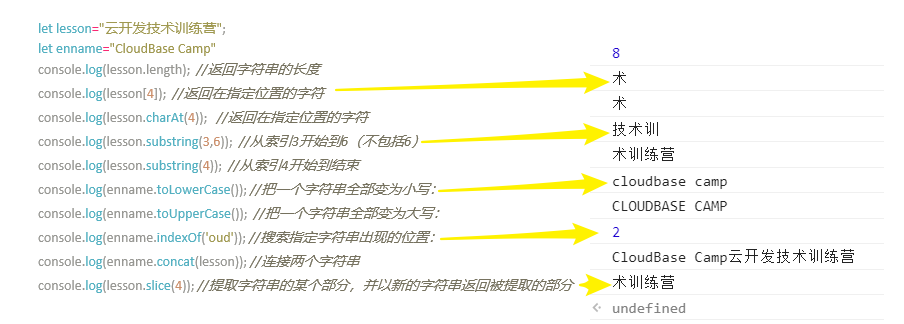
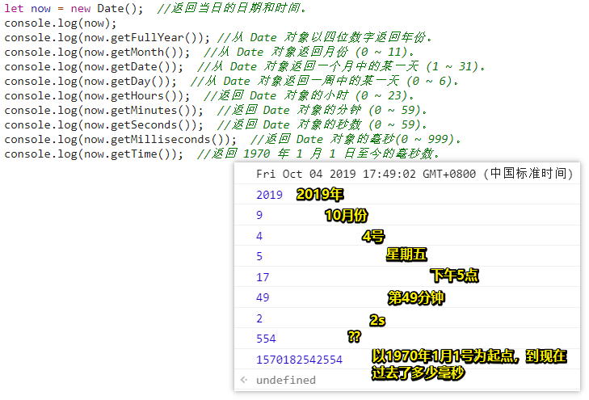
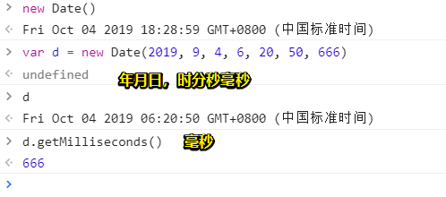
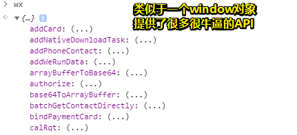

# JavaScript入门

> 资源：[JavaScript入门](https://tencentcloudbase.github.io/handbook/tcb11.html)

JavaScript是目前世界上最流行的编程语言之一，它也是**小程序开发最重要的基础语言**。要做出一个功能复杂的小程序，除了需要**掌握JavaScript的基本语法**，还要了解如何**使用JavaScript来操作小程序**（通过API接口）

> 类似 JS 操作DOM一样

## ★控制台Console

打开微信开发者工具，在**调试器**里可以看到**Console**、Sources、Network、Appdata、Wxml等标签，这些都是**调试器的功能模块**。 而**控制台Console**除了可以**显示小程序的错误信息**外，还可以用于**输入和调试代码**。

### ◇数学运算

> JavaScript的算数运算符和我们常见的数学运算符没有太大区别，+加、-减、乘*、除/、指数`**`

### ◇**Console.log打印日志**

打印出有颜色的log？


关于转义字符：

> 在实际应用中，总有一些具有特殊含义的字符无法直接输入，比如换行 `\n`、Tab键 `\t`、回车 `\r`、反斜杠 `\\`，这些我们称之为转义字符。

反斜杠是有特殊含义，如果你想要log一个反斜杠，那么就需要通过 `\`把反斜杠的能力给取消掉，同理，你想要一个字符有特殊能力，就用 `\`转义一下，如 `n`是普通的字符，你这样写 `\n`就被称为转义字符了，即 `n`的意义不是一个字符 `n`，而是一个换行 `n`。总之我们要输入一个换行字符，那就是 `\n`，输入一个回车，那就 `\r`

➹：[从 console.log 说起（上）- AlloyTeam](http://www.alloyteam.com/2013/11/console-log/)

➹：[从 console.log 说起（下）- AlloyTeam](http://www.alloyteam.com/2013/11/console-log-2/)

### ◇**console.log打印数组Array**

```js
//log一个数组，可以查看它的原型__proto__：有诸如concat、push、shift、slice、toString等方法
console.log(["肖申克的救赎","霸王别姬","这个杀手不太冷","阿甘正传","美丽人生"])

//通过索引值打印数组里的单一数据，也就是通过指定数组名以及索引值，来访问某个特定的元素:
console.log(["肖申克的救赎","霸王别姬","这个杀手不太冷","阿甘正传","美丽人生"][3])
```

### ◇**console.log打印对象Object**

```js
//查看对象的属性以及属性对应的值
console.log({name: "霸王别姬",img: "https://img3.doubanio.com/view/photo/s_ratio_poster/public/p1910813120.webp",desc: "风华绝代。"})
//通过点表示法来访问该属性获取属性对应的值
console.log({name: "霸王别姬",img: "https://img3.doubanio.com/view/photo/s_ratio_poster/public/p1910813120.webp",desc: "风华绝代。"}.desc)

```

或许你已经发现，当我们打印数组的某一项和通过点表示法获取对象某个属性对应的值的时候，这打印的内容真TM长？

而这个时候我们可以把数组、对象赋值给一个变量，类似于数学里的`y=ax+b`，就可以大大简化代码了。

> 完全把`ax+b`当作是个黑盒呀！
>
> 突然觉得，老师要讲一个变量知识，通过log来引出真得很新颖，即很直白的就告诉你了为啥需要用变量！一般讲解为啥需要变量，都会从保存程序的运行状态等很抽象的方面讲起，而log就很直接，即我不希望写那么多字符。

➹：[为什么要有指针？ - 知乎](https://www.zhihu.com/question/26623283)

➹：[★为什么要有指针？ - Ivony的回答 - 知乎](https://www.zhihu.com/question/26623283/answer/33449500)

➹：[【另眼看编程】（一）什么是变量？为什么要使用变量？ - 兄弟连_战地日记 - CSDN博客](https://blog.csdn.net/lampzdrj/article/details/10600079)

> 地址、指针、引用，指针可以用来改变地址，赋值可以改变引用！
>
> 其实归根到底，都是对数据操作！这是方式不同而已！
>
> 注：**变量的本质是一个内存地址的别名**，如果不用的变量的话，那么自己一开始把内存都规划好然后直接读写指定的位置就好，但这样忒麻烦了！
>
> 或许我应该换个方式去学习一些东西，比如多问自己「不要这种方式，是否还有其它方式可以做到，甚至是否还有更好的方式」，而不是「为什么要有xxx这样，它存在的意义是啥」。（或许做到前者需要把后者作为基础吧！即**了解一个点，然后再了解其它类似的点**。）
>
> 如这样：如果我设计一种新的语言，是否需要设计指针，如果不设计指针，我能用什么语法来代替；如我要写一个Vue前端项目，是否需要用到Vuex，如果不用Vuex，我能用啥姿势来代替？如eventBus等


## ★变量与赋值

我用 JS 写了行这样的语句：

```js
let a = 'xxx'
```

从中可以看出：

1. 如何声明一个变量？——直接用个`let`关键字声明变量即可
2. 如何把一个值赋给一个变量？——直接使用 `=`等号即可，等号的左边是变量a，等号的右边则是给该变量赋的值
3. 关于变量a的值在这里是字符串，那么可以是其它数据类型吗？——变量的值可以是任何**数据类型**， JS 常见的数据类型有：数值（Number）、字符串（String）、布尔值（Boolean）、对象（Object）、函数（Function）等。

总之，这行语句解读为「声明一个变量a并赋值为 `‘xxx’` 」

### ◇将数据赋值给变量

```js
let movielist=["肖申克的救赎","霸王别姬","这个杀手不太冷","阿甘正传","美丽人生"]
let movie={name: "霸王别姬",img: "https://img3.doubanio.com/view/photo/s_ratio_poster/public/p1910813120.webp",desc: "风华绝代。"}
console.log(movielist)
console.log(movielist[2])
console.log(movie)
console.log(movie.name)
```

通过**将复杂的数据信息（数组、对象）赋值给一个变量**，代码得到了大大的简化，可以深刻了解到**变量是用于存储信息的”容器”**。

> 读写变量，即读写数据，当然，这些变量存储的是一个引用！

### ◇**变量的冲突与覆盖**

声明了一个变量名之后，就不能再次**声明这个变量名**，但是我们可以给该变量重新赋值：

```js
let a = 5
let a //不行
a = 6 //可以
```

至此，我们对声明变量、赋值、覆盖（修改变量的值）有了更深的了解

每次打log都会返回一个`undefined`：

> 这个undefined是console.log()这个函数的返回值，每个函数都有返回值，如果函数没有提供返回值，会返回 undefined。

> 小任务：那我们是否可以给一个没有声明过的变量名直接赋值呢？你知道应该如何在控制台打印测试结果吗？你的实验结果是？

显然可以呀！不过这个变量是全局变量哈！

## ★操作数组

数组是一个有序的列表，如豆瓣电影的top5：

```js
["肖申克的救赎","霸王别姬","这个杀手不太冷","阿甘正传","美丽人生"]
```

我们对数组的操作：

1. 想增加5项数据，变成Top10的
2. 数据太多，只想要top3
3. ……

既然要对数组进行操作，就有操作的方法：

- **分隔符join方法**：将数组元素拼接为字符串,以分隔符分割，默认是逗号,分割
- **添加数组push方法**：向数组的末尾添加一个或更多元素，并**返回新数组的长度**，push方法是在原来的数组后面（不是前面）新增了值（不是覆盖，重新赋值）
- **移除最后一项pop方法**：从数组末尾**移除**最后一项，并返回移除的项的值

```js
console.log(movielist.join("、"))
console.log(movielist.push("千与千寻","泰坦尼克号","辛德勒的名单","盗梦空间","忠犬八公的故事"))
console.log(movielist.pop())
```

以上通过一些实际的案例让大家了解**如何使用控制台打印这种实战方式来了解了一些数组具体的操作方法**，数组的操作方法还有很多，大家可以去查阅技术文档。

**技术文档：**[MDN数组Array](https://developer.mozilla.org/zh-CN/docs/Web/JavaScript/Reference/Global_Objects/Array)

> 如果说小程序的开发离不开小程序的官方技术文档，那MDN则是每一个前端开发工程师都必须经常去翻阅的技术文档。打上[MDN数组Array](https://developer.mozilla.org/zh-CN/docs/Web/JavaScript/Reference/Global_Objects/Array)，在页面的左侧菜单里，我们可以看到Array有着数十种方法，而这些方法，都是我们之前打印了数组之后在__proto__里看到的方法。关于数组的prototype，学有余力的人可以去阅读[MDN Array.Prototype](https://developer.mozilla.org/zh-CN/docs/Web/JavaScript/Reference/Global_Objects/Array/prototype)

> **小任务：**通过实战的方式了解一下数组的concat()、reverse()、shift()、slice()、sort()、splice()、unshift()方法

## ★操作对象

我们可以用点表示法访问对象的属性，通过给该属性赋值就能够添加和修改对象的属性的值了。如：

```js
let a = {'age': 18}
console.log(a.age) //用点访问
a.name = 'frank' //添加属性
a.age = 19 //修改或更新某个属性的值，做法是重新赋值
```

还可以**删除对象的某个属性**

```js
delete a.name
```

## ★常量

我们知道变量的值可以通过重新赋值的方式来改变，但是有些数据我们希望是固定的（写死，不会经常改变），这个时候可以使用**const声明**创建一个值的**只读**引用

何时用它？

> 开发小程序的时候，我们会确定小程序的色系、颜色等，使用const声明，以后直接调用这个常量，这样就不用记那么多复杂的参数，以后想全网改样式，直接改const的内容即可

如：

```js
const defaultStyle = {
  color: '#7A7E83',
  selectedColor: '#3cc51f',
  backgroundColor: '#ffffff',
}
```

## ★字符串的操作

字符串是JavaScript的数据类型之一，那我们可以怎么来操作字符串呢？

**How？**

> 我们就来结合MDN技术文档来学习。**MDN文档是前端最为依赖的技术文档**，我们要像查词典一样来学习如何使用它。

**技术文档：**[MDN技术文档之JavaScript标准库之String](https://developer.mozilla.org/zh-CN/docs/Web/JavaScript/Reference/Global_Objects/String)

查看效果：



打开技术文档，在技术文档左侧菜单的**属性**和**方法**里，找到操作字符串用了哪些属性和方法，**通过翻阅技术文档既加深对字符串的每个操作的理解**，也知道该如何查阅技术文档。

> 字符串怎么有这么多属性和方法？多就对了，正是因为多，所以我们不能用传统的死记硬背来学习技术。技术文档怎么有这么多新词汇我见都没有见过，完全看不懂？你不需要全部都懂，就像我们不需要懂词典里的所有单词和语法一样。即使是GRE满分高手也不能认全所有单词，而通常6级单词就已经够用了，技术也是一样的道理。

## ★Math对象

Math是一个内置对象， 它具有数学常数和函数的属性和方法，但**它不是一个函数对象。**


**技术文档：**[Math对象MDN文档](https://developer.mozilla.org/zh-CN/docs/Web/JavaScript/Reference/Global_Objects/Math)

根据得到的结果来弄清楚每个函数的意思


同理，我们打开技术文档，在左侧菜单找一下Math对象的属性有哪些，Math对象的方法又有哪些？大致感受一下属性和方法到底是什么意思。

> 注意，在别的开发语言里面，我们想获取一个数的绝对值可以直接调用abs(x)函数即可，而JavaScript却是Math.abs(x)，这是因为前面说的Math不是函数(函数对象)，而是一个对象。

## ★Date对象

Date 对象用于**处理日期和时间**。时间有年、月、日、星期、小时、分钟、秒、毫秒以及时区的概念，因此**Date对象属性和方法也显得比较多**。

**技术文档：**[Date对象MDN文档](https://developer.mozilla.org/zh-CN/docs/Web/JavaScript/Reference/Global_Objects/Date)



关于`getMilliseconds`，它表示根据本地时间获取毫秒(0-999)，默认值是0，我们可以显示指定日期毫秒数：

```js
var moonLanding = new Date('July 20, 69 00:20:18');
moonLanding.setMilliseconds(123);

console.log(moonLanding.getMilliseconds()); //123
```

一般我们都会忽视当前日期的毫秒数，因为毫秒数对于我们的网页毫无意义，毕竟我们并不需要精确到毫秒数，只要秒就可以了！



所以上边的554是，那个日期时刻的毫秒数！

➹：[关于JavaScript中的Date你需要知道的一切 - 知乎](https://zhuanlan.zhihu.com/p/76055541)

## ★全局对象wx

wx是小程序的全局对象，用于承载小程序能力相关 API。小程序开发框架提供丰富的微信原生 API，可以方便的调起微信提供的能力，如获取用户信息，了解网络状态等。大家可以在微信开发者工具的控制台Console里了解一下这个wx这个对象。



可以看到wx的所有属性和方法，如果你对wx的哪个属性和方法不了解，你可以查阅技术文档。

**技术文档：**[API技术文档](https://developers.weixin.qq.com/miniprogram/dev/framework/app-service/api.html#API)

### ◇了解网络状态

比如设备是使用wifi打开的小程序吗？

**获取网络类型技术文档：**[wx.getNetworkType()](https://developers.weixin.qq.com/miniprogram/dev/api/device/network/wx.getNetworkType.html)

```js
wx.getNetworkType({
  success(res) {
    console.log(res)
  }
});
```


### ◇**了解用户信息**

**获取用户信息技术文档：**[wx.getUserInfo()](https://developers.weixin.qq.com/miniprogram/dev/api/open-api/user-info/wx.getUserInfo.html)

登录开发者工具之后（大家应该已经处于登录状态），在控制台console里输入以下代码，看得到什么信息：

```js
wx.getUserInfo({
  success(res) {
      console.log(res);
  }
});
```

然后退出开发者工具，再输入以上代码，看看是什么令人兴奋的结果？

### ◇**获取设备信息**

**获取设备信息技术文档：**[wx.getSystemInfo()](https://developers.weixin.qq.com/miniprogram/dev/api/base/system/system-info/wx.getSystemInfo.html)


### ◇**页面链接跳转**

**页面跳转技术文档：**[wx.navigateTo()](https://developers.weixin.qq.com/miniprogram/dev/api/route/wx.navigateTo.html)

除了可以获取到用户、设备、网络等的信息，使用控制台来调用对象的方法也可以执行一些动作，比如页面跳转。

跳转到某个页面：

```js
wx.navigateTo({
  url: '/pages/home/imgshow/imgshow'
})
```

注意，不能跳到tabbar页面哈，即无法这样做（我配置了4个tab）：

```js
wx.navigateTo({
  url: '/pages/list/list'
})
```

每次执行跳转到某个页面都会在页面栈里边push一个页面路由地址，如我从home页开始，跳转了3次某个页面（可以重复跳转同一个页面）：


[getCurrentPages](https://developers.weixin.qq.com/miniprogram/dev/reference/api/getCurrentPages.html)是个全局函数，可以直接获取当前的页面栈！需要注意的是，小程序中页面栈最多十层：


使用 [wx.navigateBack](https://developers.weixin.qq.com/miniprogram/dev/api/route/wx.navigateBack.html) 可以返回到上一个页面。如这样：

```js
wx.navigateBack({
  delta: 1
})
```

表示回到上一页：


你写2，那么就把最后两个元素移除了，然后当前页面显示的就是最后一个元素的路由


回到首页：


### ◇**显示消息提示框**

**显示消息提示框技术文档：**[wx.showToast()](https://developers.weixin.qq.com/miniprogram/dev/api/ui/interaction/wx.showToast.html)

```js
wx.showToast({
    title: '弹出成功',
    icon: 'success',
    duration: 1000
  })
```

### ◇**设置当前页面的标题**

**设置标题技术文档：**[wx.setNavigationBarTitle()](https://developers.weixin.qq.com/miniprogram/dev/api/ui/navigation-bar/wx.setNavigationBarTitle.html)

```js
wx.setNavigationBarTitle({
  title: '控制台更新的标题'
})
```

### ◇**打开文件选择**

**打开文件选择技术文档：**[wx.chooseImage()](https://developers.weixin.qq.com/miniprogram/dev/api/media/image/wx.chooseImage.html)

```js
wx.chooseImage({
  count: 1,
  sizeType: ['original', 'compressed'],
  sourceType: ['album', 'camera'],
  success (res) {
    const tempFilePaths = res.tempFilePaths
  }
})
```

这一部分主要是让大家明白控制台Console的强大之处，以及通过控制台实战的方法对小程序API的运行机制有一个初步的了解

## ★总结

- 看文档，调用API。

## ★Q&A

### ①编程中为什么要把一些变量私有？

> 我的理解是这样的，有时候仇人太多就不知道是被谁打的了还是仇人少点好

替换一下来说就是：

> 有时候暴露变量太多就不知道是被谁修改的了，还是暴露变量少点好

➹：[编程中为什么要把一些变量私有？ - Tmacchen的回答 - 知乎](https://www.zhihu.com/question/21142338/answer/27126480)

➹：[编程中为什么要把一些变量私有？ - 知乎](https://www.zhihu.com/question/21142338)

