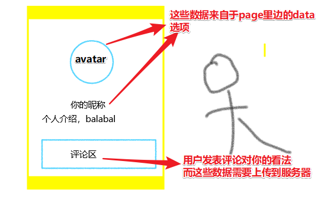
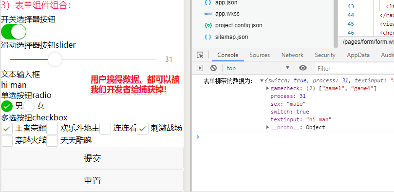
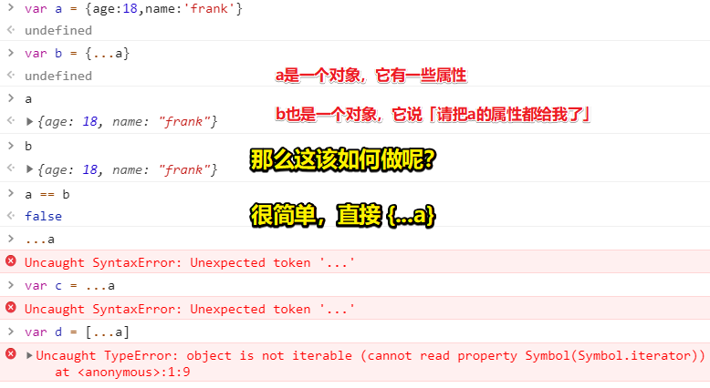

# 数据表单

## ★为什么讲这个？

> 在前面的章节所用到的数据大多都是我们在js的data里写好的，在这一节里，我们会来介绍如何让用户提交数据。无论是计算器、用户注册、表单收集、发表文章、评论等等，这些都是对用户提交数据的获取。 



## ★设置导航栏标题

如何设置？

>  只要给`wx.setNavigationBarTitle()`的title对象赋值，就能改变小程序页面的标题 。

接下来会使用多种方法来调用这个API ，而这样做的目的是 让大家了解**API调用方法有什么不同** 

**技术文档：**[wx.setNavigationBarTitle()](https://developers.weixin.qq.com/miniprogram/dev/api/ui/navigation-bar/wx.setNavigationBarTitle.html) 

### ◇onLoad调用API

思路： 在页面的**生命周期函数**里来调用API 

做法如下：

1） 使用开发者工具新建一个form页面 

2） 在form.js里onLoad里添加代码 ：

```js
  onLoad: function (options) {
    wx.setNavigationBarTitle({
      title:"onLoad触发修改的标题"
    })
  },
```

*注：`options`的值是空对象*

### ◇button调用API

思路： 通过点击button组件，触发**事件处理函数**来调用API 

做法如下：

1） 在form.wxml里输入以下代码 ：

```js
<button type="primary" bindtap="buttonSetTitle">设置标题</button>
```

2） 在js里添加`buttonSetTitle`事件处理函数 

```js
buttonSetTitle(e) {
    console.log(e)
    wx.setNavigationBarTitle({
      title: "button触发修改的标题"
    })
  }
```

3）测试，点击页面的「设置标题」button

4）查看打印出来的 `e`：


*注： 打印出来的事件对象e，并没有发现有什么特别有用的信息*

### ◇使用表单修改标题

需求：我希望标题的内容可以根据用户提交的数据进行修改 

思路：

- 这涉及到表单的知识 ，毕竟这需要让用户输入数据哈！
- 小程序一个**完整的数据表单**收集通常包含**一个form组件**，**一个输入框或选择器组件**（比如input组件），**一个button组件**。 

技术预研：

 数据表单涉及到的组件多（**至少三个**），而且参数以及参数的类型也比较多 

- 表单最核心的在于表单组件`form`，输入框组件input和button组件要在`<form></form>`内，f**orm也会收集内部组件提交的数据**；
- 绑定事件处理函数的不再是button，而是form，form的`bindsubmit`与button的 `formType="submit"`是一对，点击button，就会执行`bindsubmit`的事件处理函数；
- input是输入框，用户可以在里面添加信息；`name`是input组件的名称，与表单数据一起提交。


> 关于 `input`组件的 `name`属性意义，因为在一个 `form`组件里边，其儿子可以有一个 `input`或多个 `input`哦！因此为了区分是哪一个`input`的数据，所以是很有必要添加`name`属性的！
>
> 如果不了解上边这个图，请先看下边的代码！
>
> 总之，点击button就会触发form上的 `submit`事件，而该事件的callback会拿到表单里边，如input等组件的数据，进而我们可以通过ajax什么的把数据上传到服务器里边！

---

**做法如下：**

1） 在form.wxml里输入以下代码： 

```html
<form bindsubmit="setNaivgationBarTitle">
   <input type="text" placeholder="请输入页面标题并点击设置即可" name="navtitle"></input> 
    <button type="primary" formType="submit">设置</button>
</form>
```

2） 在form.js里添加事件处理函数setNaivgationBarTitle，同时我们把事件对象e给打印出来： 

```js
  setNaivgationBarTitle(e) {
    console.log(e)
    const navtitle = e.detail.value.navtitle
    wx.setNavigationBarTitle({
      title:navtitle
    })
  },
```

3）测试，编译之后，在页面的输入框里边输入任意文本，点击“设置”按钮，我们就会发现导航栏标题都会显示为我们刚刚输入的值 

4）看看打印的 `e`是啥？


可见， 事件对象的type属性为submit（**以前的为tap**），我们在input输入框填写的值就存储在**detail对象的value属性的name名里**，这里就是 `detail.value.navtitle`。 

5）也可以把上面的事件处理函数写成如下这个样子：

```js
  setNaivgationBarTitle(e) {
    const title = e.detail.value.navtitle
    wx.setNavigationBarTitle({
      title   //等同于title:title
    })
  },
```

>  让变量title与setNavigationBarTitle的**属性title同名**，这样 `title:title`可以简写成title ，而这是ES6的新语法！这可不同于解析赋值哈！因为 `title` 是个字符串值，可不是一个对象哈！总之，形式上就是这样了，反正，其JS 语法解释器就是这样规定的。

---

**回顾以上这个程序都干了什么：**

> 点击button组件会执行form绑定的事件处理函数`setNaivgationBarTitle`，打印事件对象`e`，然后把在input输入的值赋值给`navtitle`，最后传入`wx.setNavigationBarTitle()`，赋值给title。 

需要注意的是， **有两个`setNaivgationBarTitle`，一个是事件处理函数，一个是API，前者可以任意命名，后者小程序官方写死不可更改。** 

总之， 对数据表单来说，使用`console.log`打印事件对象可以让我们对**表单提交的数据**有一个非常清晰的了解；而使用赋值以及setData可以有效的把表单收集到的数据渲染到页面。 

## ★文本输入框input

它是用来干嘛的？

>  小程序的输入框input主要用来处理**文本和数字**的输入，下面我们就来结合实战与技术文档，来了解一下文本输入框input的type、name、placeholder等属性。 

 **技术文档：**[input技术文档](https://developers.weixin.qq.com/miniprogram/dev/component/input.html) 

---

**做法如下：**

1） 在form.wxml里输入以下代码 ：

```html
<form bindsubmit="inputSubmit">
  <input type="text" name="username" placeholder="请输入你的用户名"></input>
  <input password type="text" name="password" maxlength="6" placeholder="请输入6位数密码"  confirm-type="next" />
  <input type="idcard" name="idcard" placeholder="请输入你的身份证账号" />
  <input type="number" name="age" placeholder="请输入你的年龄" />
  <input type="digit" name="height" placeholder="请输入你身高多少米"/>
  <button form-type="submit">提交</button>
</form>
```

2） 在form.js里添加事件处理函数inputSubmit，主要是为了打印form事件对象： 

```js
inputSubmit:function(e){
	console.log('提交的数据信息:',e.detail.value)
},
```

3）测试， input输入框会因为属性的类型的不同，**手机键盘外观会有比较大的差异**，所以需要点击预览，用微信扫描二维码在手机上体验（也可以启用真机调试）。 

> 所谓的真机调试，就是你在手机里边操作页面，那么就会把log信息打印到PC的小程序开发者工具的控制台里边

可见， 在开发者工具的控制台我们可以看到打印的事件对象里的value对象，属性名即为input的name名，值即为我们输入的数据。可如果没有name属性的话，那么就无法拿到用户输入的值了！


---

**解释input的`type`属性和`placeholder`属性：**

- input输入框支持的type值有文本输入text、数字输入number、身份证输入idcard、小数点输入digit，当type不同时，**注意手机键盘外观的不同**；
- placeholder:输入框为空时的占位符（也就是默认值）；
- maxlength：最大输入长度；
- password和disabled都是boolean值，使用方法和之前的video组件里面的boolean属性一样。

**任务：**

>  **小任务：**给input输入框配置confirm-type，分别输入send、search、next、go、done，然后点击预览，用微信扫描二维码体验，注意输入内容时，手机键盘显示的不同。 

键盘的键，有些是「发送」、「搜索」图标等等

## ★表单组件组合

除了可以拿到用户输入的内容，还可以拿到用户勾选或滑动的值：

>  一个完整的数据收集表单，除了可以提交input文本框里面的数据，还可以提交开关选择器按钮switch、滑动选择器按钮slider、单选按钮radio、多选按钮checkbox等组件里面的数据。 

**技术文档：**[switch开关选择](https://developers.weixin.qq.com/miniprogram/dev/component/switch.html)、[Slider滑动选择](https://developers.weixin.qq.com/miniprogram/dev/component/slider.html)、[Radio单选](https://developers.weixin.qq.com/miniprogram/dev/component/radio.html)、[checkbox多选](https://developers.weixin.qq.com/miniprogram/dev/component/checkbox.html)、[form表单](https://developers.weixin.qq.com/miniprogram/dev/component/form.html)

**技术预研：**

- **switch属性：**记录switch开关选择的值，这是一个boolean值，ture为开，false为关；
- **sex属性：**记录name名为sex的单选按钮的值，它只记录单选选择的那一项的值；
- **process属性**：记录name名为process的滑动选择器的值，`show-value`为boolean值，在页面显示当前的value值，不然用户是看不见自己到底滑动了多少，而它数据类型为number；
- **textinput属性：**记录name名为textinput的input文本输入框的值；
- **gamecheck属性：**记录name名为gamecheck的多选组件的值，**数据类型为数组Array**。

---

**做法如下：**

1） 在form.wxml里添加以下代码，这些组件都是我们日常使用App、页面等**经常会使用**到的场景： 

```html
<form bindsubmit="formSubmit" bindrest="formReset">
    <view>开关选择器按钮</view>
    <switch name="switch"/>
    <view>滑动选择器按钮slider</view>
    <slider name="process" show-value ></slider>
    <view>文本输入框</view>
    <input name="textinput" placeholder="要输入的文本" />
    <view>单选按钮radio</view>
    <radio-group name="sex">
      <label><radio value="male"/>男</label>
      <label><radio value="female"/>女</label>
    </radio-group>
    <view>多选按钮checkbox</view>
    <checkbox-group name="gamecheck">
      <label><checkbox value="game1"/>王者荣耀</label>
      <label><checkbox value="game2"/>欢乐斗地主</label>
      <label><checkbox value="game3"/>连连看</label>
      <label><checkbox value="game4"/>刺激战场</label>
      <label><checkbox value="game5"/>穿越火线</label>
      <label><checkbox value="game6"/>天天酷跑</label>
    </checkbox-group>
    <button form-type="submit">提交</button>
    <button form-type="reset">重置</button>
</form>
```

2） 在form.js里添加formSubmit和formReset事件处理函数 ：

```js
  formSubmit: function (e) {
    console.log('表单携带的数据为：', e.detail.value)
  },
  formReset: function () {
    console.log('表单重置了')
  }
```

3）测试，在页面里边给「选择器组件」做出选择以及给「文本输入组件」添加一些值，然后点击**提交按钮** 

4） 在控制台console，我们可以看到事件对象e的**value对象**就记录了我们提交的数据。也就是说，表单组件提交的数据都存储在事件对象e的detail属性下的value里。 



5） 点击**重置按钮**，即会重置表单，并不需要formReset事件处理函数做额外的处理。 

---

**一些你忽视的细节：**

> 我们发现上面button属性，有时用的是`form-type`，有时用的是`formType`(注意两者的大小写)，这两种写法都可以。我们也可以删掉重置的事件处理函数`formReset`，以及form组件的 `bindreset="formReset"`，只需要将button的form-type设置为`reset`，也就是
>
> ```html
> <button form-type="reset">重置</button>
> ```
>
> 就可以达到重置的效果，绑定事件处理函数`bindreset`

**小结：**

 只要我们知道form表单存储的数据在哪里，就能够结合前面的知识把数据取出来，不同的数据类型区别对待，所以**掌握如何使用JavaScript操作不同的数据类型**很重要。 

> 如果是布尔值，那么就可以用 `if……else……`去处理不同的逻辑哈！

还有一点，你需要注意的是：

>  在技术文档里有这样一句话“**当点击 form 表单中 form-type 为 submit 的 button 组件时，会将表单组件中的 value 值进行提交，需要在表单组件中加上 name 来作为 key**”。我们也发现[Slider滑动选择](https://developers.weixin.qq.com/miniprogram/dev/component/slider.html)、[Radio单选](https://developers.weixin.qq.com/miniprogram/dev/component/radio.html)、[checkbox多选](https://developers.weixin.qq.com/miniprogram/dev/component/checkbox.html)等，都有自己的value值，也就是这些组件**单独使用时不需要`name`就可以在事件对象的detail里取到value值**，而**组合使用**时，则必须加name才能取到值，大家可以把name都取消掉，看看结果如何。 

如果把 `name` 删除掉，那么这显然是无法拿到用户输入的数据（这里的数据包括用户敲键盘输入的，以及用鼠标勾选、滑动选择的数据）

### ◇数组的扩展运算符

> 也叫展开运算符（ **Spread syntax** ）哈！

它的语法：

>  它的写法很简单，就是三个点 `...`。我们会用案例的方式让大家先了解它的作用，以后会经常用到的。 

何时使用它？

> 如 上边的`gamecheck`记录了我们勾选的多选项的value值，而它是一个**数组Array**，那么我们 就可以使用它了。

---

做法如下：

1）在`formSubmit`事件处理函数把选项value值给打印出来，给上面的formSubmit函数添加以下语句：

```js
  formSubmit: function (e) {
    const gamecheck=e.detail.value.gamecheck
    console.log('直接打印的gamecheck',gamecheck)
    console.log(...gamecheck)
    console.log('拓展运算符打印的gamecheck',...gamecheck)
  },
```

2）测试， 填写表单提交数据 ，查看控制台：


从控制台可以看到直接打印`gamecheck`，它是一个数组Array，中括号`[]`就可以看出来，展开也有`index`值。

而使用扩展运算符打印`gamecheck`，是**将数组里的值都遍历了出来**。这就是扩展运算符`…`的作用，大家可以先只了解即可。 

> 遍历，然后一个元素push出来！总之，形式就是如此啦！

---

## ★添加手机联系人

**Why？**

> 尽管我们提交了数据，但是当小程序重新编译之后，所有的数据都会被重置，也就是提交的数据并没有保存起来。而小程序存储数据有三种方式，一是保存在本地手机上；二是存储到缓存里；三是存储到数据库。
> 下面我们来介绍如何将数据存储到手机。

 **添加手机通讯录联系人：**[wx.addPhoneContact()](https://developers.weixin.qq.com/miniprogram/dev/api/device/contact/wx.addPhoneContact.html) 

**TPR？**



---

**How？**

1）在form.wxml添加以下代码，注意，**input的`name`名要和`wx.addPhoneContact()`里的属性名对应且一致**，下面只举几个属性，更多属性都可以按照技术文档添加

``` HTML
<form bindsubmit="submitContact">
  <view>姓氏</view>
  <input name="lastName" />
  <view>名字</view>
  <input name="firstName" />
  <view>手机号</view>
  <input name="mobilePhoneNumbe" />
  <view>微信号</view>
  <input name="weChatNumber" />
  <button type="primary" form-type="submit">创建联系人</button>
  <button type="default" form-type="reset">重置</button>
</form>
```

> 关于 `name` 属性，它还有其它写死的值，如 `nickName`、`remark`……具体详情就看文档啦！

2）在form.js文件里面输入以下代码，（**注意添加手机联系人的API在手机上使用有奇效哦**）

``` JS
  submitContact: function (e) {
    const formData = e.detail.value
    console.log(formData)
    wx.addPhoneContact({
      ...formData,
      success() {
        wx.showToast({
          title: '联系人创建成功'
        })
      },
      fail() {
        wx.showToast({
          title: '联系人创建失败'
        })
      }
    })
  },
```

> 所谓的奇效，即是可以让你根据用户所填的数据，然后在本地创建一个联系人。

3）测试，编译，微信扫描二维码，给以上input填充数据并点击创建联系人，就可以把数据存储到手机里了


---

**小结：**

1. 多写回调函数success()、fail()，并在里面添加消息提示框`wx.showToast()`能够大大增强用户的体验。

2. 在编程时多写`console.log`，多写回调函数，可以让我们对程序的运行进行诊断，这一点非常重要。不过为了教学方便，我们后面会少写回调函数。


### ◇ 对象的扩展运算符

前边的认识：「了解了数组的拓展运算符」

接下来就来看看对象的扩展运算符

对象的扩展运算符 `...` 也有类似的作用，它可以取出对象里**所有可遍历的**属性，拷贝到新的对象中。为了可以看得更加清楚，我们可以进行打印对比：

``` JS
  submitContact:function(e) {
    const formData = e.detail.value
    console.log('打印formData对象',formData)
    console.log('扩展运算符打印', { ...formData })
  },
```

尽管打印的结果好像并没有区别，但是`formData`是一个变量，我们把对象赋值给了它，打印它的结果就是一个对象了，而 `{ ...formData }`本身就是一个对象，相当于把`formData`对象里的属性和值给拷贝到了**新的对象**里面。

说白了，就是这个样子：


> **小任务：**把`wx.addPhoneContact()`里的`…formData`换成`formData`，看看什么结果？把`…formData`换成lastName，又是什么结果？为什么写lastName会报错，而写 formData不会报错？

1. `formData`之所以不报错，是因为上下文有这个变量，而 `lastName`则没有

2. 不写 `...formData`，意味着，`addPhoneContact({})`这个API拿不到用户填的数据，因为 选项对象 `{}` 里边，不存在`formData` 这个字段！那么它有哪些字段呢？——如 `firstName`等

## ★ input绑定事件处理函数


## ★总结

##  ★Q&A

### ①关于input组件文档阅读问题？


在我看来，`name`属性、`type` 属性是必填的属性，其余的都可有可无！

之后，我测试了一下，即往一个咩有写value属性的input组件里边输入内容，然后到控制台里边查看 它的「Wxml」，发现它多了一个value属性，而这个value属性，其实我们所写的代码并没有体现出来，但在渲染的时候它是存在的，它的值默认是 空字符串 `“”`哈！

结论：

属性，「必填」为「是」，那么就表示该属性一定会有的，即便你的代码里边并没有写！或者你也可以认为没有这个属性的存在，那么它就不是input组件了！


