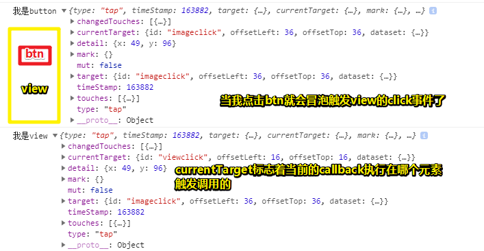

# 生命周期

> 资源：[生命周期](https://tencentcloudbase.github.io/handbook/tcb14.html)
>
> **➹：**[App(Object object) - 微信开放文档](https://developers.weixin.qq.com/miniprogram/dev/reference/api/App.html)
>
> **➹：**[生命周期 - 微信开放文档](https://developers.weixin.qq.com/miniprogram/dev/framework/app-service/page-life-cycle.html)

## ★小程序和页面的生命周期

以下是页面的生命周期，可不是小程序的生命周期！  

* App()：
  + 该函数在哪儿？—— app.js
  + 调用它干嘛？——注册小程序
  + 需要给它传啥参数？——对象 Object 类型的参数
  + 该对象参数里边默认有啥东西？——一些生命周期函数和事件处理函数
  + 何时调用它？——App() 必须在 app.js 中调用，必须调用且只能调用一次。
  + 开发者针对这个参数能做什么？——开发者可以添加任意的函数或数据变量到 `Object` 参数中，而且可以用 `this` 来访问这个 `Object` 
* Page()：
  + 在哪儿？——你创建一个页面，那么就会自动生成 4 个文件，而该函数就在页面的 js 文件里边哈
  + 调用它干啥？—— 注册小程序中的一个页面
  + 其它使用操作同上

> 为什么我们在 App() 和 Page() 里边不能直接用等号=给变量赋值？你明白了吗？注意函数语句与对象属性与方法在写法上的不同。

关于callback的触发：

> 之前我们已经了解到，通过**点击事件**可以触发事件处理函数，也就是需要**用户来点击**某个组件才能触发；这里**页面的生命周期函数**也可以触发事件处理函数，它**不需要用户点击组件**，只需要用户打开小程序、打开某个页面，把小程序切后台等情况时就能触发里面的函数。

### ◇小程序打开场景值


如何获取这个场景直？

> 在  `App` 的  `onLaunch` 和  `onShow` 打印的对象里有一个scene为1001，这个是场景值。


场景值有啥用？

> 场景值用来描述**用户进入小程序的路径方式**。用户进入你的小程序的方式有很多，比如有的是扫描二维码、有的是长按图片识别二维码，有的是通过微信群进入的小程序，有的是朋友单聊进入的小程序，有的是通过公众号进入的小程序等等，这些就是场景值，而具体的场景值，可以看技术文档，**场景值对产品、运营来说非常重要**。

 **技术文档：**[场景值列表](https://developers.weixin.qq.com/miniprogram/dev/reference/scene-list.html) 

### ◇ **onLaunch与onShow** 

`onLaunch`是干嘛的？

>  它监听小程序的初始化，初始化完成时触发，**全局只会触发一次** 

该函数里边，我们一般用来执行获取「用户登录信息的函数等」一些非常核心的数据 

当然，如果onLaunch的函数过多，会影响小程序的启动速度。

> 何时触发？——小程序初始化完成时触发，而且全局只会触发一次
>
> 何时用它？——获取核心数据时用它！需要注意的是，不要在这个函数里边写过多的逻辑！

那么 `onShow`呢？（这可不是页面里边的 `onShow`哈！ ）

> 它是在小程序启动，或从后台进入前台显示时触发，也就是**它会触发很多次**，在这里就不大适合放获取用户登录信息的函数啦。 

## ★用户登录与信息获取

 小程序用户登录和获取用户信息相对来说比较复杂 的！

### ◇**了解wx.login、wx.getSetting** 

>  **了解一个函数一个API，实战方面从打印日志开始，而理论方面从技术文档开始**。 

现在我们就实战用一（通过打log这些API的用法）下：

```js
App({
  onLaunch: function () {
    wx.login({
      success(res) {
        console.log('wx.login得到的数据', res)
      }
    })

    wx.getSetting({
      success(res) {
        console.log('wx.getSetting得到的数据', res)
      }
    })
  },
  onShow(data) {
    console.log('onShow:',data)
  },
  onHide() {
    console.log('onHide监听小程序切后台')
  },
  globalData: {
    userInfo: null
  }
})
```

结果：


- `wx.login`： 得到errMsg和code，这个code是**用户的登录凭证** 
- ` wx.getSetting `: 得到errMsg和用户当前的[权限设置authSetting](https://developers.weixin.qq.com/miniprogram/dev/api/open-api/setting/AuthSetting.html)，包含是否允许获取用户信息，是否允许获取用户位置，是否允许使用手机相册等权限。 

 总之，我们可以根据打印的结果结合技术文档来深入理解这两个API

 **技术文档：**[获取用户登录凭证wx.login](https://developers.weixin.qq.com/miniprogram/dev/api/open-api/login/wx.login.html)、[获取用户当前权限设置wx.getSetting](https://developers.weixin.qq.com/miniprogram/dev/api/open-api/setting/wx.getSetting.html) 

> 日常使用他人的小程序的时候，如果遇到一些权限设置的问题，那么可以想想这个 `wx.getSetting`API是用在什么场景的！

>  如果要让小程序和自己的服务器账号打通，仅仅获取用户登录凭证是不够的，需要将这个code以及你的小程序appid和appSecret传回到你的开发服务器，然后在自己的服务器上调用[auth.code2session](https://developers.weixin.qq.com/miniprogram/dev/api-backend/open-api/login/auth.code2Session.html)接口，得到用户的openid和session_key。由于openid是当前用户的唯一标识，可以用来判断该用户是否已经在自己的服务器上注册过，如果注册过，则根据openid生成自定义登录态并返回给小程序，整个过程非常复杂。而由于**云开发与微信登录鉴权无缝整合**，这些内容都不会涉及，所以这里不多介绍。 

### ◇ **获取用户信息wx.getUserInfo** 

```
    wx.getSetting({
      success(res) {
        console.log('wx.getSetting得到的数据', res)
        if (res.authSetting["scope.userInfo"]) {
          wx.getUserInfo({
            success(res) {
              console.log("wx.getUserInfo得到的数据", res)
            }
          })
        }
      }
    })
```

我们要获取用户信息，首先需要判断用户是否允许，可以从authSetting对象里看scope.userInfo属性是否为true，如果为true，那我们可以调用`wx.getUserInfo()`接口来获取用户信息。 

结果：


或许你已经发现了 这行代码`res.authSetting["scope.userInfo"]`为啥要用 `['xxx']`来读取一个对象的属性了：

>  由于`scope.userInfo`是一个属性名，无法使用点表示法res.authSetting.scope.userInfo来获取到它的值（会误认为是authSetting属性下的scope属性的usrInfo属性值），这里用到的是获取对象属性的另外一种表示方法，叫括号表示法，也就是用中括号[]围住属性名，属性名需用单引号或双引号围住。不然就是变量名了。

 在控制台console我们可以看到[userInfo对象](https://developers.weixin.qq.com/miniprogram/dev/api/open-api/user-info/UserInfo.html)里包含着当前登录用户的昵称、头像、性别等信息。 

> 有了这些信息数据，那么这就意味着这是可编程的！
>
> 突然觉得「元素」、「CSS属性以及其值」都是数据，都是可编程的！

### ◇ **globalData** 

 这个数据是在app.js里，和我们之前接触到的数据都在页面的js文件里有不同。而且这个用户信息的数据是所有页面都**通用的**，放在app.js里公用是应该的，但是我们要怎么才能调用到这个数据呢？ 

 `globalData`对象通常用来存放整个小程序都会使用到的数据，比如我们可以把用户信息赋值给globalData的**任意自定义属性**。模板小程序已经声明了一个userInfo属性，我们也可以自定义其他属性名，比如（后面我们会用到） ：

```js
  globalData: {
    userInfo: null,
    tcbData: {
      title: "云开发训练营",
      year: 2019,
      company: "腾讯Tencent"
    }
```

 然后在上面的wx.getUserInfo的success回调函数里将获取到的userInfo对象赋值给globalData对象的userInfo属性。 

```js
wx.getSetting({
      success: res => {
        console.log('wx.getSetting得到的数据', res)
        if (res.authSetting["scope.userInfo"]) {
          wx.getUserInfo({
            success: res => {
              console.log(this)
              console.log("wx.getUserInfo得到的数据", res)
              this.globalData.userInfo = res.userInfo
            }
          })
        }
      }
    })
  },
```

注意，在这里要用箭头函数呀！不然`this`的指向并不是Page的实例！

总之，在开发时，`this`的值不明确，那就log出来吧！

而解决`this`的指向问题，有两种：

1. 使用箭头函数

2. 使用 `that`指代，如 ：

   ```js
   let that=this
   wx.getSetting({............}) //为了便于你找位置
   ```

结果：


### ◇ **getApp()** 


## ★总结

* 事件有冒泡，Target 和 currentTarget 有区别：



* 在测试一些东西的时候，以下 log 信息甚是讨厌：


* 写在组件上的的 `data-` 数据，可以通过 `currentTarget` 或者 `target` 的 dataset 获取，后者一般不安全，因为如果发生冒泡，那么该 dataset 的值就是来自于源头的那个东西，而不是因为冒泡而触发事件执行的那个元素。

  


  假如有路由跳转，那么会执行事件源的那个事件的路由，即我点击图片，那就执行图片的路由，而不是它爸爸的路由！

* 小程序不支持 navigateTo 的外链跳转

* 小程序也支持给 `data-*` 属性添加 wxss 样式，比如我们可以给 `data-pid` 添加样式， `view[data-pid]{margin:30px;}` ， `data-*` 属性既可以类似于选择器一样的存在，也可以对它进行编程，是不是很强大？

* id、class、style 甚至点击事件都是组件携带的数据，都可以用来编程，总之，多利用事件对象获取组件上的数据来进行编程。

