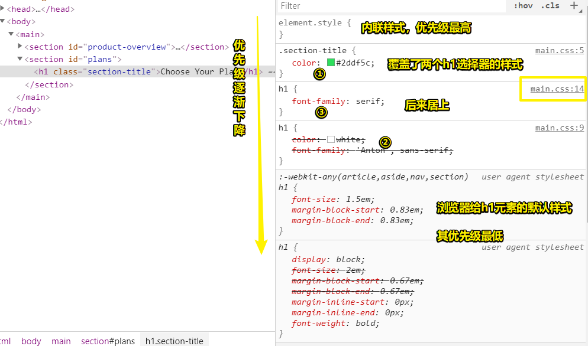
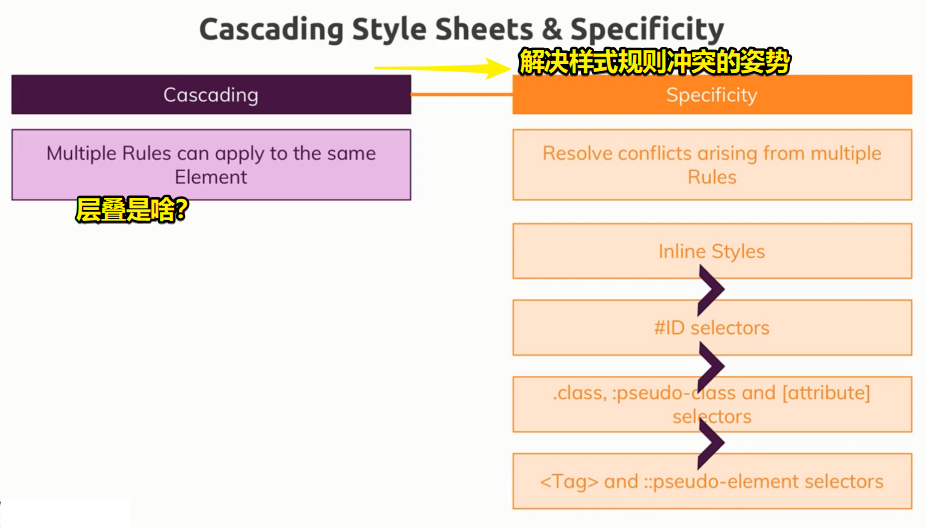
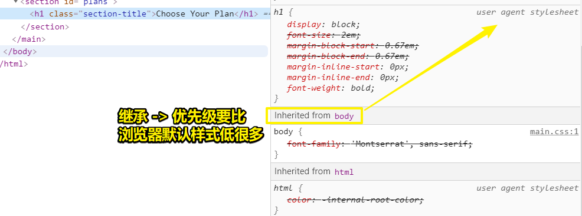
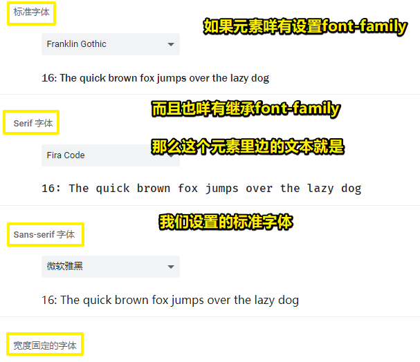

# CSS基础入门

## ★理解CSS的优先级

### <mark>1）选择器都选中了同一个元素</mark>

上一节里边，有个细节不知道你有没有留意到

那就是我们写的两个样式规则，即选择器都匹配到了h1标签：

``` css
h1 {
  color: white;
  font-family: 'Anton', sans-serif;
}

.section-title {
  color: #2ddf5c;
}
```

h1里边的文本的颜色是 `#2ddf5c`（绿色），那么为啥是这个颜色呢？

不是完全错误的理解 -> 因为如果CSS是从上到下解析的话，那么后面的选择器就会覆盖前面的选择器

把后边提到前边去 -> 颜色还是绿色 -> 可见 -> class选择器仍然覆盖了h1标签选择器 -> 你在后边再写一个h1选择器，用于更改字体类型 -> 结果 -> 字体类型真得被更改了

``` html
<section id="plans">
  <h1 class="section-title">Choose Your Plan</h1>
</section>
```

``` css
.section-title {
  color: #2ddf5c;
}

h1 {
  color: white;
  font-family: 'Anton', sans-serif;
}
* {
  margin: 0;
}

h1 {
  font-family: serif;
}
```


### <mark>2）结论</mark>

1. 样式作用于同一个选择器 -> 顺序确实会有影响 -> 不过class选择器仍然改变了颜色
2. class选择器可以覆盖h1标签的样式

### <mark>3）为啥class选择器只覆盖了h1的color样式？（font-family为啥咩有被覆盖）</mark>

这个问题 -> 说白了 -> class选择器为啥咩有100%重置了h1元素的样式？ -> 而是仍然保持了部分样式

有两个原因：

1. 多条规则应用到同一元素
2. 不同的规则有不同的优先级



> 这个图里边没有被线划掉的样式声明语句就是对这个h1元素全部生效的样式了

CSS规范规定 -> class选择器相较于标签选择器，有更高的优先级

多条规则作用于一个元素时 -> 会产生层叠 -> 而这也是CSS的特点之一 -> 正如CSS这个名字的意思——层叠样式表

层叠的意思 -> 多条规则或样式可以作用于一个元素 -> 当然，规则可能会有冲突（被线划掉的就是冲突的），如class选择器的和h1标签选择器的 -> 为了解决冲突 -> CSS采用了优先级的概念 -> 这个在CSS规范里边有具体的说明 -> 即规定了解决冲突的办法——不同选择器的优先级顺序 -> 优先级高的，控制台里边某个元素的「Styles」里边的样式规则就会顶到优先级低的前边去

### <mark>4）总结</mark>



1. 层叠的意思 -> 多个规则作用于一个元素
2. 特异性解决了产生的冲突
3. 特异性遵从以下顺序
   1. 通用选择器 -> 最低 -> 但一般不用
   2. 标签选择器，伪元素选择器 -> 算是最低了
   3. class选择器、:hover（控制鼠标悬浮的样式）这样的伪类选择器、属性选择器 -> 优先级相同 -> 如果有冲突，靠后的会生效，如前边说到的那两个h1标签选择器那样
   4. id选择器 -> 优先级更高 -> 如果一个元素，分别被type（通过节点名来匹配元素）、class、id这三种选择器选中，并设置了不同color -> 那么id选择器的颜色会生效 -> 而且这不论id选择器在CSS文件里边的哪个旮旯位置
   5. 内联样式 -> 优先级最高 -> 但最好不要用 -> 用了的话 -> 它会覆盖前面全部的样式

4. 其它的规则同样有优先级 -> 如继承等 -> 不过这是更高级的内容，目前还未学到

总之，以上列出的（特异性）规则非常重要 -> 标签选择器优先级最低 -> 内联样式优先级最高，但最好不要用内联样式，只需要了解一下即可

身为前端开发者的我们 -> 最好充分规划样式表（优先级同级时，看顺序） -> 灵活使用这些选择器 -> 避免内联样式 -> 注意选择器的相互影响 -> 其实正确使用选择器并不难 -> 在项目中用到这些知识，即得到充分的练习之后 -> 你会真正发觉「正确使用选择器并不难」

回到代码层面 -> 看看选择器在项目里边的实际使用以及从中涉及到的相关知识

**➹：**[Specifics on CSS Specificity - CSS-Tricks](https://css-tricks.com/specifics-on-css-specificity/)

**➹：**[Specificity - CSS: Cascading Style Sheets - MDN](https://developer.mozilla.org/en-US/docs/Web/CSS/Specificity)

## ★理解继承

### <mark>1）优先级机制</mark>

多个存在优先级差距的样式规则作用于同一个元素，优先级高的样式会被应用，如果优先级一样，那么就看样式规则的书写顺序

然而，影响元素样式的，还有一种机制——继承

### <mark>2）继承机制</mark>

继承意味着 -> 一个元素从它的父元素那里继承了部分样式

### <mark>3）设置一个全局默认字体</mark>

用全局生效的规则实现 -> 通用选择器 -> 给所有元素指定一个默认的样式 -> 不过 -> 检查元素 -> 你会发现通配选择器优先级最低，仅比浏览器默认给的样式高

我们一般不用通配选择器 -> 可为啥不用通配选择器呢？ -> 不在于优先级低，而是在于它的效率太低，毕竟一旦用了它，就要解析所有的CSS规则，才能决定任意一个元素的样式 -> 说白了，浏览器要对比所有元素的CSS规则，然后才确定通用样式是否被应用上 -> 如果页面有100个元素，然后每个元素或多或少都会有一个会多个样式规则，而这样用上通配选择器后，就得多解析对比100次了 -> 当然，通用选择器很多时候也会被用上，不过，不应该用来设置全局字体 -> 用body选择器设置全局字体

body选择器 -> 记住 -> body是所有内容的父元素 -> 给这个元素设置样式，其它元素都会继承 -> 因此可在该选择器里边写上全局默认字体样式 -> 这种姿势效率更高



所有元素从body那里继承样式 -> 即从父元素那里继承样式 -> 不管是直接或间接的父元素的样式都会被继承 -> body不是h1的直接父元素，但是从h1的父元素继续往上可以找到body -> 大部分样式都能继承，存在例外情况的样式属性不能被继承 -> 字体样式都会继承 -> 不过继承而来的样式优先级很低 -> 比浏览器默认样式还低 -> 毕竟继承而来的样式，不是直接选中这个元素来应用样式的，所以优先级贼鸡儿低

开发者工具 -> 审查元素 -> Styles面板 -> 某条样式上没有删除线 -> 表示继承的样式生效了



使用继承 -> 可以让我们不用直接选中子元素，就可以把样式传给子元素了，尤其是在设置font-size和font-family时最有用 -> 为啥最有用呢？ -> 因为，一般情况下，网页设计要求一个页面字体一致，而在body标签里边设置默认值就很方便了 -> 所有的元素都会继承字体，当然，你也可以用其它标签，不过，想给整个页面设置一样的字体的话，在body里边指定是比较合适的

虽然有继承 -> 但任何直接给元素设置的样式优先级都比继承高 -> 说白了，如果两者指定了相同的样式，直接指定的样式会覆盖继承而来的样式，如h1设置了字体样式，从body那里也继承了字体样式，最终h1的样式选择的是h1自己设置的样式，而不是继承而来的样式

``` html
<body>
  <h1 class="section-title">Choose Your Plan</h1>
  <p>Make sure that i love you.</p>
</body>
```

``` css
body {
  font-family: 'Montserrat', sans-serif;
}
/* 不关顺序的事儿 */
h1 {
  color: white;
  font-family: 'Anton', sans-serif;
}
```

## ★总结

- 关于CSS的优先级 -> 这说的是多个样式规则作用到同一个元素的时候（这也叫做层叠），该元素最终会被应用到哪些样式 -> 存在优先级高低之分，优先级高的选择器，其对应的样式规则会被应用到该元素上 ，而且这与样式规则的书写顺序无关-> 优先级一样，后边的覆盖前边的，注意这是后边的样式，前边也有的才会被覆盖 -> 调试 -> 看控制台的Styles，该面板会展示这个元素最终会被用上啥样式

- 不是Tag选择器，而是Type选择器，如`h1`、`::before`这样的

- 子元素 -> 只有父元素 -> 而这父元素可以是直接的，也可以是间接的 -> 我以前直接形容为父元素、爷元素、祖宗十八代元素……

- 选择器 -> 匹配页面存在的所有元素 -> 应用样式规则


