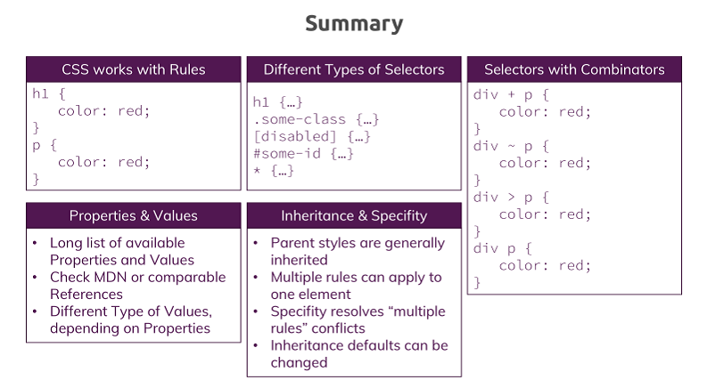

# 总结

回顾这一章所学的内容

1. CSS是**按照规则运作**的 -> 而规则像是这样 -> 有一个选择器、一个属性以及一个属性值
2. 选择器有很多种类型 -> 如元素选择器h1、选择带有自定义class的元素的class选择器、属性选择器、ID选择器（需要自定义ID）、通配选择器 `*`
3. 还有很多属性和属性值 -> 到MDN上找到完整的列表 -> 每个属性有多个不同的属性值 -> 接下来会介绍更多CSS属性和属性值
4. 还学了组合器 -> 通过组合多个选择器，更能精确地定位到你要选择的元素
5. 除了以上四大内容 -> 还学了CSS的继承以及优先级 -> 通常子元素会继承父元素的样式，但也有一些例外哈 -> 多个规则可以应用到同一个元素上，当发生冲突时，会按照优先级来解决 -> 默认继承的样式是可以被修改的，只要修改继承值的`inherit`关键字的值即可，如把`font-family`设置成继承而来的值，我们改变了CSS的正常行为，毕竟原本由于CSS的优先级规定，这个属性是不会被继承的，但最后继承生效了，所以继承性是可以被修改的

以上就是这一章所学的内容了

接下来，会继续深入学习下去 -> 继续开发我们的网页 -> 目前，我们必须承认，我们的网页还不是很好看，而以上这些内容都是非常重要的基础知识，只有在这基础上才可以更深入学习CSS的知识以及CSS它运作的原理 -> 然后才可以继续开发我们的网页