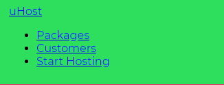
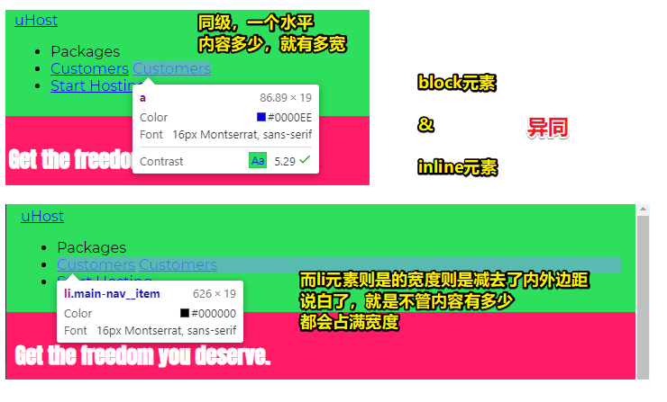
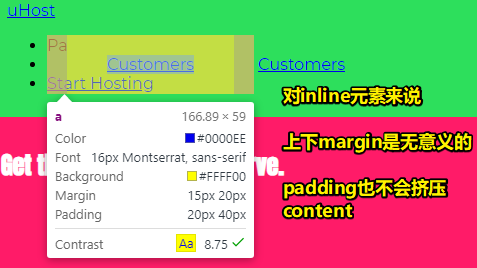
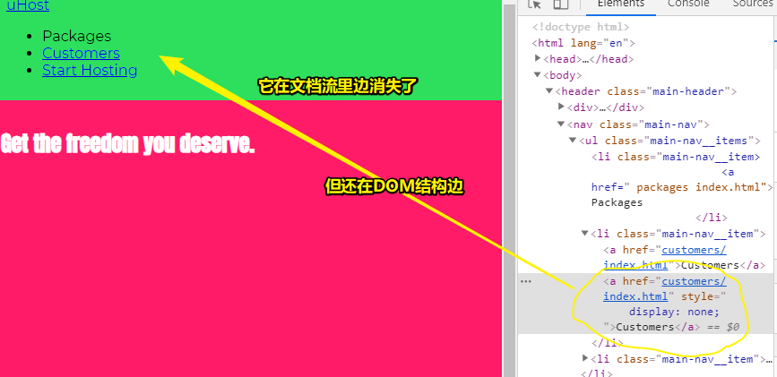
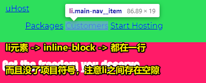
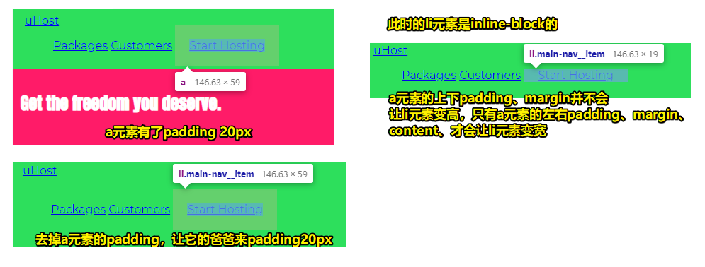
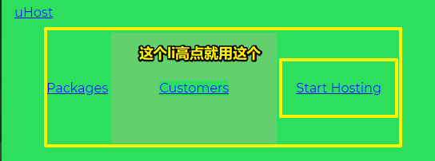

# Adding the Header to our Project、Understanding the Display Property 

## ★ Adding the Header to our Project

> 让我们将目前学到的知识应用到我们的项目中，并进行更深入的研究。在这个视频中，是时候处理header了

### <mark>1）添加一段典型的HTML代码（logo+导航栏）</mark>

``` html
<header>
  <div>
    <a href="index.html">
      uHost
    </a>
  </div>
  <nav>
    <ul>
      <li>
        <a href="packages/index.html">Packages</a>
      </li>
      <li>
        <a href="customers/index.html">Customers</a>
      </li>
      <li>
        <a href="start-hosting/index.html">Start Hosting</a>
      </li>
    </ul>
  </nav>
</header>
<main></main>
```

> 这些链接的网页会逐渐加入……

效果：


> 不管嵌套的标签话，自己会觉得页面就只有4个元素

### <mark>2）美化导航条</mark>

**①给header元素添加样式**

1、如何选择header元素？

直接元素选择器这样 `header {}` ？ -> No -> 因为在同一个网页里边可能有多个header，说白了这个header还会在其它地方用到，如section元素里边可能也会用到 -> 于是，用class选择器会合适很多 -> `.main-header {}` -> 类名最好是一目了然的，如main-header就很清楚地表示了这是主导航栏的header（BEM之B命名大法）

2、需要为header元素设定怎么的样式？

可以设置任何的样式 -> 如我想要一个占满全宽、绿色背景的导航栏 -> 为啥要绿色呢？因为绿色是作为我们整个网页的主色调，当然，你也可以选择其它颜色 -> add padding （Why？——导航栏里边的内容就不会紧贴边缘了）

``` css
.main-header {
  /* 可选，默认就是占满全宽 */
  width: 100%;
  /* 与section标题一样的颜色 */
  background-color: #2ddf5c;
  padding: 8px 16px;
}
```

效果：



可见，这样式还有待提升哈！

如：

1. 这些列表看起来并不是那么漂亮

**②让列表好看点**

列表在语义上是个导航栏 -> 因此，从样式上来看，每一个列表的内容应该横向排列，而不是纵向排列 -> 为了实现这样的排列，我们会学习一个新的属性—— `display` -> 请看下一节……

## ★ Understanding the Display Property 

> 在HTML中有两种类型的元素—块级（block-level）和内联（inline）。但是是否有一种办法可以改变这些元素的默认行为呢？事实证明是这样的，所以让我们来看看我们如何才能实现这一点，以及为什么这在某些情况下是可能会有所帮助的……

### <mark>1）如何用display属性来改变list-item的排列方式？</mark>

**①如何选择这些列表项？**

给个class名？ -> 遵循特定的class命名规则 -> BEM（模式与最优方法这一章的末尾会详解BEM） -> 总之，BEM只是一种特别的为class命名的方式，它确保了我们不会一不小心取了重复的class名，而且这种命名十分贴合元素的用途 -> 因此，我们给li取了个这样的名字 `main-nav__item` ，该名字会提醒你是在编辑main-nav（主导航栏） -> 总之，这个名字是根据BEM模型规范来命名的，当然，你也可以用其它你喜欢的名字

``` html
<!-- 这就是以后的主导航啦 -->
<nav class="main-nav">
<!-- 不止有一个item，所以用了items -->
  <ul class="main-nav__items">
    <li class="main-nav__item">
      <a href=" packages/index.html">Packages </a>
    </li>
    <li class="main-nav__item">
      <a href="customers/index.html">Customers</a>
    </li>
    <li class="main-nav__item">
      <a href="start-hosting/index.html">Start Hosting</a>
    </li>
  </ul>
</nav>
```

以上的class的命名就是所谓的BEM模式了

至此，我们就有了一些可以操作的class了

当然，本节主要讲的是display属性，而不是BEM哈，接下来会谈谈display属性是如何运作的？

### <mark>2）display属性？</mark>

display属性 -> 让我们可以改变一个元素的行为

如：

块级元素 -> 改成 -> 行内元素 -> 甚至也可以改成是混合型的inline-block元素 -> 当然，也可以是none（表示元素从文档流里边移除，注意这不是从DOM中移除）


在HTML里边，有块级元素和行内元素

如a标签，它就是行内元素 -> 在行内渲染的（render in inline） -> 同级下有两个a元素，那么就会被渲染到同一行里边去了 -> 它们并没有像block元素那样占满网页的全宽

回过头看上边的代码：



li元素之所以会「缩进」 -> 是因为它的包含块ul的给的padding

``` css
ul {
    display: block;
    list-style-type: disc;
    /* 上下margin 1个字 */
    margin-block-start: 1em;
    margin-block-end: 1em;
    margin-inline-start: 0px;
    margin-inline-end: 0px;
    /* padding-left:40px */
    padding-inline-start: 40px;
}
```


block元素与inline元素用的都是盒子模型，但是对于inline元素来说，我们不能重置它的上下margin，毕竟行内元素不是这样运作的


总之，inline元素与在流中的block元素是不同的，它们不会换行，因此修改上下margin是很难的，因此很难添加上下margin，毕竟它们可以与另一个inline元素同行，所以可能会存在同行的情况，因此inline元素关注的是左右方向的margin，而不是像block元素那样可以关注4个方向的margin

形象点来说，同行之间会互相关注，如前端，但不同行之间一般就不会互相关注了，如前端会关注Java在做什么吗？除非你搞全栈，既会前端又会Java，类似于inline-block……



> 我很好奇，为啥padding不会向上、向下顶开li元素，难道只欺负inline元素？ -> 或者说上下两个元素之间的间距应该交由block元素来做？而不是让inline元素来做？

以上就是inline元素与block元素的不同了

不过，我们可以通过display属性来更改它们的行为

### <mark>3）玩坏元素的display</mark>

**①inline -> block？**


通过display属性强制转换inline元素为block特性

**②inline -> none？**



这不是让元素变得不可见或者是变得透明了，而是直接让元素从文档流中移除了，但该元素依然存在在DOM中

当然，把inline搞成是block，或者反过来，把block搞成inline，其实很多时候都没有什么意义，为啥这样说呢？

因为元素的默认行为都是经得住考验的

但，display还有第4种选择，而这种选择贼鸡儿有用

### <mark>4）`display:none`的设计思想</mark>

`display:none;`的设计思想是：

如果和JS 一起就会非常有用，如实现这样的功能「点击按钮后出现元素」

说白了，none值，就是用来实现通过某种特定的操作来唤醒某个模块的

### <mark>5）第四种选择——inline-block</mark>

inline-block -> 把inline元素和block元素的行为混合起来了

和inline元素一样，display为inline-block的这些元素，可以呆在同一行，而且，当设定上下margin和上下padding时，也就是inline元素无法设定的东西时，它们变得像block元素一样

示例：

``` css
.main-nav__item {
  display: inline-block;
}
```



> 项目符号消失的缘故 -> `li`本来是`display:list-item;`的，但现在是`display:inline-block;`

可见列表项都呆在同一行了，为啥会这样呢？——还不是因为它们的行为就像inline元素一样，如这些inline-block元素只占内容所需的宽度，而且还可以同行，当然，它们也有供设定padding等值的盒子模型

测试：

在li元素为inline-block的情况下：

1. 只对a元素添加 padding 20px
2. 只对li元素添加 padding 20px



看第一种情况：

1. a元素确实有4个方向的padding，但有影响的，只有左右两个方向

看第二种情况：

2. li元素的左右padding有效果，上下padding也有效果，即把其它元素一起给推了下来（不管其它li有没有上下padding，只要谁高，那就选择谁的），而这就是inline-block与inline之间的区别了



不管怎样，我们可以像block元素那样，来为li元素设定样式，而且它们也会同行存在，就像inline元素一样

总之，这是一个很棒的用于创建导航栏的方式，当然，后期主要会用flexbox这个工具来做，毕竟flexbox这家伙将元素放在相邻的位置上会更好，不过，现在用inline-block就足够使用了！


## ★ Styling Anchor Tags 

> 样式链接非常重要，因为每个网站都包含这样的链接。默认的样式并不是最漂亮的，所以让我们来看看如何改进它

## ★ Adding Pseudo Classes 

> 伪类对改善我们网站的用户体验有很大帮助。为啥我们不趁机抓住这个机会，在我们的项目中应用一些伪类呢？

## ★ Theory Time - Pseudo Classes & Pseudo Elements

> 是时候深入理论了。 我们已经应用了伪类，但是还有哪些可用的额外的值呢？伪类和伪元素之间有什么区别？ 让我们在此视频中找到答案！

## ★ Grouping Rules

> 有时，相同的规则应该会被应用于不同的选择器。但事实证明，我们可以通过对它们进行分组来避免一次又一次地重复这些规则。让我告诉你这是如何工作的。

## ★ Working with "font-weight" & "border"

> 我们不断改善网站的外观，所以让我们使用“font-weight”来改变所选元素的默认字体样式。除此之外，是时候添加一些边框了。

## ★ Adding & Styling a CTA-Button

> 到目前为止，我们的导航栏中只有列表项。如果有一个不同风格的特殊的CTA-Button，这不是会很好吗？我想会是这个样子的，所以我们在这个视频中添加一个。（CTA -> Call-to-Action）

## ★ Adding a Background Image to our Project

> 背景为红色的块级元素看起来还算ok，但我认为一个真实的背景图片肯定会改善用户体验。让我们学习如何在这个视频中轻松添加这样的图像

## ★ Properties Worth to Remember

> Puh（嗯），到目前为止我们研究了很多属性。当然，我们不需要记住每一个属性，但是你可能会经常用到一些属性。这个简短的列表将帮助你记住这些属性。

## ★ Wrap Up

> 让我总结一下这个模块，总结一下到目前为止你学到了什么

