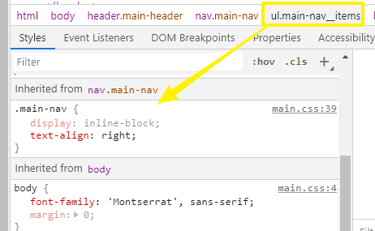
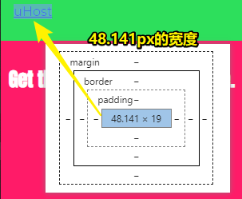

# display属性应用、美化导航条

## ★ Applying the Display Property & Styling our Navigation Bar

> 理解了“display”属性之后，现在就该设置导航栏（navigation bar）的样式了。为此，我们还将使用该属性的“inline-block”这个值的优点、特点（advantages）。

目前我们已经对display属性，尤其是inline-block元素有了一个初步的了解

1）logo和nav不是在同一行的

原因：它们俩都是block元素，都是独占一行的

那么如何让它们俩显示在同一行呢？——很简单，logo是inline-block，nav也是inline-block就好了

``` css
.main-header>div {
  display: inline-block;
}

.main-nav {
  display: inline-block;
}
```


2）关于选择器的书写顺序？

要符合从上到下浏览HTML文件的习惯 -> 选择器的位置摆放并不影响功能 -> 如 `.main-header {}` 、 `.main-header > div {}` 、 `.main-nav__item {}` 

class选择器 vs 子选择器 -> 两个都行，只是子选择器，一定要留意后续添加的代码是否嵌套了元素

3）把nav里边的元素移动到右边去

目前HTML结构：

``` html
<header class="main-header">
  <div>
    <a href="index.html">
      uHost
    </a>
  </div>
  <nav class="main-nav">
    <ul class="main-nav__items">
      <li class="main-nav__item">
        <a href="packages/index.html">Packages</a>
      </li>
      <li class="main-nav__item">
        <a href="customers/index.html">Customers</a>
      </li>
      <li class="main-nav__item">
        <a href="start-hosting/index.html">Start Hosting</a>
      </li>
    </ul>
  </nav>
</header>
```

做法：

目前li元素都是inline-block元素，那么我们可以直接在main-nav里边使用 `text-align` 来将文本对齐至右侧，毕竟**inline-block元素会被视为文本哈！**

然而，没啥效果：


`text-align` 这个属性确实被应用上了，即这些元素确实被对齐在了右侧，可这似乎看起来没有用啊！

需要注意的是，该属性也是可以被继承的：



既然右对齐已经启用了，可为啥会没有效果呢？

我们知道li元素都是一个个inline-block元素，而nav元素也是inline-block元素，所以nav它的宽度并非是最大可用宽度，而是它的元素有多宽，它就又多宽


因此，文本右对齐就失效了

所以，我们需要设定宽度，而这个宽度就是「header元素的宽度」-「nav的兄弟元素div」的宽度

由于ul元素有额外的padding-left，甚至还有上下margin，所以我们要搞掉它

因此，在设定nav元素的宽度之前，还是先来重置ul元素的内外边距吧！

``` css
.main-nav__items {
  margin: 0;
  padding: 0;
  /* 消除item点，尽管padding为0也可以消除，但写上这个可以确保消除了item点 */
  list-style: none;
}
```


为nav设定宽度100%：


前边提到了，nav元素的宽是网页全宽减去左侧那个语义化为logo的盒子的宽（可以把这个logo当作是header元素的padding-left）

因此，我们要知道logo的宽度



上边读取到的这个值，是从渲染界面里边读取的数值，但这其实并不是最好的办法 -> 后边会提到有更强大的工具来做这件事，这样也就有了更简洁的方法了

4）calc函数

如何对一个数值做计算呢？

很简单，使用calc函数即可！

calc函数 -> 能做减法，`calc(100%)`可以直接作为数值使用，也可以处理简单的计算 -> 注意，数字和符号之间是有空格的，而这是必须要有的

``` css
.main-nav {
  display: inline-block;
  text-align: right;
  width: calc(100% - 49px);
}
```


而这是因为inline-block元素所导致的

知道inline-block元素的这种特性是非常重要的，否则你将会花好几个小时来琢磨这到底发生了什么？

## ★ Understanding an Unexpected "inline-block" Behaviour

> “inline-block”是一个非常有用的值，但是有一种特殊的行为（specific behaviour）会在实践中引起问题。让我来告诉你这是哪一个问题，以及你如何能轻松地解决它。（Unexpected -> 意想不到的）

## ★ Working with "text-decoration" & "vertical-align"

> 让我们继续我们项目中的工作——改进我们的导航（navigation）的样式。为此，我们将使用“text-decoration”来设计链接，并使用“vertical-align”（垂直对齐）来对齐元素

