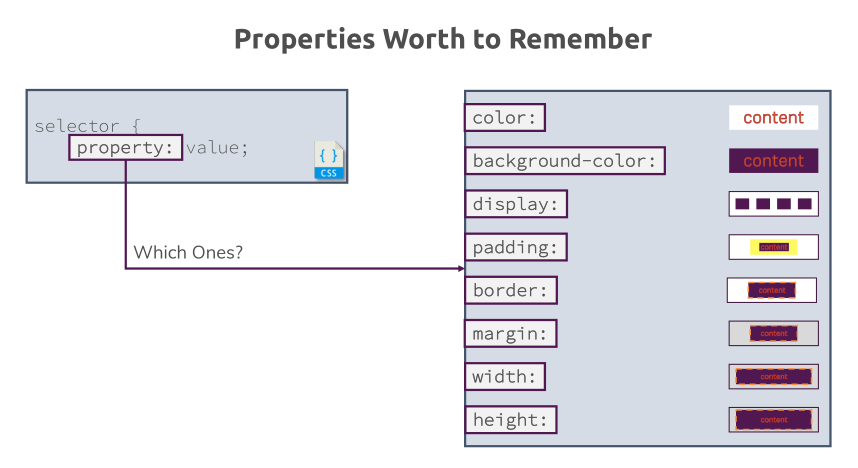

## ★ Properties Worth to Remember

> Puh（嗯），到目前为止我们研究了很多属性。当然，我们不需要记住每一个属性，但是你可能会经常用到一些属性。这个简短的列表将帮助你记住这些属性。

1）值得记住的属性列表

请记住：

- 属性是冒号前的部分

在参考列表里边，有数量众多的属性，可我们常用的有哪些属性呢？

1. color：可以改变文字的颜色
2. background-color：改变盒子的背景色
3. display：改变元素的位置或行为
4. padding：用来增加content到border的距离
5. border：改变border的粗细
6. margin：给盒子的四周增加一些空间
7. width：设定宽度
8. height：设定高度

之后，我们还会遇到一些更重要的属性，有一些可能是很经常见到的或者是很少见到的

总之，目前，上图罗列的这些属性都是核心的属性，这些属性毫无疑问都需要你去记住的

之后，我们会接触到更多的知识，但是，我们是可以去学会它们的，只要用心去学，多用用就会了，注意，不要只是读它们，要运用这些知识，这样才可以真正帮助你真的记住了它们的用途，以及什么时候去运用它们

**➹：**[评价人做事学习很用心，这个“用心”是什么意思？ - 知乎](https://www.zhihu.com/question/20038181)

## ★Time to Practice - Diving Deeper into CSS 

> 目前，我们取得了良好的进展，是时候测试您在这个模块中获得的知识了

是时候练习一下我们在这一章当中学到的东西了

1）有哪些任务呢？

完成这些任务所需要用到的知识，都是之前老师所讲过的

因此，这绝对的是一个非常棒的练习，需要注意的是，你务必自己动手去做一遍哈！

毕竟，在我们继续深入讲解其它内容之前， 你必须要理解这些核心内容

那么做啥呢？

1. 搞一个漂亮的box出来，如div -> content -> `I'm a box!` -> add padding、border、margin -> 选择任何你想要的size，如10px、20px都行 -> 目的 -> 训练盒子模型的概念 -> 通过开发者工具去理解盒子是如何构建出来的，以及这些不同的层是如何构成整个盒子的
2. 对box -> 使用不同的margin和padding
3. 在第一个box下边 -> 添加一个相同的box -> 在两个盒子之间并没有看出有啥奇怪的行为
4. 第一个盒子的高度 -> 匹配窗口的高度 -> 高度100%
5. 第一个box -> height 300px -> width 50%
6. 两个box -> 放在相邻位置
7. 盒子1 -> 隐藏 -> 不止有一种方法可以做到隐藏元素 -> 用这章学到的方法就好了
8. 盒子2 -> 悬浮效果 -> 伪类 -> 选择最后一个元素 -> 没有学过？ -> 查MDN

自己写一份答案 -> 对比老师的答案

## ★答案

## ★ Wrap Up

> 让我总结一下这个模块，总结一下到目前为止你学到了什么

