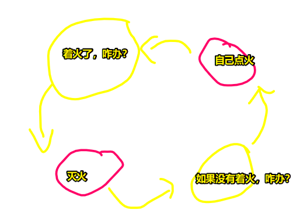

# 1~10

## 1、我应该如何看待页面中的元素？

简单拿一个页面来说，它有header、main、footer，那么我可以这样看待：

header、main、footer，都是一个个模块，它们都可以用一个个 `{}` 对象来表示，其中，拿 header 来举例子来说，假如它有两个儿子，一个是 logo 和 nav，那么我就可以这样看待：

``` js
let header = {
  logo: [logo,h1],
  nav:[ul]
}
```

除此之外，单独拎出来一个元素来看的话，我直接把它看做是一个人，然后其CSS，一个CSS属性就是一件衣服，而同样一件衣服显然有不同的颜色，而这也对应着一个CSS属性有不同的值，同一件衣服有不同的颜色，给人的感觉是不一样的，同理，同一个属性，给上不同的属性值，也会让元素的表现不一样！

拿 p 元素来说，它有很多套衣服，每套衣服的款式不一。

之前有看过，张鑫旭大佬的「CSS世界」一书，其中描述到一个个**CSS属性**就是一个个「魔法师」，而一个个**HTML元素**则是一块块「魔法石」，而CSS的各种**属性值**，则是魔法师的「魔法技能」，还有**选择器**则是魔法师手中的「选择法器」（类似于哈利波特里边的那根棍子），当然，张鑫旭大佬还把**浏览器**看作是魔法师所在的「王国」，而**操作系统**则是整个「动漫世界」

## 2、BEM？

**1）为啥会需要这种规范？**

BEM存在的意义？或者说它是为了解决什么问题而生的？

> 组件之间的完全解耦，不会造成命名空间的污染，如：`.mod-xxx ul li` 的写法带来的潜在的嵌套风险。

为了减少嵌套，只写一个class这么一层即可，如`.xxx{}`、`.xxx__item{}`、 `.xxx__item_current{}`

当然，如果出现了嵌套，最多两层选择器，而且是直接子元素的嵌套，如 `.xxx__item_current .mod-xxx__link{}`

**2）注意点**

- B -> 指的是模块，而不是block元素

- 一个class的名字 -> 只能是BEM这么短，不能是BEEE……M这样的超长class名

**3）如何写一个BEM？**

1. BE -> 双下划线 `__` -> `menu__item` -> 元素
2. BM、EM -> 单下划线 `_` -> `menu_active`、`menu__item_active` -> 修饰符 -> 也可用 `--`，毕竟对应着 `__`
3. B、E、M -> 中划线 `-`，英文称之为连字符，需要多个单词来描述时，就用`-` -> `mod-menu`、`mod-menu__item ` -> 多个单词

**4）一个极其重要的写CSS习惯**

> 我们常说CSS的注释要写WHY,而不是写WHAT,看Class命名最好就知道是WHAT


**➹：**[更好用的css命名方式——BEM命名 - 俗的太不一样 - 博客园](https://www.cnblogs.com/qisi007/p/10260318.html)

**➹：**[CSS — BEM 命名规范 - 掘金](https://juejin.im/post/5b925e616fb9a05cdd2ce70d)

**➹：**[⒛ [规范] CSS BEM 书写规范 · Tencent/tmt-workflow Wiki](https://github.com/Tencent/tmt-workflow/wiki/%E2%92%9B-%5B%E8%A7%84%E8%8C%83%5D--CSS-BEM-%E4%B9%A6%E5%86%99%E8%A7%84%E8%8C%83)

**➹：**[如何看待 CSS 中 BEM 的命名方式？ - 大猫的回答 - 知乎](https://www.zhihu.com/question/21935157/answer/20116700)

**➹：**[前端领域的BEM到底是什么 - 趁你还年轻，做个优秀的前端工程师 - SegmentFault 思否](https://segmentfault.com/a/1190000014687099)

**➹：**[BEM - Summer。桑莫。夏天](https://cythilya.github.io/2018/05/22/bem/)

## 3、Vue 的生命周期，以及钩子函数？

**➹：**[彻底理解vue的钩子函数，vue的生命周期理解，什么是vue的生命周期，钩子函数 - jiang7701037的博客 - CSDN博客](https://blog.csdn.net/jiang7701037/article/details/83118665)


## 4、attribute和property区别？

简单来说，它们没啥区别，但搞到编程里边，就弄出点区别来了：

- property是 物体本身自带属性，不能改变的（一旦改了就是另外一个东西了）

- attribute，由于 attribute还可以做动词，表示赋予。。。特性，属于人为赋予的可改变的属性。

举栗子来说：

你的头发，可以人为拉直、弯曲，但不管怎么样，都是你的头发，这叫做头发的attribute。
但是头发的弹性、硬度，这些没办法改变，改了就不是头发了，这是property.

还有：

房子的装修叫attribute

房子的面积 材料叫 property

类似的，在JS 里边用const声明的变量是只读的，意味着该变量的值是不可变的！而这也与property相对应！

**➹：**[attribute和property在英语里有什么区别? - 知乎](https://www.zhihu.com/question/30111950)

**➹：**[imcrazy4u - 知乎](https://www.zhihu.com/people/pei-han-44/activities)

## 5、CSS的class命名？

``` html
<button class="btn btn-default"></button>
<button class="btn btn-primary"></button>
```

为啥要写两个class 名，即一个 `btn` 和 一个 `btn-default`

因为btn是公共类，button都会有这个类的样式，而 `btn-xxx` 则可以认为是子类，即这是这个button元素特有的样式

父类 子类 CSS样式层叠继承

父类体现了样式的复用，子类的命名，如 `btn-default` 里边的 `-default`这样，修饰着这个button元素是什么样的样子，而且这也好维护，毕竟有具体的名字，然后知道该元素对应着哪个选择器的样式规则！

在为按钮表层做动画的时候，可以用伪元素，也可以 `<button>xxx <span class="mark"></span></button>`这样添加这个 `span` 子元素

前者HTML结构简单，适用于button元素样式简单的情形，而且后期不维护它

而后者则是适用于button元素样式丰富的情形，而且后期需要扩展button元素的样式

总会，这是需要权衡的！

## 6、『递归是编程的基本思想』吗？

> 关于递归我一直都没有真正理解过哈！每次以为理解了，但实际根本不理解，即便现在也是如此。下边是一个摘录自知乎的答案（我觉得那个段子很有意思，比那些从前有座山，山里有座庙……的故事要好得多）

并没有听过『递归是编程的基本思想』这种说法，但递归的确反应了一种反常识的编程思维。

我开始学编程的时候，一位老师就跟我们说，不要觉得计算机很聪明，计算机非常笨，只会按步骤执行。递归就是这种『笨』的提现：

我并不知道怎么求出n，我只知道从1推出2，从2推出3…直到从n-1推出n。

从这点也可以看出，其实它就是『数学归纳法』的一种实现。

以题主说的数列为例，没接触过计算机的人第一反应是找通项公式；学过编程但不用递归的方法，就是用循环来控制数列的生成；递归则是直接模拟数列的生成行为。

所以论效率，递归必然是低的。程序中函数的开销很大，而所有递归都可以通过循环来实现。它的优势不在于效率，而在于便于理解，一种直观的理解。

附上一个段子：

> 一天，数学家觉得自己已受够了数学，于是他跑到消防队去宣布他想当消防员。
> 
> 消防队长说：“您看上去不错，可是我得先给您一个测试。”
> 
> 消防队长带数学家到消防队后院小巷，巷子里有一个货栈，一只消防栓和一卷软管。消防队长问：“假设货栈起火，您怎么办？”
> 
> 数学家回答：“我把消防栓接到软管上，打开水龙，把火浇灭。”
> 
> 消防队长说：“完全正确！最后一个问题：假设您走进小巷，而货栈没有起火，您怎么办？”
> 
> 数学家疑惑地思索了半天，终于答道：“我就把货栈点着。”
> 
> 消防队长大叫起来：“什么？太可怕了！您为什么要把货栈点着？”
> 
> 数学家回答：“这样我就把问题化简为一个我已经解决过的问题了。”

递归思想就在于，你只要知道了一个基本解和后续状态的迭代关系，之后再复杂的情况都只要丢给计算机去模拟就行了。



**➹：**[递归思想为什么是编程的基本思想，它效率很高吗？ - Crossin的回答 - 知乎](https://www.zhihu.com/question/271081962/answer/383855433)

> 这个答案给我的直观感受是，你有了一个针对某个问题的基本解，然后制造关于这个基本解的问题，进而搞定了另外一个问题！
>
> 听说，函数式编程很喜欢用到递归

## 7、你是以什么眼光看待终端的？

> 就是一个软件，向这个软件输入一点字符，然后该软件就会响应这个输入，并作出输出！

终端的英文是terminal，但有时又被称作 TTY，而 TTY 这个简写就来自【电传打字机】（teletype printer）

在早期的大型机，其“终端”就是【电传打字机】。那时候的终端，也称作【硬件终端】

为啥要叫做「终端」这个概念呢？

根据历史的变迁可以知晓：

最早期的计算机（大型机）是【单任务】滴——也就是说，每次只能干一件事情。

到了60年代，出现了一个【革命性】的飞跃——发明了【多任务】系统，当时叫做“[time-sharing](https://en.wikipedia.org/wiki/Time-sharing)”（分时系统）。有了“分时系统”，就可以让多个人同时使用一台大型机。而为了让多个人同时操作这台大型机，就引入了【终端】的概念。每一台大型机安装多个终端，每个操作员都在各自的终端上进行操作，互不干扰。 

> 上边的「多个终端」指的是电传打字机哈！
>
> 这给人一种游戏手柄连接电脑一样，即手柄是一根线的一端，而一根线的接口连接的电脑又是另一端！总之，这终端是实实在在的硬东西！

「终端」的好处：

- 可以搞多任务
- 让用户可以搞「远程」操作，因为也就有了「远程终端」的概念！

当然，如今，“终端”一词的含义已经扩大了，即「“终端”的本质是“电传打字机”——以“打字机”作为输入；以“打印纸”作为输出。」这个含义有点不够看了！

总之，现在「终端」一词用来指：**基于【文本】的输入输出机制**

_注：terminal 与 TTY 这两个术语基本上是同义词；_

> 基于，词语。由于、根据的意思

**➹：**[扫盲 Linux＆UNIX 命令行——从“电传打字机”聊到“shell 脚本编程” @ 编程随想的博客](https://program-think.blogspot.com/2019/11/POSIX-TUI-from-TTY-to-Shell-Programming.html)

**➹：**[人工智能先驱人物篇之约翰·麦卡锡 - 机器之心](https://www.jiqizhixin.com/articles/2019-02-11)

**➹：**[基于和鉴于的区别_百度知道](https://zhidao.baidu.com/question/540299071.html)

## 8、在编程里边什么叫做抽象？

今天早上我想泡杯热茶，要用水壶烧水，我简简单单按下启动按钮烧水，我不想知道水壶内部怎么工作的，我不想知道它有什么高电阻、电阻产热、水沸腾之类的，反正我能简单地烧好水就行了。因此，按下“启动”按钮烧水就被称为“抽象”。

**➹：**[面向对象的编程概念：从 0 到 1 使用对象 - 知乎](https://zhuanlan.zhihu.com/p/91258807)

## 9、一些使用了递归的小代码？

斐波那契数列：

``` js
function fb(n) {
    if (n <= 0) {
        return 0
    }
    if (n <= 2) {
        return 1
    }

    return fb(n - 1) + fb(n - 2)
}

// 1 1 2 3 5 8 13 21……
fb(1) //1
fb(2) //1
fb(6) //8
fb(7) //13
fb(8) //21
```

数据的截断（分页）：

``` js
var arr = [0, 1, 2, 3, 4, 5, 6, 7, 8]

function sliceArray(arr, size) {
    if (arr.length < size) {
        return [arr]
    } else {
        return [arr.slice(0, size)].concat(sliceArray(arr.slice(size), size))
    }
}

sliceArray(arr,2) //[[0,1]……[6,7],[8]] length:5
sliceArray(arr,3) //[[0,1,2]……[7,8,9],[]] length:4
```

颜色随机：

``` js
function getRandomCol() {
  return ('#' + (function (color) {
    return (color += '0123456789abcdef'[Math.floor(Math.random() * 16)]) &&
      (color.length === 6) ? color : arguments.callee(color)
  })(''))
}

console.log(getRandomCol()) //拿到随机的颜色，如#b32dda
```

关于 `arguments.callee()` 这个API，是为了少写一个变量，不然就得这样写了：

``` js
function getRandomCol() {
  return ('#' + (function test(color) {
    return (color += '0123456789abcdef'[Math.floor(Math.random() * 16)]) &&
      (color.length === 6) ? color : test(color)
  })(''))
}

console.log(getRandomCol())
```

**➹：**[javascript获取随机颜色 - 司徒正美 - 博客园](https://www.cnblogs.com/rubylouvre/archive/2009/09/24/1572977.html)

## 10、偶然看玄幻小说，感悟到写代码就是在画画一样，抱着这样的想法，搜索到了一篇文章？

[像绘画那样写代码](https://blog.csdn.net/optman/article/details/4162339)：

很久不写代码，发现写代码的习惯有点变化了。以前基本都是把一个类（或者功能）写好了，并测试通过了，再去写另一个类。至于两者如何交互的，事先要考虑清楚，也就是要做设计，画UML图等。至少是先写的功能，要充分考虑未来调用者的各种使用场景。就像在一张白纸上作画，第一笔总是很难的，所以往往也是最苦闷的时候，写代码的进度也很慢。现在不一样了，根本不等把细节考虑，就开始写代码。先是大概把代码框架写了，想到什么就先写下什么，还没有确定的细节，就用伪代码，文字说明或者不完整的代码来大意示意一下。就这样，东一下子西一下的就把几个相关的类（功能）的框架给勾勒出来。虽然还无法编译通过，但是却让我对整个结构有了更多的认识，细节不断变得清晰，然后不断填充。这边的细节确定了，那边也就确定了，就这样来来回回的填充，很快所有的伪代码或者不完整代码就都变成了真正的代码。等到所有空白都填上了，就可以F5编译了。这时候，编译器还会发现一些错误，继续修补直至编译通过。最后是运行调试，直至得到预期结果。

 

于是就想到，绘画的时候，我们会首先用简单的几笔勾勒出大致的轮廓，然后不断的补充细节。刚开始的时候，看不出是什么东西，但随着细节的不断加入，就越来越生动了。你不可能说画一个人的肖像的时候，先把每一根头发都描绘出来，然后才是画眼睛，画鼻子......你当然会先勾勒出发型，眼睛和鼻子的位置，然后再来回细描，每一次都会力图保证所有的部位在细节的细密程度是一致的，而不能说头发很细致而眼睛很粗陋。我不懂绘画，但我觉得这是要力图保证协调，保证全局观。看电影里的大师作画，开场总是随便在纸上随便点上几笔，甚至是随意的泼墨，然后就着这些墨迹，这里加一笔，那里加一笔，一幅栩栩如生的画就诞生了，让人叹为观止。还有另一种绘画方式，就是打印。纸从一头进入，从另一头出来，画面是一行行的绘制出来的，细节也是一次性完成的，并不是来回补充上去的。

 

手绘和打印的区别就是，手绘前不需要考虑细节，只要胸中有一个大概的轮廓和思路即可，细节可以在绘画过程中不断补充。而打印，需要在一开始就把所有细节都考虑清楚，并在一开始就把细节做好。如果开始时没有把细节考虑清楚，那么打印结果是无法挽回的。手绘则可以通过再加入更多的细节来平衡以达到修补的目的，因为关注的是整体，而不是某一个局部。而且因为细节是不断加入的，所以发现错误的时候还有时间补救。不过，如果设计图（即底稿）很好的话，打印则可以得到更好的效果。所以，手绘具有灵活的特点。而打印则可以保证质量。

 

想想看，敏捷开发方式和瀑布型开发方式，不正好是跟手绘和打印类似？

---

这篇文章字数不多，但是真得写的很好呀！

该作者的豆瓣：[optman的日记](https://www.douban.com/doulist/22687330/?sort=time&sub_type=10)

> 其实我也不知道是不是他的，毕竟都叫做「optman」

**➹：**[像绘画那样写代码 - 程序园](http://www.voidcn.com/article/p-dpzvecno-bdg.html)
