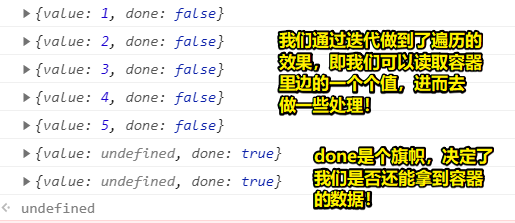

# 11~20

## 11、循环（Loops）、迭代（Iteration）、遍历（Traversal）的概念区分？

循环的目的：是为了将一个容器里边的东西，一次又一次连续的给拿出来。

Objet/Array/Map/Set……这些都是容器，那么这些容器为啥而存在呢？——我们知道任何一个事物都有相应的集合性，而「集合性」的存在是为了我们需要统一管理！总之，实际上，Object/Array等的存在，它们的必要性都是为了将数据统一给保管起来！说白了，Object等的本质属性就是容器哈！ 而循环就是从容器里边一次又一次连续不断地拿东西，直到拿完为止。
 
循环它只是一个手段，循环它要到达的目的是要**遍历整个容器**

很多人都不知道什么叫循环，什么叫遍历

循环和遍历不是一回事儿，循环它是操作数组等容器的一种手段，而操作的目的是把容器的数据给遍历出来，所谓的「遍历」就是在一个容器里边去观看，看到什么数据，就拿出什么数据出来！ 如在一个 `[1,2,3]`数组里边，**看到**一个`1`，那我就用「循环」的手段把它给拿出来，同理，**遍历到** `2` 和 `3`的时候，也用「循环」的手段把它们给拿出来！

总之，循环是一种手段，而遍历是一种结果！

或许，你会问「遍历必须要用到循环吗？」，换言之「遍历是不是一定要用循环的手段来实现呢？」

显然，这是不是的。循环和迭代都是实现遍历的一种手段

我们需往一个数据容器里边拿数据，或者说看看有哪些数据，说白了就是要遍历，那么我们可以用循环这种手段来做，也可以用迭代这种手段来做！

那么循环和迭代有啥区别呢？

区别在于循环是从容器里边一次又一次连续不断地拿元素，而迭代则是从容器里边一次又一次非要间断地拿元素

总之，要达到「遍历」这样的目的，可以用循环来做，也可以用迭代来做！
总之，「迭代」和「循环」实际上都是「遍历」的手段（方法/措施/技巧）！

在开发里边，哪些操作体现了「循环」呢？

如：for循环、forEach、map、filter、reduce……

那么「迭代」呢？

要做到「迭代」，需要给我们一个工具才行，毕竟要实现「迭代」或者说用「迭代」这种手段，总要有工具去实现它才行！而这个工具就是迭代器啦！不过，迭代器也不是平不无故就出现的（换言之，有一堆数据摆着，然后这堆数据突然就冒出一个迭代器出来，然后就去迭代这堆数据！显然这是不可能的！），我们需要根据数据产生一个生成器，然后这个生成器可以产出一个迭代器，说白了，「生成器」跟「迭代器」是一组东西！

至此，就有了「生成器」（generator）和「迭代器」（iterator）

那么如何用「迭代」的手段做到遍历呢？即如何根据数据搞一个生成器，进而产出一个迭代器呢？

目前有什么：

一个容器，里边有5个元素这样的数据：`[1,2,3,4,5]`

我们要这样的效果：

```js
next() // {value:1,done:false}
next() // {value:2,done:false}
next() // {value:3,done:false}
next() // {value:4,done:false}
next() // {value:5,done:false}
next() // {value:undefined,done:true}
next() // {value:undefined,done:true}
```

用ES5搞个迭代器出来：

``` js
var arr = [1, 2, 3, 4, 5]

// 根据数据产生一个生成器
function generator(arr) {
    var i = 0

    return {
        next: function() {
            var done = (i >= arr.length)
              , value = !done ? arr[i++] : undefined

            return {
                value: value,
                done: done
            }
        }
    }
}

// 生成器生成一个迭代器：
var iterator = generator(arr)

console.log(iterator.next())
console.log(iterator.next())
console.log(iterator.next())
console.log(iterator.next())
console.log(iterator.next())
console.log(iterator.next())
console.log(iterator.next())

```

效果：




